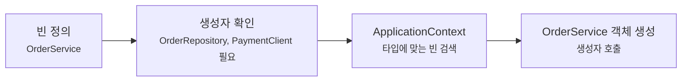
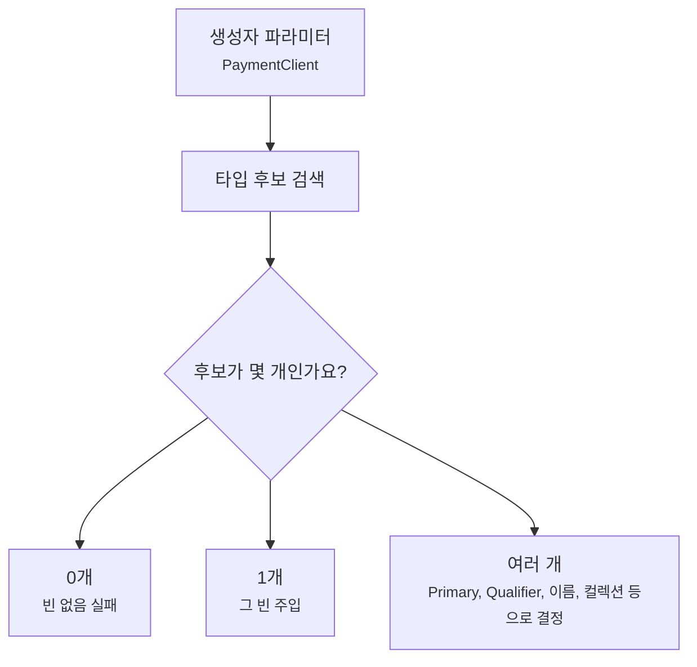
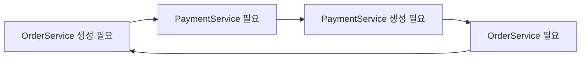

# 의존성 주입은 실제 코드에서 어떻게 읽어야 할까요?

> 생성자에 파라미터를 하나 추가했을 뿐인데, 앱이 뜨기도 하고 실패하기도 해요.

지난 글에서는 빈(bean)이 ApplicationContext에 들어오는 길을 봤어요. 컴포넌트 스캔(component scan), `@Bean`, 자동 설정(auto-configuration)이 각각 빈을 등록할 수 있었죠.

그러면 이제 진짜 실무 코드에서 자주 만나는 질문이 남아요.

> "등록된 빈은 어떤 기준으로 생성자에 들어올까요?"  
> "왜 `@Autowired`를 안 붙였는데도 주입되죠?"  
> "같은 인터페이스 구현체가 둘이면 Spring은 뭘 고르죠?"  
> "선택적으로 있으면 쓰고, 없으면 넘어가는 의존성은 어떻게 표현하죠?"  
> "순환 의존성은 왜 실행 전에 터질까요?"

오늘은 의존성 주입(dependency injection)을 실제 서비스 코드에서 읽는 법으로 볼게요.

목표는 "주입 방법 종류"를 외우는 게 아니에요. Spring Boot 앱에서 **필수 관계는 어디에 드러내고**, **선택 관계는 어떻게 표현하고**, **후보가 여러 개일 때는 어떤 결정을 코드에 남기고**, **순환 의존성은 왜 설계 냄새로 봐야 하는지** 잡는 거예요.

!!! note "이 글의 기준"
    이 글은 Spring Boot 4.1.0 공식 문서의 공통 애플리케이션 프로퍼티와 Spring Framework 7.0.8 공식 문서의 의존성 주입, `@Autowired`, `@Primary`, `@Qualifier` 설명을 확인해 작성했어요. 의존성 주입의 큰 원칙은 Spring Boot 전반에서 이어지는 이야기지만, 컴파일러 파라미터 이름이나 순환 참조 기본값처럼 버전과 설정에 영향을 받는 내용은 본문에서 따로 표시할게요.

---

## 먼저 주문 서비스를 하나 봐요

주문을 생성하는 서비스가 있다고 해볼게요.

```java
package com.example.order;

import org.springframework.stereotype.Service;

@Service
class OrderService {

    private final OrderRepository orderRepository;
    private final PaymentClient paymentClient;

    OrderService(OrderRepository orderRepository, PaymentClient paymentClient) {
        this.orderRepository = orderRepository;
        this.paymentClient = paymentClient;
    }

    OrderResult createOrder(OrderRequest request) {
        Order order = orderRepository.save(request.toOrder());
        paymentClient.pay(order.id(), order.totalPrice());
        return OrderResult.from(order);
    }
}
```

이 코드에는 `new OrderRepository()`도 없고, `new PaymentClient()`도 없어요. 그런데 `OrderService`는 두 객체를 쓸 수 있어요.

이유는 지난 글과 이어져요.

1. `OrderService`가 빈으로 등록돼요.
2. Spring이 `OrderService`를 만들려고 생성자를 봐요.
3. 생성자 파라미터 타입인 `OrderRepository`, `PaymentClient`에 맞는 빈을 찾아요.
4. 찾은 빈을 넣어서 `OrderService` 객체를 만들어요.



이 그림에서 중요한 건 `OrderService`가 의존성을 찾아다니지 않는다는 점이에요. `OrderService`는 "나는 이 두 객체가 필요해요"라고 생성자로 말하고, ApplicationContext가 그 관계를 맞춰요.

---

## 생성자 주입은 필수 의존성을 숨기지 않아요

Spring에서는 의존성을 넣는 방식이 여러 가지예요. 생성자, setter, 필드에도 주입할 수 있죠.

하지만 애플리케이션 서비스 코드에서는 생성자 주입을 기본으로 잡는 편이 좋아요.

```java
@Service
class OrderService {

    private final OrderRepository orderRepository;

    OrderService(OrderRepository orderRepository) {
        this.orderRepository = orderRepository;
    }
}
```

이 코드는 읽는 사람에게 바로 말해요.

> `OrderService`는 `OrderRepository` 없이는 제대로 만들 수 없어요.

필수 의존성은 생성자에 두는 게 자연스러워요. 객체가 만들어지는 순간부터 필요한 것이 채워져 있고, `final` 필드로 바꿀 수 없게 둘 수 있고, 테스트에서도 생성자만 보면 무엇을 준비해야 하는지 보여요.

반대로 필드 주입(field injection)은 처음에는 짧아 보여요.

```java
@Service
class OrderService {

    @Autowired
    private OrderRepository orderRepository;
}
```

하지만 시간이 지나면 불리한 점이 커져요.

| 코드에서 보이는 점 | 생성자 주입 | 필드 주입 |
|---|---|---|
| 필수 의존성이 한눈에 보이나요? | 생성자 시그니처에 보여요 | 필드를 훑어야 해요 |
| `final`로 불변 관계를 만들 수 있나요? | 가능해요 | 어렵거나 불가능해요 |
| 순수 단위 테스트에서 직접 만들기 쉬운가요? | 생성자에 넣으면 돼요 | 리플렉션, Spring 테스트, setter가 필요해질 수 있어요 |
| 의존성이 너무 많아졌다는 신호가 보이나요? | 생성자가 길어져서 바로 보여요 | 필드가 흩어져서 늦게 보여요 |

필드 주입이 "항상 실행이 안 된다"는 뜻은 아니에요. Spring은 필드 주입도 지원해요. 다만 실무 코드가 커질수록 의존 관계를 숨기고, 테스트와 리팩터링을 어렵게 만들기 쉬워요.

!!! tip "생성자가 길어지는 건 경고등이에요"
    생성자 파라미터가 6개, 7개로 늘어나면 "생성자 주입이 불편하다"가 아니라 "이 클래스가 너무 많은 역할을 하고 있나?"를 먼저 물어보는 게 좋아요.

---

## `@Autowired`가 없어도 되는 경우가 있어요

Spring 코드를 처음 보면 이런 점이 헷갈려요.

```java
@Service
class OrderService {

    private final OrderRepository orderRepository;

    OrderService(OrderRepository orderRepository) {
        this.orderRepository = orderRepository;
    }
}
```

생성자에 `@Autowired`가 없는데도 주입이 돼요.

Spring Framework는 대상 빈 클래스에 생성자가 하나뿐이면 그 생성자를 주입 생성자로 사용할 수 있어요. 그래서 요즘 Spring Boot 예제에서는 생성자 하나짜리 클래스에 `@Autowired`를 생략하는 모습을 자주 봐요.

하지만 생성자가 여러 개라면 이야기가 달라져요.

```java
@Service
class OrderService {

    private final OrderRepository orderRepository;
    private final Clock clock;

    OrderService(OrderRepository orderRepository) {
        this(orderRepository, Clock.systemDefaultZone());
    }

    OrderService(OrderRepository orderRepository, Clock clock) {
        this.orderRepository = orderRepository;
        this.clock = clock;
    }
}
```

이런 코드는 Spring이 어떤 생성자를 써야 하는지 애매해질 수 있어요. 애초에 서비스 빈에서 생성자를 여러 개 두는 설계가 꼭 필요한지도 다시 봐야 해요.

보통은 설정해야 할 객체를 `@Bean`으로 올리고, 서비스는 하나의 생성자로 필요한 빈을 받게 만드는 편이 더 읽기 쉬워요.

```java
import java.time.Clock;
import org.springframework.context.annotation.Bean;
import org.springframework.context.annotation.Configuration;

@Configuration
class TimeConfig {

    @Bean
    Clock clock() {
        return Clock.systemDefaultZone();
    }
}
```

```java
@Service
class OrderService {

    private final OrderRepository orderRepository;
    private final Clock clock;

    OrderService(OrderRepository orderRepository, Clock clock) {
        this.orderRepository = orderRepository;
        this.clock = clock;
    }
}
```

이렇게 하면 "시간 기준은 설정에서 정하고, 서비스는 그 기준을 받아 쓴다"는 경계가 분명해져요.

---

## 주입은 먼저 타입으로 후보를 찾아요

Spring이 생성자 파라미터를 볼 때 가장 먼저 보는 것은 타입이에요.

```java
OrderService(OrderRepository orderRepository) {
    this.orderRepository = orderRepository;
}
```

여기서는 `OrderRepository` 타입의 빈이 필요해요. ApplicationContext에 그 타입으로 주입 가능한 빈이 하나라면 자연스럽게 들어와요.

문제는 후보가 없거나, 너무 많을 때예요.

```java
interface PaymentClient {

    void pay(String orderId, long amount);
}
```

```java
import org.springframework.stereotype.Component;

@Component
class CardPaymentClient implements PaymentClient {

    @Override
    public void pay(String orderId, long amount) {
        // 카드 결제 API 호출
    }
}
```

```java
@Service
class OrderService {

    private final PaymentClient paymentClient;

    OrderService(PaymentClient paymentClient) {
        this.paymentClient = paymentClient;
    }
}
```

`PaymentClient` 구현체가 하나라면 괜찮아요. 그런데 나중에 계좌이체 구현체가 추가됐다고 해볼게요.

```java
@Component
class BankTransferPaymentClient implements PaymentClient {

    @Override
    public void pay(String orderId, long amount) {
        // 계좌이체 API 호출
    }
}
```

이제 `PaymentClient` 타입 후보가 둘이에요.

```text
PaymentClient
├── cardPaymentClient
└── bankTransferPaymentClient
```

이 상태에서 `OrderService(PaymentClient paymentClient)`만 보면 Spring은 어느 빈을 넣어야 할지 확정하기 어려워요.

이 실패는 나쁜 게 아니에요. 오히려 좋은 질문을 던져줘요.

> 주문 서비스는 정말 아무 결제 클라이언트나 받으면 되나요? 아니면 특정 결제 방식을 명시해야 하나요?

---

## 후보가 여러 개면 결정을 코드에 남겨야 해요

후보가 여러 개일 때는 대표적으로 세 가지 방향이 있어요.

| 방법 | 뜻 | 어울리는 상황 |
|---|---|---|
| `@Primary` | 같은 타입 중 기본 후보를 정해요 | 대부분의 주입 지점에서 같은 구현체를 써야 할 때 |
| `@Qualifier` | 주입 지점에서 특정 후보를 좁혀요 | 한 타입의 여러 구현체를 용도별로 골라야 할 때 |
| 컬렉션 주입 | 같은 타입 후보를 전부 받아요 | 전략 목록, 핸들러 목록처럼 여러 구현체를 순회할 때 |

기본 구현체가 분명하다면 `@Primary`를 쓸 수 있어요.

```java
import org.springframework.context.annotation.Primary;
import org.springframework.stereotype.Component;

@Primary
@Component
class CardPaymentClient implements PaymentClient {
}
```

이제 단일 `PaymentClient`가 필요한 곳에는 `CardPaymentClient`가 우선 들어갈 수 있어요.

하지만 특정 주입 지점에서 의도를 드러내고 싶다면 `@Qualifier`가 더 선명할 때가 있어요.

```java
import org.springframework.beans.factory.annotation.Qualifier;
import org.springframework.stereotype.Service;

@Service
class OrderService {

    private final PaymentClient paymentClient;

    OrderService(@Qualifier("cardPaymentClient") PaymentClient paymentClient) {
        this.paymentClient = paymentClient;
    }
}
```

이 코드는 "주문 서비스는 카드 결제 클라이언트를 쓴다"는 결정을 생성자에 남겨요.

다만 `@Qualifier("cardPaymentClient")`처럼 빈 이름에 직접 기대면 이름 변경에 약해질 수 있어요. 결제 방식처럼 도메인 의미가 있다면 커스텀 qualifier를 만들거나, 설정 클래스에서 이름과 역할을 명확히 관리하는 편이 더 나을 수 있어요. 이 부분은 프로젝트 규모와 팀 규칙에 따라 달라져요.

Spring은 후보가 여러 개일 때 파라미터 이름과 빈 이름이 맞는지도 볼 수 있어요. 다만 이 방식은 Java 컴파일러의 파라미터 이름 보존 설정에 영향을 받으니, 중요한 선택 기준은 `@Primary`나 `@Qualifier`처럼 코드에서 더 명시적으로 드러내는 편이 안전해요.

여러 구현체를 모두 받아야 하는 경우도 있어요.

```java
import java.util.List;
import org.springframework.stereotype.Service;

@Service
class PaymentRouter {

    private final List<PaymentClient> paymentClients;

    PaymentRouter(List<PaymentClient> paymentClients) {
        this.paymentClients = paymentClients;
    }
}
```

이 경우에는 "하나를 골라주세요"가 아니라 "이 타입의 빈들을 모두 주세요"예요. 할인 정책, 알림 발송 채널, 파일 검증기처럼 전략 목록이 자연스러운 곳에서 쓸 수 있어요.



이 그림은 주입 실패를 읽는 순서예요. "왜 안 들어오지?"라고 보기보다 "후보가 없나, 너무 많나, 선택 기준이 없나?"로 쪼개면 로그가 훨씬 덜 막막해져요.

---

## 선택적 의존성은 선택적이라는 사실을 드러내야 해요

모든 의존성이 필수는 아니에요.

예를 들어 주문이 생성될 때 Slack 알림을 보낼 수도 있지만, 로컬 개발 환경이나 작은 배포에서는 알림 기능이 없을 수 있어요.

이때 필수 생성자 파라미터로 받으면 알림 빈이 없을 때 앱이 시작하지 않아요.

```java
@Service
class OrderNotificationService {

    private final SlackClient slackClient;

    OrderNotificationService(SlackClient slackClient) {
        this.slackClient = slackClient;
    }
}
```

정말 필수라면 이 실패가 맞아요. 알림이 없으면 서비스가 성립하지 않는다는 뜻이니까요.

하지만 "있으면 쓰고, 없으면 조용히 넘어간다"가 요구사항이라면 코드에도 그렇게 표현해야 해요.

```java
import java.util.Optional;
import org.springframework.stereotype.Service;

@Service
class OrderNotificationService {

    private final Optional<SlackClient> slackClient;

    OrderNotificationService(Optional<SlackClient> slackClient) {
        this.slackClient = slackClient;
    }

    void notifyCreated(String orderId) {
        slackClient.ifPresent(client -> client.send("주문 생성: " + orderId));
    }
}
```

또는 필요할 때 늦게 꺼내고 싶다면 `ObjectProvider`를 쓸 수 있어요.

```java
import org.springframework.beans.factory.ObjectProvider;
import org.springframework.stereotype.Service;

@Service
class OrderNotificationService {

    private final ObjectProvider<SlackClient> slackClientProvider;

    OrderNotificationService(ObjectProvider<SlackClient> slackClientProvider) {
        this.slackClientProvider = slackClientProvider;
    }

    void notifyCreated(String orderId) {
        SlackClient slackClient = slackClientProvider.getIfAvailable();
        if (slackClient != null) {
            slackClient.send("주문 생성: " + orderId);
        }
    }
}
```

둘 중 무엇이 더 낫다고 외울 필요는 없어요. 기준은 의도를 얼마나 잘 드러내느냐예요.

| 표현 | 읽히는 의도 |
|---|---|
| `SlackClient` | 반드시 있어야 해요 |
| `Optional<SlackClient>` | 없어도 되는 의존성이에요 |
| `ObjectProvider<SlackClient>` | 필요할 때 조회하거나, 없을 수도 있고, 지연해서 다룰 수 있어요 |
| `List<SlackClient>` | 같은 타입 후보를 여러 개 받을 수 있어요 |

!!! warning "선택적 의존성은 기능 요구사항이어야 해요"
    시작 실패를 피하려고 필수 의존성을 `Optional`로 감추면 나중에 더 찾기 어려운 버그가 돼요. "없어도 되는가?"는 기술 문제가 아니라 기능과 운영 요구사항의 문제예요.

---

## setter 주입은 선택 설정에 가깝게 쓰세요

Spring Framework 문서에서도 생성자 주입과 setter 주입을 모두 다뤄요. 둘 다 Spring이 지원하는 방식이에요.

하지만 역할을 나누면 이해하기 쉬워요.

| 방식 | 어울리는 관계 |
|---|---|
| 생성자 주입 | 객체가 성립하려면 반드시 필요한 의존성 |
| setter 주입 | 나중에 바뀔 수 있거나 선택적인 설정 |

예를 들어 대부분의 서비스, 컨트롤러, 저장소 관계는 생성자 주입이 자연스러워요.

반대로 프레임워크 확장 포인트, 테스트 도구, 선택 설정을 주입하는 특수한 경우에는 setter나 메서드 주입이 쓰일 수 있어요.

중요한 건 "코드가 짧다"가 기준이 아니라는 점이에요.

> 필수 관계는 생성자에, 선택 관계는 선택적이라는 사실이 보이는 타입이나 메서드에 둬요.

---

## 순환 의존성은 "두 객체가 서로를 만들어달라고 하는 상황"이에요

이제 가장 골치 아픈 장면을 볼게요.

```java
@Service
class OrderService {

    private final PaymentService paymentService;

    OrderService(PaymentService paymentService) {
        this.paymentService = paymentService;
    }
}
```

```java
@Service
class PaymentService {

    private final OrderService orderService;

    PaymentService(OrderService orderService) {
        this.orderService = orderService;
    }
}
```

겉으로는 단순해 보여요. 주문 서비스는 결제가 필요하고, 결제 서비스는 주문 정보가 필요하니까요.

하지만 컨테이너 입장에서는 이런 상황이에요.



`OrderService`를 만들려면 `PaymentService`가 필요하고, `PaymentService`를 만들려면 다시 `OrderService`가 필요해요. 생성자 주입에서는 둘 중 하나를 먼저 완성하기 어렵죠.

Spring Boot의 공통 애플리케이션 프로퍼티 기준으로 `spring.main.allow-circular-references` 기본값은 `false`예요. 즉, 순환 참조를 기본적으로 허용하고 자동으로 풀어보려 하지 않아요.

이 실패는 귀찮은 제약이 아니라 중요한 신호예요.

> 두 서비스의 책임 경계가 서로 물고 있을 가능성이 커요.

---

## 순환 의존성은 설정으로 덮기 전에 설계를 먼저 봐야 해요

순환 의존성이 나왔을 때 가장 쉬워 보이는 방법은 설정을 켜는 거예요.

```yaml
spring:
  main:
    allow-circular-references: true
```

하지만 이건 보통 마지막 수단에 가까워요. 그리고 모든 순환 구조가 이 설정으로 해결되는 것도 아니에요.

먼저 해야 할 일은 책임을 다시 나누는 거예요.

예를 들어 주문 서비스가 결제를 요청하고, 결제가 끝난 뒤 주문 상태를 기록해야 한다고 해볼게요. 이때 `PaymentService`가 `OrderService` 전체를 다시 주입받으면 순환이 생기기 쉬워요.

대신 결제 완료 기록만 담당하는 더 작은 빈을 분리할 수 있어요.

```java
interface OrderPaymentRecorder {

    void recordPaid(String orderId);
}
```

```java
@Service
class OrderPaymentRecordService implements OrderPaymentRecorder {

    private final OrderRepository orderRepository;

    OrderPaymentRecordService(OrderRepository orderRepository) {
        this.orderRepository = orderRepository;
    }

    @Override
    public void recordPaid(String orderId) {
        // 주문 결제 완료 상태 기록
    }
}
```

그리고 결제 서비스는 주문 서비스 전체가 아니라 이 작은 역할만 알아요.

```java
@Service
class PaymentService {

    private final OrderPaymentRecorder orderPaymentRecorder;

    PaymentService(OrderPaymentRecorder orderPaymentRecorder) {
        this.orderPaymentRecorder = orderPaymentRecorder;
    }
}
```

이제 질문이 좋아져요.

> 결제 서비스가 정말 주문 서비스 전체를 알아야 하나요, 아니면 "결제 완료 기록"이라는 더 작은 역할만 알면 되나요?

더 나아가 결제 완료를 이벤트로 발행하고, 주문 쪽에서 듣게 만들 수도 있어요. 이벤트는 뒤 글에서 더 자세히 볼 거예요. 지금 중요한 건 순환 의존성을 설정값으로 숨기기 전에 책임 경계를 먼저 보는 거예요.

| 증상 | 먼저 물어볼 질문 |
|---|---|
| `AService`와 `BService`가 서로 생성자로 받음 | 둘 중 하나가 너무 많은 일을 하고 있나요? |
| 설정 클래스와 서비스가 서로 물림 | `@Bean` 생성 책임과 업무 로직이 섞였나요? |
| 보안 설정과 사용자 서비스가 서로 물림 | 인증 조회, 비밀번호 인코딩, 사용자 업무 규칙이 분리돼 있나요? |
| 이벤트 발행 때문에 다시 서비스를 주입함 | 동기 호출이 아니라 이벤트나 더 작은 port가 맞나요? |

!!! warning "순환 참조 허용은 해결이 아니라 유예일 수 있어요"
    `spring.main.allow-circular-references=true`는 레거시 코드를 임시로 살릴 때 검토할 수는 있어요. 하지만 새 코드에서는 순환 자체를 줄이는 쪽이 더 안전해요. 특히 생성자 주입 순환은 책임 경계가 꼬였다는 신호로 먼저 읽어야 해요.

---

## DI를 잘 쓰면 테스트 코드도 단순해져요

의존성 주입은 Spring 컨테이너만을 위한 기술이 아니에요. 순수 Java 테스트에서도 이점이 보여요.

```java
class FakePaymentClient implements PaymentClient {

    boolean paid;

    @Override
    public void pay(String orderId, long amount) {
        this.paid = true;
    }
}
```

```java
class OrderServiceTest {

    void createsOrderAndPays() {
        OrderRepository orderRepository = new InMemoryOrderRepository();
        FakePaymentClient paymentClient = new FakePaymentClient();
        OrderService orderService = new OrderService(orderRepository, paymentClient);

        orderService.createOrder(new OrderRequest("book", 10000));

        assert paymentClient.paid;
    }
}
```

이 예시는 테스트 프레임워크 문법을 보여주려는 게 아니에요. 핵심은 `OrderService`가 필요한 객체를 생성자로 받기 때문에 Spring 컨테이너 없이도 직접 조립할 수 있다는 점이에요.

반대로 서비스 안에서 `new RealPaymentClient()`를 직접 호출하거나 필드 주입에만 기대면, 테스트가 갑자기 컨테이너 설정 문제로 커질 수 있어요.

실무에서는 모든 테스트를 순수 단위 테스트로 만들 수는 없어요. Spring MVC, JPA, 보안, 트랜잭션은 컨텍스트를 띄우는 테스트가 필요할 때도 많아요. 그래도 생성자 주입은 "이 클래스가 무엇에 의존하는지"를 테스트 앞에 드러내는 좋은 습관이에요.

---

## 코드 리뷰에서는 주입 지점을 이렇게 보면 좋아요

의존성 주입 코드를 볼 때는 Annotation 개수보다 관계의 모양을 먼저 보면 좋아요.

| 질문 | 왜 중요한가요? |
|---|---|
| 생성자 파라미터가 이 클래스의 필수 협력자인가요? | 필수 관계와 선택 관계가 섞였는지 볼 수 있어요 |
| 인터페이스를 주입한다면 후보가 하나로 결정되나요? | 구현체가 늘어날 때 시작 실패나 모호성이 생길 수 있어요 |
| `@Qualifier` 값이 도메인 의미를 갖고 있나요? | 단순 빈 이름 의존인지, 의도적인 선택인지 구분할 수 있어요 |
| `Optional`이나 `ObjectProvider`가 진짜 선택 요구사항을 표현하나요? | 필수 의존성을 숨기는지 확인할 수 있어요 |
| 생성자 파라미터가 너무 많지 않나요? | 서비스가 여러 책임을 끌어안고 있을 수 있어요 |
| 양방향 서비스 주입이 있나요? | 순환 의존성과 책임 경계 문제를 의심할 수 있어요 |

이 질문들은 "Spring이 알아서 넣어주겠지"를 "이 관계를 코드가 설명하고 있나?"로 바꿔줘요.

---

## 자, 정리해볼까요?

!!! abstract "오늘 우리가 배운 것"
    - 의존성 주입(dependency injection)은 빈이 필요한 다른 빈을 직접 찾거나 만들지 않고, 컨테이너가 생성 시점에 넣어주는 흐름이에요.
    - 실무 서비스 코드에서는 생성자 주입을 기본으로 잡는 편이 좋아요. 필수 의존성이 시그니처에 드러나고, `final` 필드와 테스트가 쉬워져요.
    - 생성자가 하나뿐인 빈은 보통 `@Autowired` 없이도 생성자 주입이 가능해요. 생성자가 여러 개라면 선택이 애매해질 수 있으니 설계를 먼저 단순하게 보세요.
    - 주입은 먼저 타입으로 후보를 찾고, 후보가 여러 개면 `@Primary`, `@Qualifier`, 파라미터 이름, 컬렉션 주입 같은 기준으로 좁혀요.
    - 선택적 의존성은 `Optional`, `ObjectProvider`, 컬렉션처럼 선택적이라는 사실이 보이는 타입으로 표현해야 해요.
    - 순환 의존성은 설정으로 덮기 전에 책임 경계를 먼저 의심해야 해요. 새 코드에서는 순환을 줄이는 설계가 더 안전해요.

다음 글에서는 Annotation 하나가 왜 단순한 표시로 끝나지 않는지 볼 거예요. `@Transactional` 같은 Annotation이 실제로는 프록시(proxy)를 통해 동작하는 이유, 그리고 self-invocation이 왜 기대를 깨뜨리는지 이어서 살펴볼게요.

---

## 참고한 링크

- [Spring Framework Reference: Dependency Injection](https://docs.spring.io/spring-framework/reference/core/beans/dependencies/factory-collaborators.html)
- [Spring Framework Reference: Using @Autowired](https://docs.spring.io/spring-framework/reference/core/beans/annotation-config/autowired.html)
- [Spring Framework Reference: Fine-tuning Annotation-based Autowiring with @Primary or @Fallback](https://docs.spring.io/spring-framework/reference/core/beans/annotation-config/autowired-primary.html)
- [Spring Framework Reference: Fine-tuning Annotation-based Autowiring with Qualifiers](https://docs.spring.io/spring-framework/reference/core/beans/annotation-config/autowired-qualifiers.html)
- [Spring Boot Reference: Common Application Properties](https://docs.spring.io/spring-boot/appendix/application-properties/index.html)
