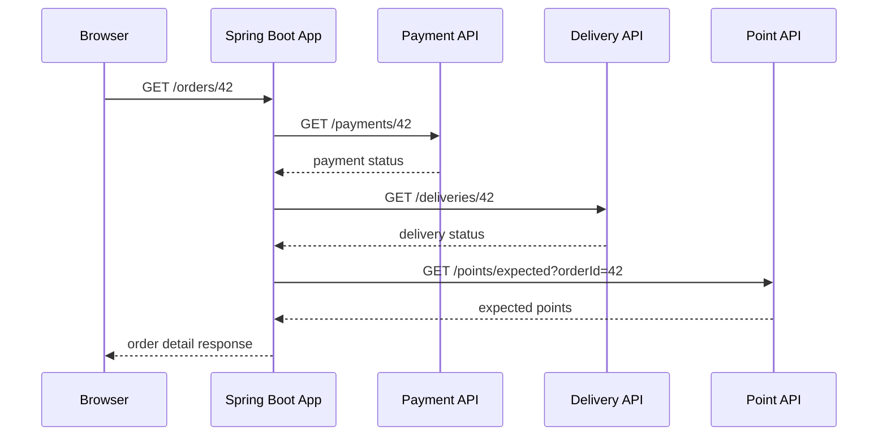
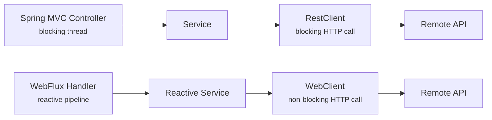
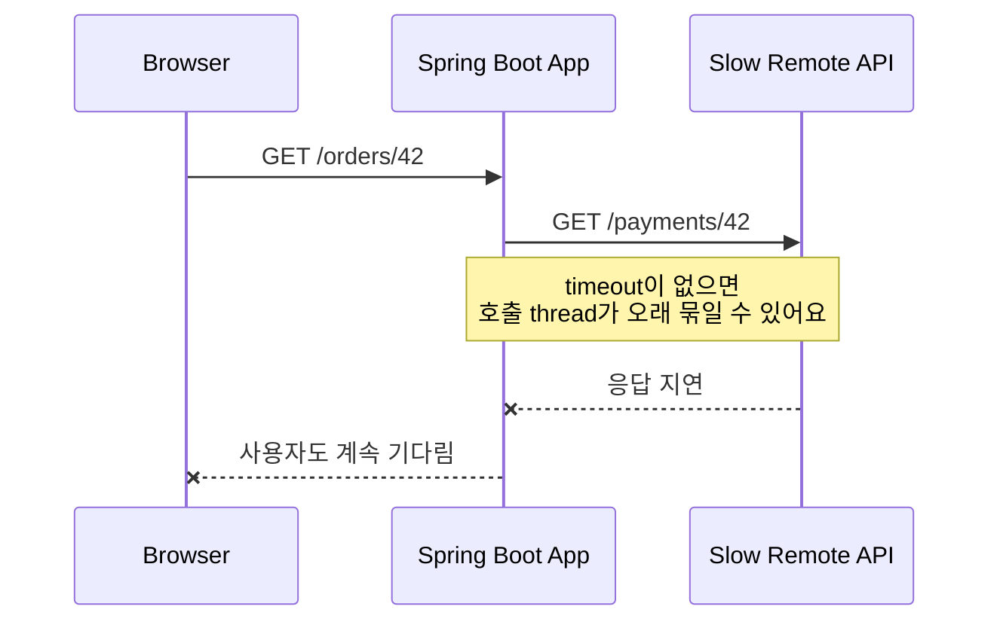
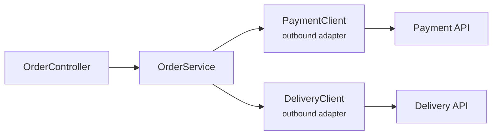

# RestClient, WebClient, HTTP Interface는 언제 다르게 써야 할까요?

> 우리 API가 응답을 만들려면, 이제 다른 회사의 API부터 물어봐야 해요.

지난 글에서는 WebSocket과 STOMP를 보면서 서버와 브라우저가 오래 열린 연결 위에서 메시지를 주고받는 흐름을 봤어요. 오늘은 방향을 바꿔볼게요. 이번에는 우리 Spring Boot 앱이 **클라이언트가 되어서 다른 HTTP API를 호출하는 장면**이에요.

처음에는 이런 코드가 자연스러워 보여요.

```java
String body = restClient.get()
        .uri("https://payment.example.com/payments/{id}", paymentId)
        .retrieve()
        .body(String.class);
```

요청을 보내고, 응답을 받고, 문자열로 읽어요. 간단하죠.

근데요, 실무에서는 바로 질문이 늘어나요.

> "RestClient와 WebClient 중 뭘 써야 하죠?"  
> "HTTP Interface는 Feign 같은 건가요?"  
> "timeout은 어디서 정해야 하나요?"  
> "외부 API가 500을 주면 우리 API도 바로 500인가요?"  
> "retry를 붙이면 더 안전해지는 거 아닌가요?"  
> "controller에서 바로 호출해도 되나요?"

오늘은 문법보다 경계를 먼저 볼 거예요. **다른 서버를 호출하는 코드는 단순한 유틸 함수가 아니라, 우리 서비스 바깥으로 나가는 outbound API 경계예요.** Spring Boot는 이 경계에서 `RestClient`, `WebClient`, HTTP Service Interface를 쓸 수 있게 도와주지만, 무엇을 고를지와 실패를 어떻게 다룰지는 우리가 설계해야 해요.

!!! note "이 글의 기준"
    이 글은 Spring Boot 4.1.0과 Spring Framework 7.0.x 공식 문서의 REST clients, `RestClient`, `WebClient`, HTTP Interface, HTTP Service client group 설명을 기준으로 작성했어요. Spring Boot 3.x 프로젝트에서도 큰 선택 기준은 비슷하지만, starter 이름과 HTTP Service client group 설정은 사용 중인 버전 문서를 함께 확인하세요.

---

## 서버도 다른 서버 앞에서는 클라이언트예요

주문 API가 있다고 해볼게요. 사용자가 주문 상세 화면을 열면 우리 서버는 주문 정보만 갖고 있지 않을 수 있어요.

- 결제 상태는 결제 서버에서 가져와요.
- 배송 상태는 배송 서버에서 가져와요.
- 적립 예정 포인트는 포인트 서버에서 가져와요.

브라우저 입장에서는 `GET /orders/42` 하나예요. 하지만 서버 안쪽에서는 여러 HTTP 호출이 이어질 수 있어요.



이 그림에서 중요한 건 Spring Boot 앱이 두 역할을 한다는 점이에요. 브라우저에게는 서버지만, 결제 API와 배송 API 앞에서는 클라이언트예요.

그래서 outbound 호출 코드는 이런 책임을 가져요.

| 책임 | 코드에서 드러나야 하는 질문 |
|---|---|
| 주소 | 어느 base URL과 path를 호출하나요? |
| 계약 | request, response, error body가 어떤 모양인가요? |
| 시간 제한 | 언제까지 기다리고 포기하나요? |
| 실패 처리 | 4xx, 5xx, network error를 어떻게 해석하나요? |
| 재시도 | 어떤 실패만 다시 시도하고, 몇 번까지만 하나요? |
| 관측 | 어떤 외부 호출이 느렸는지 log, metric, trace로 찾을 수 있나요? |

처음에는 `GET` 한 줄처럼 보여도, 실제로는 외부 시스템과 맺는 작은 계약이에요. 이 계약을 controller 안에 흩뿌리면 나중에 장애가 났을 때 "어느 외부 API가 느린지", "어느 status를 우리가 잘못 해석했는지" 찾기 어려워져요.

---

## `RestClient`는 blocking 앱의 기본 선택지예요

Spring MVC, JDBC, JPA처럼 blocking 흐름으로 짜인 앱이라면 먼저 `RestClient`를 떠올리면 돼요. `RestClient`는 Spring Framework의 동기 HTTP client예요. 요청을 보내고 응답이 올 때까지 현재 thread가 기다리는 모델이에요.

Spring Boot는 미리 설정된 `RestClient.Builder` bean을 제공해요. 그래서 보통은 직접 `RestClient.create()`를 흩뿌리기보다 builder를 주입받아 외부 API별 client를 만들어둬요.

```java
package com.example.order.payment;

import org.springframework.stereotype.Component;
import org.springframework.web.client.RestClient;

@Component
public class PaymentClient {

    private final RestClient restClient;

    public PaymentClient(RestClient.Builder builder) {
        this.restClient = builder
                .baseUrl("https://payment.example.com")
                .build();
    }

    public PaymentResponse findPayment(long orderId) {
        return restClient.get()
                .uri("/payments/{orderId}", orderId)
                .retrieve()
                .body(PaymentResponse.class);
    }
}
```

이 코드에서 `PaymentClient`는 "결제 서버를 어떻게 부를지"를 감싸는 adapter예요. controller나 service가 외부 API path를 직접 알 필요가 없게 해줘요.

```java
package com.example.order.payment;

public record PaymentResponse(
        long orderId,
        String status,
        int paidAmount
) {
}
```

`RestClient`는 이런 경우에 잘 맞아요.

| 상황 | 왜 `RestClient`가 자연스러울까요? |
|---|---|
| Spring MVC 앱 | 요청 처리 thread가 blocking 호출을 기다리는 모델과 잘 맞아요 |
| JDBC, JPA 사용 | persistence도 blocking이라 실행 모델이 섞이지 않아요 |
| 한두 개 외부 API 호출 | 직선적인 Java 코드로 읽기 쉬워요 |
| 팀이 imperative 코드에 익숙함 | breakpoint, stack trace, 예외 흐름을 따라가기 쉬워요 |

처음에는 여기까지만 잡아도 충분해요. **MVC 기반 서버에서 다른 REST API를 호출한다면 `RestClient`가 가장 읽기 쉬운 출발점이에요.**

!!! warning "`RestTemplate`부터 새로 배우지는 않아도 돼요"
    오래된 Spring 예제에는 `RestTemplate`이 많이 나와요. 기존 프로젝트를 읽을 때는 알아야 하지만, 새 코드에서는 Spring Framework의 최신 동기 client인 `RestClient`를 먼저 보는 편이 좋아요.

---

## `WebClient`는 non-blocking 흐름에 맞는 client예요

`WebClient`는 이름 때문에 "웹 API 호출용 최신 client"처럼 보일 수 있어요. 하지만 핵심은 최신이 아니라 **non-blocking, reactive HTTP client**라는 점이에요.

지난 글에서 봤듯이 WebFlux는 기다리는 동안 thread를 붙잡지 않는 실행 모델이에요. `WebClient`도 그 흐름에 맞춰 `Mono`, `Flux`를 반환해요.

```java
package com.example.order.payment;

import org.springframework.stereotype.Component;
import org.springframework.web.reactive.function.client.WebClient;
import reactor.core.publisher.Mono;

@Component
public class ReactivePaymentClient {

    private final WebClient webClient;

    public ReactivePaymentClient(WebClient.Builder builder) {
        this.webClient = builder
                .baseUrl("https://payment.example.com")
                .build();
    }

    public Mono<PaymentResponse> findPayment(long orderId) {
        return webClient.get()
                .uri("/payments/{orderId}", orderId)
                .retrieve()
                .bodyToMono(PaymentResponse.class);
    }
}
```

이 코드의 반환값은 `PaymentResponse`가 아니라 `Mono<PaymentResponse>`예요. "결제 응답이 지금 있다"가 아니라 "결제 응답이 나중에 하나 올 수 있다"는 흐름을 표현해요.

WebFlux handler나 reactive service에서는 이 흐름이 자연스러워요.

```java
public Mono<OrderViewResponse> findOrderView(long orderId) {
    Mono<OrderResponse> order = orderClient.findOrder(orderId);
    Mono<PaymentResponse> payment = paymentClient.findPayment(orderId);
    Mono<DeliveryResponse> delivery = deliveryClient.findDelivery(orderId);

    return Mono.zip(order, payment, delivery)
            .map(tuple -> new OrderViewResponse(
                    tuple.getT1(),
                    tuple.getT2(),
                    tuple.getT3()
            ));
}
```

세 외부 호출을 non-blocking으로 조합하는 흐름이에요. 응답을 기다리는 동안 event loop를 막지 않는다는 장점이 있죠.

하지만 MVC 앱에서 `WebClient`를 가져와서 마지막에 `.block()`을 붙이면 이야기가 달라져요.

```java
PaymentResponse response = webClient.get()
        .uri("/payments/{orderId}", orderId)
        .retrieve()
        .bodyToMono(PaymentResponse.class)
        .block();
```

이 코드는 결국 현재 thread를 기다리게 만들어요. "reactive client를 썼다"는 사실만으로 non-blocking 앱이 되지는 않아요. 앱의 controller, service, repository, 외부 client가 어떤 실행 모델로 이어지는지가 더 중요해요.



이 그림의 핵심은 client 하나만 떼어 고르지 말자는 거예요. `RestClient`와 `WebClient`의 선택은 "외부 API 호출 문법"보다 애플리케이션의 실행 모델과 더 가까워요.

!!! tip "선택 기준을 짧게 잡으면"
    MVC, JDBC, JPA 중심 앱이면 `RestClient`부터 보세요. WebFlux와 reactive library로 끝까지 이어지는 앱이면 `WebClient`가 자연스러워요.

---

## HTTP Interface는 호출 코드를 계약처럼 보이게 해줘요

이제 세 번째 선택지가 나와요. HTTP Service Interface예요.

`RestClient`나 `WebClient`를 직접 쓰면 "어떻게 호출하는지"가 코드에 드러나요.

```java
restClient.get()
        .uri("/payments/{orderId}", orderId)
        .retrieve()
        .body(PaymentResponse.class);
```

HTTP Interface는 이 호출을 Java interface의 method 계약으로 표현해요.

```java
package com.example.order.payment;

import org.springframework.web.bind.annotation.PathVariable;
import org.springframework.web.service.annotation.GetExchange;
import org.springframework.web.service.annotation.HttpExchange;

@HttpExchange("/payments")
public interface PaymentHttpService {

    @GetExchange("/{orderId}")
    PaymentResponse findPayment(@PathVariable long orderId);
}
```

읽는 느낌이 달라지죠.

| 직접 client 코드 | HTTP Interface |
|---|---|
| `get()`, `uri()`, `retrieve()`를 매번 조합해요 | method가 HTTP 계약을 대표해요 |
| 호출 방식이 code flow에 섞여요 | 외부 API별 interface로 모을 수 있어요 |
| 동적 조건이 많은 호출에 유연해요 | 정해진 endpoint 계약을 읽기 좋아요 |
| 세밀한 예외 처리와 분기 흐름을 바로 쓰기 쉬워요 | 반복되는 CRUD성 외부 API 호출을 줄이기 좋아요 |

Spring Framework 쪽에서는 `HttpServiceProxyFactory`가 이 interface의 proxy를 만들어요. Spring Boot 4.1에서는 HTTP Service client group을 통해 base URL, timeout, SSL 같은 공통 설정을 묶는 흐름도 제공해요.

예를 들어 결제 API group을 둔다면 설정은 이런 감각으로 읽을 수 있어요.

```yaml
spring:
  http:
    serviceclient:
      payment:
        base-url: "https://payment.example.com"
        connect-timeout: 2s
        read-timeout: 3s
```

그리고 설정 class에서 해당 interface를 가져오게 만들 수 있어요.

```java
package com.example.order.payment;

import org.springframework.boot.http.service.registry.ImportHttpServices;
import org.springframework.context.annotation.Configuration;

@Configuration
@ImportHttpServices(group = "payment", types = PaymentHttpService.class)
public class PaymentHttpClientConfig {
}
```

이제 애플리케이션 코드는 `PaymentHttpService`를 주입받아 외부 API를 호출할 수 있어요.

```java
package com.example.order.payment;

import org.springframework.stereotype.Service;

@Service
public class PaymentLookupService {

    private final PaymentHttpService paymentHttpService;

    public PaymentLookupService(PaymentHttpService paymentHttpService) {
        this.paymentHttpService = paymentHttpService;
    }

    public PaymentResponse findPayment(long orderId) {
        return paymentHttpService.findPayment(orderId);
    }
}
```

처음 보면 "그냥 interface 하나 더 만든 것 아닌가요?" 싶을 수 있어요. 하지만 외부 API가 많아질수록 장점이 보여요. base URL과 timeout은 group으로 묶고, endpoint 계약은 interface에 모으고, service는 "무엇을 조회하는지"만 읽게 만들 수 있거든요.

!!! note "HTTP Interface는 마법의 안정장치가 아니에요"
    method 모양이 예뻐져도 외부 API가 느리거나, 응답 schema가 바뀌거나, 인증 header가 빠지면 똑같이 실패해요. HTTP Interface는 호출 코드를 계약처럼 정리해주는 도구이지, 장애와 호환성 문제를 없애주는 도구는 아니에요.

---

## timeout은 옵션이 아니라 계약이에요

외부 API 호출에서 가장 위험한 기본값은 "언젠가 응답하겠지"예요.

사용자가 주문 상세를 열었는데 결제 API가 30초 동안 응답하지 않는다고 해볼게요. 우리 서버가 아무 제한 없이 기다리면 사용자는 화면을 못 보고, 요청 thread는 묶이고, 동시 요청이 쌓이면서 우리 앱까지 느려질 수 있어요.



그래서 외부 호출에는 최소한 두 시간을 구분해서 생각해야 해요.

| 시간 제한 | 뜻 |
|---|---|
| connection timeout | 상대 서버와 연결을 맺기까지 얼마나 기다릴까요? |
| read timeout | 연결 뒤 응답 데이터를 받기까지 얼마나 기다릴까요? |

Spring Boot 4.1의 HTTP client 설정은 공통값과 service client group별 값을 나눠 잡을 수 있어요.

```yaml
spring:
  http:
    clients:
      connect-timeout: 1s
      read-timeout: 2s
    serviceclient:
      payment:
        base-url: "https://payment.example.com"
        connect-timeout: 2s
        read-timeout: 3s
      delivery:
        base-url: "https://delivery.example.com"
        read-timeout: 5s
```

이런 설정은 단순 취향이 아니에요. 결제 승인처럼 빨리 실패해야 하는 호출과 배송 추적처럼 조금 더 기다릴 수 있는 호출은 기대 시간이 다를 수 있어요.

!!! warning "timeout을 너무 길게 잡는 것도 장애 설계예요"
    외부 API가 느려졌을 때 우리 앱이 얼마나 오래 같이 느려질지 정하는 값이 timeout이에요. "넉넉하게 60초"는 친절한 설정이 아니라, thread와 connection을 오래 붙잡는 결정일 수 있어요.

---

## retry는 아무 실패에나 붙이면 위험해요

timeout 다음으로 많이 붙이는 것이 retry예요.

> "실패하면 한 번 더 해보면 더 안정적이지 않나요?"

항상 그렇지는 않아요. retry는 상대 서버가 잠깐 흔들렸을 때 도움이 될 수 있지만, 잘못 붙이면 장애를 키워요.

예를 들어 상품 목록 조회가 실패했을 때 한 번 더 시도하는 건 비교적 안전할 수 있어요.

```http
GET /products?category=book
```

하지만 결제 승인 요청은 다르게 봐야 해요.

```http
POST /payments/approve
```

첫 요청이 실제로는 결제를 성공시켰는데, 네트워크 문제로 응답만 못 받았을 수 있어요. 이때 같은 요청을 무작정 다시 보내면 중복 결제 같은 더 큰 문제가 생길 수 있어요. 이런 호출은 idempotency key, 외부 API의 중복 방지 계약, 상태 조회 보정 흐름이 같이 있어야 해요.

| 호출 종류 | retry 판단 |
|---|---|
| 조회 `GET` | 대체로 retry를 검토하기 쉬워요 |
| 멱등한 `PUT`, `DELETE` | API가 정말 멱등하게 설계됐는지 확인해야 해요 |
| 생성 `POST` | 중복 생성 방지 key 없이는 위험할 수 있어요 |
| 결제, 송금, 쿠폰 사용 | retry보다 idempotency와 상태 확인이 먼저예요 |

retry는 "실패를 숨기는 기능"이 아니에요. 실패를 조금 더 견디게 만들 수 있지만, 상대 서버가 이미 과부하라면 retry traffic이 더 큰 압박이 될 수 있어요.

!!! tip "retry 전에 세 가지를 물어보세요"
    이 요청은 다시 보내도 같은 결과여야 하나요? 상대 API가 중복 요청을 식별하나요? retry가 실패하면 사용자에게 어떤 상태를 보여줄 건가요?

---

## 에러 응답은 우리 서비스 언어로 번역해야 해요

외부 API가 실패했을 때 가장 쉬운 코드는 예외를 그대로 올려보내는 거예요. 하지만 그러면 우리 API의 에러 계약이 외부 서버의 상태와 body에 흔들려요.

결제 API가 `404 Not Found`를 줬다고 해볼게요. 우리 API도 무조건 `404`일까요?

상황에 따라 달라요.

| 외부 API 상황 | 우리 API에서의 해석 예시 |
|---|---|
| 결제 기록이 아직 생성되지 않음 | 주문 상세에서 `paymentStatus: "PENDING"`으로 보여줄 수 있어요 |
| 결제 서버가 일시 장애 | `503 Service Unavailable`로 "잠시 후 다시 시도"를 줄 수 있어요 |
| 인증 token 오류 | 내부 설정 문제라 사용자에게 그대로 노출하면 안 돼요 |
| 요청 schema 불일치 | 우리 코드와 외부 계약이 어긋난 것이므로 알림과 수정이 필요해요 |

그래서 외부 client는 보통 외부 실패를 우리 도메인의 실패로 번역해요.

```java
package com.example.order.payment;

import org.springframework.http.HttpStatusCode;
import org.springframework.stereotype.Component;
import org.springframework.web.client.RestClient;

@Component
public class PaymentClient {

    private final RestClient restClient;

    public PaymentClient(RestClient.Builder builder) {
        this.restClient = builder
                .baseUrl("https://payment.example.com")
                .build();
    }

    public PaymentResponse findPayment(long orderId) {
        return restClient.get()
                .uri("/payments/{orderId}", orderId)
                .retrieve()
                .onStatus(HttpStatusCode::is5xxServerError, (request, response) -> {
                    throw new PaymentGatewayUnavailableException(orderId);
                })
                .body(PaymentResponse.class);
    }
}
```

이 예제의 핵심은 예외 class 이름이 아니에요. 외부 API의 `5xx`를 우리 서비스가 이해하는 "결제 gateway를 사용할 수 없음"으로 바꿨다는 점이에요.

실무에서는 여기에 log, metric, trace tag도 같이 붙여야 해요.

- 어느 외부 service를 호출했나요?
- method와 path template은 무엇인가요?
- status code는 무엇이었나요?
- timeout인지, DNS인지, connection refused인지 구분되나요?
- 사용자의 주문 ID나 request ID로 추적할 수 있나요?

외부 API 장애는 우리 코드 안에서 발생한 예외처럼 보이지만, 실제 원인은 네트워크, 인증, 상대 배포, rate limit, schema 변경일 수 있어요. 그래서 번역과 관측이 같이 필요해요.

---

## client 코드는 어디에 두는 게 좋을까요?

작은 예제에서는 controller에서 바로 호출해도 동작해요.

```java
@GetMapping("/orders/{id}")
public OrderViewResponse findOrder(@PathVariable long id) {
    PaymentResponse payment = restClient.get()
            .uri("https://payment.example.com/payments/{id}", id)
            .retrieve()
            .body(PaymentResponse.class);

    return orderService.findOrderView(id, payment);
}
```

하지만 오래 가는 코드에서는 불리해요.

| controller에 직접 호출하면 | 나중에 생기는 문제 |
|---|---|
| URL, header, timeout이 흩어져요 | 외부 API 변경 때 수정 범위가 커져요 |
| 외부 error 해석이 endpoint마다 달라져요 | 같은 실패가 화면마다 다르게 보일 수 있어요 |
| 테스트가 무거워져요 | controller 테스트가 외부 API mocking까지 떠안아요 |
| service 의도가 흐려져요 | "주문을 조회한다"보다 HTTP 세부사항이 먼저 보여요 |

보통은 외부 시스템별 client adapter를 둬요.



이 구조에서 service는 애플리케이션의 결정을 담고, client adapter는 외부 API 호출과 번역을 맡아요. 나중에 HTTP Interface를 쓰든 `RestClient`를 직접 쓰든 service 쪽의 언어는 크게 흔들리지 않게 만들 수 있어요.

처음 프로젝트라면 너무 거창하게 나누지 않아도 돼요. 다만 "외부 API별로 client class 하나" 정도는 초반부터 두는 편이 유지보수에 유리해요.

---

## 그래서 무엇을 고르면 될까요?

세 도구를 한 번에 정리해볼게요.

| 도구 | 먼저 떠올릴 상황 | 조심할 점 |
|---|---|---|
| `RestClient` | Spring MVC, JDBC, JPA 중심의 blocking 앱 | timeout, error mapping을 빼먹기 쉬워요 |
| `WebClient` | WebFlux, reactive pipeline, 많은 non-blocking I/O 조합 | `.block()`을 붙이면 reactive 장점이 사라질 수 있어요 |
| HTTP Interface | 외부 API endpoint 계약을 interface로 모으고 싶을 때 | 복잡한 동적 호출과 세밀한 분기에는 직접 client 코드가 더 읽기 쉬울 수 있어요 |

그리고 어떤 도구를 쓰든 공통 원칙은 같아요.

- base URL은 설정으로 빼요.
- timeout은 외부 API별 기대 시간에 맞춰 잡아요.
- error response는 우리 서비스 언어로 번역해요.
- retry는 멱등성과 중복 방지 계약을 확인한 뒤 붙여요.
- 외부 service 이름, path template, status, duration을 관측 가능하게 남겨요.
- controller보다 외부 시스템별 client adapter에 호출 세부사항을 모아요.

이렇게 보면 HTTP client 선택은 "문법 취향"이 아니에요. 우리 앱이 어떤 실행 모델을 쓰는지, 외부 API 계약을 어디에 모을지, 실패를 어느 경계에서 번역할지 정하는 설계예요.

---

## 참고한 링크

- [Spring Boot Reference: REST Clients](https://docs.spring.io/spring-boot/reference/io/rest-client.html)
- [Spring Framework Reference: REST Clients](https://docs.spring.io/spring-framework/reference/integration/rest-clients.html)
- [Spring Framework Reference: WebClient](https://docs.spring.io/spring-framework/reference/web/webflux-webclient.html)
- [Spring Framework Reference: HTTP Interface](https://docs.spring.io/spring-framework/reference/integration/rest-clients.html#rest-http-interface)

---

## 자, 정리해볼까요?

!!! abstract "오늘 우리가 배운 것"
    - Spring Boot 앱도 다른 API를 호출할 때는 HTTP client가 돼요.
    - Spring MVC, JDBC, JPA 중심의 blocking 앱에서는 `RestClient`가 가장 자연스러운 출발점이에요.
    - WebFlux와 reactive library로 끝까지 이어지는 흐름에서는 `WebClient`가 잘 맞아요.
    - HTTP Interface는 외부 API 호출을 Java interface 계약처럼 모아 읽게 해줘요.
    - timeout, retry, error mapping, 관측은 도구 선택보다 더 중요한 outbound API 설계예요.

다음 글에서는 데이터 접근으로 넘어갈 거예요. JDBC, JdbcClient, JPA, Spring Data repository, R2DBC가 왜 한 줄로 비교하기 어려운지, 그리고 어떤 문제에서 어떤 선택이 자연스러운지 살펴볼게요.
