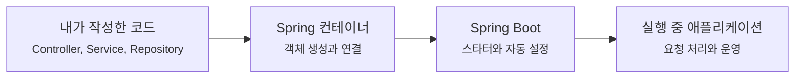

# Spring Boot 글은 어디부터 읽으면 좋을까요?

> Spring Boot는 편한데, 편한 만큼 **내가 안 한 일을 누가 했는지**가 잘 안 보일 때가 있어요.

컨트롤러 하나 만들었을 뿐인데 서버가 뜨고, JSON이 나가고, 설정 파일이 읽히고, 데이터베이스 연결까지 준비되는 장면을 보면 이런 생각이 들죠.

> "이거 편하긴 한데, 내부에서 뭐가 움직이는 거지?"

이 Spring Boot 글들은 그 질문을 따라가려고 만든 길이에요. Annotation 이름을 먼저 외우기보다, **내가 작성한 코드**와 **Spring Boot가 대신 준비한 일**을 나눠서 보는 데 집중할게요.

처음 읽는 분은 "아, 그래서 서버가 뜨는구나" 정도만 잡아도 충분해요. 하지만 이 카테고리는 거기서 멈추지 않을 거예요. 같은 장면을 한 번 더 내려가서 **누가 결정했는지**, **어느 시점에 객체가 만들어지는지**, **어떤 경계에서 기대와 다르게 동작하는지**, **실무에서는 무엇을 확인해야 하는지**까지 같이 볼 거예요.

---

## 지금은 여기서 시작하면 돼요

아직 글이 많지는 않아요. 그래서 지금은 아래 순서대로 읽는 흐름이 가장 자연스러워요.

- [왜 Spring과 Spring Boot가 필요했을까요?](why-spring-and-boot-exist.md){ data-preview }  
  객체를 직접 만들고 연결하던 코드가 왜 Spring 컨테이너로 옮겨갔는지, 그리고 Spring Boot가 어떤 반복 설정을 덜어주는지 큰 그림부터 잡아요.

- [Spring Boot 프로젝트는 처음에 무엇을 만들어줄까요?](spring-boot-init-and-project-shape.md){ data-preview }
  Spring Initializr와 `spring init`으로 만든 첫 프로젝트의 선택지, 빌드 파일, `main` 클래스, 패키지 구조, DevTools의 역할을 살펴봐요.

- [IoC, DI, AOP는 왜 Spring을 읽는 세 가지 기준점일까요?](spring-three-principles-ioc-di-aop.md){ data-preview }
  제어의 역전, 의존성 주입, 관점 지향 프로그래밍을 어려운 정의보다 먼저 코드 책임의 이동으로 잡아봐요.

- [main 메서드 하나가 어떻게 실행 중인 앱이 될까요?](main-method-to-running-app.md){ data-preview }
  `SpringApplication.run`이 환경을 준비하고 컨테이너를 만들고 웹 서버를 띄우는 큰 흐름을 따라가요.

- [ApplicationContext와 Bean은 왜 Spring이 소유한 객체일까요?](application-context-and-beans.md){ data-preview }
  Spring 컨테이너가 빈 정의를 모으고 실제 객체를 만들고 연결하는 흐름을, 생명주기와 scope까지 이어서 살펴봐요.

- [컴포넌트 스캔과 Bean 등록은 왜 가끔 내 클래스를 못 찾을까요?](component-scan-and-bean-registration.md){ data-preview }
  컴포넌트 스캔, `@Bean`, 조건부 등록이 각각 어떤 방식으로 빈을 등록하는지 보고, Spring Boot가 클래스를 못 찾는 흔한 이유를 정리해요.

- [의존성 주입은 실제 코드에서 어떻게 읽어야 할까요?](dependency-injection-in-real-code.md){ data-preview }
  생성자 주입, 선택적 의존성, 여러 빈 후보, 순환 의존성을 실제 서비스 코드 흐름으로 읽고 field injection이 오래 갈수록 불리해지는 이유를 살펴봐요.

- [AOP 프록시와 Annotation은 왜 기대와 다르게 동작할까요?](aop-proxy-and-annotation-behavior.md){ data-preview }
  `@Transactional` 같은 Annotation이 단순한 표시가 아니라 프록시를 통과하는 호출에서 동작하는 이유와 self-invocation 함정을 살펴봐요.

- [스타터와 자동 설정은 왜 버전과 설정을 대신 맞춰줄까요?](auto-configuration-and-starters.md){ data-preview }
  starter, BOM, dependency management, auto-configuration, 조건 평가 리포트를 통해 의존성 하나가 어떻게 실행 설정으로 이어지는지 살펴봐요.

- [application.yml과 profile은 설정을 어떻게 바꿔줄까요?](configuration-properties-profiles-and-secrets.md){ data-preview }
  외부 설정, Config Data, profile, 환경 변수, Configuration Properties, 검증, secret 경계를 한 흐름으로 읽어봐요.

- [Spring Boot 4와 3은 무엇이 달라졌을까요?](boot-4-and-boot-3-baseline-map.md){ data-preview }
  Spring Boot 4.x와 3.5.x의 기준선을 Java, Spring Framework, Jakarta EE, Servlet 컨테이너, starter, 테스트 의존성 관점에서 비교해요.

- [웹 요청은 Spring MVC 안에서 어떤 순서로 지나갈까요?](web-request-lifecycle-mvc.md){ data-preview }
  DispatcherServlet, HandlerMapping, argument resolution, validation, HttpMessageConverter, exception handling까지 Spring MVC 요청 흐름을 한 번에 따라가요.

앞으로는 이 흐름을 따라 프로젝트 생성, `main` 메서드, 애플리케이션 컨텍스트(application context), 빈(bean), 의존성 주입(dependency injection), 자동 설정(auto-configuration), 웹 요청 흐름, 데이터베이스, 보안, 테스트, 운영까지 하나씩 이어갈 예정이에요.

---

## 이 길에서 계속 붙잡을 질문

Spring Boot를 읽을 때는 기능 이름보다 질문을 먼저 잡는 편이 덜 헷갈려요.

- 내가 만든 클래스는 누가 객체로 만들까요?
- 필요한 객체는 누가 생성자에 넣어줄까요?
- `main` 메서드 하나가 왜 웹 서버 시작으로 이어질까요?
- 스타터(starter)를 넣으면 왜 여러 라이브러리가 같이 따라올까요?
- 자동 설정(auto-configuration)은 언제 적용되고, 언제 물러날까요?
- 테스트에서는 왜 실행할 때와 다른 컨텍스트가 뜰까요?
- Annotation 하나를 붙였는데 실제로는 프록시(proxy), 조건(condition), 컨텍스트(application context) 중 어디가 움직인 걸까요?
- 운영에서 문제가 났을 때 로그, 설정, 빈 목록, 조건 평가 리포트 중 무엇부터 봐야 할까요?

이 질문들이 뒤 글들의 기준점이 될 거예요.

이 그림의 핵심은 역할 분리예요. 개발자는 애플리케이션의 행동을 쓰고, Spring은 객체를 만들고 연결하고, Spring Boot는 반복되는 설정과 실행 기본값을 준비해요.

---

## 자, 정리해볼까요?

!!! abstract "Spring Boot 글은 이렇게 읽으면 돼요"
    - 처음이라면 위 목록을 차례대로 읽는 게 가장 자연스러워요.
    - 이 카테고리는 Annotation 암기보다 **프레임워크가 대신 한 일**을 보이게 만드는 데 집중해요.
    - 각 글은 쉬운 장면에서 시작하되, 나중에 인용해도 버틸 수 있도록 메커니즘과 실패 경계까지 함께 남겨요.
    - 실제 파일명은 번호 없는 안정적인 slug를 쓰고, 읽는 순서는 `zensical.toml`의 nav에서 관리해요.

그럼 첫 글부터 시작해볼까요?

<a class="md-button md-button--primary" href="why-spring-and-boot-exist/">첫 글 읽기</a>
