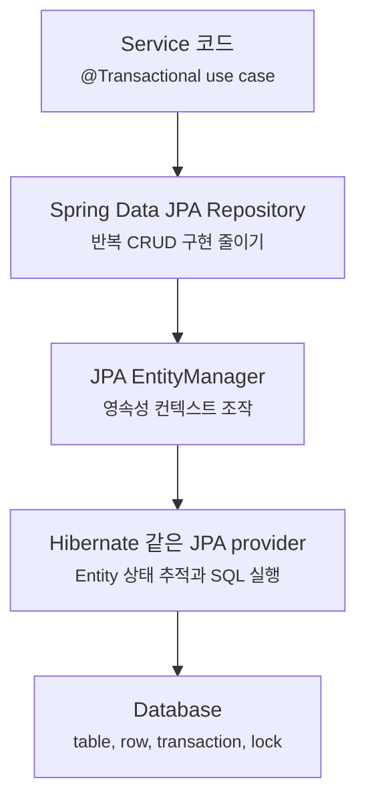
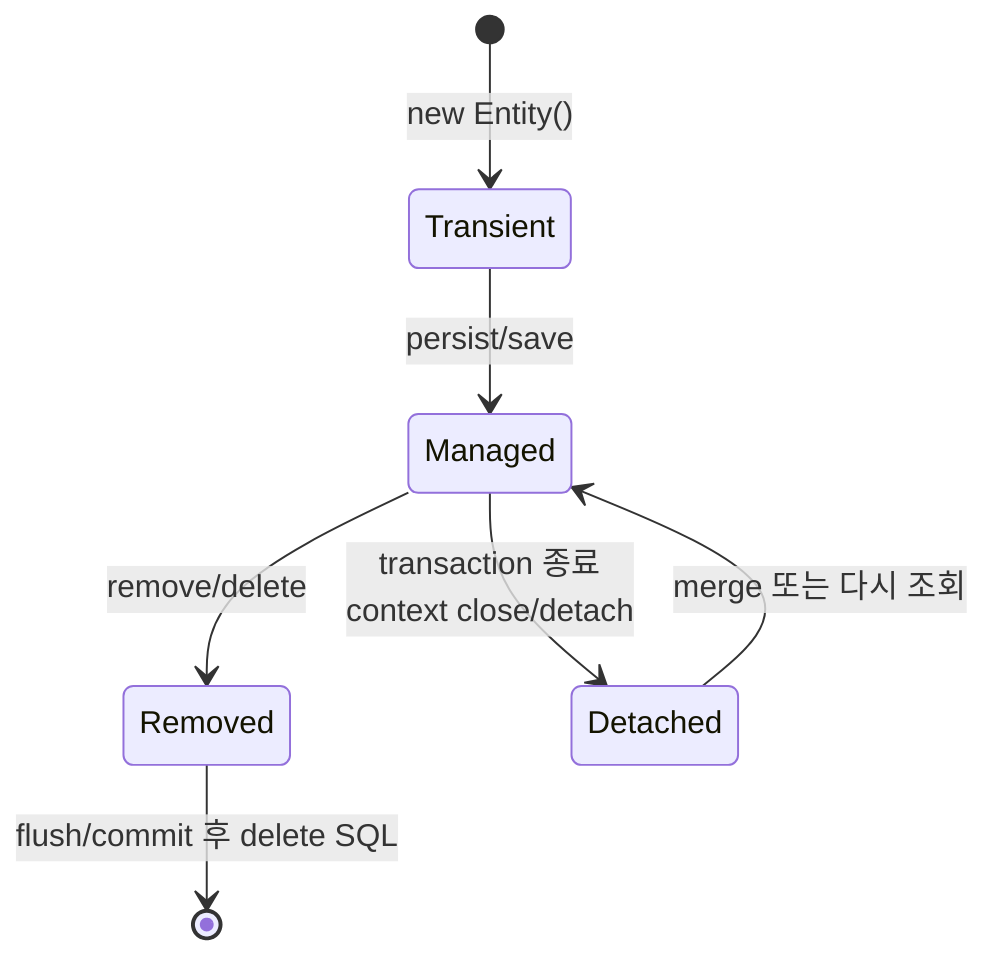
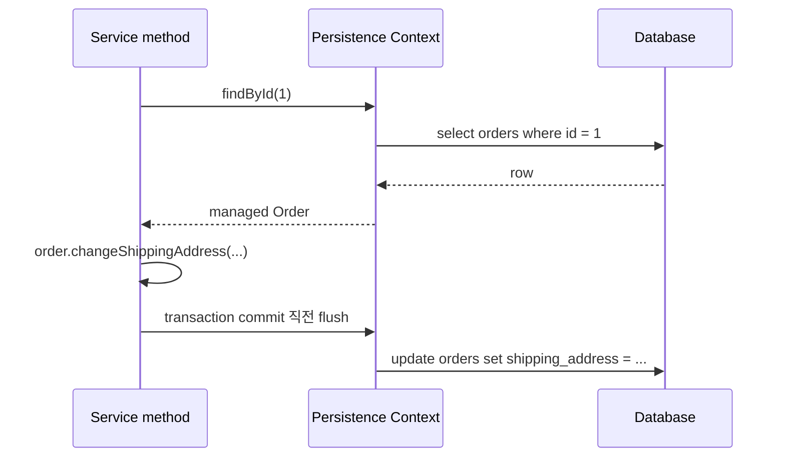
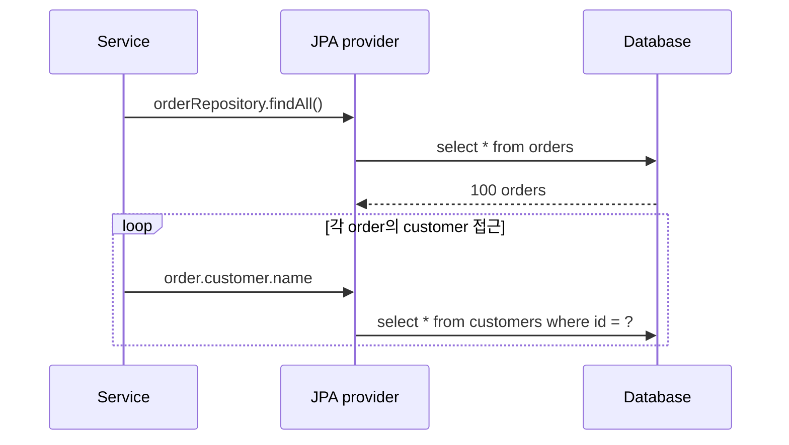
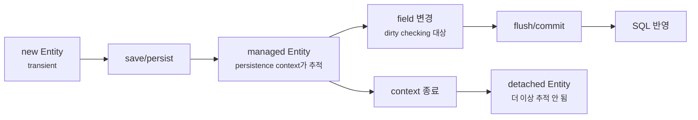

# JPA Entity 상태와 영속성 컨텍스트는 왜 헷갈릴까요?

> 분명 `save()`를 다시 부르지 않았는데, transaction이 끝나자 `update`가 나갔어요.

지난 글에서는 JDBC, Spring Data JDBC, JPA, R2DBC를 최신순이 아니라 문제 모양으로 골라야 한다고 봤어요. 오늘은 그중 JPA를 더 가까이 볼게요.

JPA를 처음 쓰면 편한 장면이 먼저 보여요.

```java
Order order = orderRepository.findById(id)
        .orElseThrow(OrderNotFoundException::new);

order.changeShippingAddress(newAddress);
```

여기까지만 보면 그냥 Java 객체의 setter 비슷한 메서드를 호출한 것 같죠.

근데요, 이 코드가 `@Transactional` method 안에서 실행됐다면 이야기가 달라져요. JPA provider는 이 `order` 객체를 그냥 평범한 Java 객체로만 보지 않아요. **영속성 컨텍스트(persistence context)가 관리하는 Entity**로 보고, transaction이 끝날 때 변경 내용을 데이터베이스와 맞춰요.

그래서 JPA를 읽을 때는 질문이 바뀌어야 해요.

> "Repository가 SQL을 대신 만들어주나요?"에서 멈추면 부족해요.  
> "이 객체는 지금 영속성 컨텍스트 안에 있나요?"까지 봐야 해요.

!!! note "이 글의 기준"
    이 글은 Spring Data JPA 공식 문서의 repository, auditing, `@EntityGraph` 설명과 Hibernate ORM 공식 문서의 persistence context, entity state, lazy fetching 설명을 기준으로 작성했어요. Spring Boot 버전별 starter 이름이나 Hibernate 세부 버전은 프로젝트마다 달라질 수 있지만, JPA의 핵심 모델인 Entity 상태와 영속성 컨텍스트 개념은 같은 방향으로 읽으면 돼요.

---

## JPA는 "SQL 자동 생성기"만은 아니에요

JPA를 처음 만나는 코드는 보통 repository예요.

```java
package com.example.order;

import org.springframework.data.jpa.repository.JpaRepository;

public interface OrderRepository extends JpaRepository<Order, Long> {
}
```

이 interface 하나로 `save`, `findById`, `findAll`, `deleteById` 같은 method를 쓸 수 있어요. 그래서 처음에는 이렇게 느끼기 쉬워요.

> "아, JPA는 SQL을 안 쓰고 repository method로 DB를 다루게 해주는 기술이구나."

틀린 말은 아니지만 핵심은 조금 더 깊은 곳에 있어요.

JPA는 관계형 데이터베이스의 row를 Java 객체처럼 다루게 해주는 ORM(Object-Relational Mapping) 표준이에요. 그리고 Hibernate 같은 JPA provider가 실제 runtime에서 Entity를 추적하고 SQL을 실행해요. Spring Data JPA는 그 위에서 repository boilerplate를 줄여주는 도구예요.



이 그림에서 Spring Data JPA repository는 입구예요. 하지만 JPA 특유의 헷갈림은 대개 그 아래, **EntityManager와 영속성 컨텍스트가 객체 상태를 관리하는 층**에서 생겨요.

---

## Entity는 그냥 DTO가 아니에요

먼저 작은 주문 Entity를 볼게요.

```java
package com.example.order;

import jakarta.persistence.Entity;
import jakarta.persistence.EnumType;
import jakarta.persistence.Enumerated;
import jakarta.persistence.GeneratedValue;
import jakarta.persistence.Id;
import jakarta.persistence.Table;
import java.time.Instant;

@Entity
@Table(name = "orders")
public class Order {

    @Id
    @GeneratedValue
    private Long id;

    private String orderNumber;
    private String shippingAddress;

    @Enumerated(EnumType.STRING)
    private OrderStatus status;

    private Instant createdAt;

    protected Order() {
    }

    private Order(String orderNumber, String shippingAddress, Instant createdAt) {
        this.orderNumber = orderNumber;
        this.shippingAddress = shippingAddress;
        this.status = OrderStatus.READY;
        this.createdAt = createdAt;
    }

    public static Order place(String orderNumber, String shippingAddress, Instant createdAt) {
        return new Order(orderNumber, shippingAddress, createdAt);
    }

    public void changeShippingAddress(String shippingAddress) {
        if (status != OrderStatus.READY) {
            throw new IllegalStateException("배송 준비 상태에서만 주소를 바꿀 수 있어요.");
        }
        this.shippingAddress = shippingAddress;
    }

    public void markPaid() {
        if (status != OrderStatus.READY) {
            throw new IllegalStateException("배송 준비 상태에서만 결제 처리할 수 있어요.");
        }
        this.status = OrderStatus.PAID;
    }

    public Long id() {
        return id;
    }

    public String orderNumber() {
        return orderNumber;
    }
}
```

```java
package com.example.order;

public enum OrderStatus {
    READY,
    PAID,
    SHIPPED,
    CANCELED
}
```

겉으로 보면 field가 있는 Java class예요. 하지만 `@Entity`가 붙는 순간 이 class는 JPA가 데이터베이스 row와 연결해서 관리할 수 있는 대상이 돼요.

여기서 DTO와 Entity의 차이를 조심해야 해요.

| 구분 | DTO | JPA Entity |
|---|---|---|
| 주된 역할 | API 요청/응답, 계층 간 데이터 전달 | DB row와 연결되는 domain 상태 |
| 생명주기 | 보통 한 요청에서 만들어지고 버려짐 | 영속성 컨텍스트 안에서 상태가 추적됨 |
| 변경 의미 | field 값이 바뀐 Java 객체 | 관리 상태라면 DB 반영 후보가 됨 |
| 외부 노출 | API 계약으로 노출 가능 | 그대로 노출하면 내부 저장 모델이 새어 나갈 수 있음 |

Entity는 "DB에 저장되는 DTO"가 아니에요. JPA가 상태를 추적할 수 있는 domain 객체예요.

---

## Entity에는 상태가 있어요

JPA에서 Entity는 보통 네 가지 상태로 읽으면 좋아요.

| 상태 | 한국어로 읽기 | 어떤 상태인가요? |
|---|---|---|
| transient | 아직 관리되지 않는 새 객체 | `new Order(...)`처럼 만들었지만 영속성 컨텍스트와 연결되지 않았어요 |
| managed | 관리 중인 객체 | 영속성 컨텍스트 안에 있고 변경 추적 대상이에요 |
| detached | 분리된 객체 | 식별자는 있지만 현재 영속성 컨텍스트가 관리하지 않아요 |
| removed | 삭제 예정 객체 | 영속성 컨텍스트 안에서 삭제 대상으로 표시됐어요 |

흐름으로 보면 이래요.



이 그림의 핵심은 `new`로 만든 객체와 repository에서 조회한 객체가 같은 의미가 아니라는 점이에요. 둘 다 Java 객체지만, 하나는 아직 JPA가 모르는 객체이고 다른 하나는 영속성 컨텍스트가 추적하는 객체일 수 있어요.

예를 들어 주문을 새로 만들 때는 처음에 transient 상태예요.

```java
Order order = Order.place("A-1001", "Seoul", Instant.now());
```

이 객체를 repository로 저장하면 managed 상태가 돼요.

```java
Order saved = orderRepository.save(order);
```

반대로 transaction이 끝나고 영속성 컨텍스트가 닫힌 뒤에는 그 객체가 detached 상태가 될 수 있어요. 식별자는 가지고 있지만, 더 이상 변경 추적 대상이 아닌 거예요.

!!! warning "detached Entity를 수정해도 자동으로 DB에 반영된다고 기대하면 위험해요"
    JPA가 변경을 감지하는 대상은 영속성 컨텍스트가 관리하는 managed Entity예요. controller까지 Entity를 들고 나가서 나중에 field를 바꾸는 방식은 transaction 경계를 흐리게 만들고, lazy loading 예외나 예기치 않은 merge 문제를 부를 수 있어요.

---

## 영속성 컨텍스트는 "작업대"에 가까워요

영속성 컨텍스트는 Entity를 관리하는 공간이에요. 너무 추상적으로 들리면, service method 하나가 실행되는 동안 JPA가 펼쳐놓는 작업대라고 생각해도 좋아요.

작업대 위에는 이런 일이 생겨요.

- 같은 row를 한 context 안에서 다시 찾으면 같은 Entity instance로 다뤄질 수 있어요.
- managed Entity의 변경이 추적돼요.
- 삭제 예정 Entity가 표시돼요.
- flush 시점에 `insert`, `update`, `delete` SQL이 데이터베이스로 나가요.



여기서 service code는 `update` SQL을 직접 호출하지 않았어요. 대신 managed Entity의 field가 바뀌었고, 영속성 컨텍스트가 그 변경을 flush 시점에 데이터베이스로 동기화했어요. 이게 dirty checking이에요.

---

## dirty checking은 편하지만 경계를 흐리게 만들 수 있어요

다음 service를 볼게요.

```java
package com.example.order;

import org.springframework.stereotype.Service;
import org.springframework.transaction.annotation.Transactional;

@Service
public class OrderCommandService {

    private final OrderRepository orderRepository;

    public OrderCommandService(OrderRepository orderRepository) {
        this.orderRepository = orderRepository;
    }

    @Transactional
    public void changeShippingAddress(long orderId, String newAddress) {
        Order order = orderRepository.findById(orderId)
                .orElseThrow(OrderNotFoundException::new);

        order.changeShippingAddress(newAddress);
    }
}
```

처음 보면 이상하죠.

> "`save(order)`를 안 했는데요?"

JPA에서는 이 코드가 자연스러울 수 있어요. `findById`로 가져온 `order`가 transaction 안에서 managed 상태라면, `order.changeShippingAddress(...)`로 바뀐 내용을 JPA가 감지해요. 그리고 transaction commit 과정에서 flush가 일어나면 필요한 `update` SQL을 만들 수 있어요.

그래서 JPA 코드 리뷰에서는 이런 질문이 중요해져요.

| 질문 | 봐야 할 이유 |
|---|---|
| 이 method에 transaction이 있나요? | managed 상태와 flush 시점이 transaction 경계에 묶여요 |
| Entity를 조회한 뒤 어디까지 들고 가나요? | context 밖으로 나가면 detached가 될 수 있어요 |
| 변경 method가 domain 규칙을 지키나요? | setter 남발은 dirty checking의 추적 범위를 흐려요 |
| `save()`를 습관처럼 다시 부르나요? | 새 객체 저장인지, managed 객체 변경인지 구분이 안 될 수 있어요 |

!!! tip "`save()`가 없는 update를 무조건 이상하게 보지는 마세요"
    JPA에서는 managed Entity를 바꾸고 transaction이 끝날 때 반영하는 방식이 흔해요. 다만 그 코드가 읽히려면 service method의 transaction 경계와 Entity 변경 method가 분명해야 해요.

---

## `save()`는 "항상 즉시 SQL 실행"이라는 뜻이 아니에요

Spring Data JPA를 쓰면 `repository.save(entity)`를 자주 보게 돼요. 이름 때문에 "지금 바로 DB에 저장한다"처럼 느껴지지만, JPA에서는 조금 더 조심해서 읽어야 해요.

새 Entity를 저장하는 흐름은 이런 느낌이에요.

```java
@Transactional
public long placeOrder(PlaceOrderCommand command) {
    Order order = Order.place(
            command.orderNumber(),
            command.shippingAddress(),
            Instant.now()
    );

    Order saved = orderRepository.save(order);
    return saved.id();
}
```

이때 `save`는 새 Entity를 영속성 컨텍스트에 연결하는 입구가 될 수 있어요. 하지만 실제 `insert` SQL이 언제 나가는지는 식별자 생성 전략, flush 시점, transaction commit 시점에 영향을 받아요.

반대로 이미 managed 상태인 Entity를 바꿀 때마다 `save`를 반복해서 부르면 코드 의도가 흐려져요.

```java
@Transactional
public void pay(long orderId) {
    Order order = orderRepository.findById(orderId)
            .orElseThrow(OrderNotFoundException::new);

    order.markPaid();
    orderRepository.save(order); // 꼭 필요한지 먼저 의심해볼 지점
}
```

이 줄이 항상 버그라는 뜻은 아니에요. 하지만 "새 객체를 저장한다"와 "관리 중인 객체의 상태를 바꾼다"는 다른 이야기예요. JPA를 제대로 읽으려면 둘을 구분해야 해요.

---

## lazy loading은 편의 기능이면서 성능 함정이에요

주문에는 고객이 있을 수 있어요.

```java
package com.example.order;

import jakarta.persistence.Entity;
import jakarta.persistence.FetchType;
import jakarta.persistence.GeneratedValue;
import jakarta.persistence.Id;
import jakarta.persistence.ManyToOne;
import jakarta.persistence.Table;

@Entity
@Table(name = "orders")
public class Order {

    @Id
    @GeneratedValue
    private Long id;

    @ManyToOne(fetch = FetchType.LAZY)
    private Customer customer;

    private String orderNumber;

    public String customerName() {
        return customer.name();
    }
}
```

`FetchType.LAZY`는 관련 객체를 처음부터 무조건 다 가져오지 않고, 필요할 때 가져오겠다는 뜻이에요. 처음에는 좋아 보여요. 주문 목록만 필요한데 고객 상세까지 매번 가져오면 낭비니까요.

하지만 반복문에서 관계를 건드리면 문제가 보이기 시작해요.

```java
@Transactional(readOnly = true)
public List<OrderSummary> findSummaries() {
    return orderRepository.findAll().stream()
            .map(order -> new OrderSummary(
                    order.id(),
                    order.customerName(),
                    order.orderNumber()
            ))
            .toList();
}
```

처음 `findAll()`에서 주문 100개를 가져왔고, 그 뒤 `customerName()`을 부를 때마다 고객을 하나씩 추가 조회한다면 어떻게 될까요?



이게 흔히 말하는 N+1 문제예요. 주문 목록 1번 조회에, 고객 조회 N번이 붙어요. 데이터가 적을 때는 티가 안 나고, 운영 데이터가 늘면 갑자기 느려질 수 있어요.

해결 방법은 상황마다 달라요.

| 방법 | 어울리는 상황 |
|---|---|
| DTO projection | 목록 화면이나 API 응답에 필요한 column만 가져오고 싶을 때 |
| fetch join | 특정 use case에서 연관 Entity를 한 query로 같이 가져오고 싶을 때 |
| `@EntityGraph` | Spring Data JPA repository method에서 fetch 계획을 드러내고 싶을 때 |
| query 분리 | 목록과 상세의 데이터 요구가 다를 때 |

예를 들어 repository method에 `@EntityGraph`를 붙여 특정 조회에서 고객을 함께 가져오게 표현할 수 있어요.

```java
package com.example.order;

import java.util.List;
import org.springframework.data.jpa.repository.EntityGraph;
import org.springframework.data.jpa.repository.JpaRepository;

public interface OrderRepository extends JpaRepository<Order, Long> {

    @EntityGraph(attributePaths = "customer")
    List<Order> findByStatus(OrderStatus status);
}
```

중요한 건 lazy loading을 나쁘다고 외우는 게 아니에요. **언제 늦게 가져오고, 언제 처음 query에서 같이 가져와야 하는지 use case마다 정해야 한다**는 점이에요.

!!! warning "Entity를 JSON으로 바로 반환하면 lazy loading 문제가 API 응답 중에 터질 수 있어요"
    controller가 Entity를 그대로 반환하면 JSON 직렬화 과정에서 lazy 관계를 건드릴 수 있어요. 그러면 예상치 못한 query가 나가거나, 영속성 컨텍스트 밖에서는 lazy loading 예외가 날 수 있어요. API 응답은 DTO로 끊는 편이 안전해요.

---

## 감사 필드는 "누가 언제 바꿨나"를 Entity 생명주기와 연결해요

실무 Entity에는 보통 이런 필드가 붙어요.

- 언제 만들어졌나요?
- 언제 마지막으로 수정됐나요?
- 누가 만들었나요?
- 누가 마지막으로 수정했나요?

Spring Data JPA는 auditing 기능으로 이런 값을 채울 수 있어요.

```java
package com.example.order;

import jakarta.persistence.Entity;
import jakarta.persistence.EntityListeners;
import jakarta.persistence.GeneratedValue;
import jakarta.persistence.Id;
import jakarta.persistence.Table;
import java.time.Instant;
import org.springframework.data.annotation.CreatedBy;
import org.springframework.data.annotation.CreatedDate;
import org.springframework.data.annotation.LastModifiedBy;
import org.springframework.data.annotation.LastModifiedDate;
import org.springframework.data.jpa.domain.support.AuditingEntityListener;

@Entity
@Table(name = "orders")
@EntityListeners(AuditingEntityListener.class)
public class Order {

    @Id
    @GeneratedValue
    private Long id;

    private String orderNumber;

    @CreatedDate
    private Instant createdAt;

    @LastModifiedDate
    private Instant updatedAt;

    @CreatedBy
    private Long createdBy;

    @LastModifiedBy
    private Long updatedBy;
}
```

그리고 설정 쪽에서 JPA auditing을 켜요.

```java
package com.example.config;

import java.util.Optional;
import org.springframework.context.annotation.Bean;
import org.springframework.context.annotation.Configuration;
import org.springframework.data.domain.AuditorAware;
import org.springframework.data.jpa.repository.config.EnableJpaAuditing;

@Configuration
@EnableJpaAuditing
public class JpaAuditingConfig {

    @Bean
    AuditorAware<Long> auditorAware() {
        return () -> Optional.of(1L);
    }
}
```

예시는 단순하게 항상 `1L`을 돌려줬지만, 실제 서비스에서는 현재 로그인한 사용자 ID를 꺼내야 해요. Spring Security를 쓴다면 `SecurityContext`에서 인증된 사용자를 읽는 방식이 흔해요.

여기서도 중요한 건 Annotation 이름을 외우는 게 아니에요.

| Annotation | 읽는 법 |
|---|---|
| `@CreatedDate` | Entity가 처음 저장될 때 생성 시각을 채워요 |
| `@LastModifiedDate` | Entity가 수정될 때 마지막 수정 시각을 채워요 |
| `@CreatedBy` | 누가 만들었는지 채워요 |
| `@LastModifiedBy` | 누가 마지막으로 바꿨는지 채워요 |

감사 필드는 단순 편의 필드가 아니에요. 운영에서 "이 주문 상태가 언제, 누구 때문에 바뀌었나요?"를 추적하는 시작점이에요. 다만 이것만으로 모든 변경 이력이 남는 건 아니에요. 값의 변경 전후 기록까지 필요하면 별도 history table, event, Hibernate Envers 같은 선택지를 검토해야 해요.

---

## 실무에서는 이 경계가 중요해져요

JPA는 코드를 짧게 만들어주지만, 그만큼 runtime 경계를 숨기기도 해요. 그래서 실무에서는 아래 냄새를 먼저 봐요.

| 냄새 | 의심할 지점 |
|---|---|
| controller가 Entity를 그대로 반환함 | API 계약과 persistence model이 섞였어요 |
| service 밖에서 Entity를 오래 들고 있음 | detached 상태, lazy loading, 변경 추적 경계가 흐려져요 |
| 모든 update 뒤에 습관적으로 `save()`를 호출함 | transient와 managed 상태를 구분하지 못했을 수 있어요 |
| 목록 API가 갑자기 느려짐 | lazy loading으로 N+1이 생겼을 수 있어요 |
| `@Transactional` 없는 method에서 Entity를 수정함 | dirty checking이 동작할 경계가 없을 수 있어요 |
| Entity 관계가 양방향으로 계속 늘어남 | JSON 순환 참조, cascade, fetch 계획이 복잡해질 수 있어요 |
| 테스트에서는 통과하는데 운영 DB에서 느림 | 실제 SQL, index, fetch plan, transaction 범위를 확인해야 해요 |

특히 JPA 문제를 디버깅할 때는 "어떤 Java method가 호출됐나요?"만 보면 부족해요.

- 실제로 어떤 SQL이 나갔나요?
- 한 요청에서 SQL이 몇 번 나갔나요?
- transaction은 어디서 열리고 닫혔나요?
- Entity는 managed 상태였나요, detached 상태였나요?
- lazy 관계를 어디서 처음 건드렸나요?
- API DTO로 바꾸기 전에 Entity 그래프가 JSON 변환기에 넘어가지는 않았나요?

이 질문들이 있어야 JPA가 편한지 위험한지 제대로 판단할 수 있어요.

---

## 처음에는 여기까지만 잡아도 충분해요

JPA를 한 번에 다 이해하려고 하면 너무 커요. 오늘은 이 정도만 먼저 붙잡아도 좋아요.



이 그림에서 JPA의 핵심은 `managed Entity`예요. 객체가 managed 상태인지 아닌지에 따라 같은 Java 코드도 완전히 다르게 읽혀요.

그래서 JPA를 쓸 때는 항상 이렇게 물어보세요.

> "이 객체는 지금 누가 관리하고 있나요?"

이 질문 하나가 dirty checking, lazy loading, N+1, detached Entity, transaction boundary를 읽는 출발점이 돼요.

---

## 참고한 링크

- [Spring Data JPA Reference Documentation](https://docs.spring.io/spring-data/jpa/reference/index.html)
- [Spring Data JPA Reference Documentation: Auditing](https://docs.spring.io/spring-data/jpa/reference/auditing.html)
- [Spring Data JPA Reference Documentation: JPA Query Methods](https://docs.spring.io/spring-data/jpa/reference/jpa/query-methods.html)
- [Hibernate ORM User Guide: Persistence Context](https://docs.hibernate.org/orm/current/userguide/html_single/Hibernate_User_Guide.html#pc)
- [Jakarta Persistence API: EntityManager](https://jakarta.ee/specifications/persistence/3.2/apidocs/jakarta.persistence/jakarta/persistence/entitymanager)

---

## 자, 정리해볼까요?

!!! abstract "오늘 우리가 배운 것"
    - JPA Entity는 DTO가 아니라 영속성 컨텍스트가 상태를 추적할 수 있는 객체예요.
    - Entity는 transient, managed, detached, removed 상태로 읽으면 흐름이 선명해져요.
    - managed Entity를 transaction 안에서 바꾸면 dirty checking을 통해 flush/commit 시점에 SQL이 나갈 수 있어요.
    - `save()`는 항상 즉시 SQL 실행이라는 뜻이 아니고, 새 Entity 저장과 managed Entity 변경은 다르게 읽어야 해요.
    - lazy loading은 필요한 순간까지 조회를 늦출 수 있지만, N+1과 JSON 직렬화 문제를 만들 수 있어요.
    - `@CreatedDate`, `@LastModifiedDate`, `@CreatedBy`, `@LastModifiedBy`는 Entity 생명주기와 운영 추적을 연결하는 auditing 도구예요.

다음 글에서는 transaction boundary를 더 깊게 볼게요. `@Transactional`이 정확히 어디서 시작되고 끝나는지, rollback은 어떤 예외에서 일어나는지, self-invocation과 propagation이 왜 기대를 흔드는지 이어서 살펴볼 거예요.
