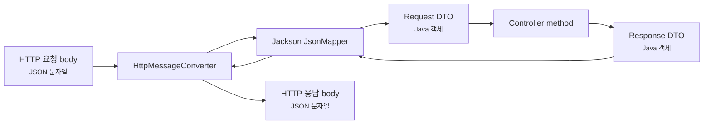
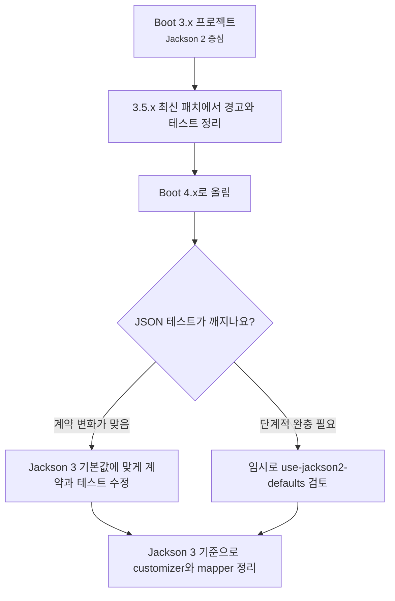

# JSON과 Jackson 3는 왜 API 호환성의 핵심일까요?

> 컨트롤러가 객체를 return했을 뿐인데, 클라이언트는 그 객체가 아니라 JSON 문자열을 믿고 있어요.

지난 글에서는 REST API를 controller method가 아니라 클라이언트와 서버가 맺는 HTTP 계약으로 봤어요. request DTO, response DTO, validation, Problem Details, error code 같은 이야기를 했죠.

그런데 그 계약은 결국 이런 모양으로 밖으로 나가요.

```json
{
  "id": 42,
  "status": "READY",
  "orderedAt": "2026-07-02T10:15:30+09:00"
}
```

처음에는 자연스럽게 느껴져요.

> "Java 객체를 return하면 JSON으로 나가는 거 아닌가요?"

맞아요. Spring MVC에서는 `@RequestBody`를 Java 객체로 읽고, `@RestController`의 반환 객체를 JSON으로 쓰는 흐름이 잘 준비되어 있어요. 하지만 실무에서는 바로 이런 질문이 따라와요.

> "날짜는 문자열인가요, 숫자인가요?"  
> "enum은 `READY`로 나가나요, 다른 표시 이름으로 나가나요?"  
> "클라이언트가 모르는 필드를 보내면 실패해야 하나요?"  
> "null 필드는 응답에서 빠지나요, 그대로 나오나요?"  
> "Spring Boot 3에서 쓰던 `ObjectMapper` 설정은 Boot 4에서도 그대로 먹나요?"  
> "`com.fasterxml.jackson` import는 왜 갑자기 안 맞죠?"

오늘은 이 지점을 볼 거예요. **JSON 변환은 단순한 편의 기능이 아니라 API 계약을 실제 바이트로 만드는 경계예요. Spring Boot 4.x에서는 Jackson 3가 기본 방향이고, Jackson 2를 쓰던 프로젝트는 package, 기본값, customizer, 테스트를 함께 확인해야 해요.**

!!! note "이 글의 기준"
    이 글은 Spring Boot 4.1.0 공식 문서의 JSON, Spring MVC Jackson 설정 설명과 Jackson 3 마이그레이션 문서를 기준으로 작성했어요. Jackson 2 지원은 Spring Boot 4.x에서 마이그레이션을 돕기 위한 deprecated 경로이므로, 새 Boot 4 프로젝트는 Jackson 3 기준으로 읽는 편이 좋아요.

---

## JSON은 controller 바깥의 실제 약속이에요

Java controller는 이렇게 생겼을 수 있어요.

```java
package com.example.order.api;

import org.springframework.web.bind.annotation.GetMapping;
import org.springframework.web.bind.annotation.PathVariable;
import org.springframework.web.bind.annotation.RestController;

@RestController
public class OrderController {

    private final OrderService orderService;

    public OrderController(OrderService orderService) {
        this.orderService = orderService;
    }

    @GetMapping("/orders/{id}")
    public OrderResponse findOrder(@PathVariable Long id) {
        return orderService.findOrder(id);
    }
}
```

그리고 DTO는 record로 만들 수 있어요.

```java
package com.example.order.api;

import java.time.OffsetDateTime;

public record OrderResponse(
        Long id,
        OrderStatus status,
        OffsetDateTime orderedAt
) {
}
```

서버 안에서는 `OrderResponse`예요. 하지만 클라이언트가 받는 것은 Java record가 아니에요. HTTP response body에 적힌 JSON이에요.

```http
HTTP/1.1 200 OK
Content-Type: application/json

{
  "id": 42,
  "status": "READY",
  "orderedAt": "2026-07-02T10:15:30+09:00"
}
```

여기에서 이미 중요한 결정이 일어났어요.

| Java 쪽 모양 | JSON 계약에서 드러나는 모양 |
|---|---|
| `Long id` | JSON number로 나가요 |
| `OrderStatus status` | enum 이름 문자열로 나가요 |
| `OffsetDateTime orderedAt` | 날짜와 시간 문자열로 나가요 |
| record component 이름 | JSON field 이름이 돼요 |

이 변환을 맡는 대표 도구가 Jackson이에요. Spring MVC 요청 흐름에서 보면 `HttpMessageConverter`가 request body를 읽거나 response body를 쓸 때 Jackson mapper를 사용해요.



이 그림의 핵심은 controller method 앞뒤에 JSON 변환 경계가 있다는 점이에요. controller 본문에 들어오기 전에도 JSON은 이미 Java 객체로 바뀌고, controller가 return한 뒤에도 Java 객체는 다시 JSON으로 바뀌어요.

그래서 JSON 문제는 "프론트엔드가 보기 좋은 문자열" 문제가 아니에요. 요청이 controller까지 도착하느냐, 응답을 기존 클라이언트가 계속 읽을 수 있느냐를 결정하는 API 경계 문제예요.

---

## Spring Boot 4에서는 Jackson 3가 기본 방향이에요

Spring Boot 4.x 문서는 JSON mapping library 중 Jackson 3를 preferred and default library로 안내해요. Jackson 2 지원도 있지만 deprecated이고, Jackson 2에서 3로 옮기는 동안을 돕는 용도라고 봐야 해요.

MVC 앱에서 보통 이런 starter를 쓰죠.

```gradle
dependencies {
    implementation "org.springframework.boot:spring-boot-starter-webmvc"
}
```

이 starter를 따라가면 JSON 처리에 필요한 의존성도 같이 들어와요. Jackson이 classpath에 있으면 Spring Boot는 Jackson 3용 `JsonMapper` bean을 자동 설정해요.

| 구분 | Spring Boot 4.x에서 읽는 법 |
|---|---|
| 기본 JSON mapper | Jackson 3의 `JsonMapper` 중심 |
| Jackson 2 | 마이그레이션 완충용 deprecated 지원 |
| 설정 property | `spring.jackson.*`로 Jackson 3 `JsonMapper.Builder`에 적용 |
| Java config 확장 | `JsonMapperBuilderCustomizer` 같은 hook 사용 |
| 완전 교체 | `JsonMapper` bean을 직접 정의할 수 있지만 자동 설정을 잃을 수 있어요 |

이전 Boot 3.x 글과 코드에서는 `ObjectMapper`라는 이름이 훨씬 자주 보였을 거예요.

```java
// Boot 3.x와 Jackson 2 코드에서 흔히 보던 모양
import com.fasterxml.jackson.databind.ObjectMapper;
```

Boot 4.x와 Jackson 3를 읽을 때는 이 방향을 먼저 떠올리는 편이 좋아요.

```java
// Boot 4.x와 Jackson 3에서 JSON 중심으로 읽는 모양
import tools.jackson.databind.json.JsonMapper;
```

여기서 중요한 건 이름만 바꾸는 일이 아니에요. Jackson 3에서는 package가 `com.fasterxml.jackson`에서 `tools.jackson` 쪽으로 옮겨졌고, JSON 전용 mapper로 `JsonMapper`를 쓰는 흐름이 더 뚜렷해졌어요. 다만 Jackson Annotation package에는 예외가 있어요. `@JsonProperty`, `@JsonIgnore` 같은 annotation은 여전히 `com.fasterxml.jackson.annotation` 쪽을 보게 될 수 있어요.

!!! warning "검색 결과의 import가 서로 다른 이유"
    오래된 Spring Boot 3.x 글은 Jackson 2와 `com.fasterxml.jackson.databind.ObjectMapper`를 기준으로 설명할 가능성이 높아요. Boot 4.x 글과 섞어 읽으면 import, customizer, 기본값이 서로 어긋날 수 있어요.

---

## 설정은 "하나의 ObjectMapper를 마음대로 바꾸기"가 아니에요

예전에는 이런 코드를 많이 봤을 거예요.

```java
@Bean
ObjectMapper objectMapper() {
    return new ObjectMapper()
            .findAndRegisterModules()
            .disable(SerializationFeature.WRITE_DATES_AS_TIMESTAMPS);
}
```

작은 예제에서는 이해하기 쉬워요. 하지만 Spring Boot 앱에서는 조심해야 해요.

왜냐하면 Spring Boot는 이미 JSON mapper와 message converter를 자동 설정하고 있거든요. 우리가 mapper bean을 통째로 새로 만들면 Boot가 준비한 module 등록, property 반영, converter 연결 흐름을 일부 놓칠 수 있어요.

Boot 4.x에서는 먼저 property로 되는지 보는 편이 좋아요.

```yaml
spring:
  jackson:
    serialization:
      indent-output: true
    default-property-inclusion: non_null
```

이런 설정은 auto-configured `JsonMapper.Builder`에 적용되고, 그 builder로 만들어지는 mapper에도 이어져요. 날짜, enum, unknown field, null 포함 여부 같은 설정 중 property로 표현되는 것은 코드보다 설정이 더 읽기 쉬울 때가 많아요.

조금 더 세밀한 설정이 필요하면 customizer를 붙일 수 있어요.

```java
@Bean
JsonMapperBuilderCustomizer jsonMapperCustomizer() {
    return builder -> builder.enable(SerializationFeature.INDENT_OUTPUT);
}
```

이 예제의 핵심은 "mapper를 통째로 갈아끼우기 전에 builder를 조정한다"는 점이에요. 완전 교체가 필요한 경우도 있지만, 그때는 Boot 자동 설정과 message converter가 어떻게 달라지는지 알고 해야 해요.

| 하고 싶은 일 | 먼저 볼 선택지 |
|---|---|
| pretty print 켜기 | `spring.jackson.serialization.indent-output` |
| null field 제외 | `spring.jackson.default-property-inclusion` |
| unknown field 처리 | `spring.jackson.deserialization.fail-on-unknown-properties` |
| custom serializer 등록 | Jackson module 또는 `@JacksonComponent` |
| 전역 mapper 세밀 조정 | `JsonMapperBuilderCustomizer` |
| 완전 다른 mapper 사용 | `JsonMapper` bean 직접 정의, converter 영향 확인 |

!!! tip "Boot 앱에서는 새 mapper보다 기존 builder 조정이 먼저예요"
    `new ObjectMapper()`나 `new JsonMapper()`를 아무 곳에서나 만들면 Spring Boot가 준비한 설정과 달라질 수 있어요. API 응답과 테스트에서 다른 JSON이 나오면 이 지점을 먼저 의심해보세요.

---

## 날짜는 "보기에 예쁜 값"이 아니라 호환성 문제예요

주문 시간을 응답한다고 해볼게요.

```java
public record OrderResponse(
        Long id,
        OffsetDateTime orderedAt
) {
}
```

클라이언트가 기대하는 JSON이 이것이라면,

```json
{
  "id": 42,
  "orderedAt": "2026-07-02T10:15:30+09:00"
}
```

갑자기 이렇게 바뀌면 문제가 될 수 있어요.

```json
{
  "id": 42,
  "orderedAt": 1782954930
}
```

사람 눈에는 "둘 다 시간"처럼 보일 수 있어요. 하지만 API 계약으로는 다른 타입이에요. 클라이언트 DTO가 문자열로 받고 있었다면 숫자 timestamp는 역직렬화 실패나 화면 버그로 이어질 수 있어요.

Jackson 3 마이그레이션에서 날짜가 자주 언급되는 이유도 여기에 있어요. 기본값이 달라지거나, Boot 3에서 쓰던 customizer가 Boot 4에서 적용되지 않으면 테스트가 깨질 수 있어요. 이건 좋은 신호예요. JSON 계약이 바뀌었다는 걸 테스트가 알려준 거니까요.

날짜 응답은 보통 이렇게 정하는 편이 안전해요.

| 결정할 것 | 권장 질문 |
|---|---|
| 시간대 포함 여부 | 서버 지역 시간이 아니라 offset 또는 UTC 기준이 필요한가요? |
| 타입 | 문자열 ISO-8601인가요, epoch number인가요? |
| 필드 이름 | `createdAt`, `orderedAt`, `updatedAt`의 의미가 분명한가요? |
| 정렬과 비교 | 클라이언트가 문자열로 정렬해도 안전한 형식인가요? |
| 테스트 | JSON 응답에서 날짜 모양을 직접 검증하나요? |

```java
mockMvc.perform(get("/orders/42"))
        .andExpect(status().isOk())
        .andExpect(jsonPath("$.orderedAt").value("2026-07-02T10:15:30+09:00"));
```

이 테스트는 service가 어떤 시간 객체를 만들었는지보다 API가 어떤 JSON 계약을 내보냈는지 확인해요. Jackson 설정을 바꾸거나 Boot 버전을 올릴 때 이런 테스트가 실제 안전망이 돼요.

---

## enum은 내부 이름을 그대로 공개해도 되는지 먼저 봐야 해요

enum은 처음에는 아주 편해요.

```java
public enum OrderStatus {
    READY,
    PAID,
    CANCELED
}
```

기본 응답은 보통 이런 식으로 읽혀요.

```json
{
  "status": "READY"
}
```

문제는 enum 이름이 내부 코드 이름이면서 동시에 외부 API 값이 된다는 점이에요. `READY`를 `WAITING_PAYMENT`로 바꾸면 Java 코드 리팩터링처럼 보여도, 클라이언트에게는 breaking change일 수 있어요.

그래서 enum을 API에 노출할 때는 세 질문을 먼저 해야 해요.

| 질문 | 왜 중요할까요? |
|---|---|
| 이 이름을 클라이언트가 분기 기준으로 써도 되나요? | 쓰면 이름 변경이 어려워져요 |
| 화면 표시 문구와 상태 code를 분리했나요? | "결제 대기" 같은 문구는 바뀔 수 있어요 |
| 알 수 없는 enum 값이 오면 클라이언트는 어떻게 하나요? | 서버가 새 상태를 추가하면 오래된 앱이 실패할 수 있어요 |

처음에는 enum name을 그대로 써도 괜찮은 경우가 많아요. 다만 그 순간부터 enum name은 내부 구현만이 아니라 API 값이 돼요.

더 오래 갈 계약이 필요하면 response DTO에서 명시적인 code와 label을 나눌 수 있어요.

```java
public record OrderStatusResponse(
        String code,
        String label
) {
}
```

```json
{
  "status": {
    "code": "READY",
    "label": "주문 준비 중"
  }
}
```

이렇게 하면 클라이언트는 `code`로 분기하고, 사용자가 보는 문장은 `label`로 따로 다룰 수 있어요. 물론 모든 API가 이렇게 복잡할 필요는 없어요. 핵심은 enum 이름을 외부 계약으로 공개하는 순간 그 이름의 변경 비용이 커진다는 걸 아는 거예요.

---

## unknown field는 "관대함"과 "오류 발견" 사이의 선택이에요

클라이언트가 주문 생성 요청을 보냈다고 해볼게요.

```json
{
  "productId": 100,
  "quantity": 2,
  "couponCode": "WELCOME"
}
```

그런데 서버 DTO는 아직 `couponCode`를 모르고 있어요.

```java
public record CreateOrderRequest(
        Long productId,
        int quantity
) {
}
```

이때 선택지가 있어요.

| 정책 | 장점 | 위험 |
|---|---|---|
| unknown field를 무시 | 클라이언트가 field를 먼저 추가해도 서버가 덜 깨져요 | 오타를 놓칠 수 있어요 |
| unknown field에서 실패 | 잘못된 요청을 빨리 발견해요 | field 추가와 배포 순서가 빡빡해져요 |

예를 들어 클라이언트가 `quantity`를 잘못 써서 `quanity`로 보냈다면, unknown field를 무시하는 설정에서는 주문 수량이 기본값처럼 들어가거나 validation에서 다른 방식으로 실패할 수 있어요.

```json
{
  "productId": 100,
  "quanity": 2
}
```

반대로 public API에서 서버가 response field를 추가했을 때, 클라이언트가 unknown field에 너무 엄격하면 새 field 하나 때문에 오래된 클라이언트가 깨질 수 있어요.

그래서 request와 response를 다르게 생각해야 해요.

| 방향 | 흔한 판단 |
|---|---|
| 서버가 받는 request | 오타와 잘못된 입력을 빨리 잡기 위해 엄격하게 가고 싶을 수 있어요 |
| 서버가 주는 response | 클라이언트가 모르는 추가 field에 관대해야 진화가 쉬워요 |

이 지점은 팀 정책이에요. Spring Boot property나 Jackson Annotation으로 조정할 수 있지만, 먼저 정해야 하는 것은 "우리 API는 unknown field를 어떤 약속으로 볼 것인가"예요.

!!! warning "unknown field 정책은 버전 전략과 연결돼요"
    response field 추가를 non-breaking change로 보고 싶다면 클라이언트 parser가 unknown field에 관대해야 해요. 반대로 request에서는 오타를 빨리 잡기 위해 더 엄격한 정책을 선택할 수 있어요.

---

## Jackson 2에서 3로 갈 때는 네 군데를 같이 봐야 해요

Spring Boot 3.x 프로젝트에서 Boot 4.x로 올라오면 JSON 쪽에서 가장 먼저 봐야 할 곳은 보통 이 네 군데예요.

```bash
rg "com\\.fasterxml\\.jackson|ObjectMapper|Jackson2|JsonMapper" src build.gradle pom.xml
```

### 1. package와 dependency 이름

Jackson 3는 많은 package가 `tools.jackson` 쪽으로 이동했어요.

```java
// Jackson 2
import com.fasterxml.jackson.databind.ObjectMapper;

// Jackson 3
import tools.jackson.databind.json.JsonMapper;
```

다만 앞에서 말했듯이 Jackson Annotation은 예외가 있어요.

```java
import com.fasterxml.jackson.annotation.JsonProperty;
```

그래서 단순히 모든 `com.fasterxml.jackson`을 기계적으로 바꾸면 안 돼요. databind, core, module, dataformat 쪽과 annotation 쪽을 나눠 봐야 해요.

### 2. customizer와 직접 만든 mapper

Boot 3.x에서 이런 class 이름을 쓰고 있었다면 Boot 4.x에서 다시 봐야 해요.

```java
Jackson2ObjectMapperBuilderCustomizer
ObjectMapper
```

Boot 4.x의 Jackson 3 흐름에서는 `JsonMapper.Builder`와 `JsonMapperBuilderCustomizer` 쪽을 기준으로 읽는 편이 좋아요. 특히 직접 `ObjectMapper` bean을 만들어둔 프로젝트는 Boot 자동 설정과 충돌하거나, message converter가 기대한 mapper를 쓰지 않을 수 있어요.

### 3. 기본값 변화

Jackson 3 마이그레이션 문서는 package 변경뿐 아니라 기본 설정 변화도 언급해요. Spring 쪽 안내에서도 테스트가 깨지기 쉬운 지점으로 property 정렬, 날짜 timestamp 여부 같은 항목을 짚고 있어요.

이런 테스트는 특히 영향을 받을 수 있어요.

```java
assertThat(json).isEqualTo("""
        {"id":42,"status":"READY","orderedAt":"2026-07-02T10:15:30+09:00"}
        """);
```

field 순서까지 raw string으로 비교하면 mapper 기본값 변화에 민감해요. API 계약에서 순서가 의미 없다면 `jsonPath`나 JSON-aware assertion을 쓰는 편이 더 안정적이에요. 반대로 날짜 형식이나 enum 값처럼 계약상 중요한 값은 정확히 확인해야 해요.

### 4. 임시 완충 설정

Spring Boot 4.x에는 기존 Jackson 2 기본값에 최대한 가깝게 맞추는 완충 설정이 있어요.

```yaml
spring:
  jackson:
    use-jackson2-defaults: true
```

이 설정은 마이그레이션 중 테스트를 단계적으로 통과시키는 데 도움이 될 수 있어요. 하지만 장기 전략은 아니에요. Boot 4.x의 기본 방향은 Jackson 3이고, Jackson 2 지원은 future Boot 4.x release에서 제거될 예정인 deprecated 경로예요.



이 그림에서 중요한 건 `use-jackson2-defaults`가 목적지가 아니라는 점이에요. 마이그레이션을 한 번에 끝내기 어렵다면 잠깐 완충할 수 있지만, 결국 JSON 계약과 테스트를 Jackson 3 기준으로 정리해야 해요.

---

## JSON 테스트는 "예쁘게 나오나"가 아니라 "계약이 유지되나"를 봐야 해요

JSON 테스트를 너무 넓게 잡으면 사소한 순서 변경에도 깨져요. 너무 느슨하게 잡으면 실제 breaking change를 놓쳐요.

예를 들어 response field 순서가 중요하지 않다면 이런 raw string 비교는 불안정할 수 있어요.

```java
assertThat(responseBody).isEqualTo("{\"id\":42,\"status\":\"READY\"}");
```

대신 계약상 중요한 field를 직접 확인할 수 있어요.

```java
mockMvc.perform(get("/orders/42"))
        .andExpect(status().isOk())
        .andExpect(jsonPath("$.id").value(42))
        .andExpect(jsonPath("$.status").value("READY"))
        .andExpect(jsonPath("$.orderedAt").value("2026-07-02T10:15:30+09:00"));
```

반대로 request 역직렬화 정책은 실패 테스트가 중요해요.

```java
mockMvc.perform(post("/orders")
        .contentType("application/json")
        .content("""
                {
                  "productId": 100,
                  "quanity": 2
                }
                """))
        .andExpect(status().isBadRequest());
```

이 테스트가 항상 정답이라는 뜻은 아니에요. unknown field를 허용하기로 한 API라면 다른 기대값을 써야 해요. 중요한 건 팀의 JSON 정책이 테스트에 드러나야 한다는 점이에요.

| 테스트해야 할 것 | 이유 |
|---|---|
| 날짜와 시간 형식 | timestamp와 ISO 문자열은 다른 계약이에요 |
| enum 값 | enum rename이 클라이언트 breaking change가 될 수 있어요 |
| null field 포함 여부 | 클라이언트 화면과 타입 처리에 영향을 줘요 |
| unknown field 정책 | API 진화와 오타 탐지 사이의 선택이에요 |
| error response JSON | 실패 응답도 클라이언트가 의존하는 계약이에요 |

JSON 테스트는 Jackson 내부 구현을 테스트하는 게 아니에요. 우리 API가 어떤 JSON을 약속했는지 붙잡는 테스트예요.

---

## 처음에는 여기까지만 잡아도 충분해요

Spring Boot에서 JSON은 너무 자연스럽게 동작해서 오히려 놓치기 쉬워요. 하지만 `@RequestBody`와 `@RestController` 사이에는 분명한 변환 경계가 있어요.

처음에는 이 정도만 기억해도 좋아요.

| 초반 이해 | 더 깊은 이해 |
|---|---|
| 객체를 return하면 JSON이 나가요 | `HttpMessageConverter`가 Jackson mapper로 response body를 써요 |
| JSON body가 DTO가 돼요 | media type, target type, mapper 설정에 따라 역직렬화돼요 |
| Boot 4는 Jackson 3를 써요 | `JsonMapper`, `tools.jackson`, builder 기반 설정을 기준으로 읽어요 |
| 날짜와 enum은 알아서 변환돼요 | 그 변환 모양이 API 호환성을 결정해요 |
| Jackson 설정은 취향이에요 | 설정 변화는 request, response, test, client를 함께 흔들 수 있어요 |

조금 더 깊게 보면 이런 원칙이 남아요.

> JSON mapper는 controller 옆의 부가 기능이 아니라, Java 코드와 외부 API 계약 사이의 번역기예요. 번역 규칙이 바뀌면 API도 바뀔 수 있어요.

---

## 참고한 링크

- [Spring Boot Reference - JSON](https://docs.spring.io/spring-boot/reference/features/json.html)
- [Spring Boot How-to - Customize the Jackson JsonMapper](https://docs.spring.io/spring-boot/how-to/spring-mvc.html#howto.spring-mvc.customize-jackson-jsonmapper)
- [Spring Blog - Introducing Jackson 3 support in Spring](https://spring.io/blog/2025/10/07/introducing-jackson-3-support-in-spring/)
- [Jackson 3 Migration Guide](https://github.com/FasterXML/jackson/blob/main/jackson3/MIGRATING_TO_JACKSON_3.md)
- [Jackson Databind 3.x README](https://github.com/FasterXML/jackson-databind/blob/3.x/README.md)

---

## 자, 정리해볼까요?

!!! abstract "오늘 우리가 배운 것"
    - JSON은 controller 밖에서 클라이언트가 실제로 의존하는 API 계약이에요.
    - Spring MVC는 `HttpMessageConverter`와 Jackson mapper를 통해 request body를 DTO로 읽고 response DTO를 JSON으로 써요.
    - Spring Boot 4.x에서는 Jackson 3가 기본 방향이고, Jackson 2 지원은 마이그레이션을 위한 deprecated 경로예요.
    - Jackson 3에서는 `JsonMapper`, `tools.jackson` package, builder 기반 설정을 기준으로 읽어야 해요.
    - 날짜, enum, null, unknown field 정책은 보기 좋은 출력 문제가 아니라 API 호환성 문제예요.
    - Boot 3에서 4로 올릴 때는 package, customizer, 직접 만든 mapper, JSON 테스트를 함께 확인해야 해요.

다음 글에서는 작은 REST API를 실제 저장소의 첫 커밋으로 만들어볼 거예요. 지금까지 본 controller, DTO, validation, error contract, JSON 계약을 한 번에 붙여서 "읽을 수 있는 예제 코드"로 연결해볼게요.
