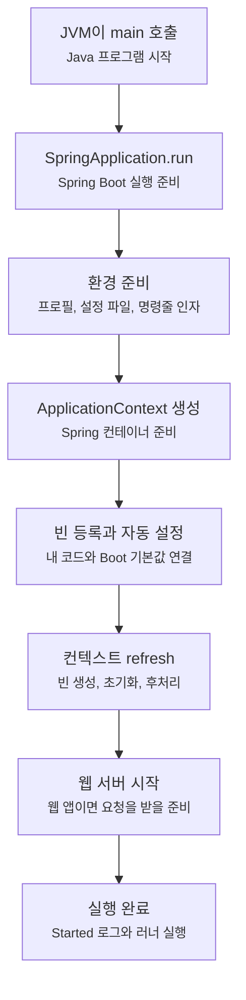
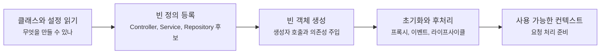
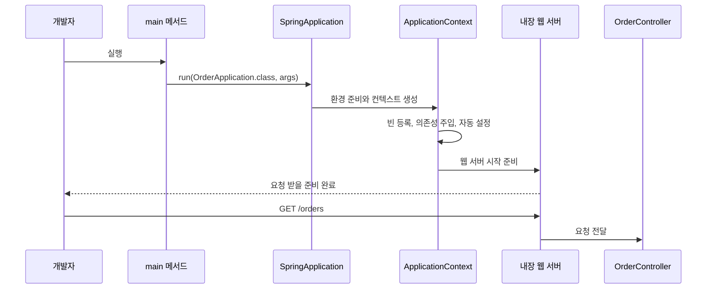

# main 메서드 하나가 어떻게 실행 중인 앱이 될까요?

> `main` 메서드는 한 줄인데, 실행하면 로그가 쏟아지고 서버가 떠요.

처음 생성한 Spring Boot 프로젝트에는 보통 이런 클래스가 있어요.

```java
package com.example.order;

import org.springframework.boot.SpringApplication;
import org.springframework.boot.autoconfigure.SpringBootApplication;

@SpringBootApplication
public class OrderApplication {

    public static void main(String[] args) {
        SpringApplication.run(OrderApplication.class, args);
    }
}
```

코드는 짧아요. 그런데 실행하면 상황이 전혀 짧지 않죠.

```text
Started OrderApplication in 1.234 seconds
```

그리고 브라우저나 `curl`로 요청을 보내면 컨트롤러가 응답해요. 내가 직접 웹 서버를 만든 적도 없고, 컨트롤러 객체를 만든 적도 없는데요.

그래서 오늘 질문은 이거예요.

> "`SpringApplication.run(...)` 한 줄 안에서 무슨 일이 벌어지길래 앱이 살아나는 걸까요?"

이 글은 내부 구현의 모든 메서드를 따라가는 글은 아니에요. 목표는 실행 로그를 볼 때 "아, 지금 환경을 준비하는 중이구나", "컨테이너가 빈(bean)을 만드는 중이구나", "이 시점에 웹 서버가 붙는구나" 정도의 큰 흐름을 잡는 거예요.

!!! note "이 글의 기준"
    예시는 Spring Boot 4.x 흐름을 기준으로 설명해요. `SpringApplication`, `@SpringBootApplication`, 자동 설정(auto-configuration), 웹 애플리케이션 타입 같은 표현은 Spring Boot 4.1.0 공식 문서를 확인해 작성했어요.

---

## Java가 먼저 부르는 곳은 여전히 `main`이에요

Spring Boot를 써도 Java 프로그램의 출발점은 그대로예요.

JVM은 `public static void main(String[] args)`를 찾아 실행해요. 여기까지는 평범한 Java 애플리케이션과 같아요.

차이는 그다음 줄이에요.

```java
SpringApplication.run(OrderApplication.class, args);
```

이 한 줄은 이렇게 읽을 수 있어요.

| 코드 조각 | 뜻 |
|---|---|
| `OrderApplication.class` | 이 클래스를 시작 기준점으로 삼아줘요 |
| `args` | 실행할 때 받은 명령줄 인자를 Spring Boot에도 넘겨줘요 |
| `SpringApplication.run(...)` | Spring 애플리케이션을 준비하고 실행해요 |

`OrderApplication.class`는 단순히 "이 클래스를 객체로 만들어줘"라는 뜻이 아니에요. 이 클래스에 붙은 `@SpringBootApplication`을 보고, Spring Boot가 어디서부터 설정과 컴포넌트를 찾을지 판단하는 기준점이 돼요.

앞 글에서 본 IoC, DI, AOP는 이 순간부터 실제 실행 흐름으로 들어와요. 컨테이너가 만들어지고, 빈이 등록되고, 필요한 객체들이 연결되고, 프록시(proxy)가 필요한 곳에는 프록시도 준비될 수 있어요.

---

## `@SpringBootApplication`은 세 가지 신호를 한 번에 줘요

`OrderApplication` 위에는 `@SpringBootApplication`이 붙어 있어요.

```java
@SpringBootApplication
public class OrderApplication {
}
```

이 Annotation은 "이 클래스가 Spring Boot 애플리케이션의 시작점이에요"라는 표시예요. 공식 문서에서는 이 Annotation이 크게 세 가지 기능을 함께 켜는 편의 Annotation이라고 설명해요.

| 켜지는 기능 | 처음 읽을 때의 의미 |
|---|---|
| Spring Boot 자동 설정(auto-configuration) | 클래스패스와 내가 만든 설정을 보고 기본 구성을 준비해요 |
| 컴포넌트 스캔(component scan) | 현재 패키지 아래에서 `@Controller`, `@Service`, `@Repository`, `@Component` 같은 대상을 찾아요 |
| 설정 클래스 등록 | 이 클래스 자체도 설정의 출발점으로 다룰 수 있어요 |

여기서 초보자가 가장 자주 헷갈리는 부분은 컴포넌트 스캔이에요.

예를 들어 시작 클래스가 `com.example.order` 패키지에 있으면, 보통 그 아래 패키지들이 탐색 범위가 돼요.

```text
com.example.order
├── OrderApplication.java
├── controller
│   └── OrderController.java
├── service
│   └── OrderService.java
└── repository
    └── OrderRepository.java
```

이 구조에서는 `controller`, `service`, `repository`가 시작 클래스 아래에 있으니 자연스럽게 발견될 수 있어요.

반대로 이런 구조라면 초반부터 이상한 일이 생길 수 있어요.

```text
com.example.order
└── OrderApplication.java

com.example.payment
└── PaymentService.java
```

`PaymentService`가 시작 클래스의 하위 패키지 밖에 있으면, 기대와 달리 스캔되지 않을 수 있어요. 그래서 프로젝트를 만들 때 패키지 이름을 대충 잡으면 나중에 "왜 이 클래스는 빈으로 안 잡히지?"라는 질문으로 돌아와요.

!!! tip "처음 프로젝트에서는 시작 클래스를 루트에 두세요"
    `OrderApplication` 같은 시작 클래스는 보통 애플리케이션 패키지의 가장 위쪽에 둬요. 그래야 컨트롤러, 서비스, 저장소가 그 아래로 자연스럽게 모이고, 컴포넌트 스캔 범위도 이해하기 쉬워요.

---

## 실행은 대략 이런 순서로 지나가요

`SpringApplication.run(...)` 내부는 꽤 많은 일을 해요. 처음에는 아래 정도의 흐름으로 잡으면 충분해요.



이 그림에서 가장 중요한 경계는 `main`과 `ApplicationContext` 사이예요. `main`은 Java의 입구이고, `ApplicationContext`는 Spring이 객체를 만들고 연결하는 컨테이너예요.

이제 각 단계를 조금만 더 풀어볼게요.

---

## 먼저 환경을 준비해요

애플리케이션이 실행되면 Spring Boot는 먼저 실행 환경을 잡아요.

여기서 말하는 환경은 "내 노트북이냐 서버냐"만 뜻하지 않아요. Spring이 설정값을 읽고 판단하는 재료 전체에 가까워요.

| 재료 | 예 |
|---|---|
| 명령줄 인자 | `--server.port=8081`, `--spring.profiles.active=local` |
| 설정 파일 | `application.properties`, `application.yml` |
| 프로필(profile) | `local`, `test`, `prod` |
| 시스템 환경 변수 | `SERVER_PORT`, `SPRING_PROFILES_ACTIVE` |

예를 들어 이렇게 실행할 수 있어요.

```bash
./gradlew bootRun --args='--server.port=8081'
```

그러면 애플리케이션은 기본 포트 대신 `8081`을 사용할 수 있어요. 정확히 어떤 설정이 어느 설정을 이기는지는 뒤의 설정 글에서 따로 다룰 거예요.

지금은 한 가지만 잡으면 돼요.

> `SpringApplication.run`은 빈을 만들기 전에, 어떤 설정으로 앱을 시작할지부터 준비해요.

왜 먼저 준비해야 할까요? 어떤 빈은 프로필에 따라 만들어질 수도 있고, 안 만들어질 수도 있어요. 웹 서버 포트처럼 실행 모양을 바꾸는 값도 컨텍스트가 본격적으로 준비되기 전에 알아야 해요.

---

## 그다음 ApplicationContext를 만들어요

환경이 준비되면 Spring Boot는 애플리케이션 컨텍스트(application context)를 만들어요.

애플리케이션 컨텍스트는 Spring 컨테이너의 대표적인 형태예요. 여기에는 빈 정의, 실제 빈 객체, 설정, 이벤트 발행 기능 같은 것들이 모여요.

조금 거칠게 말하면 이래요.

| 우리가 보는 장면 | 컨텍스트 안에서 일어나는 일 |
|---|---|
| `@Service`가 붙은 클래스가 쓰임 | 빈 후보로 발견되고 등록돼요 |
| 생성자에 `OrderRepository`가 들어옴 | 컨테이너가 맞는 빈을 찾아 주입해요 |
| `@Configuration`과 `@Bean`을 씀 | 직접 만든 빈 정의가 컨텍스트에 들어가요 |
| 자동 설정이 적용됨 | 조건에 맞는 Boot 기본 설정이 빈으로 등록돼요 |

여기서 "등록"과 "생성"을 구분하면 좋아요.

먼저 Spring은 어떤 빈을 만들 수 있는지 정의를 모아요. 그다음 컨텍스트를 새로고침(refresh)하는 과정에서 실제 객체를 만들고, 필요한 의존성을 넣고, 초기화 과정을 거쳐요.



이 흐름 때문에 `new OrderService()`를 직접 쓰지 않아도 서비스 객체가 생겨요. 생성자에 필요한 객체가 있으면 컨테이너가 맞는 빈을 찾아 넣어줘요.

다음 글에서는 이 ApplicationContext와 빈(bean)을 더 자세히 볼 거예요. 오늘은 `main`에서 실행 중 앱으로 넘어가는 중간에 컨테이너가 만들어진다는 것만 붙잡으면 돼요.

---

## 자동 설정은 "비어 있는 자리"에 기본값을 채워요

Spring Boot의 자동 설정(auto-configuration)은 실행 중에 갑자기 아무거나 만드는 기능이 아니에요.

프로젝트에 어떤 라이브러리가 들어왔는지, 개발자가 이미 어떤 빈을 등록했는지, 어떤 설정값이 있는지를 보고 "이 조건이면 보통 이런 구성이 필요하겠네" 하고 기본 구성을 시도해요.

예를 들어 웹 스타터를 넣은 프로젝트라면 웹 요청을 처리할 준비가 필요해요.

| 프로젝트 상태 | Boot가 준비하려는 방향 |
|---|---|
| Spring MVC 관련 라이브러리가 있음 | MVC 요청 처리 기본 구성을 준비해요 |
| 내장 서버 라이브러리가 있음 | 별도 서버 설치 없이 실행할 수 있게 준비해요 |
| JSON 라이브러리가 있음 | 객체와 JSON 변환 기본값을 준비해요 |
| 개발자가 직접 같은 종류의 빈을 제공함 | 사용자 설정을 우선하고 기본값은 물러날 수 있어요 |

여기서 핵심은 마지막 줄이에요.

자동 설정은 대체로 "개발자가 아무것도 못 바꾸게 덮어버리는 기능"이 아니라, **아직 명시하지 않은 자리에 기본값을 놓는 기능**에 가까워요.

그래서 처음에는 편하게 시작하고, 필요해지면 직접 설정을 추가해 바꿔갈 수 있어요.

!!! note "자동 설정을 확인하고 싶다면"
    공식 문서는 어떤 자동 설정이 적용됐고 왜 적용됐는지 보고 싶을 때 `--debug`로 실행해 조건 평가 리포트를 확인할 수 있다고 안내해요. 처음부터 전부 읽을 필요는 없지만, "왜 이 설정이 들어왔지?"를 추적할 때 중요한 단서가 돼요.

---

## 시작 실패는 보통 어느 단계에서 보일까요?

여기부터는 조금 더 깊게 볼게요.

`SpringApplication.run(...)`의 순서를 아는 이유는 단순히 내부 흐름을 외우기 위해서가 아니에요. 앱이 안 뜰 때 **어느 단계에서 실패했는지**를 가늠하기 위해서예요.

Spring Boot 시작 실패는 겉으로는 모두 "앱이 안 켜짐"처럼 보이지만, 실제 원인은 서로 다른 층에 있을 수 있어요.

| 실패가 보이는 층 | 예 | 먼저 볼 단서 |
|---|---|---|
| 환경 준비 | 잘못된 프로필, 빠진 환경 변수, 포트 설정 충돌 | 실행 인자, `application.yml`, 환경 변수 |
| 빈 정의와 등록 | 컴포넌트 스캔 범위 밖의 클래스, 조건에 맞지 않는 자동 설정 | 패키지 구조, 자동 설정 조건 평가 |
| 빈 생성과 의존성 주입 | 필요한 빈이 없음, 같은 타입 빈이 여러 개, 순환 의존성 | 예외의 `NoSuchBeanDefinition`, `NoUniqueBeanDefinition`, dependency cycle 메시지 |
| 초기화와 후처리 | 프록시 생성 실패, 설정 검증 실패, 라이프사이클 콜백 실패 | 가장 아래쪽 root cause와 관련 빈 이름 |
| 웹 서버 시작 | 포트 사용 중, 서버 설정 오류 | 포트 점유, `server.*` 설정 |

처음에는 에러 로그가 길어서 무섭게 느껴져요. 하지만 시작 흐름을 알고 있으면 로그를 이렇게 읽을 수 있어요.

> "환경을 읽다가 실패했나?"  
> "빈을 찾다가 실패했나?"  
> "빈은 만들었는데 초기화하다가 실패했나?"  
> "컨텍스트는 떴는데 웹 서버가 못 열렸나?"

Spring Boot의 실패 분석(failure analysis) 메시지는 이런 원인을 사람 말에 가깝게 풀어주려는 장치예요. 그래도 설명이 부족할 때는 `--debug`로 조건 평가 리포트를 보거나, Actuator를 쓰는 앱에서는 조건 정보를 확인해 자동 설정이 왜 들어왔는지 추적할 수 있어요.

여기서 중요한 습관은 에러를 "Spring Boot가 이상하다"로 뭉개지 않는 거예요. 시작 단계 중 어디에서 멈췄는지 찾으면, 봐야 할 파일과 질문이 줄어들어요.

---

## 웹 애플리케이션이면 웹 서버도 같이 준비돼요

Spring Boot 웹 프로젝트에서 특히 신기한 부분은 서버예요.

예전에는 Java 웹 애플리케이션을 별도 애플리케이션 서버에 올리는 방식이 익숙했어요. Spring Boot는 내장 서버를 함께 사용해서 애플리케이션 자체를 실행하는 흐름을 자연스럽게 만들어요.

그래서 웹 스타터가 들어 있고 웹 애플리케이션으로 판단되면, 컨텍스트가 준비되는 과정에서 웹 서버도 요청을 받을 준비를 해요.



이 그림에서 컨트롤러가 바로 서버를 여는 게 아니에요. 컨트롤러는 요청을 처리할 빈으로 준비되고, 웹 서버와 Spring MVC의 요청 처리 장치가 그 컨트롤러까지 요청을 전달해요.

만약 웹 서버가 필요 없는 배치성 프로그램이라면 설정으로 웹 애플리케이션 타입을 끌 수도 있어요.

```yaml
spring:
  main:
    web-application-type: "none"
```

이런 설정은 "Spring Boot는 항상 웹 서버를 띄운다"는 오해를 줄여줘요. 웹 관련 라이브러리와 설정이 있을 때 웹 애플리케이션으로 동작하는 것이지, 모든 Spring Boot 앱이 반드시 HTTP 서버일 필요는 없어요.

---

## 그럼 `Started` 로그는 언제 나오는 걸까요?

실행 로그의 마지막에 이런 줄을 자주 봐요.

```text
Started OrderApplication in 1.234 seconds
```

이 숫자는 컴퓨터마다, 의존성마다, 설정마다 달라져요. 그러니 위 로그는 예시로만 봐주세요.

중요한 건 이 로그가 "이제 주요 시작 과정이 끝났다"는 신호라는 점이에요. 컨텍스트가 준비되고, 웹 애플리케이션이라면 요청을 받을 준비도 마친 뒤에 이런 시작 완료 로그를 보게 돼요.

그리고 그 뒤에 `ApplicationRunner`나 `CommandLineRunner` 같은 실행 후 작업이 이어질 수 있어요.

예를 들어 앱이 뜬 직후 간단한 확인 작업을 하고 싶다면 이런 빈을 만들 수 있어요.

```java
package com.example.order;

import org.springframework.boot.ApplicationRunner;
import org.springframework.context.annotation.Bean;
import org.springframework.context.annotation.Configuration;

@Configuration
class StartupCheckConfig {

    @Bean
    ApplicationRunner startupCheck() {
        return args -> System.out.println("Application started");
    }
}
```

이 코드는 예시예요. 실무에서는 단순한 출력보다 로거를 쓰고, 무거운 작업을 시작 과정에 넣을 때는 실패 영향도와 재시도 방식을 조심해야 해요.

여기서 기억할 점은 `ApplicationRunner`가 컨텍스트를 만드는 도구가 아니라는 거예요. 이미 컨텍스트가 준비된 뒤, 애플리케이션 시작 직후에 실행할 작업을 넣는 자리예요.

---

## "내가 작성한 코드"와 "Boot가 준비한 일"을 나눠볼게요

처음으로 돌아가 볼게요.

```java
@SpringBootApplication
public class OrderApplication {

    public static void main(String[] args) {
        SpringApplication.run(OrderApplication.class, args);
    }
}
```

이 짧은 코드를 역할별로 나누면 훨씬 덜 신기해져요.

| 내가 작성한 것 | Spring Boot가 한 일 |
|---|---|
| 시작 클래스 위치를 정함 | 그 위치를 기준으로 컴포넌트 스캔 범위를 잡음 |
| `@SpringBootApplication`을 붙임 | 자동 설정, 컴포넌트 스캔, 설정 클래스 역할을 켬 |
| `SpringApplication.run`을 호출함 | 환경을 준비하고 컨텍스트를 만들고 실행함 |
| `args`를 넘김 | 명령줄 인자를 설정 재료로 사용할 수 있게 함 |
| 웹 스타터를 의존성에 넣음 | 웹 요청 처리와 내장 서버 기본 구성을 준비함 |

이제 "main 한 줄이 마법처럼 서버를 띄웠다"보다 더 정확하게 말할 수 있어요.

> `main`은 Spring Boot에게 시작 기준점과 실행 인자를 넘겼고, Spring Boot는 그 기준으로 환경, 컨테이너, 자동 설정, 웹 서버를 차례로 준비했어요.

---

## 자, 정리해볼까요?

!!! abstract "오늘 우리가 배운 것"
    - Spring Boot 애플리케이션도 Java 프로그램이라서 시작점은 `main` 메서드예요.
    - `SpringApplication.run(OrderApplication.class, args)`는 시작 기준 클래스와 명령줄 인자를 받아 Spring 애플리케이션을 준비해요.
    - `@SpringBootApplication`은 자동 설정(auto-configuration), 컴포넌트 스캔(component scan), 설정 클래스 역할을 함께 켜는 시작 신호예요.
    - 실행 중에는 환경 준비, ApplicationContext 생성, 빈 등록과 생성, 자동 설정 적용, 웹 서버 준비 같은 단계가 이어져요.
    - 웹 서버는 컨트롤러가 직접 여는 것이 아니라, Spring Boot와 웹 관련 자동 설정이 준비한 실행 환경 위에서 요청을 받아요.
    - 시작 실패를 읽을 때는 환경, 빈 등록, 의존성 주입, 초기화, 웹 서버 시작 중 어느 층에서 멈췄는지 나눠보면 좋아요.

다음 글에서는 오늘 지나온 ApplicationContext와 빈(bean)을 더 가까이 볼 거예요. "Spring이 관리하는 객체"라는 말이 정확히 무엇을 뜻하는지, 객체의 생명주기와 의존성 그래프가 어떻게 이어지는지 살펴볼게요.

## 참고한 링크

- [SpringApplication :: Spring Boot](https://docs.spring.io/spring-boot/reference/features/spring-application.html)
- [Using the @SpringBootApplication Annotation :: Spring Boot](https://docs.spring.io/spring-boot/reference/using/using-the-springbootapplication-annotation.html)
- [Auto-configuration :: Spring Boot](https://docs.spring.io/spring-boot/reference/using/auto-configuration.html)
- [How-to: Web Server :: Spring Boot](https://docs.spring.io/spring-boot/how-to/webserver.html)
