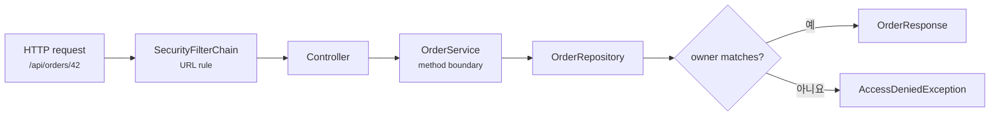
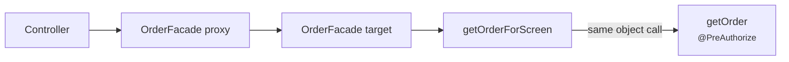

# Method Security와 도메인 권한은 어디에 둬야 할까요?

> `/api/orders/{orderId}`를 로그인한 사용자만 볼 수 있게 했는데, 남의 주문 번호를 넣어도 통과하면 어떡하죠?

지난 글에서는 JWT와 OAuth2 resource server를 봤어요. API 서버는 access token을 발급하는 쪽이 아니라, 들어온 token을 검증하고 `Authentication`으로 바꾼 뒤 요청을 허용할지 판단한다고 했죠.

그럼 이제 이런 코드를 생각해볼게요.

```java
@GetMapping("/api/orders/{orderId}")
public OrderResponse getOrder(@PathVariable long orderId) {
    return orderService.getOrder(orderId);
}
```

Security 설정에는 이미 이런 규칙이 있을 수 있어요.

```java
http.authorizeHttpRequests((authorize) -> authorize
        .requestMatchers("/api/orders/**").authenticated()
        .anyRequest().denyAll()
);
```

처음에는 충분해 보여요.

> "로그인한 사용자만 주문 API를 부를 수 있잖아요?"

맞아요. 그런데 이 규칙은 **로그인했는지**는 확인하지만, **그 주문이 이 사용자의 주문인지**는 확인하지 않아요. `/api/orders/42`가 내 주문인지, 다른 사람 주문인지는 URL pattern만 봐서는 알 수 없어요.

오늘은 이 지점을 볼 거예요.

- URL 단위 인가와 method 단위 인가는 무엇이 다를까요?
- `@EnableMethodSecurity`는 왜 따로 켜야 할까요?
- `@PreAuthorize`는 method 실행 전에 무엇을 볼 수 있을까요?
- `@PostAuthorize`는 왜 편하지만 조심해야 할까요?
- role과 permission, 소유권 검사는 어디에 두는 게 읽기 좋을까요?
- 테스트에서는 method security를 어떻게 확인해야 할까요?

오늘 목표는 `@PreAuthorize` 문법을 많이 외우는 게 아니에요. **인가(authorization)를 URL 문 앞에서 끝낼지, service method 경계까지 가져갈지, 도메인 소유권 판단은 어디에 둘지**를 나눠서 읽는 거예요.

!!! note "이 글의 기준"
    이 글은 Spring Boot 4.x의 Spring Security 문서와 Spring Security 7.x 계열의 Method Security, request authorization, domain object security, testing method security 문서를 기준으로 작성했어요. Spring Boot 3.x 프로젝트에서도 `SecurityFilterChain`, `@EnableMethodSecurity`, `@PreAuthorize`, 프록시 기반 method security라는 큰 모델은 같은 방향으로 읽을 수 있어요.

---

## URL 규칙은 입구를 막고, method security는 업무 경계를 막아요

Spring Security를 처음 설정할 때는 보통 URL부터 막아요.

```java
@Configuration
public class SecurityConfig {

    @Bean
    SecurityFilterChain securityFilterChain(HttpSecurity http) throws Exception {
        http.authorizeHttpRequests((authorize) -> authorize
                .requestMatchers("/api/public/**").permitAll()
                .requestMatchers("/api/admin/**").hasRole("ADMIN")
                .requestMatchers("/api/orders/**").authenticated()
                .anyRequest().denyAll()
        );

        return http.build();
    }
}
```

이 설정은 요청의 입구에서 판단하기 좋아요.

| 질문 | URL 규칙이 잘하는 일 |
|---|---|
| 로그인 없이 들어와도 되나요? | `/api/public/**` 허용 |
| 관리자 화면인가요? | `/api/admin/**`에 `ROLE_ADMIN` 요구 |
| 이 API 묶음은 인증이 필요한가요? | `/api/orders/**`에 인증 요구 |
| 모르는 URL은 닫아야 하나요? | `anyRequest().denyAll()` |

하지만 주문 상세 조회는 한 단계 더 들어가야 해요.

```http
GET /api/orders/42
Authorization: Bearer ...
```

이 요청에서 URL만 보면 알 수 있는 건 `/api/orders/**`라는 사실뿐이에요. `42번 주문의 owner가 현재 사용자와 같은가?`는 DB에서 주문을 읽거나, 권한 정책을 따로 확인해야 알 수 있어요.



이 그림에서 URL 규칙은 대문이에요. 대문을 통과해도 방마다 권한이 다를 수 있죠. Method security는 이 방의 문, 즉 **업무 method 경계**에서 한 번 더 묻는 방식이에요.

!!! tip "URL 규칙과 method security를 경쟁시키지 마세요"
    URL 규칙은 넓은 입구를 닫는 데 좋고, method security는 parameter, return value, 도메인 소유권처럼 업무 정보가 필요한 판단에 좋아요. 둘 중 하나만 정답이라기보다 서로 다른 위치의 경계예요.

---

## Method security는 starter만 넣는다고 켜지지 않아요

Spring Boot에서 `spring-boot-starter-security`를 넣으면 web application은 기본적으로 보호돼요. 지난 보안 글에서 본 것처럼 filter chain이 생기고, 기본 로그인이나 HTTP Basic 흐름이 준비될 수 있어요.

하지만 method-level authorization은 별도로 켜야 해요.

```java
package com.example.security;

import org.springframework.context.annotation.Configuration;
import org.springframework.security.config.annotation.method.configuration.EnableMethodSecurity;

@Configuration
@EnableMethodSecurity
public class MethodSecurityConfig {
}
```

`@EnableMethodSecurity`를 추가하면 Spring Security가 method security용 interceptor를 등록해요. 그 다음 Spring이 관리하는 bean의 method에 `@PreAuthorize`, `@PostAuthorize`, `@PreFilter`, `@PostFilter` 같은 Annotation을 붙여서 method 호출을 검사할 수 있어요.

여기서 중요한 점이 있어요.

| 착각 | 실제로는 |
|---|---|
| Security starter를 넣으면 `@PreAuthorize`도 자동으로 적용돼요 | Method security는 `@EnableMethodSecurity`로 켜야 해요 |
| URL에서 인증했으니 모든 service method도 안전해요 | URL을 통하지 않는 호출, 내부 job, 다른 controller 경로는 별도 경계가 필요할 수 있어요 |
| Annotation이 없는 method도 기본으로 막혀요 | Method security Annotation이 없는 method는 method security만으로는 보호되지 않아요 |

그래서 공식 문서도 method security를 쓸 때 unannotated method가 자동으로 보호되는 것은 아니라고 설명해요. 실무에서는 URL 단위의 catch-all 규칙도 같이 두는 편이 안전해요.

```java
http.authorizeHttpRequests((authorize) -> authorize
        .requestMatchers("/api/public/**").permitAll()
        .anyRequest().authenticated()
);
```

이런 URL 기본 경계 위에, 더 세밀한 업무 권한을 service method에서 한 번 더 검사하는 식으로 읽으면 덜 헷갈려요.

---

## `@PreAuthorize`는 method 실행 전에 parameter와 인증 정보를 같이 봐요

가장 자주 만나는 Annotation은 `@PreAuthorize`예요. 이름 그대로 method가 실행되기 전에 조건을 확인해요.

```java
package com.example.order;

import org.springframework.security.access.prepost.PreAuthorize;
import org.springframework.stereotype.Service;

@Service
public class OrderService {

    private final OrderRepository orderRepository;

    public OrderService(OrderRepository orderRepository) {
        this.orderRepository = orderRepository;
    }

    @PreAuthorize("hasAuthority('SCOPE_orders:read')")
    public OrderResponse getOrder(long orderId) {
        Order order = orderRepository.findById(orderId)
                .orElseThrow(OrderNotFoundException::new);

        return OrderResponse.from(order);
    }
}
```

이 코드는 "이 method를 실행하려면 `SCOPE_orders:read` 권한이 필요하다"라고 읽을 수 있어요. 지난 JWT 글에서 봤듯이 OAuth2 resource server는 `scope`나 `scp` claim을 `SCOPE_...` authority로 바꿔 읽을 수 있어요.

하지만 아직 소유권 검사는 없어요. `orders:read` scope가 "주문을 읽을 수 있는 종류의 token"이라는 뜻이라면, "42번 주문이 내 주문인가"는 별개의 질문이에요.

처음에는 이렇게 parameter와 인증 이름을 비교하고 싶을 수 있어요.

```java
@PreAuthorize("#customerId == authentication.name")
public List<OrderResponse> getOrders(String customerId) {
    return orderRepository.findByCustomerId(customerId)
            .stream()
            .map(OrderResponse::from)
            .toList();
}
```

이 방식은 설명용으로는 좋아요. `#customerId`는 method parameter고, `authentication.name`은 현재 인증된 사용자 이름이에요. 둘이 같아야 method가 실행돼요.

그런데 실무에서는 path나 request body로 넘어온 `customerId`를 그대로 믿으면 위험할 수 있어요. 클라이언트가 그 값을 바꿔 보낼 수 있기 때문이에요. 그래서 소유권 검사는 보통 **서버가 신뢰하는 데이터**를 기준으로 해야 해요.

---

## 도메인 권한은 권한 전용 bean으로 빼면 읽기 쉬워져요

주문 하나를 읽는 use case로 돌아가볼게요.

```java
@PreAuthorize("@orderPermission.canRead(authentication, #orderId)")
public OrderResponse getOrder(long orderId) {
    Order order = orderRepository.findById(orderId)
            .orElseThrow(OrderNotFoundException::new);

    return OrderResponse.from(order);
}
```

여기서 `@orderPermission`은 Spring bean 이름이에요. SpEL 표현식에서 bean method를 호출해서 권한 판단을 맡길 수 있어요.

```java
package com.example.order;

import org.springframework.security.core.Authentication;
import org.springframework.stereotype.Component;

@Component
public class OrderPermission {

    private final OrderRepository orderRepository;

    public OrderPermission(OrderRepository orderRepository) {
        this.orderRepository = orderRepository;
    }

    public boolean canRead(Authentication authentication, long orderId) {
        return orderRepository.existsByIdAndCustomerUsername(orderId, authentication.getName());
    }
}
```

이렇게 나누면 service method는 업무 흐름을 읽고, permission bean은 접근 정책을 읽어요.

| 위치 | 맡는 일 |
|---|---|
| `SecurityFilterChain` | URL 묶음의 넓은 접근 규칙 |
| `OrderService` | 주문 조회라는 업무 흐름 |
| `OrderPermission` | 현재 사용자가 이 주문을 읽을 수 있는지 판단 |
| `OrderRepository` | DB에서 소유권 조건 확인 |

이 방식의 장점은 "권한 판단이 service 코드 중간에 흩어지지 않는다"는 거예요. `if (!owner) throw ...`가 여러 method에 퍼지는 대신, 권한 정책 이름을 method 경계에 드러낼 수 있어요.

하지만 비용도 있어요. `OrderPermission.canRead(...)`에서 DB를 한 번 보고, 실제 `getOrder(...)`에서 다시 주문을 조회하면 query가 두 번 나갈 수 있어요. 글로 보면 깔끔하지만, 조회량이 많거나 latency가 중요한 API에서는 설계를 더 봐야 해요.

대안은 use case에 따라 달라져요.

| 방식 | 좋은 점 | 조심할 점 |
|---|---|---|
| `existsByIdAndCustomerUsername`로 사전 검사 | 권한 거절이 method 실행 전 분명해요 | 실제 조회와 DB 접근이 중복될 수 있어요 |
| `findByIdAndCustomerUsername`로 service에서 한 번에 조회 | DB query를 한 번으로 줄이기 쉬워요 | 권한 정책이 service 코드에 섞일 수 있어요 |
| permission bean이 domain object를 조회해서 판단 | 정책을 재사용하기 쉬워요 | permission layer가 repository를 많이 알게 돼요 |
| 별도 ACL 모델 | 복잡한 공유 권한을 표현할 수 있어요 | 스키마, 캐시, 운영 복잡도가 커져요 |

처음에는 단순하게 시작해도 돼요. 다만 중요한 건 "관리자 role이면 통과"와 "이 resource의 owner라서 통과"를 같은 말로 섞지 않는 거예요.

---

## Role, scope, permission, owner는 다른 말이에요

보안 코드를 읽다 보면 `ROLE_ADMIN`, `SCOPE_orders:read`, `permission:order:read`, owner check가 한 화면에 섞여요. 이름이 다 권한처럼 보여서 헷갈리죠.

이렇게 나눠보면 좋아요.

| 이름 | 대략 묻는 질문 | 예시 |
|---|---|---|
| role | 이 사용자는 어떤 역할인가요? | `ROLE_ADMIN`, `ROLE_MANAGER` |
| scope | 이 token은 어떤 API 범위를 허용받았나요? | `SCOPE_orders:read` |
| permission | 이 행동을 할 수 있나요? | `permission:order:cancel` |
| owner check | 이 resource가 이 사용자 것인가요? | `order.customerUsername == authentication.name` |

관리자 API처럼 역할 자체가 중요한 곳은 role이 자연스러워요.

```java
@PreAuthorize("hasRole('ADMIN')")
public void forceCancelOrder(long orderId) {
    // 관리자 강제 취소
}
```

외부 client가 받은 access token의 범위를 보는 API라면 scope가 자연스러워요.

```java
@PreAuthorize("hasAuthority('SCOPE_orders:write')")
public OrderResponse createOrder(CreateOrderRequest request) {
    // 주문 생성
}
```

업무 행동을 더 명확히 이름 붙이고 싶다면 permission 형태를 쓸 수 있어요.

```java
@PreAuthorize("hasAuthority('permission:order:cancel')")
public void cancelOrder(long orderId) {
    // 주문 취소
}
```

그리고 특정 주문의 주인인지 봐야 한다면 role이나 scope만으로는 부족해요.

```java
@PreAuthorize("@orderPermission.canCancel(authentication, #orderId)")
public void cancelMyOrder(long orderId) {
    // 본인 주문 취소
}
```

실무에서는 이런 조합도 흔해요.

```java
@PreAuthorize("hasRole('ADMIN') or @orderPermission.canRead(authentication, #orderId)")
public OrderResponse getOrder(long orderId) {
    // 관리자는 모두 조회, 일반 사용자는 자기 주문만 조회
}
```

문법보다 중요한 건 읽는 기준이에요. "이 사람이 누구인가"와 "이 token이 무엇을 허용받았나"와 "이 resource가 누구의 것인가"를 분리해서 봐야 해요.

---

## `@PostAuthorize`는 반환값을 볼 수 있지만, 조회 후 거절이에요

가끔은 method를 실행해야만 권한 판단에 필요한 객체를 얻을 수 있어요. 이때 `@PostAuthorize`를 쓸 수 있어요.

```java
@PostAuthorize("returnObject.customerUsername() == authentication.name")
public OrderResponse getOrder(long orderId) {
    Order order = orderRepository.findById(orderId)
            .orElseThrow(OrderNotFoundException::new);

    return OrderResponse.from(order);
}
```

`returnObject`는 method가 반환하려던 값이에요. 이 방식은 읽기 쉽고, "반환된 주문의 소유자가 현재 사용자와 같아야 한다"는 뜻도 분명해요.

하지만 조심할 점이 있어요. `@PostAuthorize`는 method 실행 **후** 판단해요. 즉, 이미 DB 조회와 domain 로직 일부가 실행된 다음에 거절될 수 있어요.

| 상황 | `@PostAuthorize`가 어울리나요? |
|---|---|
| 단순 조회 결과의 owner를 확인 | 가능해요 |
| method 실행 중 외부 결제, 메시지 발행, 파일 삭제가 일어남 | 위험해요 |
| 반환 객체에 민감한 lazy loading이 얽혀 있음 | 조심해야 해요 |
| collection을 많이 반환하고 일부만 필터링하려 함 | 성능과 의도 표현을 다시 봐야 해요 |

특히 쓰기 작업은 "실행하고 나서 권한 없으면 거절"이 안전하지 않아요. 주문 취소, 결제, 파일 삭제, 관리자 변경처럼 side effect가 있는 작업은 실행 전에 권한을 판단해야 해요.

!!! warning "`@PostAuthorize`를 쓰기 작업의 안전장치로 착각하지 마세요"
    반환값을 보고 거절할 수 있다는 말은 method 안의 일이 없던 일이 된다는 뜻이 아니에요. Side effect가 있는 method는 가능하면 실행 전에 권한을 확인하세요.

---

## Method security도 프록시 경계를 지나야 동작해요

이전 AOP 글과 transaction 글에서 봤던 함정이 여기서도 다시 나와요. Method security는 Spring AOP 기반으로 동작해요. 즉, 보안이 걸린 method 호출이 Spring이 만든 프록시(proxy)를 지나야 interceptor가 권한을 검사할 수 있어요.

문제가 되는 코드를 볼게요.

```java
@Service
public class OrderFacade {

    public OrderResponse getOrderForScreen(long orderId) {
        return getOrder(orderId);
    }

    @PreAuthorize("@orderPermission.canRead(authentication, #orderId)")
    public OrderResponse getOrder(long orderId) {
        // 주문 조회
    }
}
```

`getOrderForScreen(...)`이 같은 객체 안의 `getOrder(...)`를 부르면 보통 프록시를 다시 거치지 않아요. 그러면 `@PreAuthorize`가 기대한 시점에 적용되지 않을 수 있어요. 이 문제를 self-invocation이라고 불러요.



이 그림에서 처음 controller 호출은 프록시를 지나요. 하지만 target 객체 안에서 자기 method를 다시 부르는 호출은 프록시가 볼 수 없는 내부 호출이에요.

해결은 보통 구조를 명확히 하는 쪽이에요.

```java
@Service
public class OrderScreenService {

    private final OrderQueryService orderQueryService;

    public OrderScreenService(OrderQueryService orderQueryService) {
        this.orderQueryService = orderQueryService;
    }

    public OrderResponse getOrderForScreen(long orderId) {
        return orderQueryService.getOrder(orderId);
    }
}
```

```java
@Service
public class OrderQueryService {

    @PreAuthorize("@orderPermission.canRead(authentication, #orderId)")
    public OrderResponse getOrder(long orderId) {
        // 주문 조회
    }
}
```

이제 `OrderScreenService`가 다른 Spring bean인 `OrderQueryService`를 호출하므로, method security 프록시가 호출을 볼 수 있어요.

---

## 테스트는 HTTP 테스트와 service method 테스트를 나눠요

Method security를 쓰면 테스트도 두 층으로 나눠 보는 게 좋아요.

첫 번째는 HTTP 입구 테스트예요.

- 로그인하지 않은 요청이 401이 되는지
- 권한 없는 token이 403이 되는지
- public endpoint가 의도대로 열려 있는지
- `/api/admin/**` 같은 URL 규칙이 맞는지

두 번째는 method security 테스트예요. Service method를 직접 호출했을 때 `@PreAuthorize`가 실제로 막는지 확인해요.

```java
package com.example.order;

import static org.assertj.core.api.Assertions.assertThatExceptionOfType;

import org.junit.jupiter.api.Test;
import org.springframework.beans.factory.annotation.Autowired;
import org.springframework.boot.test.context.SpringBootTest;
import org.springframework.security.access.AccessDeniedException;
import org.springframework.security.test.context.support.WithMockUser;

@SpringBootTest
class OrderServiceSecurityTest {

    @Autowired
    OrderService orderService;

    @Test
    @WithMockUser(username = "gildong", authorities = "SCOPE_orders:read")
    void ownOrderCanBeRead() {
        orderService.getOrder(42L);
    }

    @Test
    @WithMockUser(username = "other", authorities = "SCOPE_orders:read")
    void othersOrderIsDenied() {
        assertThatExceptionOfType(AccessDeniedException.class)
                .isThrownBy(() -> orderService.getOrder(42L));
    }
}
```

이 코드는 전체 예제가 아니라 테스트 모양을 보여주는 조각이에요. 실제 테스트에서는 42번 주문이 `gildong`의 주문이라는 fixture를 먼저 만들어야 해요.

중요한 건 controller 테스트만으로 method security를 다 검증했다고 착각하지 않는 거예요. URL 규칙이 우연히 막아준 것인지, service method 경계가 실제로 막는 것인지 분리해서 봐야 해요.

!!! tip "403을 보면 어느 경계가 거절했는지 먼저 찾으세요"
    URL 규칙이 거절했는지, method security가 거절했는지, permission bean이 `false`를 반환했는지에 따라 고칠 위치가 달라져요.

---

## 실무에서는 권한 정책 이름을 먼저 설계해요

Method security가 들어가면 Annotation 표현식이 길어지기 쉬워요.

```java
@PreAuthorize("hasRole('ADMIN') or (hasAuthority('SCOPE_orders:read') and @orderPermission.canRead(authentication, #orderId))")
```

한두 번은 괜찮아요. 하지만 이런 표현식이 여러 service에 반복되면 권한 정책이 문자열 조각으로 흩어져요.

그럴 때는 정책 이름을 먼저 세우는 편이 좋아요.

```java
@PreAuthorize("@orderPolicy.canRead(authentication, #orderId)")
public OrderResponse getOrder(long orderId) {
    // 주문 조회
}
```

```java
@Component
public class OrderPolicy {

    private final OrderRepository orderRepository;

    public OrderPolicy(OrderRepository orderRepository) {
        this.orderRepository = orderRepository;
    }

    public boolean canRead(Authentication authentication, long orderId) {
        return isAdmin(authentication) || isOwner(authentication, orderId);
    }

    private boolean isAdmin(Authentication authentication) {
        return authentication.getAuthorities().stream()
                .anyMatch((authority) -> authority.getAuthority().equals("ROLE_ADMIN"));
    }

    private boolean isOwner(Authentication authentication, long orderId) {
        return orderRepository.existsByIdAndCustomerUsername(orderId, authentication.getName());
    }
}
```

이제 Annotation은 짧아지고, 권한 정책은 Java 코드로 테스트하기 쉬워져요.

여기서 "그럼 모든 권한을 method security로 옮기면 되나요?"라고 묻고 싶을 수 있어요. 그렇지는 않아요.

| 경계 | 추천하는 판단 |
|---|---|
| `SecurityFilterChain` | 전체 인증 필요, public URL, admin URL, API 그룹 |
| Method security | service use case별 권한, parameter 기반 권한, 도메인 소유권 |
| Repository query | owner 조건을 DB query로 강제해야 하는 조회 |
| Domain model | 상태 전이 규칙, 권한과 무관한 업무 불변식 |

권한은 한 곳에만 있어야 깔끔하다는 생각보다, **각 경계가 무엇을 알 수 있는지**를 기준으로 두는 편이 안전해요. URL은 path를 알고, service는 use case를 알고, repository는 데이터 조건을 알고, domain model은 업무 상태를 알아요.

---

## 참고한 링크

- [Spring Boot Reference - Spring Security](https://docs.spring.io/spring-boot/reference/web/spring-security.html)
- [Spring Security Reference - Method Security](https://docs.spring.io/spring-security/reference/servlet/authorization/method-security.html)
- [Spring Security Reference - Authorize HttpServletRequests](https://docs.spring.io/spring-security/reference/servlet/authorization/authorize-http-requests.html)
- [Spring Security Reference - Domain Object Security ACLs](https://docs.spring.io/spring-security/reference/servlet/authorization/acls.html)
- [Spring Security Reference - Testing Method Security](https://docs.spring.io/spring-security/reference/servlet/test/method.html)

---

## 자, 정리해볼까요?

!!! abstract "오늘 우리가 배운 것"
    - URL 규칙은 요청 입구를 막는 데 좋고, method security는 service method 경계에서 업무 권한을 검사하는 데 좋아요.
    - Spring Boot Security starter만으로 method security가 자동 활성화되지는 않아요. `@EnableMethodSecurity`를 명시해야 해요.
    - `@PreAuthorize`는 method 실행 전에 `Authentication`, authority, method parameter를 보고 접근을 결정할 수 있어요.
    - 도메인 소유권 검사는 role이나 scope만으로 끝나지 않아요. 서버가 신뢰하는 데이터로 owner를 확인해야 해요.
    - `@PostAuthorize`는 반환값을 볼 수 있지만 method 실행 후 판단하므로 side effect가 있는 쓰기 작업에는 조심해야 해요.
    - Method security도 프록시 경계를 지나야 동작하므로 self-invocation 함정을 피해야 해요.
    - 테스트는 HTTP 입구 규칙과 service method 권한 규칙을 분리해서 확인하는 편이 좋아요.

처음에는 여기까지만 잡아도 충분해요. 더 깊게 보면 핵심은 하나예요. **인가는 한 줄짜리 Annotation이 아니라, 요청 입구와 업무 method와 데이터 소유권 사이에 세우는 여러 runtime 경계**예요.

다음에는 이 권한 모델을 실제 인증 API 흐름에 붙여서, 로그인과 token 검증과 보호된 endpoint를 실습 프로젝트 안에서 이어가볼게요.
