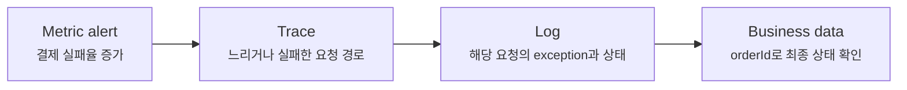
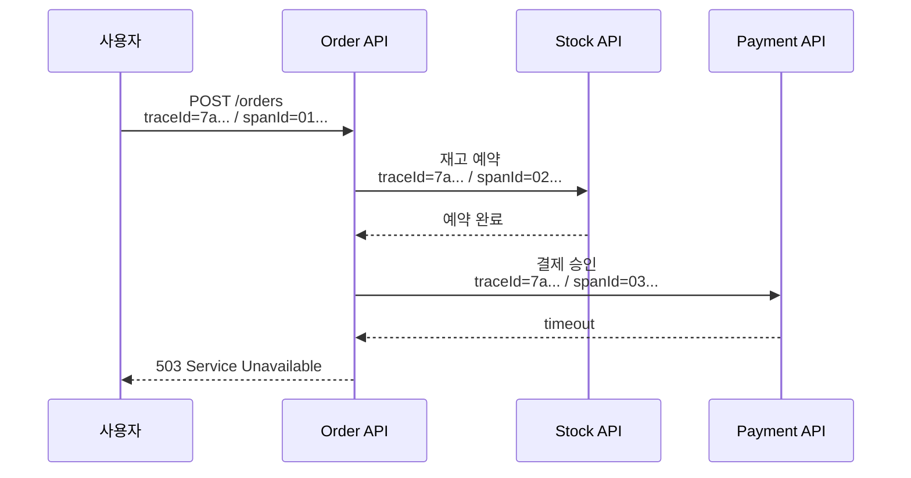
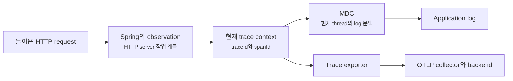
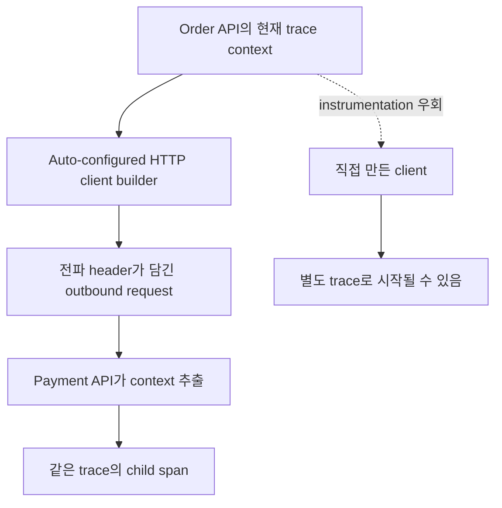

# Micrometer tracing과 correlation ID는 한 요청을 어떻게 찾을까요?

> 오류 log가 남았다는 것과, **그 오류까지 어떤 요청이 지나왔는지 안다는 것**은 달라요.

오후 2시 17분부터 결제 실패율이 올라갔어요. 주문 service log에는 `payment failed`가 있고, 결제 service에는 timeout이 있고, 재고 service에는 같은 시각의 정상 log와 오류 log가 섞여 있어요.

시간만 비슷한 log를 이어 붙이다 보면 이런 질문이 생겨요.

> “이 세 줄이 정말 같은 사용자 요청에서 나온 걸까요?”

사실은 timestamp만으로는 알 수 없어요. 동시에 수백 개의 요청이 흐를 수 있고, service마다 clock과 처리 시간이 조금씩 다르기 때문이에요. 이때 필요한 것은 한 요청의 흐름을 함께 들고 다니는 **추적 문맥(trace context)**이에요.

[앞 글](observability-actuator-health-metrics.md)에서는 metric으로 오류율과 지연이 변하는 모양을 찾았어요. 이번에는 그 이상 징후에서 요청 하나로 내려가 볼게요. Micrometer tracing, log, correlation ID, MDC를 연결하고, service와 thread 경계를 넘을 때 무엇이 전달되어야 하는지 살펴볼 거예요.

!!! note "이 글의 기준"
    Dependency와 설정 예시는 Spring Boot 4.x와 Java 21을 기준으로 해요. Trace exporter와 backend는 여러 조합이 가능하지만, 본문에서는 OpenTelemetry와 OTLP 조합을 중심으로 설명할게요.

---

## 먼저 metric, log, trace의 질문을 나눠 봐요

관측 가능성(observability)을 말할 때 metric, log, trace를 한 묶음으로 부르지만, 셋은 같은 정보를 다른 화면에 보여주는 기능이 아니에요.

| 신호 | 가장 잘 답하는 질문 | 대표 모양 |
|---|---|---|
| Metric | 오류가 얼마나 늘었고 언제부터 느려졌나요? | 요청 수, 오류율, p95 latency |
| Log | 그 시점에 code가 어떤 사건과 값을 기록했나요? | Message, level, exception, business ID |
| Trace | 요청이 어느 service와 작업을 어떤 순서로 지났나요? | Span의 부모-자식 관계와 소요 시간 |

운영에서는 보통 셋을 오가요.



Metric이 “문제가 넓게 생겼다”는 사실을 알려주면, trace는 어느 구간이 오래 걸렸는지 좁혀요. 그다음 같은 trace ID가 붙은 log와 주문 같은 business data를 확인해야 실제 원인과 영향 범위를 판단할 수 있어요.

---

## Trace 하나는 여러 span으로 이루어져요

사용자가 주문 API를 한 번 호출했는데 내부에서는 주문 service, 재고 service, 결제 service가 차례로 움직인다고 해 볼게요.

이 전체 여정에는 같은 **trace ID**가 붙어요. 하지만 HTTP 요청 처리, database query, 외부 service 호출처럼 시간을 재고 싶은 각 작업에는 서로 다른 **span ID**가 붙어요.

| 이름 | 범위 | 운영에서 하는 일 |
|---|---|---|
| Trace | 하나의 분산 요청 전체 | 여러 service의 작업을 한 묶음으로 찾아요 |
| Span | Trace 안의 한 작업 | 어느 작업이 실패했고 얼마나 걸렸는지 보여줘요 |
| Trace ID | Trace 전체가 공유하는 식별자 | Trace backend와 여러 service log를 검색해요 |
| Span ID | 현재 작업의 식별자 | 한 service 안에서도 어느 구간의 log인지 좁혀요 |



세 service가 같은 `traceId=7a...`를 공유하므로 하나의 요청임을 알 수 있어요. 반면 `spanId`는 작업마다 달라서 결제 호출 구간과 주문 처리 구간을 구분해요.

### Correlation ID는 새 추적 체계라기보다 연결 고리예요

상관관계 ID(correlation ID)는 관련된 기록을 함께 찾기 위한 값을 넓게 부르는 말이에요. Spring Boot에서 Micrometer tracing을 쓰면 기본 log correlation ID는 MDC에 들어온 `traceId`와 `spanId`로 만들어져요.

그래서 용어를 이렇게 잡으면 덜 헷갈려요.

- `traceId`: 전체 요청 여정을 잇는 핵심 식별자예요.
- `spanId`: 현재 작업을 가리키는 식별자예요.
- Log correlation ID: 이 값들을 log line에서 찾기 쉽게 표시한 모양이에요.
- `orderId`: 주문이라는 domain object를 찾는 business 식별자예요.

`orderId`만으로 trace를 대신할 수는 없어요. 주문 번호가 만들어지기 전 실패할 수도 있고, 하나의 주문을 scheduler와 message consumer가 여러 번 다룰 수도 있죠. 반대로 trace ID는 기술적인 실행 한 번을 잇지만, 재시도 뒤 새 trace가 시작되면 같은 주문의 긴 생명주기 전체를 대표하지 않아요.

!!! tip "Trace ID와 business ID를 경쟁시키지 마세요"
    Trace ID는 “이 실행이 어디를 지났나?”에 강하고, order ID는 “이 업무 대상이 결국 어떻게 됐나?”에 강해요. 장애 대응 log에는 둘 다 검색할 수 있게 남기는 편이 좋아요.

---

## Spring Boot는 observation을 trace와 log로 이어 줘요

[앞 글](observability-actuator-health-metrics.md)에서 본 Micrometer는 metric만 만드는 library가 아니에요. Micrometer의 관측(observation)은 하나의 작업을 계측하는 공통 모델이고, tracing bridge가 있으면 완료된 observation을 span으로 이어 줄 수 있어요.

Spring MVC request처럼 Spring이 이미 계측하는 지점에서는 개발자가 매번 span을 직접 열 필요가 없어요.



Spring의 instrumentation이 request observation을 만들고, Micrometer tracing이 현재 trace context를 관리해요. 같은 context가 MDC에 반영되면 application log에도 trace ID와 span ID가 붙고, exporter는 span을 trace backend로 보내요.

여기서 개발자가 작성하는 것은 business log와 필요한 custom observation이에요. HTTP server 계측, correlation ID 형식, exporter 준비 같은 반복 연결은 dependency와 설정 조건이 맞을 때 Spring Boot가 자동 설정해요.

---

## Boot 4에서 OpenTelemetry와 OTLP를 붙여 봐요

Actuator와 OpenTelemetry starter를 추가해요. Spring Boot dependency management를 사용한다면 각 library version을 따로 적지 않아도 돼요.

```gradle title="build.gradle" linenums="1" hl_lines="4"
dependencies {
    implementation 'org.springframework.boot:spring-boot-starter-web'
    implementation 'org.springframework.boot:spring-boot-starter-actuator'
    implementation 'org.springframework.boot:spring-boot-starter-opentelemetry'
}
```

이 starter는 Micrometer tracing과 OpenTelemetry를 연결하고, OTLP로 trace를 내보낼 수 있는 구성을 준비해요. 실제 span을 저장하고 조회하려면 OTLP를 받는 collector나 tracing backend가 별도로 실행 중이어야 해요.

```yaml title="src/main/resources/application.yml" linenums="1"
spring:
  application:
    name: order-api

management:
  tracing:
    sampling:
      probability: 1.0
  opentelemetry:
    tracing:
      export:
        otlp:
          endpoint: "http://localhost:4318/v1/traces"
```

`probability: 1.0`은 학습과 local 확인에서 모든 요청을 보기 위한 값이에요. Spring Boot의 기본 sampling 비율은 10%예요. 운영에서 무조건 100%로 바꾸면 traffic과 span 수에 따라 network, 저장 비용, query 비용이 크게 늘 수 있어요.

OTLP endpoint 주소도 application 실행 위치에서 접근 가능한 주소여야 해요. Container 안의 `localhost`는 보통 application container 자신을 가리키므로, collector를 별도 container로 띄웠다면 service 이름이나 실제 network 주소를 써야 해요.

!!! warning "Trace에는 request body와 secret을 통째로 넣지 않아요"
    HTTP header, token, password, 주민등록번호, 카드 정보, 자유 형식 request body를 span attribute나 log에 그대로 기록하면 관측 backend가 새로운 민감정보 저장소가 돼요. 필요한 값만 허용 목록으로 정하고 masking, 보존 기간, 접근 권한을 함께 설계하세요.

---

## Log에는 tracing을 켠 순간 correlation ID가 붙어요

Micrometer tracing이 활성화되면 Spring Boot의 기본 log 형식에는 `traceId`와 `spanId`로 만든 correlation ID가 들어가요. Application code는 평소처럼 SLF4J logger를 사용하면 돼요.

```java title="src/main/java/com/example/order/OrderService.java" linenums="1"
package com.example.order;

import org.slf4j.Logger;
import org.slf4j.LoggerFactory;
import org.springframework.stereotype.Service;

@Service
public class OrderService {

    private static final Logger log = LoggerFactory.getLogger(OrderService.class);

    public void placeOrder() {
        log.info("payment approval started");
    }
}
```

실행 중 tracing context가 있다면 log는 다음과 비슷한 모양이 돼요. 아래 값은 형식을 설명하기 위한 예시예요.

```text
2026-07-21T14:17:05.321+09:00 INFO [order-api] [7ac9...-01af...] OrderService : payment approval started
```

대괄호 안에는 기본적으로 `traceId-spanId` 조합이 표시돼요. 그래서 trace backend에서 느린 trace를 찾은 다음 trace ID를 log 검색 system에 넣거나, 오류 log의 trace ID로 trace timeline을 찾을 수 있어요.

형식을 바꿔야 한다면 전체 log pattern을 복사하기보다 correlation 부분만 설정할 수 있어요.

```yaml title="src/main/resources/application.yml" linenums="1"
logging:
  pattern:
    correlation: "[${spring.application.name:},%X{traceId:-},%X{spanId:-}] "
  include-application-name: false
```

여기서는 correlation pattern에 application 이름을 이미 넣었기 때문에 기본 application 이름 표시는 꺼서 중복을 피했어요. Pattern 끝의 공백도 뒤에 이어지는 logger 이름과 붙지 않게 하는 일부예요.

### 사람이 읽는 한 줄보다 검색 가능한 field가 중요해져요

여러 instance의 log를 중앙에서 검색한다면 JSON 같은 구조화 log가 유리해요. Spring Boot는 ECS, GELF, Logstash JSON 형식을 기본 지원해요.

```yaml title="src/main/resources/application-prod.yml" linenums="1"
logging:
  structured:
    format:
      console: logstash
```

구조화 형식에는 MDC의 key-value도 JSON member로 들어갈 수 있어요. 배포 환경에서는 application이 stdout으로 구조화 log를 내고, container platform이나 log agent가 수집하도록 구성하는 경우가 많아요.

중요한 것은 JSON 자체가 아니라 field 계약이에요. `service.name`, `traceId`, `spanId`, `orderId`, `error.type`처럼 검색할 값을 일관된 이름과 type으로 남겨야 해요. Message 한 줄에 `order=... trace=...`를 매번 다른 순서로 이어 붙이면 수집 뒤에도 다시 문자열을 해석해야 하죠.

---

## MDC는 현재 실행 문맥을 log에 잠깐 붙이는 공간이에요

진단 문맥 지도(Mapped Diagnostic Context, MDC)는 현재 실행 흐름의 key-value를 logger가 함께 읽을 수 있게 하는 공간이에요. Micrometer tracing은 현재 trace의 `traceId`와 `spanId`를 MDC와 연결해요.

Business ID도 짧은 범위에서 MDC에 넣을 수 있어요.

```java title="src/main/java/com/example/order/OrderProcessor.java" linenums="1"
package com.example.order;

import org.slf4j.Logger;
import org.slf4j.LoggerFactory;
import org.slf4j.MDC;
import org.springframework.stereotype.Component;

@Component
public class OrderProcessor {

    private static final Logger log = LoggerFactory.getLogger(OrderProcessor.class);

    public void process(String orderId) {
        try (MDC.MDCCloseable ignored = MDC.putCloseable("orderId", orderId)) {
            log.info("order processing started");
        }
    }
}
```

`try` scope가 끝나면 `orderId`가 MDC에서 제거돼요. Web server thread는 다음 request에 재사용될 수 있으므로 `MDC.put(...)`만 하고 지우지 않으면 다른 사용자의 log에 이전 값이 붙는 오염이 생길 수 있어요.

하지만 모든 method에서 MDC를 직접 복사하는 방식으로 trace propagation을 구현하면 안 돼요. MDC는 log 표현을 돕는 도구이고, 분산 추적의 원본은 tracer가 관리하는 trace context예요. HTTP header 전파, parent-child span 관계, sampling 결정까지 MDC가 대신하지는 못해요.

---

## 다른 service를 호출할 때는 context도 함께 보내야 해요

Order API 안에서만 trace ID가 보인다고 분산 추적이 완성된 것은 아니에요. Payment API로 나가는 HTTP request에 trace context가 실리고, Payment API가 그 값을 읽어 child span을 시작해야 같은 trace로 이어져요.

Spring Boot에서는 자동 설정된 builder로 HTTP client를 만들면 필요한 instrumentation이 적용돼요.

```java title="src/main/java/com/example/order/PaymentClient.java" linenums="1"
package com.example.order;

import org.springframework.stereotype.Component;
import org.springframework.web.client.RestClient;

@Component
public class PaymentClient {

    private final RestClient restClient;

    public PaymentClient(RestClient.Builder builder) {
        this.restClient = builder
                .baseUrl("http://payment-api:8080")
                .build();
    }

    public void approve(String orderId) {
        this.restClient.post()
                .uri("/payments/{orderId}", orderId)
                .retrieve()
                .toBodilessEntity();
    }
}
```

이 코드에서 중요한 줄은 `new RestClient(...)`가 아니라 Spring Boot가 제공한 `RestClient.Builder`를 주입받는 부분이에요. `RestTemplateBuilder`와 `WebClient.Builder`도 같은 원칙이에요.

직접 client를 생성해 auto-configured builder를 우회하면 호출 자체는 성공해도 자동 trace propagation이 빠질 수 있어요. 그러면 Order API trace와 Payment API trace가 별개로 시작되어 장애 화면에서는 관계없는 두 요청처럼 보여요.



Service 사이를 잇는 핵심은 같은 문자열을 log에 찍는 일이 아니라, client가 현재 context를 header에 주입하고 server가 추출하는 과정이에요.

---

## Thread가 바뀌어도 context가 저절로 따라간다고 가정하면 안 돼요

MDC와 현재 trace context는 실행 흐름과 연결돼 있어요. 그래서 `@Async`, 직접 만든 executor, callback, scheduler처럼 thread가 바뀌는 경계에서는 context propagation을 확인해야 해요.

Spring Boot 4.0.x에서는 `ContextPropagatingTaskDecorator` Bean을 등록해 auto-configured executor에 observation context 복원을 연결해요.

```java title="src/main/java/com/example/order/ContextPropagationConfig.java" linenums="1"
package com.example.order;

import org.springframework.context.annotation.Bean;
import org.springframework.context.annotation.Configuration;
import org.springframework.core.task.support.ContextPropagatingTaskDecorator;

@Configuration(proxyBeanMethods = false)
public class ContextPropagationConfig {

    @Bean
    ContextPropagatingTaskDecorator contextPropagatingTaskDecorator() {
        return new ContextPropagatingTaskDecorator();
    }
}
```

Spring Boot 4.1.x에서 auto-configured `AsyncTaskExecutor`를 쓴다면 `spring.task.execution.propagate-context=true`로 opt-in할 수 있어요. 4.0.x에는 이 property가 없으므로 현재 project version을 먼저 확인해야 해요. Executor를 직접 구성했다면 version과 관계없이 decorator가 그 executor에 실제로 연결됐는지도 확인하세요. Reactor를 쓰는 code는 thread 하나에 기대기보다 Reactor Context를 통한 전파 모델도 함께 봐야 해요.

!!! warning "Context가 끊긴 증상은 기능 오류처럼 보이지 않을 수 있어요"
    Async 작업 자체는 성공하고 log도 남지만 trace ID가 사라지거나 새 trace가 시작될 수 있어요. Test가 green이라는 사실만으로 관측 문맥까지 이어졌다고 볼 수 없으므로, 실제 실행에서 parent trace와 async 작업이 연결되는지 확인해야 해요.

Message broker도 같은 경계예요. Producer instrumentation이 trace context를 message header에 넣고 consumer instrumentation이 꺼내야 이어져요. 단순히 payload에 임의의 `traceId` field를 추가하는 것과 tracer의 context propagation은 같지 않아요.

---

## Sampling은 저장할 trace를 고르는 운영 정책이에요

모든 request를 trace backend에 저장하면 가장 자세하지만, traffic이 커질수록 span 수와 비용도 함께 늘어요. Sampling은 그중 어느 trace를 기록하고 export할지 고르는 정책이에요.

Spring Boot는 기본적으로 요청의 10%만 sample하고, `management.tracing.sampling.probability`로 비율을 바꿀 수 있어요.

| 환경이나 상황 | 시작점 예시 | 반드시 함께 볼 것 |
|---|---|---|
| Local 학습과 짧은 검증 | `1.0` | 요청마다 trace가 생기는지 직접 확인해요 |
| 낮은 traffic의 중요 API | 비교적 높은 비율 | 저장 비용과 민감정보 정책을 확인해요 |
| 높은 traffic의 일반 API | 낮은 비율에서 조정 | 오류와 긴 요청을 놓치는 비율을 평가해요 |
| 장애 조사 중 임시 상향 | 제한된 시간과 범위 | 종료 시점과 원복 절차를 정해요 |

`0.1`은 요청 열 개마다 정확히 한 개가 순서대로 저장된다는 뜻이 아니에요. 확률에 따른 결정이므로 드문 오류 trace가 빠질 수도 있어요. 그래서 trace만으로 전체 오류율을 계산하지 않고 metric을 함께 봐야 해요.

또 sampling 비율만 올린다고 진단 가능성이 자동으로 좋아지지는 않아요. 의미 없는 짧은 span이 너무 많거나, 필요한 error와 destination 정보가 없거나, service 이름이 환경마다 제각각이면 100%를 저장해도 찾기 어려워요.

처음에는 다음 질문으로 정책을 잡아 보세요.

- 하루에 생성되는 trace와 span은 대략 얼마나 되나요?
- 오류, 긴 요청, 특정 중요 경로를 찾을 수 있나요?
- 보존 기간과 query 비용은 어느 정도인가요?
- Sampling 변경을 application 재배포 없이 운영 설정으로 조정할 수 있나요?
- Backend에 trace가 없을 때 log와 metric으로 조사를 이어갈 수 있나요?

---

## Custom span은 framework가 모르는 business 경계에 만들어요

Spring MVC controller나 instrumented HTTP client처럼 이미 observation이 있는 곳에 custom span을 겹쳐 만들면 timeline이 중복되고 비용만 늘 수 있어요. Custom observation은 “재고 할당 규칙 계산”, “주문 상태 전이”처럼 framework가 이름 붙일 수 없는 중요한 작업에 두는 편이 좋아요.

```java title="src/main/java/com/example/order/InventoryAllocator.java" linenums="1"
package com.example.order;

import io.micrometer.observation.Observation;
import io.micrometer.observation.ObservationRegistry;
import org.springframework.stereotype.Component;

@Component
public class InventoryAllocator {

    private final ObservationRegistry observationRegistry;

    public InventoryAllocator(ObservationRegistry observationRegistry) {
        this.observationRegistry = observationRegistry;
    }

    public void allocate(String channel) {
        Observation.createNotStarted("inventory.allocate", this.observationRegistry)
                .lowCardinalityKeyValue("channel", channel)
                .observe(this::allocateInventory);
    }

    private void allocateInventory() {
        // 재고 할당 규칙을 실행해요.
    }
}
```

`channel` 값이 `web`, `mobile`, `partner`처럼 제한되어 있다면 낮은 cardinality key로 쓰기 좋아요. `orderId`, `userId`처럼 계속 새 값이 생기는 식별자는 low-cardinality key로 넣지 않아요.

Custom span 이름도 method 이름을 그대로 복사하기보다 운영자가 timeline에서 이해할 작업 이름으로 정해요. `InventoryAllocator.allocate()`보다 `inventory.allocate`가 code refactoring 뒤에도 의미를 유지하기 쉬워요.

---

## 장애가 났을 때는 넓은 신호에서 좁은 증거로 내려가요

결제 실패 alert가 울렸다고 해 볼게요. 다음 순서로 보면 도구를 무작정 넘나드는 일을 줄일 수 있어요.

1. Metric에서 실패가 시작된 시각, 영향 endpoint, 오류율, latency 변화를 확인해요.
2. 같은 시간대의 실패 trace나 긴 trace를 찾아 어느 span에서 시간이 늘었는지 봐요.
3. Trace ID로 모든 service의 log를 검색해 exception과 retry 여부를 확인해요.
4. Span ID로 같은 service 안의 여러 작업 중 실패 구간을 더 좁혀요.
5. Order ID 같은 business ID로 database의 최종 상태와 중복 처리 여부를 확인해요.
6. 최근 배포, 설정 변경, 외부 dependency 상태와 시간축을 맞춰 원인 가설을 검증해요.

이 순서는 trace 화면 하나만 보고 원인을 단정하지 않게 해요. 긴 payment span은 payment service 내부 문제일 수도 있지만, connection pool 대기나 network timeout 설정 때문일 수도 있어요. Trace가 병목 위치를 가리키면 log, metric, 설정으로 이유를 확인해야 해요.

### 배포 전에 직접 확인할 것

다음 항목은 실제 request를 보내고 log와 trace backend를 함께 보며 확인하세요.

- 들어온 HTTP request의 application log에 trace ID와 span ID가 붙나요?
- Order API가 Payment API를 호출한 뒤 두 service가 같은 trace ID를 공유하나요?
- 각 service와 operation의 span ID는 서로 다르고 parent-child 순서가 맞나요?
- 실패 response의 trace에서 error와 느린 span을 찾을 수 있나요?
- `@Async` 작업이나 직접 만든 executor를 지난 뒤에도 의도한 context가 이어지나요?
- Sampling을 `1.0`으로 둔 local 환경에서는 반복 요청이 trace backend에서 빠짐없이 보이나요?
- Log와 span attribute에 token, password, 개인정보가 들어가지 않나요?

“Application이 정상 응답했다”만 확인하면 propagation 누락을 놓쳐요. 이 글의 기능은 trace 화면과 log 검색에서 **같은 실제 요청이 service 경계를 넘어 이어져 보이는 것**까지 확인해야 완성돼요.

## 참고한 링크

- [Spring Boot 공식 문서: Tracing](https://docs.spring.io/spring-boot/reference/actuator/tracing.html)
- [Spring Boot 공식 문서: Observability](https://docs.spring.io/spring-boot/reference/actuator/observability.html)
- [Spring Boot 공식 문서: Logging](https://docs.spring.io/spring-boot/reference/features/logging.html)
- [Spring Boot 공식 문서: OpenTelemetry 지원](https://docs.spring.io/spring-boot/reference/actuator/observability.html#actuator.observability.opentelemetry)
- [Micrometer Tracing 공식 문서](https://docs.micrometer.io/tracing/reference/)
- [Micrometer Observation 공식 문서](https://docs.micrometer.io/micrometer/reference/observation.html)

## 자, 정리해볼까요?

!!! abstract "오늘 우리가 배운 것"
    - Metric은 문제의 크기와 시점을, log는 사건의 세부 내용을, trace는 한 요청이 지난 service와 작업 순서를 보여줘요.
    - 하나의 trace는 같은 trace ID를 공유하고, 그 안의 HTTP 호출과 내부 작업은 서로 다른 span ID를 가져요.
    - Micrometer tracing이 활성화되면 Spring Boot는 trace ID와 span ID를 기본 log correlation ID에 연결해요.
    - MDC는 현재 실행 문맥을 log에 붙이는 도구이므로 business ID를 넣었다면 scope가 끝날 때 반드시 제거해야 해요.
    - 자동 설정된 `RestClient.Builder`, `WebClient.Builder`, `RestTemplateBuilder`를 사용해야 outbound HTTP trace propagation이 자동으로 이어져요.
    - `@Async`, custom executor, reactive flow, message broker처럼 실행 경계가 바뀌는 곳에서는 context propagation을 별도로 확인해야 해요.
    - Sampling은 저장 비용을 줄이지만 드문 오류 trace를 놓칠 수 있으므로 전체 추세는 metric으로 보고, 운영 비율은 traffic과 진단 가치를 함께 보며 정해야 해요.
    - Custom span은 이미 계측된 controller를 중복 포장하기보다 framework가 모르는 중요한 business 작업에 만들어요.

다음 글에서는 기존 Auth API에 Actuator, Prometheus metric, OpenTelemetry tracing, Jaeger, 작은 downstream을 직접 붙여 볼게요. 일부러 async context를 끊어 본 뒤 같은 trace ID를 복원하고, 실패 metric에서 trace와 log로 내려가는 실무 흐름까지 확인할 거예요.
