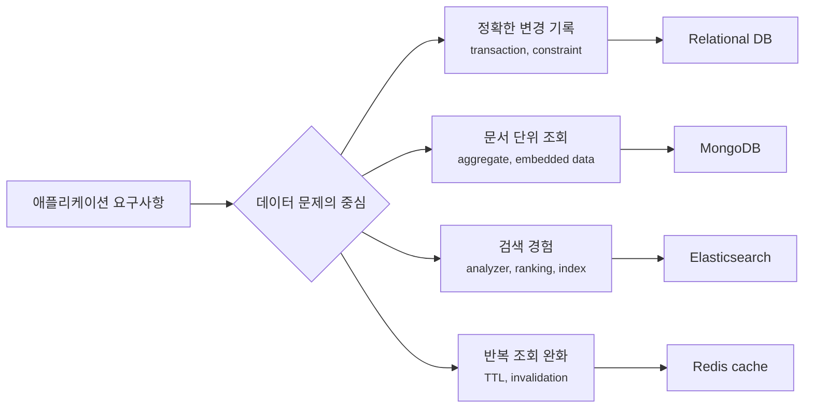
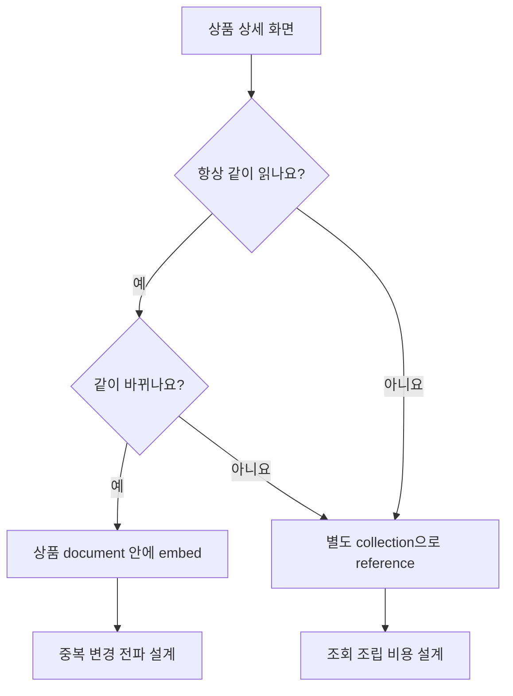
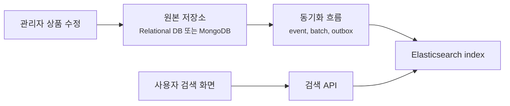
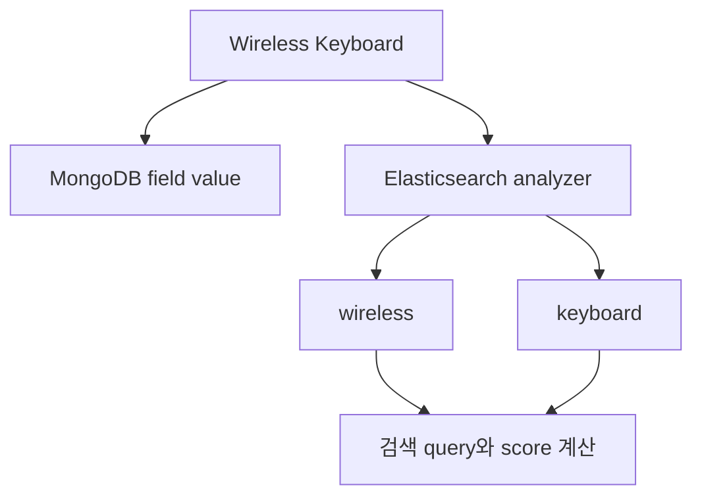
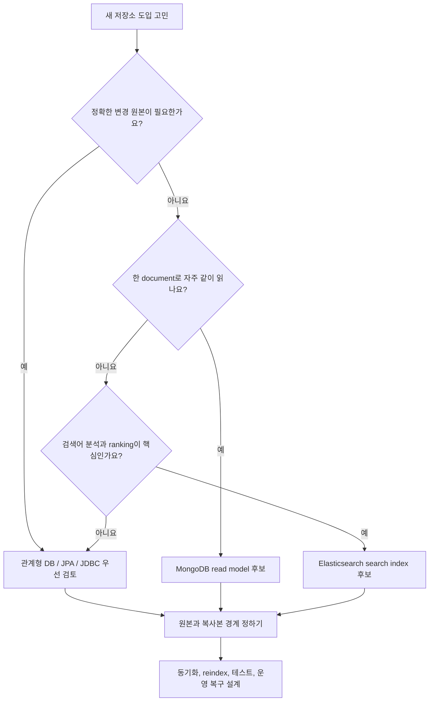

# MongoDB와 Elasticsearch는 왜 JPA보다 빠른 DB가 아닐까요?

> 검색이 느리다고 DB를 Elasticsearch로 바꾸면, 검색은 빨라질 수 있어요. 그런데 주문 수정은 더 어려워질 수 있어요.

지난 글에서는 Redis cache와 session을 봤어요. Redis는 빠른 저장소지만, cache와 session은 같은 Redis를 쓰더라도 의미가 다르다고 했죠. 하나는 다시 만들 수 있는 복사본이고, 하나는 사용자의 현재 상태에 가까웠어요.

오늘도 비슷한 질문에서 시작할게요.

> "JPA query가 복잡하고 느린데 MongoDB나 Elasticsearch로 바꾸면 해결되지 않을까요?"

처음에는 그럴듯해 보여요.

- MongoDB는 JSON처럼 생긴 document를 저장해요.
- Elasticsearch는 검색을 빠르게 해줘요.
- 둘 다 관계형 database와 다르게 동작해요.
- 그래서 왠지 "SQL보다 자유롭고 빠른 선택지"처럼 보여요.

근데요, **MongoDB와 Elasticsearch는 JPA보다 빠른 DB라는 한 줄로 고르는 도구가 아니에요.** MongoDB는 document 단위로 데이터를 모아 읽고 쓰는 문제에 강하고, Elasticsearch는 검색어를 분석하고 index에서 찾아오는 문제에 강해요. 둘 다 "관계형 database를 덜 배워도 되는 길"이 아니라, 다른 대가를 내고 다른 문제를 푸는 저장소예요.

!!! note "이 글의 기준"
    이 글은 Spring Boot 4.1.0의 NoSQL auto-configuration, Spring Data MongoDB 5.1.0, Spring Data Elasticsearch 6.1.0, MongoDB와 Elasticsearch 공식 문서를 기준으로 작성했어요. Spring Boot 3.x 프로젝트에서도 큰 선택 기준은 비슷하지만, starter, property 이름, client 구성, 지원 버전은 프로젝트가 쓰는 문서를 확인해야 해요.

---

## 먼저 "저장"과 "검색"을 나눠서 봐야 해요

상품 목록 API를 생각해볼게요.

```http
GET /products?keyword=wireless&minPrice=10000&brand=aha
```

관계형 database에서는 보통 `products`, `brands`, `categories`, `product_options`, `reviews` 같은 table을 나누고 join해서 읽어요. JPA를 쓰면 Entity 관계로 표현할 수 있고, Querydsl이나 SQL로 query를 다듬을 수도 있어요.

그런데 화면은 이렇게 물어볼 수 있어요.

- 상품명과 설명에서 `wireless`를 검색하고 싶어요.
- 오타가 조금 있어도 비슷한 결과를 보고 싶어요.
- 브랜드, 가격, 카테고리 filter를 같이 걸고 싶어요.
- 리뷰 점수와 판매량을 섞어서 정렬하고 싶어요.
- 상세 화면에서는 상품, 옵션, 대표 리뷰를 한 번에 읽고 싶어요.

이 요구사항은 모두 "데이터를 읽는다"로 보이지만 성격이 달라요.

| 요구사항 | 중심 질문 | 잘 맞는 도구 후보 |
|---|---|---|
| 주문 생성, 결제, 재고 차감 | 정확히 기록하고 transaction을 지킬 수 있나요? | 관계형 DB, JPA, JDBC |
| 상품 상세를 한 덩어리로 읽기 | 자주 같이 읽는 데이터를 document로 묶을 수 있나요? | MongoDB |
| 검색어, 형태소, ranking, filter | 텍스트를 어떻게 분석하고 index할까요? | Elasticsearch |
| 임시로 반복 조회 줄이기 | 값이 사라져도 다시 만들 수 있나요? | Redis cache |

여기서 중요한 건 "어느 저장소가 더 빠른가요?"가 아니에요. **어떤 질문을 자주 하고, 어떤 일관성을 지켜야 하고, 어떤 방식으로 장애를 복구할 수 있는가**예요.



이 그림의 핵심은 저장소를 "최신 기술 순서"로 고르지 않는다는 점이에요. 같은 상품 데이터라도 결제와 재고에는 관계형 DB가, 상품 검색에는 Elasticsearch가, 읽기 전용 catalog document에는 MongoDB가 더 자연스러울 수 있어요.

---

## MongoDB는 "table 없는 JPA"가 아니라 document model이에요

MongoDB를 처음 보면 JSON처럼 생긴 document가 먼저 눈에 들어와요.

```json
{
  "_id": "product-42",
  "name": "Wireless Keyboard",
  "brand": {
    "id": "brand-7",
    "name": "Aha Gear"
  },
  "options": [
    { "color": "black", "stock": 12 },
    { "color": "white", "stock": 4 }
  ],
  "reviewSummary": {
    "average": 4.7,
    "count": 128
  }
}
```

처음에는 이렇게 생각하기 쉬워요.

> "아, table을 안 나누고 한 번에 넣으면 join이 필요 없으니까 더 빠르겠네요?"

맞는 장면이 있어요. 상품 상세 화면에서 항상 브랜드 이름, 옵션, 리뷰 요약을 같이 보여준다면 한 document로 묶어두는 게 읽기에는 편할 수 있어요. 하지만 그 말은 반대로, document 안에 중복된 브랜드 이름이 여러 상품에 들어갈 수 있다는 뜻이기도 해요.

MongoDB 모델링에서 자주 만나는 선택은 embedded document와 reference예요.

| 선택 | 뜻 | 잘 맞는 장면 | 조심할 점 |
|---|---|---|---|
| embed | 관련 데이터를 같은 document 안에 넣어요 | 같이 읽고 같이 바뀌는 작은 데이터 | document가 커지고 중복이 생길 수 있어요 |
| reference | 다른 document의 id를 들고 있어요 | 따로 커지고 따로 바뀌는 데이터 | 애플리케이션에서 다시 조회하거나 조립해야 해요 |

즉 MongoDB에서는 "정규화를 안 해도 된다"가 아니라 **어떤 단위로 읽고 쓰는지에 맞춰 document 경계를 설계한다**가 더 정확해요.



이 그림에서 document 경계는 Java class 경계가 아니라 사용자의 읽기와 변경 흐름으로 정해져요. 같이 읽지만 따로 바뀌는 데이터는 중복과 동기화 비용을 같이 봐야 해요.

Spring Data MongoDB에서는 이런 document를 Java class로 매핑할 수 있어요.

```java
package com.example.catalog;

import java.util.List;
import org.springframework.data.annotation.Id;
import org.springframework.data.mongodb.core.mapping.Document;

@Document("product_catalog")
public class ProductCatalogDocument {

    @Id
    private String id;

    private String name;
    private BrandSnapshot brand;
    private List<ProductOptionSnapshot> options;
    private ReviewSummary reviewSummary;

    // constructors, getters
}
```

```java
package com.example.catalog;

public record BrandSnapshot(
        String id,
        String name
) {
}
```

여기서 `BrandSnapshot`이라는 이름이 중요해요. 이 값은 브랜드의 원본 Entity가 아니라, 상품 catalog document 안에 복사해둔 읽기용 snapshot에 가까워요. 나중에 브랜드 이름이 바뀌면 이 snapshot을 어떻게 갱신할지 별도로 설계해야 해요.

!!! tip "MongoDB document를 설계할 때 먼저 물어볼 질문"
    "이 데이터는 한 화면이나 한 use case에서 같이 읽히고, 같은 속도로 바뀌나요?"라고 물어보세요. 같이 읽히지만 따로 바뀌면 embed가 편해 보이다가 동기화 문제가 생길 수 있어요.

---

## Spring Boot에서 MongoDB는 연결보다 모델 경계가 더 중요해요

Spring Boot 4.x 기준으로 MongoDB 연결은 `spring.mongodb.*` property를 중심으로 읽으면 돼요. 예를 들어 local 개발 환경에서는 이런 모양이 될 수 있어요.

```yaml
spring:
  mongodb:
    uri: "mongodb://localhost:27017/catalog"
```

Spring Boot는 classpath와 설정을 보고 MongoDB client와 `MongoTemplate` 같은 bean을 준비할 수 있어요. Spring Data MongoDB repository를 쓰면 method 이름 기반 query도 만들 수 있어요.

```java
package com.example.catalog;

import java.util.List;
import org.springframework.data.mongodb.repository.MongoRepository;

public interface ProductCatalogRepository
        extends MongoRepository<ProductCatalogDocument, String> {

    List<ProductCatalogDocument> findByBrandName(String brandName);
}
```

더 세밀한 query나 update가 필요하면 `MongoTemplate`이 더 잘 맞을 때도 있어요.

```java
package com.example.catalog;

import java.util.List;
import org.springframework.data.mongodb.core.MongoTemplate;
import org.springframework.data.mongodb.core.query.Criteria;
import org.springframework.data.mongodb.core.query.Query;
import org.springframework.stereotype.Repository;

@Repository
public class ProductCatalogQueryRepository {

    private final MongoTemplate mongoTemplate;

    public ProductCatalogQueryRepository(MongoTemplate mongoTemplate) {
        this.mongoTemplate = mongoTemplate;
    }

    public List<ProductCatalogDocument> findAvailableByBrand(String brandName) {
        Query query = Query.query(Criteria.where("brand.name").is(brandName)
                .and("options.stock").gt(0));

        return mongoTemplate.find(query, ProductCatalogDocument.class);
    }
}
```

하지만 연결 코드가 짧다고 설계가 쉬워지는 건 아니에요. 오히려 Spring Boot가 연결을 쉽게 해줄수록, 개발자는 아래 경계를 더 명확히 잡아야 해요.

| 경계 | 질문 |
|---|---|
| 원본 데이터 | 이 document의 진짜 source of truth는 어디인가요? |
| 중복 데이터 | document 안에 복사한 값은 누가 갱신하나요? |
| index | 자주 찾는 field에 index가 있나요? |
| transaction | 여러 document를 동시에 바꿔야 하는 흐름이 핵심인가요? |
| schema 변화 | document field가 늘거나 이름이 바뀔 때 예전 데이터는 어떻게 읽나요? |
| 테스트 | repository method가 실제 MongoDB query로 원하는 결과를 내나요? |

특히 "JPA에서 느려서 MongoDB로 옮겼다"는 말만으로는 부족해요. 느린 이유가 join인지, N+1인지, index 부족인지, 화면에 맞지 않는 read model인지 먼저 봐야 해요. 원인이 query 튜닝 문제라면 저장소를 바꾸는 순간 운영 복잡도만 늘 수 있어요.

---

## Elasticsearch는 primary database보다 search index에 가까워요

이번에는 상품 검색을 볼게요.

```http
GET /products/search?q=wireless keyboard
```

사용자는 정확히 `wireless keyboard`라는 문자열이 들어간 row만 찾는 게 아닐 수 있어요. 대소문자, 단어 분리, 동의어, 오타, 한국어 형태소, 판매량 ranking, 가격 filter를 기대할 수 있어요.

Elasticsearch는 이런 검색 문제를 풀기 위해 document를 index에 넣고, field mapping과 analyzer를 통해 검색 가능한 형태로 바꿔요.

```json
{
  "id": "product-42",
  "name": "Wireless Keyboard",
  "description": "Quiet mechanical keyboard for office desks",
  "brandName": "Aha Gear",
  "price": 49000,
  "tags": ["keyboard", "wireless", "office"]
}
```

여기서 Elasticsearch document는 보통 "업무 원장"이라기보다 "검색을 위한 projection"으로 보는 편이 안전해요. 주문 결제의 원본, 재고 차감의 원본, 회원 권한의 원본을 Elasticsearch에만 두면 검색 index 장애와 업무 데이터 장애가 같은 문제가 돼버려요.



이 그림에서 검색 index는 원본 저장소의 그림자에 가까워요. 빠른 검색을 위해 따로 만든 읽기 모델이기 때문에, 원본과 index 사이의 지연, 실패, 재색인(reindex) 절차를 같이 설계해야 해요.

Spring Data Elasticsearch에서는 index에 저장할 document class를 만들 수 있어요.

```java
package com.example.search;

import java.math.BigDecimal;
import java.util.List;
import org.springframework.data.annotation.Id;
import org.springframework.data.elasticsearch.annotations.Document;

@Document(indexName = "product-search")
public class ProductSearchDocument {

    @Id
    private String id;

    private String name;
    private String description;
    private String brandName;
    private BigDecimal price;
    private List<String> tags;

    // constructors, getters
}
```

repository로 단순 조회를 시작할 수도 있어요.

```java
package com.example.search;

import java.util.List;
import org.springframework.data.elasticsearch.repository.ElasticsearchRepository;

public interface ProductSearchRepository
        extends ElasticsearchRepository<ProductSearchDocument, String> {

    List<ProductSearchDocument> findByNameContaining(String keyword);
}
```

하지만 검색 품질이 중요해질수록 repository method 이름만으로는 부족해질 수 있어요. field mapping, analyzer, query DSL, score, filter context, pagination, 정렬 안정성, index alias, reindex 전략이 함께 등장하기 때문이에요.

!!! warning "Elasticsearch를 원본 DB처럼 보면 복구 질문이 어려워져요"
    Index를 지우고 다시 만들어야 할 때 어디서 다시 채울 수 있나요? 이 질문에 답할 수 없다면 Elasticsearch가 검색 index가 아니라 유일한 원본이 되어 있을 수 있어요.

---

## Mapping은 "Java field가 저장된다"보다 더 넓은 문제예요

MongoDB와 Elasticsearch 모두 document를 다루지만, mapping의 의미는 조금 달라요.

MongoDB에서는 Java object를 BSON document로 바꾸고 다시 읽는 object mapping이 중요해요. `@Document`, `@Id`, `@Field`, `@Indexed` 같은 Annotation은 collection, id, field 이름, index 힌트를 표현해요.

Elasticsearch에서는 field가 어떻게 저장되고 검색 가능한 형태로 index되는지가 중요해요. 문자열 field 하나도 `text`로 분석할지, `keyword`로 정확히 매칭할지에 따라 검색 결과가 달라져요.

| 주제 | MongoDB에서 보는 질문 | Elasticsearch에서 보는 질문 |
|---|---|---|
| document | 이 aggregate를 어떤 collection에 저장하나요? | 이 검색용 projection을 어떤 index에 넣나요? |
| id | Java id가 MongoDB `_id`와 어떻게 매핑되나요? | 검색 document의 id가 원본 데이터와 어떻게 연결되나요? |
| field | field 이름과 type이 document에 어떻게 저장되나요? | field가 `text`, `keyword`, number, date 중 무엇인가요? |
| index | 조회 조건 field에 index가 있나요? | 검색어 분석, filter, sort에 맞는 mapping인가요? |
| 변경 | 예전 document shape도 읽을 수 있나요? | mapping 변경 때 reindex가 필요한가요? |

예를 들어 상품명 검색에서 이 차이가 바로 드러나요.

```text
name = "Wireless Keyboard"
```

MongoDB에서 `name` index는 특정 field 값을 찾는 데 도움을 줄 수 있어요. Elasticsearch에서는 `name`을 검색 가능한 token으로 분석할지, 브랜드 코드처럼 정확히 일치해야 하는 값으로 둘지 결정해야 해요.



이 그림은 두 저장소가 같은 document 모양을 가져도 읽는 방식이 다르다는 걸 보여줘요. MongoDB는 document 자체의 저장과 조회 경계를 먼저 보고, Elasticsearch는 검색 가능한 token과 ranking을 먼저 봐야 해요.

---

## "NoSQL로 바꾸면 schema가 자유롭다"는 절반만 맞아요

MongoDB에 새 field를 넣는 건 관계형 DB에 column을 추가하는 것보다 가볍게 느껴질 수 있어요.

```json
{
  "_id": "product-42",
  "name": "Wireless Keyboard",
  "shippingBadge": "오늘출발"
}
```

하지만 애플리케이션 입장에서는 schema가 사라진 게 아니에요. Java class, JSON 응답, 검색 index mapping, 화면 표시, batch job이 모두 어떤 field가 있다고 기대해요.

예전 document에는 `shippingBadge`가 없을 수 있어요. 어떤 document는 `price`가 number이고, 오래된 document는 string일 수도 있어요. Elasticsearch는 field type이 한 번 정해진 뒤 다른 type이 들어오면 indexing이 실패할 수 있어요.

그래서 NoSQL에서도 migration 질문은 남아요.

| 질문 | 왜 남아 있나요? |
|---|---|
| 예전 document를 새 코드가 읽을 수 있나요? | field가 없거나 type이 다를 수 있어요 |
| 기본값은 어디서 채우나요? | 읽을 때 채울지, batch로 갱신할지 정해야 해요 |
| index mapping을 바꿀 수 있나요? | field type 변경은 새 index와 reindex가 필요할 수 있어요 |
| 중복된 snapshot은 어떻게 갱신하나요? | 원본 변경이 여러 document에 퍼져야 할 수 있어요 |
| 실패한 동기화는 어떻게 재시도하나요? | 검색 index가 원본보다 늦거나 빠질 수 있어요 |

관계형 DB에서는 Flyway나 Liquibase로 schema migration을 명시적으로 남겼죠. MongoDB와 Elasticsearch에서도 같은 정신이 필요해요. 형식은 다를 수 있지만, "데이터 모양이 바뀌었다"는 사실을 코드 변경만으로 숨기면 나중에 운영 데이터가 깨져 보여요.

---

## Spring Boot 앱 안에서는 저장소별 책임을 코드로 분리해요

같은 `Product`라는 단어를 쓰더라도 저장소별 책임이 다르면 class 이름도 달라지는 편이 좋아요.

```text
product/
├── Product.java                       # 업무 원본 Entity
├── ProductRepository.java             # JPA repository
├── ProductCommandService.java         # 생성, 수정, 재고 변경
├── catalog/
│   ├── ProductCatalogDocument.java    # MongoDB read model
│   └── ProductCatalogRepository.java
└── search/
    ├── ProductSearchDocument.java     # Elasticsearch search index model
    └── ProductSearchIndexer.java
```

`Product`, `ProductCatalogDocument`, `ProductSearchDocument`를 모두 "상품"이라고 부를 수는 있어요. 하지만 코드에서는 같은 책임이 아니에요.

| class | 책임 |
|---|---|
| `Product` | 업무 규칙과 변경의 원본 |
| `ProductCatalogDocument` | 상품 상세 조회에 맞춘 document |
| `ProductSearchDocument` | 검색 index에 넣을 projection |
| `ProductSearchIndexer` | 원본 변경을 검색 index로 반영하는 흐름 |

이렇게 나누면 조금 장황해 보여도 장점이 있어요. 리뷰할 때 "이 값은 원본인가요, 복사본인가요, 검색용인가요?"를 코드 이름만으로도 물어볼 수 있어요.

반대로 모든 저장소 모델 이름을 `Product`로 맞추면 처음에는 짧아 보여요. 하지만 나중에 어떤 `Product`가 transaction 안의 원본이고, 어떤 `Product`가 검색 index용 snapshot인지 헷갈리기 쉬워져요.

---

## 실무 코드 리뷰에서는 이 냄새를 먼저 봐요

MongoDB와 Elasticsearch는 도입 자체보다 경계가 흐려질 때 문제가 커져요.

| 냄새 | 의심할 지점 |
|---|---|
| "JPA가 느려서 MongoDB로 바꿨어요"만 있고 느린 SQL 분석이 없음 | 저장소 변경이 원인 해결이 아닐 수 있어요 |
| MongoDB document에 모든 관계를 끝없이 embed함 | document 크기, 중복 갱신, 부분 변경 비용이 커질 수 있어요 |
| `ProductDocument`가 원본 Entity처럼 업무 규칙을 모두 가짐 | 원본과 read model 책임이 섞였을 수 있어요 |
| Elasticsearch index만 있고 원본 재생성 경로가 없음 | index 손상이나 mapping 변경 때 복구가 어려워요 |
| 검색 결과가 권한 filter 없이 전역 index를 그대로 반환함 | 다른 사용자가 보면 안 되는 데이터가 노출될 수 있어요 |
| mapping과 analyzer를 기본값에 맡긴 채 검색 품질을 기대함 | 검색 결과가 단어 분석과 field type에 흔들릴 수 있어요 |
| MongoDB나 Elasticsearch 변경이 test double로만 검증됨 | 실제 query, index, mapping 차이를 놓칠 수 있어요 |
| 동기화 실패 로그와 재시도 전략이 없음 | 원본과 read model이 조용히 어긋날 수 있어요 |

디버깅할 때는 질문을 이렇게 바꿔보세요.

- 이 데이터의 source of truth는 어디인가요?
- 이 document는 업무 원본인가요, 조회용 snapshot인가요, 검색용 projection인가요?
- 원본이 바뀌면 MongoDB document와 Elasticsearch index는 언제 바뀌나요?
- index를 지우고 다시 만들 수 있나요?
- 검색 결과에 권한, 판매 상태, 삭제 상태 filter가 빠지지 않았나요?
- mapping이나 analyzer 변경을 배포할 때 reindex 순서는 정해져 있나요?
- 지금 문제는 저장소 종류 문제인가요, 모델 경계 문제인가요, query/index 문제인가요?

이 질문들이 있어야 NoSQL을 "SQL을 안 써도 되는 저장소"가 아니라 "읽기 모델과 검색 모델을 설계하는 선택지"로 볼 수 있어요.

---

## 처음에는 여기까지만 잡아도 충분해요

MongoDB와 Elasticsearch를 처음 만날 때는 이 흐름으로 보면 돼요.



이 그림의 핵심은 NoSQL을 선택하기 전에 데이터의 역할을 먼저 묻는 거예요. 업무 원본인지, document read model인지, search index인지가 정해져야 Spring Boot 설정과 repository 코드도 덜 흔들려요.

그래서 MongoDB나 Elasticsearch를 붙이기 전에 항상 이렇게 물어보세요.

> "우리가 지금 바꾸려는 건 저장소인가요, 아니면 읽기 모델과 검색 모델의 경계인가요?"

이 질문이 있어야 "JPA보다 빠른 DB"라는 막연한 기대를 벗어나서, 어떤 데이터는 관계형 DB에 남기고, 어떤 데이터는 MongoDB document로 만들고, 어떤 데이터는 Elasticsearch index로 보내야 하는지 설계할 수 있어요.

---

## 참고한 링크

- [Spring Boot Reference: Working with NoSQL Technologies](https://docs.spring.io/spring-boot/reference/data/nosql.html)
- [Spring Data MongoDB Reference](https://docs.spring.io/spring-data/mongodb/reference/index.html)
- [Spring Data MongoDB Reference: Object Mapping](https://docs.spring.io/spring-data/mongodb/reference/mongodb/mapping/mapping.html)
- [MongoDB Manual: Data Modeling](https://www.mongodb.com/docs/manual/data-modeling/)
- [Spring Data Elasticsearch Reference](https://docs.spring.io/spring-data/elasticsearch/reference/index.html)
- [Spring Data Elasticsearch Reference: Object Mapping](https://docs.spring.io/spring-data/elasticsearch/reference/elasticsearch/object-mapping.html)
- [Elasticsearch Docs: Mapping](https://www.elastic.co/docs/manage-data/data-store/mapping)

---

## 자, 정리해볼까요?

!!! abstract "오늘 우리가 배운 것"
    - MongoDB와 Elasticsearch는 JPA보다 빠른 DB라는 한 줄로 고르는 도구가 아니에요.
    - MongoDB는 자주 같이 읽고 쓰는 데이터를 document 경계로 묶는 문제에 강해요.
    - Elasticsearch는 검색어 분석, mapping, ranking, filter가 중요한 search index 문제에 강해요.
    - NoSQL에서도 schema 변화, index, migration, 테스트, 운영 복구 질문은 사라지지 않아요.
    - Spring Boot가 MongoDB나 Elasticsearch client를 쉽게 준비해줘도, source of truth와 read model 경계는 개발자가 설계해야 해요.
    - MongoDB document와 Elasticsearch document는 업무 원본 Entity와 이름이 비슷해도 책임이 다를 수 있어요.
    - 새 저장소를 붙이기 전에는 느린 이유, 읽기 모델, 검색 모델, 동기화 실패, reindex 절차를 같이 확인해야 해요.

다음 글에서는 Spring Security의 filter chain을 볼 거예요. 왜 Spring Security는 Controller보다 앞에서 요청을 잡고, 인증과 인가와 CSRF와 CORS가 어떤 순서로 얽히는지 이어서 살펴볼게요.
