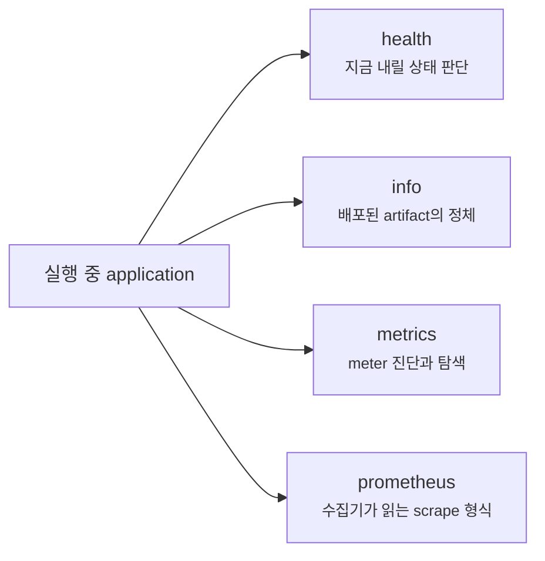
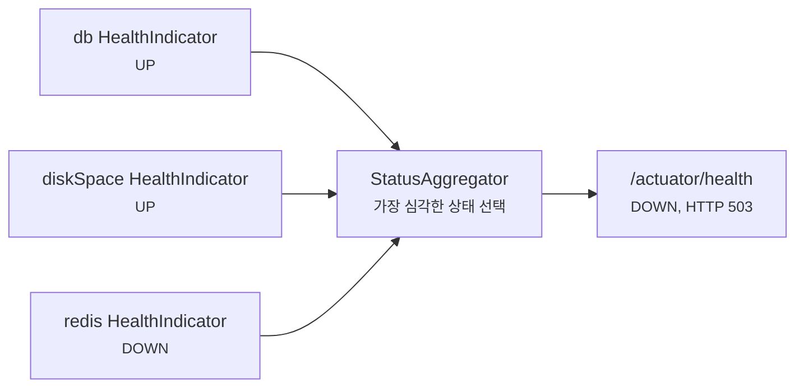
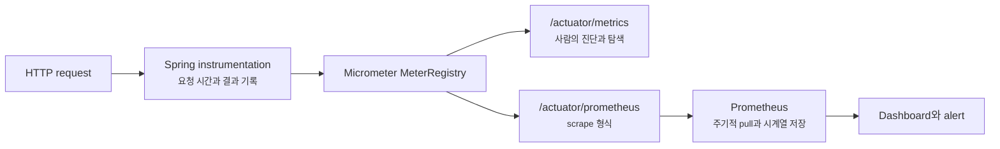

# Actuator의 health와 metrics는 운영에서 무엇을 알려줄까요?

> `/actuator/health`가 `UP`이라고 해서, 사용자의 주문까지 정상이라는 뜻은 아니에요.

새 버전을 배포하고 첫 화면도 잘 열렸어요. 배포 도구가 확인한 health endpoint도 `200 OK`예요. 그런데 잠시 뒤부터 주문 요청이 느려지고, 일부 사용자는 결제 단계에서 오류를 봐요.

이럴 때 `health=UP`만 보고 있으면 질문이 막혀요.

> “서버가 살아 있다는데, 왜 사용자는 실패하고 있죠?”

사실은 **살아 있음**, **트래픽을 받을 준비가 됨**, **요청이 정상 속도로 처리됨**은 서로 다른 상태예요. 하나의 초록불로 모두 표현할 수 없어요.

[앞 글](testcontainers-wiremock-and-contract-tests.md)에서는 database와 외부 HTTP 경계를 실제에 가깝게 test하는 방법을 봤어요. 이번에는 test가 끝난 뒤 실행 중인 application을 어떻게 바라볼지 살펴볼게요. Spring Boot Actuator의 health, info, metrics를 나누고, 운영 도구가 읽을 Prometheus 형식까지 연결해 볼 거예요.

!!! note "이 글의 기준"
    설정과 dependency 예시는 Spring Boot 4.x와 Java 21을 기준으로 해요. Actuator의 endpoint 기본값은 version에 따라 달라질 수 있으므로, 실제 project를 운영할 때는 사용 중인 Spring Boot version의 공식 문서도 함께 확인하세요.

---

## 먼저 “정상”이라는 말을 네 가지 질문으로 나눠 봐요

Application을 운영한다는 것은 한 번 접속해 보고 끝내는 일이 아니에요. 서로 다른 주체가 서로 다른 질문을 계속 던지는 일이에요.

| 질문하는 주체 | 알고 싶은 것 | 맞는 관측 입구 |
|---|---|---|
| Load balancer, container platform | 이 instance로 요청을 보내도 되나요? | health group, readiness |
| 운영자 | 어떤 build가 떠 있고 내부 구성 요소 상태는 어떤가요? | info, health details |
| Monitoring system | 요청량, 오류율, 지연, JVM 상태가 시간에 따라 어떻게 변하나요? | Prometheus 같은 metrics exporter |
| 개발자 | 지금 등록된 meter 이름과 tag, 측정값은 무엇인가요? | metrics endpoint |

여기서 자주 생기는 오해가 있어요. `health`, `metrics`, `prometheus`는 비슷한 숫자를 다른 모양으로 보여주는 endpoint가 아니에요.



Health는 지금의 상태를 작게 요약하고, info는 실행 중인 artifact가 무엇인지 알려줘요. Metrics는 여러 순간의 측정값을 쌓아 추세를 보게 하고, Prometheus endpoint는 그 측정값을 monitoring system이 가져갈 수 있는 형식으로 내보내요.

---

## Actuator dependency를 넣으면 운영용 입구가 준비돼요

먼저 Actuator starter를 추가해요. Prometheus가 metric을 가져가게 하려면 Prometheus registry도 runtime dependency로 넣어요.

```gradle title="build.gradle" linenums="1" hl_lines="3 4"
dependencies {
    implementation 'org.springframework.boot:spring-boot-starter-web'
    implementation 'org.springframework.boot:spring-boot-starter-actuator'
    runtimeOnly 'io.micrometer:micrometer-registry-prometheus'
}
```

Spring Boot dependency management를 사용한다면 두 dependency의 version을 따로 맞추지 않아도 돼요. 여기서 개발자가 한 일은 library를 선택한 것까지예요.

그다음은 Spring Boot가 맡아요.

1. Actuator endpoint 구현과 자동 설정을 classpath에서 찾고 준비해요.
2. `HealthContributor`들을 모아 health 상태를 만들어요.
3. Micrometer의 `MeterRegistry`를 만들고 JVM, process, HTTP 요청 같은 meter를 등록해요.
4. Prometheus registry가 있으면 Prometheus scrape 형식을 만들 수 있게 해요.

근데 dependency가 있다고 모든 endpoint가 인터넷에 공개되는 것은 아니에요. 이 경계를 세 단어로 나눠야 해요.

| 단계 | 뜻 | 확인할 설정이나 코드 |
|---|---|---|
| 접근(access) | Endpoint operation 자체를 사용할 수 있는가 | `management.endpoint.<id>.access` |
| 노출(exposure) | HTTP나 JMX를 통해 원격으로 닿을 수 있는가 | `management.endpoints.web.exposure.*` |
| 보안(security) | 노출된 HTTP endpoint에 누가 들어갈 수 있는가 | Firewall, network policy, Spring Security |

Endpoint가 준비됐어도 HTTP exposure 목록에 없으면 URL로 접근할 수 없어요. URL이 열렸어도 인증과 network 경계가 없으면 운영 정보가 의도하지 않은 사람에게 보일 수 있죠.

현재 Spring Boot 4.x의 기본 HTTP exposure에는 `health`만 들어가요. `info`, `metrics`, `prometheus`는 필요한 것만 명시적으로 열어야 해요.

```yaml title="src/main/resources/application.yml" linenums="1"
management:
  endpoints:
    web:
      exposure:
        include: "health,info,metrics,prometheus"
  endpoint:
    health:
      show-details: "when-authorized"
```

이 설정은 endpoint를 노출할 뿐, 운영자 인증이나 사설 network를 대신 만들지는 않아요. 특히 application에 직접 만든 `SecurityFilterChain`이 있다면 Spring Boot의 Actuator 보안 자동 설정은 물러나요. [Security filter chain 글](spring-security-filter-chain-first.md)에서 본 것처럼, 이때는 health 공개 범위와 운영자 endpoint 인증을 직접 규칙에 넣어야 해요.

!!! warning "`include: \"*\"`는 편의 설정이 아니라 공개 범위 결정이에요"
    `env`, `configprops`, `beans`, `mappings`, `loggers`, `heapdump`, `threaddump`, `logfile` 같은 endpoint는 설정값, 내부 구조, memory, log를 드러내거나 실행 상태를 바꿀 수 있어요. 개발 환경에서 잠깐 전체를 열어 보는 것과 운영 network에 전체를 노출하는 것은 전혀 다른 결정이에요.

---

## Health는 “모든 기능이 정상”이 아니라 상태 판단 재료예요

기본 `/actuator/health` 응답은 아주 작아요.

```json
{
  "status": "UP"
}
```

`show-details`의 기본값이 `never`이기 때문에, 공개 요청에는 보통 전체 상태만 보여요. 내부에서는 database, disk space, Redis처럼 classpath와 bean 구성에 맞춰 만들어진 `HealthContributor`들이 각자의 상태를 내고 있어요.



여러 contributor의 결과는 상태 집계기(status aggregator)가 하나의 전체 상태로 합쳐요. 기본 HTTP mapping에서는 `DOWN`과 `OUT_OF_SERVICE`가 `503 Service Unavailable`로 이어지고, `UP`은 `200`으로 응답해요.

여기서 중요한 점은 **어떤 component를 전체 health에 넣었는지가 곧 운영 정책**이라는 거예요. 추천 상품용 Redis가 잠시 실패해도 주문은 받을 수 있는데 전체 health를 `DOWN`으로 만들면, platform이 정상 주문 instance까지 빼 버릴 수 있어요.

반대로 database가 끊기면 모든 API가 실패하는 application인데 단순 process 상태만 `UP`으로 내보내면, load balancer는 실패할 instance로 계속 요청을 보낼 수 있죠.

### Details는 장애 원인에 가깝지만 공개 정보도 많아져요

권한이 있는 운영자에게 health details를 보여주면 어느 component가 `DOWN`인지 빠르게 찾을 수 있어요. 하지만 database 제품, disk 상태, 외부 system 이름처럼 내부 topology를 추측할 단서도 늘어나요.

그래서 보통은 다음처럼 나눠요.

| 대상 | 보여줄 정보 | 이유 |
|---|---|---|
| 외부 load balancer | 전체 status 또는 전용 readiness status | routing 판단에는 작은 응답이면 충분해요 |
| 인증된 운영자 | component와 필요한 details | 장애 원인을 좁혀야 해요 |
| 일반 사용자 | Actuator 응답 대신 서비스용 오류 응답 | 내부 운영 구조는 API 계약이 아니에요 |

Health endpoint는 dashboard가 아니라 **자동화가 행동을 결정하는 신호**에 가까워요. 무엇을 넣을지는 “알고 싶은가?”보다 “이 결과를 받은 platform이 무엇을 할 것인가?”로 결정해야 해요.

---

## Liveness와 readiness를 하나로 합치면 장애가 커질 수 있어요

Container platform은 health 실패 뒤에 실제 행동을 해요. 그래서 상태를 적어도 두 가지로 나눠야 해요.

| 상태 | 답하는 질문 | 실패했을 때 platform 행동 | 넣지 말아야 할 것 |
|---|---|---|---|
| Liveness | 이 process는 스스로 회복할 수 없는 상태인가요? | Instance 재시작 | 공유 DB, 외부 API, Redis 같은 외부 system 상태 |
| Readiness | 이 instance가 지금 새 traffic을 받아도 되나요? | Routing 대상에서 일시 제외 | 없어도 핵심 요청을 처리할 수 있는 선택적 dependency |

Database 장애를 liveness에 넣었다고 생각해 볼게요. 모든 application instance가 같은 database를 봐요. Database가 잠깐 멈추면 모든 instance의 liveness가 실패하고, platform은 application을 한꺼번에 재시작해요. Database 장애는 그대로인데 재시작 부하까지 더해져요.

그래서 liveness는 application 내부가 복구 불가능하게 망가졌는지를 봐야 해요. 외부 system 실패를 그대로 넣으면 cascading failure를 만들 수 있어요.

Readiness는 조금 더 판단이 필요해요. Database 없이 어떤 요청도 처리할 수 없다면 해당 instance를 traffic에서 빼는 편이 자연스러울 수 있어요. 하지만 모든 instance가 공유하는 database라면 전부 routing에서 빠져 서비스가 완전히 사라질 수도 있죠. 일부 기능이 fallback으로 동작한다면 readiness를 유지하고 개별 요청에서 오류를 다루는 편이 나을 수도 있어요.

Spring Boot Actuator는 두 상태를 health group으로 제공해요.

```text
GET /actuator/health/liveness
GET /actuator/health/readiness
```

Health group은 단지 URL 별칭이 아니에요. 서로 다른 contributor 목록, details 공개 정책, status mapping을 가질 수 있는 별도 판단 단위예요.

### 별도 management port만 검사하면 생기는 빈틈

운영 endpoint를 application traffic과 다른 port로 분리하는 경우가 있어요.

```yaml title="src/main/resources/application.yml" linenums="1"
management:
  server:
    port: 8081
  endpoint:
    health:
      probes:
        add-additional-paths: true
```

별도 port는 network 접근 제어에 유용하지만, 그 port만 정상이고 실제 application port는 새 연결을 받지 못하는 상황도 생길 수 있어요. `add-additional-paths: true`를 켜면 main server port에도 `/livez`, `/readyz`가 추가돼요. Platform은 실제 traffic이 들어가는 web infrastructure까지 통과해 상태를 확인할 수 있어요.

!!! tip "Probe 이름을 행동으로 기억해요"
    Liveness 실패는 “다시 시작해”, readiness 실패는 “새 요청을 보내지 마”예요. 어떤 dependency를 넣기 전에 그 행동이 장애를 줄일지 먼저 물어보세요.

---

## Info는 “무슨 application이 떠 있나?”에 답해요

장애 대응 중에는 상태만큼 정체도 중요해요.

> “지금 이 instance에는 어느 commit으로 만든 artifact가 떠 있죠?”

`/actuator/info`는 application 이름, build version, commit 같은 배포 metadata를 보여줄 수 있어요. Spring Boot build plugin이 build info를 만들게 할 수도 있어요.

```gradle title="build.gradle" linenums="1"
springBoot {
    buildInfo()
}
```

Build 과정에서 만들어진 metadata가 classpath에 들어오면 Actuator의 build info contributor가 읽어요. Git plugin으로 `git.properties`를 만들었다면 branch와 commit 정보도 연결할 수 있어요.

이 정보는 다음 질문에 유용해요.

- 일부 instance만 이전 version인지 확인해요.
- 배포 직후 오류율 변화와 release를 연결해요.
- Rollback 대상 artifact를 빠르게 식별해요.

하지만 info도 공개 자기소개 페이지가 아니에요. 내부 branch 이름, 전체 Git property, build 환경 값까지 무심코 내보내지 말고 운영 판단에 필요한 식별 정보만 남겨요.

---

## Metrics는 한순간이 아니라 변화의 모양을 보여줘요

Health가 `UP`이어도 요청 시간이 100ms에서 5초로 늘어날 수 있어요. 오류가 아니더라도 thread와 connection pool이 거의 다 찼을 수 있죠. 이런 현상은 한 번의 상태 확인보다 시간에 따라 쌓인 측정값(metric)으로 봐야 해요.

Spring Boot Actuator는 Micrometer를 통해 meter를 등록해요. Micrometer는 application code와 Prometheus, OTLP, Datadog 같은 monitoring backend 사이에서 공통 계측 모델을 제공해요.

| Meter 모양 | 답하기 좋은 질문 | 예시 |
|---|---|---|
| Counter | 사건이 몇 번 누적됐나요? | 주문 생성 수, 실패 수 |
| Gauge | 지금 값이 얼마인가요? | Queue 크기, 사용 중 connection 수 |
| Timer | 몇 번 실행됐고 얼마나 걸렸나요? | HTTP 요청 시간, 외부 API 호출 시간 |
| Distribution summary | 값의 분포가 어떤가요? | Payload 크기, batch 처리량 |

Actuator를 붙이면 JVM memory와 GC, process와 system, application 시작 시간, Spring MVC 요청 같은 여러 meter가 자동으로 등록돼요. 예를 들어 Spring MVC 요청은 기본적으로 `http.server.requests`라는 이름으로 측정돼요.

### `/metrics`는 탐색용이고 `/prometheus`는 수집용이에요

두 endpoint의 역할을 자주 바꿔 읽어요.

```text
GET /actuator/metrics
GET /actuator/metrics/http.server.requests
GET /actuator/metrics/http.server.requests?tag=status:500
```

`metrics` endpoint는 현재 등록된 meter 이름을 찾고, measurement와 사용 가능한 tag를 좁혀 보는 진단 도구예요. Production monitoring backend처럼 주기적으로 긁어 history를 저장하도록 만든 endpoint는 아니에요.

Prometheus가 읽을 대상은 다음 endpoint예요.

```text
GET /actuator/prometheus
```



같은 `MeterRegistry`의 측정값이지만 소비자가 달라요. 개발자는 `metrics`로 meter 구조를 확인하고, Prometheus는 exporter endpoint를 반복해서 scrape해 시간축을 만들어요.

Prometheus 설정은 대략 다음 모양이에요.

```yaml title="prometheus.yml" linenums="1"
scrape_configs:
  - job_name: "order-api"
    metrics_path: "/actuator/prometheus"
    static_configs:
      - targets: ["order-api:8080"]
```

Application endpoint가 외부 인터넷에 공개돼야 Prometheus가 읽을 수 있다는 뜻은 아니에요. Prometheus가 닿을 수 있는 내부 network 경로를 만들고, 그 경로만 인증이나 network policy로 허용하는 편이 안전해요.

### 이름이 달라 보여도 같은 meter일 수 있어요

Micrometer 안에서는 `http.server.requests`처럼 점으로 구분된 이름을 써요. Prometheus 형식에서는 naming convention과 meter type에 따라 `http_server_requests_seconds_count` 같은 이름으로 바뀔 수 있어요.

그래서 `/actuator/metrics`를 조회할 때 Prometheus에서 본 이름을 그대로 넣으면 못 찾을 수 있어요. 진단 endpoint에서는 **code와 registry에 등록된 원래 meter 이름**을 써야 해요.

---

## 직접 metric을 만들기 전에 운영 질문부터 정해요

기본 HTTP, JVM, database pool metric으로 답할 수 없는 business 질문도 있어요.

> “결제 승인 뒤 실제 주문 생성은 몇 건 성공했나요?”

이때 custom counter를 만들 수 있어요.

```java title="src/main/java/com/example/order/OrderMetrics.java" linenums="1"
package com.example.order;

import io.micrometer.core.instrument.Counter;
import io.micrometer.core.instrument.MeterRegistry;
import org.springframework.stereotype.Component;

@Component
public class OrderMetrics {

    private final Counter createdOrders;

    public OrderMetrics(MeterRegistry registry) {
        this.createdOrders = Counter.builder("orders.created")
                .description("Number of successfully created orders")
                .register(registry);
    }

    public void recordCreated() {
        this.createdOrders.increment();
    }
}
```

이 counter는 성공적으로 주문 상태가 확정된 지점에서 증가시켜야 해요. Controller 진입 직후 올리면 validation 실패와 transaction rollback까지 성공 주문으로 셀 수 있죠. Metric 이름보다 **어느 business 경계에서 기록했는지**가 더 중요해요.

Counter 하나만 보고 현재 주문 수를 알 수도 없어요. Counter는 process가 시작된 뒤 누적 증가한 값이라 instance 재시작 때 다시 시작할 수 있어요. Prometheus에서는 일정 시간의 증가량이나 초당 rate로 바꿔 보는 것이 자연스러워요.

### Tag는 검색 조건이면서 시계열 개수예요

`channel=web`, `result=success`처럼 제한된 값은 metric을 나눠 보는 데 유용해요. 하지만 다음 값은 tag로 넣으면 안 돼요.

- `userId`
- `orderId`
- 전체 request URL
- 자유 형식 error message
- 제한 없이 늘어나는 tenant 이름

Prometheus에서는 metric 이름과 tag 조합마다 별도 time series가 생겨요. 사용자 백만 명을 tag로 넣으면 관측하려던 application보다 monitoring system이 먼저 힘들어질 수 있어요. 이를 높은 cardinality 문제라고 해요.

| 좋은 tag 후보 | 위험한 tag 후보 |
|---|---|
| HTTP method | User ID |
| Route template | 실제 query string이 붙은 URL |
| 제한된 status 또는 result | 예외 message 전문 |
| 미리 정한 region | 계속 새로 생기는 resource ID |

!!! warning "Metric은 log의 압축본이지 log 대체품이 아니에요"
    Metric tag는 “어떤 종류의 문제가 얼마나 자주 생겼나”를 빠르게 나누는 값이에요. 특정 사용자와 특정 주문의 전체 맥락을 담는 공간이 아니에요. 한 요청의 상세 원인은 다음 글에서 볼 log와 trace로 이어야 해요.

---

## Dashboard보다 먼저 어떤 행동을 할지 정해요

Metric을 많이 모았다고 관측 가능성(observability)이 저절로 생기지는 않아요. 운영자가 답할 질문과 대응 행동이 있어야 해요.

웹 API라면 먼저 다음 네 가지 축을 잡을 수 있어요.

| 축 | 볼 수 있는 신호 | 이어질 행동 |
|---|---|---|
| Traffic | 초당 요청 수, endpoint별 호출량 | Capacity 변화와 비정상 급증 확인 |
| Error | 5xx 비율, business 실패 수 | 최근 배포, dependency 오류 조사 |
| Latency | 평균이 아닌 percentile과 긴 요청 비율 | 느린 query, 외부 API, pool 대기 확인 |
| Saturation | Thread, connection pool, CPU, memory 압박 | 병목 자원과 limit 확인 |

Alert도 “CPU가 잠깐 높다”보다 사용자가 실제로 겪는 실패와 가까운 신호에서 시작하는 편이 좋아요.

- 일정 시간 동안 5xx 비율이 기준을 넘었어요.
- p95 또는 p99 latency가 service 목표를 오래 벗어났어요.
- Readiness에서 빠지는 instance가 계속 늘어요.
- Connection pool 대기가 늘면서 요청 시간이 함께 나빠져요.

하나의 순간값만 보면 정상적인 짧은 spike에도 계속 깨울 수 있어요. 지속 시간, 비율, 요청량을 함께 보고 alert가 울렸을 때 확인할 dashboard와 runbook도 연결해야 해요.

---

## 운영 공개 범위는 endpoint마다 다르게 설계해요

한 가지 설정을 모든 환경에 복사하기보다 소비자와 위험을 기준으로 나누는 편이 안전해요.

| Endpoint | 주 소비자 | 권장 경계 | 주의할 점 |
|---|---|---|---|
| `health`, liveness, readiness | Platform, load balancer | 필요한 최소 status만 접근 허용 | Details를 외부에 공개하지 않아요 |
| `prometheus` | Prometheus scraper | 내부 network와 전용 인증 | 인터넷 전체에 열지 않아요 |
| `info` | 배포 도구, 운영자 | 인증된 운영 경로 | 필요한 build 식별 정보만 넣어요 |
| `metrics` | 개발자, 운영자 | 인증된 진단 경로 | Production scrape backend로 쓰지 않아요 |
| `env`, `configprops` | 제한된 운영 진단 | 기본 비노출 유지, 꼭 필요할 때만 제한적으로 사용 | Sanitizing만 믿고 전체 공개하지 않아요 |
| `heapdump`, `threaddump`, `logfile` | 장애 분석 담당자 | 강한 접근 통제와 감사 | 개인정보, secret, memory 내용이 포함될 수 있어요 |
| `loggers`, `shutdown` | 운영 제어 도구 | 쓰기 권한을 별도로 제한 | 실행 상태를 바꾸는 operation이에요 |

별도 management port, firewall, network policy, Spring Security는 경쟁 관계가 아니에요. 서로 다른 층에서 노출 범위를 줄여요. 중요한 것은 “Actuator니까 안전하다”가 아니라 **누가 어느 경로로 어떤 operation까지 실행할 수 있는지**를 실제 배포 환경에서 확인하는 일이에요.

### 배포 전에 직접 확인할 것

```bash
curl -i http://localhost:8080/actuator/health
curl -i http://localhost:8080/actuator/health/liveness
curl -i http://localhost:8080/actuator/health/readiness
curl -i http://localhost:8080/actuator/info
curl -i http://localhost:8080/actuator/metrics/http.server.requests
curl -i http://localhost:8080/actuator/prometheus
```

이 명령을 전부 `200`으로 만드는 것이 목표는 아니에요. 공개 health는 작은 응답을 내고, 운영자 endpoint는 인증 없이 거절되며, Prometheus 경로는 monitoring network에서만 성공하는지처럼 **의도한 주체에게 의도한 결과가 나오는지** 확인해야 해요.

또 health contributor가 외부 system을 검사한다면 응답 시간도 확인하세요. Health check 자체가 느리거나 매번 비싼 query를 실행하면 platform probe가 timeout되고, 실제 application 상태보다 검사 방식 때문에 재시작과 routing 제외가 반복될 수 있어요.

## 참고한 링크

- [Spring Boot 공식 문서: Actuator Endpoints](https://docs.spring.io/spring-boot/reference/actuator/endpoints.html)
- [Spring Boot 공식 문서: HTTP를 통한 Monitoring과 Management](https://docs.spring.io/spring-boot/reference/actuator/monitoring.html)
- [Spring Boot 공식 문서: Metrics](https://docs.spring.io/spring-boot/reference/actuator/metrics.html)
- [Spring Boot 공식 문서: Actuator Metrics API](https://docs.spring.io/spring-boot/api/rest/actuator/metrics.html)
- [Spring Boot 공식 문서: Actuator Prometheus API](https://docs.spring.io/spring-boot/api/rest/actuator/prometheus.html)
- [Spring Boot 공식 문서: Application Availability](https://docs.spring.io/spring-boot/reference/features/spring-application.html#features.spring-application.application-availability)
- [Spring Boot 공식 문서: Common Application Properties](https://docs.spring.io/spring-boot/appendix/application-properties/)
- [Micrometer 공식 문서: Meter와 Registry 개념](https://docs.micrometer.io/micrometer/reference/concepts/registry.html)

## 자, 정리해볼까요?

!!! abstract "오늘 우리가 배운 것"
    - Actuator는 실행 중 application의 health, info, metrics 같은 운영 입구를 자동 설정하지만, dependency를 넣었다고 모든 endpoint가 HTTP에 공개되는 것은 아니에요.
    - Health는 “모든 기능이 완벽하다”는 인증서가 아니라, contributor와 집계 정책으로 만든 현재 상태 판단 신호예요.
    - Liveness 실패는 재시작, readiness 실패는 routing 제외로 이어지므로 외부 dependency를 어느 probe에 넣을지 행동부터 생각해야 해요.
    - 별도 management port를 쓸 때 main traffic port의 `/livez`, `/readyz`도 확인하면 관리 port만 살아 있는 false positive를 줄일 수 있어요.
    - `info`는 실행 중인 build와 commit을 식별하고, `metrics`는 등록된 meter를 진단하며, `/prometheus`는 monitoring system이 scrape할 시계열 형식을 제공해요.
    - Custom metric은 business 경계에서 기록하고, 무한히 늘어나는 ID를 tag로 넣어 높은 cardinality를 만들지 않아야 해요.
    - 운영 endpoint는 소비자별로 최소 노출하고, network와 인증과 operation 권한을 함께 설계해야 해요.

다음 글에서는 metric이 이상해진 한 요청을 log와 trace로 찾아갈 거예요. Micrometer tracing, correlation ID, MDC, sampling을 연결해서 여러 service 사이에서 같은 요청을 놓치지 않는 방법을 살펴볼게요.
