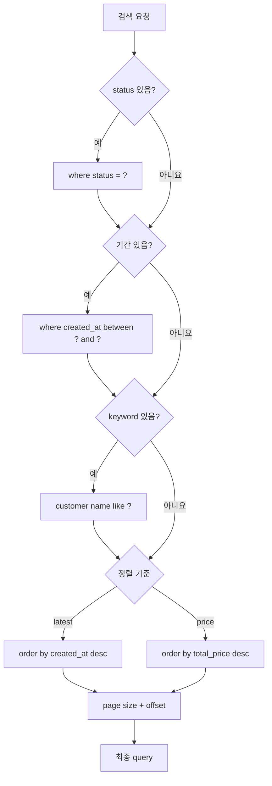
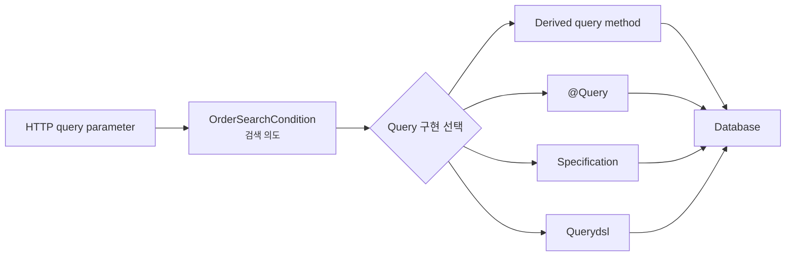
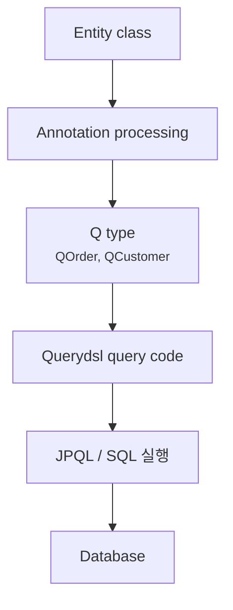
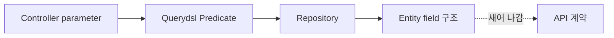
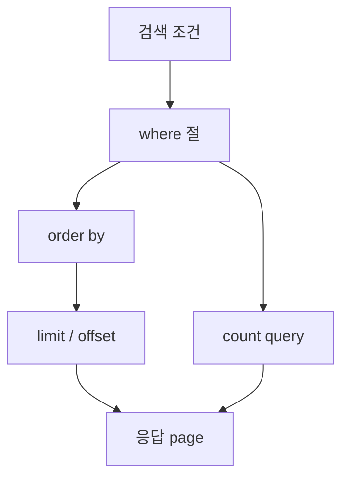
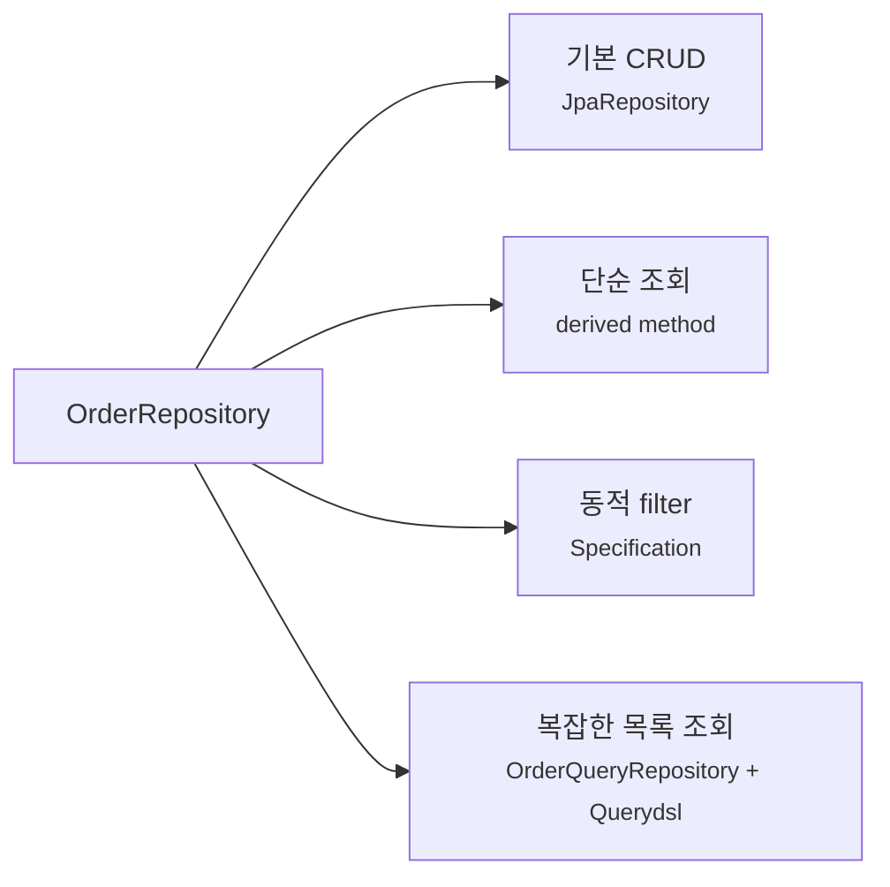
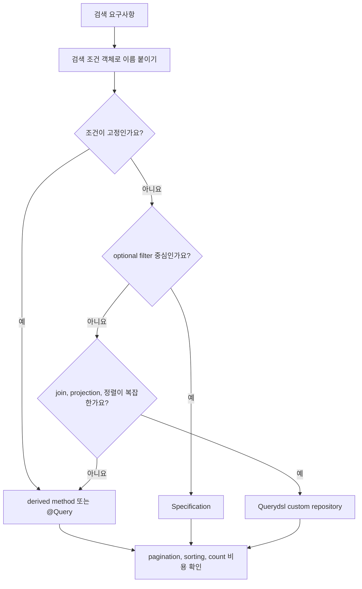

# 복잡한 query는 Querydsl과 Specification 중 무엇으로 풀어야 할까요?

> 검색 조건 하나만 더 붙였을 뿐인데, repository method 이름이 문장처럼 길어져요.

지난 글에서는 database schema 변경을 Flyway와 Liquibase로 어떻게 이력화하는지 봤어요. 이제 schema 위에서 실제 데이터를 읽는 장면으로 다시 올라와 볼게요.

처음에는 repository method가 참 편해 보여요.

```java
List<Order> findByStatus(OrderStatus status);
```

그런데 화면 검색 조건이 조금씩 늘어나면 금방 이런 질문을 만나죠.

> "상태도 고르고, 기간도 고르고, 고객 이름도 검색하고, 결제 금액도 범위로 걸고, 최신순이나 금액순 정렬도 해야 하면 method 이름을 계속 늘려야 하나요?"

처음에는 이렇게 만들 수 있어요.

```java
List<Order> findByStatusAndCreatedAtBetweenAndCustomerNameContainingOrderByCreatedAtDesc(
        OrderStatus status,
        Instant from,
        Instant to,
        String customerName
);
```

작동할 수는 있어요. 하지만 읽기 시작하는 순간 불안해져요. 조건이 하나 더 생기면 method가 또 늘어나고, 어떤 조건은 optional이고, 어떤 조건은 join이 필요하고, 어떤 정렬은 index를 타야 해요.

오늘 목표는 "Querydsl이 더 좋아요"나 "Specification이 더 좋아요" 같은 결론을 빨리 내는 게 아니에요. **query가 복잡해지는 이유를 먼저 나누고, 그 복잡함을 어떤 도구가 어느 정도까지 감당하는지** 보는 거예요.

!!! note "이 글의 기준"
    이 글은 Spring Data JPA 4.x의 Specifications, Spring Data Querydsl extension, OpenFeign Querydsl 문서를 기준으로 작성했어요. Spring Data JPA 4.x 문서에는 `Specification`뿐 아니라 더 넓게 조합할 수 있는 `PredicateSpecification`도 등장하지만, 이 글은 기존 프로젝트와 예제가 가장 많이 만나는 `JpaSpecificationExecutor`와 `Specification`을 중심으로 설명할게요. Querydsl은 현재 OpenFeign fork와 기존 Querydsl 자료가 함께 보일 수 있으니, 새 프로젝트에서는 사용하는 Spring Boot와 Spring Data 버전이 어떤 Querydsl 좌표를 지원하는지 확인해야 해요.

---

## 문제는 조건 개수가 아니라 "조건 조합"이에요

주문 목록 API를 만든다고 해볼게요. 처음 요구사항은 단순해요.

```http
GET /orders?status=PAID
```

상태로만 찾으면 derived query method가 충분해요.

```java
package com.example.order;

import java.util.List;
import org.springframework.data.jpa.repository.JpaRepository;

public interface OrderRepository extends JpaRepository<Order, Long> {

    List<Order> findByStatus(OrderStatus status);
}
```

그런데 검색 화면은 보통 이렇게 자라요.

```http
GET /orders?status=PAID&from=2026-07-01&to=2026-07-07&keyword=kim&sort=latest&page=0&size=20
```

여기서 조건은 모두 항상 들어오지 않아요. 사용자는 상태만 고를 수도 있고, 기간만 고를 수도 있고, keyword를 비워둘 수도 있어요. 그러면 query는 이런 모양이 돼요.



이 그림에서 복잡한 지점은 조건이 많다는 사실 자체가 아니에요. **조건이 들어오기도 하고 빠지기도 하며, join과 정렬과 pagination이 함께 움직인다**는 점이에요.

그래서 repository method 이름만 늘리는 방식은 금방 한계에 닿아요.

| 요구사항 | method 이름만으로 버티기 어려운 이유 |
|---|---|
| optional 조건 | 모든 조합마다 method를 만들 수 없어요 |
| 여러 table join | 이름이 길어지고 읽는 사람이 SQL 모양을 상상하기 어려워요 |
| 복잡한 정렬 | 단순 property 정렬을 넘어 function, 집계, null 처리까지 갈 수 있어요 |
| pagination | content query와 count query 비용을 따로 봐야 해요 |
| 검색 API 확장 | condition object와 query builder가 분리되어야 오래 버텨요 |

처음에는 여기까지만 잡아도 충분해요. 복잡한 query는 "method 이름이 길어지는 문제"가 아니라 **검색 조건을 조합하고, 실행 SQL을 통제하고, 성능을 예측해야 하는 문제**예요.

---

## 먼저 검색 조건을 객체로 분리해요

도구를 고르기 전에 검색 조건부터 이름 붙이면 좋아요. Controller parameter가 바로 repository method로 흘러가면 query가 자라는 방향을 잡기 어려워요.

```java
package com.example.order;

import java.time.LocalDate;

public record OrderSearchCondition(
        OrderStatus status,
        LocalDate from,
        LocalDate to,
        String keyword,
        OrderSort sort
) {
}
```

```java
package com.example.order;

public enum OrderSort {
    LATEST,
    TOTAL_PRICE_DESC
}
```

이 객체는 "JPA가 어떻게 query를 만들지"가 아니라 "사용자가 무엇으로 검색하고 싶은지"를 표현해요. 이 한 단계가 있으면 뒤에서 `Specification`을 쓰든 Querydsl을 쓰든 코드가 덜 흔들려요.



이 그림의 핵심은 검색 의도와 query 구현을 분리하는 거예요. 사용자의 요청 모양이 바뀌는 일과 JPA query 작성 방식이 바뀌는 일을 같은 곳에 섞지 않으면, 나중에 도구를 바꾸기도 쉬워져요.

---

## 단순한 query는 derived method와 `@Query`가 여전히 좋아요

모든 query를 처음부터 Querydsl로 밀어 넣을 필요는 없어요. 단순한 조건은 Spring Data JPA repository method가 더 읽기 좋을 때가 많아요.

```java
List<Order> findByStatus(OrderStatus status);

List<Order> findTop10ByOrderByCreatedAtDesc();
```

이 정도는 이름만 봐도 의도가 분명해요. 별도 query builder를 만들면 오히려 장식이 많아질 수 있어요.

반대로 query가 고정되어 있고 SQL이나 JPQL 모양을 직접 보여주는 편이 낫다면 `@Query`도 좋은 선택이에요.

```java
package com.example.order;

import java.time.Instant;
import java.util.List;
import org.springframework.data.jpa.repository.JpaRepository;
import org.springframework.data.jpa.repository.Query;
import org.springframework.data.repository.query.Param;

public interface OrderRepository extends JpaRepository<Order, Long> {

    @Query("""
            select o
            from Order o
            where o.createdAt >= :from
              and o.createdAt < :to
            order by o.createdAt desc
            """)
    List<Order> findCreatedBetween(
            @Param("from") Instant from,
            @Param("to") Instant to
    );
}
```

`@Query`는 이런 경우에 잘 맞아요.

| 잘 맞는 상황 | 이유 |
|---|---|
| 조건 조합이 거의 없음 | query 모양이 고정되어 있어요 |
| JPQL을 명시적으로 보여주고 싶음 | method 이름보다 실행 의도가 잘 보여요 |
| 튜닝 대상 query가 분명함 | 리뷰에서 query 자체를 놓고 이야기하기 쉬워요 |
| projection을 직접 잡고 싶음 | Entity 전체가 아니라 필요한 값만 가져올 수 있어요 |

하지만 조건이 optional로 늘어나면 `@Query`도 금방 복잡해져요. `(:status is null or o.status = :status)` 같은 조건이 계속 붙으면 query는 하나지만 의미는 흐려질 수 있어요.

!!! tip "고정 query와 동적 query를 구분하세요"
    고정 query는 derived method나 `@Query`가 읽기 좋을 수 있어요. 동적 query는 조건 조합을 코드로 다룰 수 있는 `Specification`이나 Querydsl 쪽이 자연스러워져요.

---

## Specification은 조건 조각을 조립하는 방식이에요

Spring Data JPA의 `Specification`은 JPA Criteria API 위에서 조건을 조립하게 해주는 작은 abstraction이에요. repository는 `JpaSpecificationExecutor`를 함께 확장해요.

```java
package com.example.order;

import org.springframework.data.jpa.repository.JpaRepository;
import org.springframework.data.jpa.repository.JpaSpecificationExecutor;

public interface OrderRepository
        extends JpaRepository<Order, Long>, JpaSpecificationExecutor<Order> {
}
```

이제 조건을 작은 method로 나눌 수 있어요.

```java
package com.example.order;

import java.time.Instant;
import org.springframework.data.jpa.domain.Specification;

public final class OrderSpecifications {

    private OrderSpecifications() {
    }

    public static Specification<Order> hasStatus(OrderStatus status) {
        return (root, query, builder) -> builder.equal(root.get("status"), status);
    }

    public static Specification<Order> createdAtBetween(Instant from, Instant to) {
        return (root, query, builder) -> builder.between(root.get("createdAt"), from, to);
    }

    public static Specification<Order> customerNameContains(String keyword) {
        return (root, query, builder) -> builder.like(
                builder.lower(root.join("customer").get("name")),
                "%" + keyword.toLowerCase() + "%"
        );
    }
}
```

그리고 service에서는 들어온 조건만 골라 조립해요.

```java
package com.example.order;

import static com.example.order.OrderSpecifications.createdAtBetween;
import static com.example.order.OrderSpecifications.customerNameContains;
import static com.example.order.OrderSpecifications.hasStatus;

import java.time.Instant;
import java.time.ZoneOffset;
import java.util.ArrayList;
import java.util.List;
import org.springframework.data.domain.Page;
import org.springframework.data.domain.Pageable;
import org.springframework.data.jpa.domain.Specification;
import org.springframework.stereotype.Service;
import org.springframework.transaction.annotation.Transactional;

@Service
public class OrderSearchService {

    private final OrderRepository orderRepository;

    public OrderSearchService(OrderRepository orderRepository) {
        this.orderRepository = orderRepository;
    }

    @Transactional(readOnly = true)
    public Page<Order> search(OrderSearchCondition condition, Pageable pageable) {
        List<Specification<Order>> specifications = new ArrayList<>();

        if (condition.status() != null) {
            specifications.add(hasStatus(condition.status()));
        }

        if (condition.from() != null && condition.to() != null) {
            Instant from = condition.from().atStartOfDay().toInstant(ZoneOffset.UTC);
            Instant to = condition.to().plusDays(1).atStartOfDay().toInstant(ZoneOffset.UTC);
            specifications.add(createdAtBetween(from, to));
        }

        if (condition.keyword() != null && !condition.keyword().isBlank()) {
            specifications.add(customerNameContains(condition.keyword()));
        }

        return orderRepository.findAll(Specification.allOf(specifications), pageable);
    }
}
```

여기서 `Specification.allOf(...)`는 여러 조건을 `and`로 묶는 흐름이에요. 빈 목록이면 제한 없는 조건처럼 동작할 수 있어서, 예전처럼 `Specification.where(null)` 같은 모양으로 시작하지 않아도 돼요.

Specification의 장점은 분명해요.

| 장점 | 설명 |
|---|---|
| Spring Data JPA 안에 있음 | 별도 query framework 없이 시작할 수 있어요 |
| 조건 조각을 재사용할 수 있음 | `hasStatus`, `createdAtBetween` 같은 조각을 조합해요 |
| pagination과 repository 통합이 쉬움 | `findAll(specification, pageable)` 흐름이 자연스러워요 |
| 단순 동적 filter에 적합 | 검색 조건이 `where` 중심일 때 부담이 적어요 |

하지만 단점도 있어요. `root.get("status")`처럼 field 이름을 문자열로 쓰는 부분은 compile-time에 안전하지 않아요. join, fetch join, group by, projection, 복잡한 order가 늘어나면 Criteria API 특유의 문법이 읽기 어려워질 수 있어요.

!!! warning "Specification을 모든 query의 만능 도구로 보지는 마세요"
    Specification은 조건 조합에는 좋지만, 복잡한 select shape, fetch join, 집계, 전용 DTO projection까지 한곳에 억지로 넣으면 코드가 Criteria API 세부사항으로 가득 차기 쉬워요.

---

## Querydsl은 query를 Java 코드로 쓰되 type-safe하게 잡아요

Querydsl은 SQL 비슷한 query를 Java의 fluent API로 만들게 해주는 도구예요. JPA에서는 Entity를 기준으로 `QOrder`, `QCustomer` 같은 Q type을 생성하고, 그 Q type을 사용해 query를 작성해요.

예를 들어 이런 Entity가 있다고 해볼게요.

```java
package com.example.order;

import jakarta.persistence.Entity;
import jakarta.persistence.EnumType;
import jakarta.persistence.Enumerated;
import jakarta.persistence.FetchType;
import jakarta.persistence.GeneratedValue;
import jakarta.persistence.Id;
import jakarta.persistence.ManyToOne;
import jakarta.persistence.Table;
import java.math.BigDecimal;
import java.time.Instant;

@Entity
@Table(name = "orders")
public class Order {

    @Id
    @GeneratedValue
    private Long id;

    @Enumerated(EnumType.STRING)
    private OrderStatus status;
    private BigDecimal totalPrice;
    private Instant createdAt;

    @ManyToOne(fetch = FetchType.LAZY)
    private Customer customer;
}
```

Querydsl annotation processing이 설정되어 있으면 compile 과정에서 `QOrder` 같은 class가 만들어져요. 그러면 query는 이런 식으로 쓸 수 있어요.

```java
package com.example.order;

import static com.example.order.QOrder.order;

import com.querydsl.core.BooleanBuilder;
import com.querydsl.jpa.impl.JPAQueryFactory;
import java.time.Instant;
import java.time.ZoneOffset;
import java.util.List;
import org.springframework.stereotype.Repository;

@Repository
public class OrderQueryRepository {

    private final JPAQueryFactory queryFactory;

    public OrderQueryRepository(JPAQueryFactory queryFactory) {
        this.queryFactory = queryFactory;
    }

    public List<Order> search(OrderSearchCondition condition, long offset, long limit) {
        BooleanBuilder where = new BooleanBuilder();

        if (condition.status() != null) {
            where.and(order.status.eq(condition.status()));
        }

        if (condition.from() != null && condition.to() != null) {
            Instant from = condition.from().atStartOfDay().toInstant(ZoneOffset.UTC);
            Instant to = condition.to().plusDays(1).atStartOfDay().toInstant(ZoneOffset.UTC);
            where.and(order.createdAt.goe(from).and(order.createdAt.lt(to)));
        }

        if (condition.keyword() != null && !condition.keyword().isBlank()) {
            where.and(order.customer.name.containsIgnoreCase(condition.keyword()));
        }

        return queryFactory
                .selectFrom(order)
                .join(order.customer).fetchJoin()
                .where(where)
                .orderBy(order.createdAt.desc(), order.id.desc())
                .offset(offset)
                .limit(limit)
                .fetch();
    }
}
```

여기서 눈여겨볼 부분은 문자열 field 이름이 아니라 `order.createdAt`, `order.customer.name` 같은 generated type을 쓴다는 점이에요. field 이름이 바뀌면 compile 단계에서 깨질 가능성이 커져요. query 모양도 JPQL 문자열보다 Java method chain으로 읽혀요.



이 그림에서 Querydsl의 힘은 Q type에 있어요. query를 문자열로 쓰지 않고도 Entity field와 연동된 표현으로 작성할 수 있기 때문이에요.

Querydsl은 이런 경우에 특히 좋아요.

| 잘 맞는 상황 | 이유 |
|---|---|
| join과 fetch join이 자주 등장함 | query 흐름을 코드로 명확히 표현하기 좋아요 |
| DTO projection이 많음 | select shape를 repository query code에서 분명히 잡을 수 있어요 |
| 정렬과 조건이 다양함 | fluent API로 조건 조합과 order를 다루기 쉬워요 |
| compile-time 안전성이 중요함 | Q type 덕분에 field 이름 변경을 더 빨리 감지할 수 있어요 |
| 팀이 query 전용 repository를 운영함 | 복잡한 조회를 command repository와 분리하기 좋아요 |

대신 초기 설정이 필요해요. Q type 생성을 위한 annotation processing, Gradle/Maven 설정, IDE generated sources 인식, Spring Data와 Querydsl fork 좌표 호환성을 챙겨야 해요. 단순 query 몇 개 때문에 도입하면 배보다 배꼽이 커질 수 있어요.

!!! note "Spring Data의 Querydsl extension은 현재 상태를 확인하고 쓰세요"
    Spring Data 문서는 Querydsl의 유지보수 흐름이 느려지면서 OpenFeign fork가 생겼고, Spring Data가 그 fork를 best-effort로 지원한다고 설명해요. 그래서 새 프로젝트에서는 `com.querydsl` 자료와 `io.github.openfeign.querydsl` 자료가 함께 보일 수 있어요. 블로그 예시를 그대로 복사하기보다 프로젝트의 Spring Boot, Spring Data, Querydsl 버전 조합을 먼저 확인하세요.

---

## `QuerydslPredicateExecutor`는 편하지만 API 경계를 흐릴 수 있어요

Spring Data에는 Querydsl predicate를 repository에 붙이는 방식도 있어요.

```java
package com.example.order;

import org.springframework.data.jpa.repository.JpaRepository;
import org.springframework.data.querydsl.QuerydslPredicateExecutor;

public interface OrderRepository
        extends JpaRepository<Order, Long>, QuerydslPredicateExecutor<Order> {
}
```

이 방식은 단순 predicate 실행에는 편해요. 하지만 검색 API 전체를 이 모양에 의존시키면 조심해야 해요.



이 그림에서 위험한 건 Entity field 구조가 API 검색 계약으로 새어 나가는 일이에요. 외부 API는 `status`, `from`, `to`, `keyword` 같은 사용자의 언어로 말해야 하는데, 내부 query predicate가 앞쪽으로 올라오면 Entity 구조 변경이 API 변경처럼 번질 수 있어요.

그래서 실무에서는 보통 이렇게 나눠요.

- 단순 내부 admin 화면이나 빠른 검색에는 `QuerydslPredicateExecutor`가 편할 수 있어요.
- 공개 API나 오래 유지할 검색 화면은 `OrderSearchCondition` 같은 별도 조건 객체를 두는 편이 좋아요.
- join, fetch join, DTO projection, count query 최적화가 필요하면 custom query repository가 더 명확해요.

즉 Querydsl을 쓰더라도 "predicate를 어디까지 노출할 것인가"는 별도 설계 문제예요.

---

## Pagination과 sorting은 화면 옵션이 아니라 query 성능 문제예요

검색 API에서 `page`, `size`, `sort`는 단순한 UI parameter처럼 보이지만, database 입장에서는 실행 비용을 바꾸는 조건이에요.

Spring Data repository에서는 `Pageable`을 자주 써요.

```java
Page<Order> findAll(Specification<Order> specification, Pageable pageable);
```

이 방식은 편해요. content query와 count query를 함께 다루고, page metadata를 응답으로 만들기 좋거든요.

하지만 데이터가 많아지면 아래 질문을 봐야 해요.

| 질문 | 왜 중요할까요? |
|---|---|
| 정렬 column에 index가 있나요? | `order by created_at desc`가 매번 큰 sort를 만들 수 있어요 |
| 같은 값이 많은 column으로만 정렬하나요? | page 사이에서 row 순서가 흔들릴 수 있어요 |
| 깊은 page로 갈 수 있나요? | `offset 100000`은 앞 row를 건너뛰는 비용이 커질 수 있어요 |
| count query가 비싼가요? | join이 많은 검색에서 전체 개수 계산이 병목이 될 수 있어요 |
| fetch join과 page를 같이 쓰나요? | JPA provider 경고나 memory pagination 문제가 생길 수 있어요 |

그래서 정렬은 안정적으로 잡는 편이 좋아요. 예를 들어 최신순이면 `createdAt`만 쓰지 말고 같은 시각에 만들어진 row를 위해 `id`까지 함께 정렬할 수 있어요.

```java
return queryFactory
        .selectFrom(order)
        .where(where)
        .orderBy(order.createdAt.desc(), order.id.desc())
        .offset(offset)
        .limit(limit)
        .fetch();
```

이건 단순 취향이 아니에요. 같은 `createdAt` 값을 가진 row가 여러 개 있을 때 DB가 매번 같은 순서를 보장하지 않으면, 사용자는 다음 page에서 같은 주문을 다시 보거나 어떤 주문을 건너뛸 수 있어요.



이 그림에서 pagination은 where 뒤에 살짝 붙는 장식이 아니에요. 정렬, limit, offset, count가 함께 움직여서 응답 시간과 안정성을 결정해요.

!!! warning "정렬 없는 pagination은 운영에서 흔들릴 수 있어요"
    DB가 row를 항상 같은 순서로 돌려준다고 기대하면 안 돼요. page API에는 명시적인 정렬 기준을 두고, 가능하면 고유한 tie-breaker까지 함께 넣어야 해요.

---

## 어떤 도구를 고를까요?

선택을 한 장으로 줄이면 이렇게 볼 수 있어요.

| 상황 | 자연스러운 선택 | 이유 |
|---|---|---|
| 조건이 1-2개이고 고정됨 | derived query method | 코드가 가장 짧고 의도가 바로 보여요 |
| 고정 JPQL이 더 명확함 | `@Query` | query 자체를 리뷰하기 좋아요 |
| optional filter 조합이 중심 | `Specification` | 조건 조각을 쉽게 합칠 수 있어요 |
| join, projection, 정렬이 복잡함 | Querydsl custom repository | query shape를 코드로 분명히 잡을 수 있어요 |
| 외부 API 검색 계약이 중요함 | condition object + query 구현 분리 | Entity 구조가 API로 새지 않아요 |
| 성능 튜닝 대상 목록 조회 | Querydsl 또는 명시적 `@Query` | 실행 query와 count query를 따로 설계하기 좋아요 |

중요한 건 하나의 프로젝트 안에서도 여러 방식을 섞을 수 있다는 점이에요.



이 그림처럼 기본 CRUD, 단순 조회, 동적 filter, 복잡한 목록 조회를 같은 도구 하나로 밀어붙일 필요는 없어요. query의 복잡함이 어디에 있는지에 따라 적절한 층을 나누면 돼요.

---

## 실무 코드 리뷰에서는 이 냄새를 먼저 봐요

복잡한 query는 처음부터 장애로 보이지 않아요. 작게 편해 보이는 선택이 쌓이다가 어느 날 검색 API가 손대기 어려워져요.

리뷰할 때는 아래 냄새를 자주 확인해요.

| 냄새 | 의심할 지점 |
|---|---|
| repository method 이름이 한 줄을 넘어감 | derived query가 감당할 범위를 넘었을 수 있어요 |
| optional parameter마다 method가 늘어남 | 조건 조합 도구가 필요해요 |
| `@Query` 안에 `:param is null or ...`가 반복됨 | 동적 query를 문자열로 억지로 버티고 있을 수 있어요 |
| API parameter가 Entity field 이름을 그대로 노출함 | 내부 저장 구조가 외부 계약으로 새고 있을 수 있어요 |
| page API에 정렬 기준이 없음 | 결과 순서가 흔들릴 수 있어요 |
| fetch join과 pagination이 섞였는데 경고를 안 봄 | memory pagination이나 count query 문제가 숨어 있을 수 있어요 |
| 검색 DTO 없이 Controller parameter가 repository까지 감 | 요청 계약과 query 구현이 강하게 결합됐을 수 있어요 |
| Querydsl 설정만 있고 실제 query는 단순 CRUD뿐임 | 도입 비용이 이득보다 클 수 있어요 |

디버깅할 때는 질문을 이렇게 바꿔보세요.

- 최종적으로 어떤 SQL이 실행됐나요?
- optional 조건이 빠졌을 때 where 절은 어떻게 바뀌나요?
- join이 필요한 조건과 아닌 조건이 섞여 있나요?
- count query는 content query만큼 비싸지 않나요?
- 정렬 column은 index와 맞나요?
- API 검색 조건 이름이 Entity field 이름에 묶여 있지 않나요?
- 지금 필요한 건 더 짧은 method 이름인가요, 아니면 query 전용 구조인가요?

이 질문이 있어야 Querydsl과 Specification을 "취향 차이"가 아니라 query 복잡도를 다루는 설계 도구로 볼 수 있어요.

---

## 처음에는 여기까지만 잡아도 충분해요

복잡한 query를 처음 정리한다면 이 흐름으로 보면 돼요.



이 그림의 핵심은 도구 이름보다 경계를 먼저 보는 거예요. 검색 조건은 API 계약이고, query builder는 구현 방식이고, pagination과 sorting은 성능 경계예요.

그래서 복잡한 query를 볼 때는 항상 이렇게 물어보세요.

> "이 query의 복잡함은 조건 조합에 있나요, join과 select 모양에 있나요, 아니면 pagination과 정렬 비용에 있나요?"

이 질문이 derived method, `@Query`, Specification, Querydsl 사이의 선택을 훨씬 덜 감정적으로 만들어줘요.

---

## 참고한 링크

- [Spring Data JPA Reference: Specifications](https://docs.spring.io/spring-data/jpa/reference/jpa/specifications.html)
- [Spring Data JPA API: `JpaSpecificationExecutor`](https://docs.spring.io/spring-data/jpa/docs/current/api/org/springframework/data/jpa/repository/JpaSpecificationExecutor.html)
- [Spring Data JPA Reference: Spring Data Extensions](https://docs.spring.io/spring-data/jpa/reference/repositories/core-extensions.html)
- [OpenFeign Querydsl GitHub Repository](https://github.com/OpenFeign/querydsl)
- [Querydsl Reference Guide](https://querydsl.com/static/querydsl/5.0.0/reference/html_single/)

---

## 자, 정리해볼까요?

!!! abstract "오늘 우리가 배운 것"
    - 복잡한 query의 핵심은 조건 개수가 아니라 optional 조건, join, 정렬, pagination이 함께 조합되는 방식이에요.
    - 단순하고 고정된 조회는 derived query method나 `@Query`가 여전히 읽기 좋아요.
    - `Specification`은 Spring Data JPA 안에서 동적 filter 조각을 조립하기 좋은 도구예요.
    - Querydsl은 Q type을 사용해 join, projection, 복잡한 정렬을 type-safe한 query code로 표현하기 좋아요.
    - `QuerydslPredicateExecutor`는 편하지만 내부 Entity field 구조가 API 검색 계약으로 새지 않게 조심해야 해요.
    - Pagination과 sorting은 UI 옵션이 아니라 count query, index, 안정적인 정렬 순서까지 포함하는 성능 설계예요.
    - 먼저 검색 조건 객체를 만들고, query의 복잡함이 어디에 있는지 본 뒤 도구를 고르는 편이 오래 버텨요.

다음 글에서는 Redis cache와 session을 볼 거예요. DB를 매번 읽지 않게 만드는 cache가 왜 성능을 올리면서도 invalidation, TTL, 분산 session 같은 새로운 버그를 만드는지 이어서 살펴볼게요.
