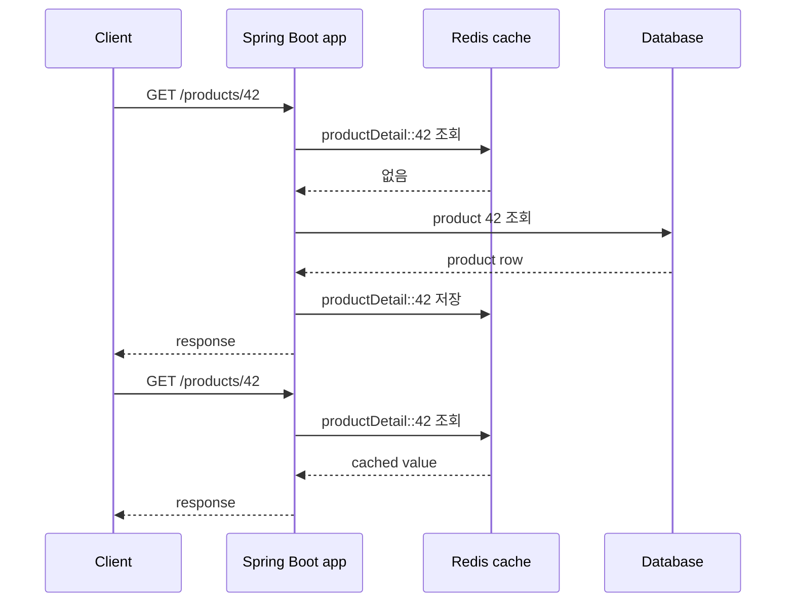
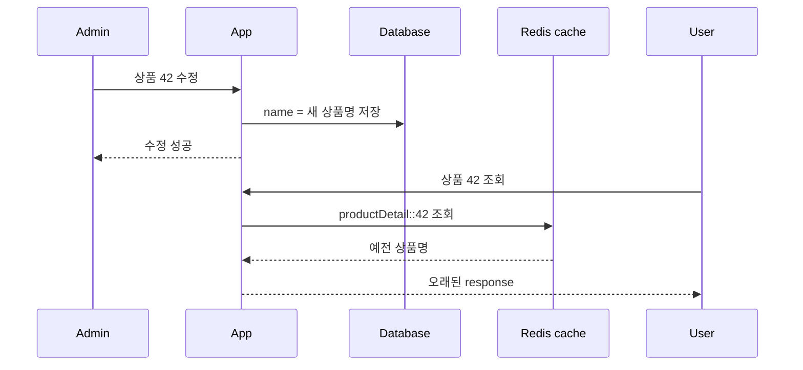
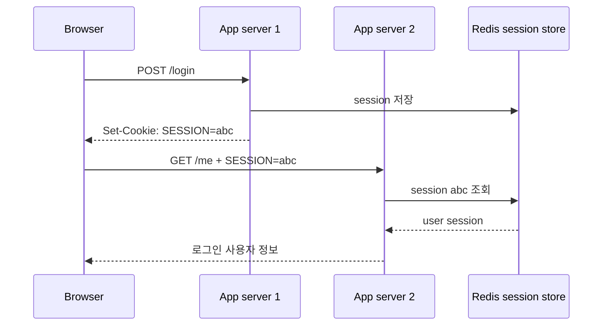
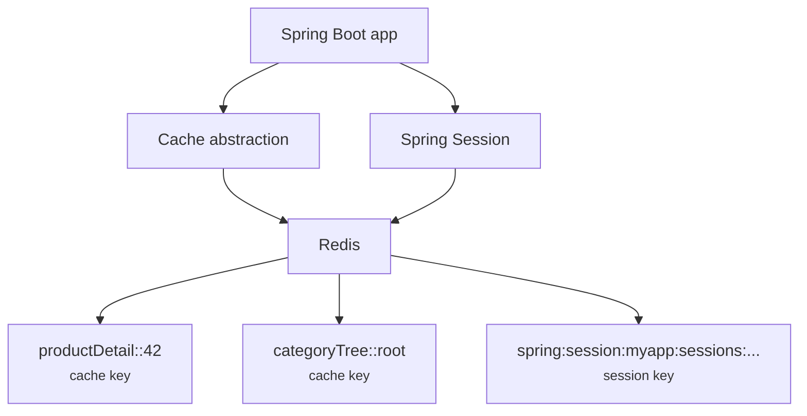
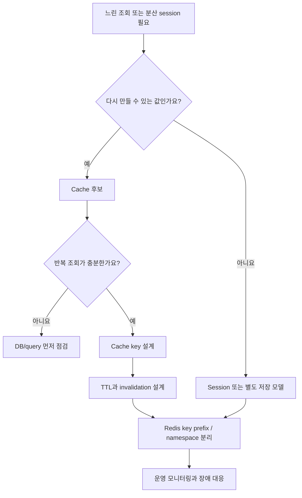

# Redis cache와 session은 왜 성능을 올리면서 버그도 만들까요?

> DB를 덜 읽게 만들었는데, 사용자는 방금 바꾼 값이 안 보인다고 해요.

지난 글에서는 복잡한 query를 어떻게 표현할지 봤어요. Querydsl, Specification, `@Query`를 고르는 이유도 결국은 "DB에서 어떤 데이터를 어떻게 읽을까"였죠.

그런데 서비스를 운영하다 보면 query를 아무리 잘 써도 이런 순간이 와요.

> "이 화면은 너무 자주 조회되는데, 매번 DB까지 가야 하나요?"

그래서 cache를 붙여요. Redis를 넣고, 자주 읽는 값을 잠깐 보관하고, DB 부하를 줄여요. 또 서버가 여러 대가 되면 session도 Redis로 옮기고 싶어져요. 한 서버에만 로그인 정보가 있으면 load balancer 뒤에서 요청이 흔들릴 수 있으니까요.

처음에는 둘 다 비슷해 보여요.

- cache도 Redis에 저장해요.
- session도 Redis에 저장해요.
- 둘 다 TTL이 있어요.
- 둘 다 빠른 key-value 저장소를 써요.

근데요, **cache와 session은 Redis를 같이 쓴다고 같은 의미가 아니에요.** Cache는 "없어도 다시 만들 수 있는 값"에 가깝고, session은 "사용자의 현재 상태"에 가까워요. 이 차이를 놓치면 성능을 올리려다 오래된 데이터, 강제 로그아웃, memory 증가, key 충돌 같은 버그를 만들 수 있어요.

!!! note "이 글의 기준"
    이 글은 Spring Boot 4.0.3의 Redis cache auto-configuration, Redis 연결 설정, Spring Session Redis 문서를 기준으로 작성했어요. 핵심 모델은 Spring Boot 3.x 프로젝트에서도 비슷하게 읽을 수 있지만, starter 이름과 세부 property는 프로젝트가 쓰는 Spring Boot/Spring Session 버전 문서를 확인하세요.

---

## Cache는 "정답"이 아니라 "다시 만들 수 있는 복사본"이에요

상품 상세 API가 있다고 해볼게요.

```http
GET /products/42
```

처음 요청은 DB에서 상품을 읽어요.

```java
package com.example.product;

import org.springframework.stereotype.Service;

@Service
public class ProductService {

    private final ProductRepository productRepository;

    public ProductService(ProductRepository productRepository) {
        this.productRepository = productRepository;
    }

    public ProductDetail getProduct(long productId) {
        Product product = productRepository.findById(productId)
                .orElseThrow(ProductNotFoundException::new);

        return ProductDetail.from(product);
    }
}
```

조회가 너무 많아지면 이렇게 생각할 수 있어요.

> "상품 정보는 자주 바뀌지 않으니까 Redis에 잠깐 넣어두면 되지 않을까요?"

Spring Cache abstraction을 쓰면 method 결과를 cache에 넣는 흐름을 만들 수 있어요.

```java
package com.example.product;

import org.springframework.cache.annotation.Cacheable;
import org.springframework.stereotype.Service;

@Service
public class ProductService {

    private final ProductRepository productRepository;

    public ProductService(ProductRepository productRepository) {
        this.productRepository = productRepository;
    }

    @Cacheable(cacheNames = "productDetail", key = "#productId")
    public ProductDetail getProduct(long productId) {
        Product product = productRepository.findById(productId)
                .orElseThrow(ProductNotFoundException::new);

        return ProductDetail.from(product);
    }
}
```

이제 첫 요청은 DB를 읽고, 다음 요청은 cache에서 바로 꺼낼 수 있어요.



이 그림에서 cache는 DB를 대체하지 않아요. DB에서 만든 응답의 복사본을 잠깐 들고 있을 뿐이에요. 그래서 cache 값은 지워져도 다시 만들 수 있어야 해요.

!!! tip "Cache에 넣을 수 있는지 묻는 첫 질문"
    "이 값이 Redis에서 사라져도 DB나 다른 원천 데이터로 다시 만들 수 있나요?"라고 물어보세요. 대답이 아니면 cache가 아니라 별도 저장 모델일 가능성이 커요.

---

## Redis CacheManager는 cache 이름과 key를 Redis key로 바꿔요

Spring Boot에서 Redis cache를 쓰려면 보통 Redis 연결과 cache provider가 준비되어야 해요. 개념적으로는 이런 설정이 들어가요.

```yaml
spring:
  data:
    redis:
      host: localhost
      port: 6379
  cache:
    cache-names: productDetail,categoryTree
    redis:
      time-to-live: 10m
```

`spring.data.redis.*`는 Redis 서버에 어떻게 연결할지 말해요. `spring.cache.*`는 cache abstraction이 어떤 cache를 만들고 어떻게 보관할지 말해요.

Spring Boot는 Redis가 cache provider로 선택될 수 있으면 `RedisCacheManager`를 준비할 수 있어요. 이때 cache 이름과 method key가 합쳐져 Redis key가 돼요.

```text
productDetail::42
categoryTree::root
```

Spring Boot 문서는 Redis cache에서 기본적으로 key prefix를 붙이며, cache 사이의 key 충돌을 막기 위해 이 설정을 유지하라고 권장해요. 예를 들어 `productDetail` cache의 `42`와 `categoryTree` cache의 `42`가 같은 Redis key가 되면 안 되겠죠.

| 설정 축 | 의미 |
|---|---|
| `spring.data.redis.host`, `port`, `url` | Redis에 어디로 연결할지 정해요 |
| `spring.cache.cache-names` | 시작 시 만들 cache 이름을 정할 수 있어요 |
| `spring.cache.redis.time-to-live` | cache entry가 얼마나 오래 살아 있을지 정해요 |
| key prefix | cache 이름끼리 Redis key가 겹치지 않게 막아요 |
| `RedisCacheConfiguration` bean | 직렬화 방식이나 기본 cache 설정을 더 세밀하게 바꿀 때 써요 |

처음에는 property로 충분한지 먼저 보세요. 모든 cache에 같은 TTL을 둘 수 있고, 기본 직렬화 전략을 그대로 써도 된다면 별도 configuration class를 크게 만들 필요가 없어요.

반대로 cache마다 TTL이 다르거나, JSON 직렬화 방식을 명확히 고정해야 하거나, key prefix 정책을 프로젝트 규칙으로 잡아야 한다면 `RedisCacheConfiguration`을 직접 다루는 단계로 넘어가요.

---

## Cache bug의 절반은 "언제 지울지"에서 나와요

Cache를 붙이면 읽기는 빨라질 수 있어요. 하지만 쓰기가 들어오는 순간 질문이 바뀌어요.

```http
PATCH /products/42
Content-Type: application/json

{
  "name": "새 상품명"
}
```

DB에는 새 상품명이 저장됐는데, Redis에는 예전 `ProductDetail`이 남아 있으면 어떻게 될까요? 사용자는 수정했는데 화면에는 예전 이름이 보일 수 있어요.



이 장면이 cache invalidation이에요. Cache에 값을 넣는 것보다 "언제 버릴지"가 더 어렵다는 말이 여기서 나와요.

Spring Cache abstraction에서는 보통 이런 Annotation을 만나요.

```java
package com.example.product;

import org.springframework.cache.annotation.CacheEvict;
import org.springframework.stereotype.Service;
import org.springframework.transaction.annotation.Transactional;

@Service
public class ProductCommandService {

    private final ProductRepository productRepository;

    public ProductCommandService(ProductRepository productRepository) {
        this.productRepository = productRepository;
    }

    @Transactional
    @CacheEvict(cacheNames = "productDetail", key = "#productId")
    public void changeName(long productId, String name) {
        Product product = productRepository.findById(productId)
                .orElseThrow(ProductNotFoundException::new);

        product.changeName(name);
    }
}
```

이 코드는 "상품 이름을 바꾸면 productDetail cache의 해당 key를 지운다"는 의도를 보여줘요. 다음 조회는 cache miss가 되고 DB에서 새 값을 읽어 다시 cache에 넣겠죠.

하지만 여기서도 실무 경계가 있어요.

| 질문 | 왜 중요한가요? |
|---|---|
| transaction commit 전에 cache를 지워도 되나요? | DB 변경이 rollback되면 cache와 DB가 잠깐 엇갈릴 수 있어요 |
| 하나의 변경이 여러 cache에 영향을 주나요? | 상세 cache, 목록 cache, 검색 cache가 각각 오래된 값을 가질 수 있어요 |
| TTL만 믿어도 되나요? | 오래된 값이 TTL 동안 계속 보일 수 있어요 |
| 값이 없는 결과도 cache하나요? | 존재하지 않는 상품 결과를 cache하면 나중에 생성된 값을 못 볼 수 있어요 |
| 여러 서버가 동시에 같은 key를 다시 만들면요? | cache stampede로 DB에 한꺼번에 요청이 몰릴 수 있어요 |

TTL은 안전망이지 정답이 아니에요. "10분 뒤에는 알아서 사라져요"는 "10분 동안은 틀린 값을 보여줄 수 있어요"와 같은 말일 수 있어요.

!!! warning "Cache는 consistency를 공짜로 주지 않아요"
    Cache를 붙이면 읽기 경로가 하나 더 생겨요. 그래서 쓰기 경로에서는 어떤 cache가 stale해질 수 있는지 같이 설계해야 해요.

---

## Session은 cache보다 사용자 상태에 가까워요

이번에는 로그인된 사용자를 생각해볼게요.

```http
POST /login
```

서버가 session을 만들고, browser에는 session id가 cookie로 내려가요.

```text
Set-Cookie: JSESSIONID=...
```

다음 요청부터 browser는 cookie를 보내고, 서버는 session id로 사용자를 찾아요.



Redis session을 쓰는 이유는 여기서 분명해져요. 서버가 여러 대여도 session이 특정 서버 memory에 묶이지 않아요. App server 1에서 로그인해도 App server 2가 같은 session을 읽을 수 있어요.

Spring Session은 servlet container의 `HttpSession` 저장 위치를 Redis 같은 외부 저장소로 바꿔주는 역할을 해요. Spring Boot와 함께 쓰면 보통 session timeout과 Redis session namespace 같은 설정을 보게 돼요.

```yaml
server:
  servlet:
    session:
      timeout: 30m

spring:
  session:
    redis:
      namespace: spring:session:myapp
      flush-mode: on_save
  data:
    redis:
      host: localhost
      port: 6379
```

여기서 cache TTL과 session timeout을 섞으면 안 돼요.

| 구분 | Cache | Session |
|---|---|---|
| 의미 | 다시 만들 수 있는 조회 결과 복사본 | 사용자의 현재 상태 |
| 사라지면 | 다시 계산하거나 DB에서 읽을 수 있어야 해요 | 사용자는 로그아웃되거나 상태를 잃을 수 있어요 |
| 대표 설정 | `spring.cache.redis.time-to-live` | `server.servlet.session.timeout`, `spring.session.redis.*` |
| key 경계 | cache name과 key prefix | session namespace |
| 주된 위험 | stale data, invalidation 누락, stampede | 강제 로그아웃, session fixation, 저장 크기 증가 |

Session은 "cache처럼 빠르게 넣어두는 값"이 아니에요. 사용자가 지금 로그인되어 있는지, 장바구니를 어떤 방식으로 들고 있는지, OAuth2 login 상태를 어떻게 이어갈지 같은 흐름과 연결돼요.

---

## Redis 하나를 같이 써도 key 공간은 나눠야 해요

작은 프로젝트에서는 Redis 하나에 cache와 session을 같이 넣을 수 있어요. 하지만 같은 Redis를 쓴다는 말이 같은 key 정책을 써도 된다는 뜻은 아니에요.



이 그림처럼 물리적으로는 Redis 하나여도 논리적으로는 key 공간을 나눠서 봐야 해요. Cache는 cache name과 prefix로, session은 namespace로 나누는 식이에요.

실무에서는 아래 질문을 먼저 확인해요.

- cache와 session이 같은 Redis database를 써도 되나요?
- 운영에서 cache 전체 삭제를 해도 session은 남아야 하나요?
- session key를 지워야 하는 장애 대응과 cache key를 지워야 하는 장애 대응이 다르지 않나요?
- Redis memory eviction policy가 session까지 밀어내지는 않나요?
- cache TTL과 session timeout이 서로 다른 의도로 관리되고 있나요?

특히 Redis memory가 부족해져 eviction이 일어나면 cache는 성능 저하로 끝날 수 있지만, session은 사용자가 갑자기 로그아웃되는 문제로 보일 수 있어요. 그래서 규모가 커지면 cache용 Redis와 session용 Redis를 분리하거나, 최소한 key namespace, database, memory 정책, 모니터링을 분리해서 봐야 해요.

!!! warning "운영에서 `FLUSHDB`는 cache 청소 버튼이 아닐 수 있어요"
    같은 Redis database에 session이 들어 있다면 cache를 지우려던 명령이 모든 사용자의 session을 날릴 수 있어요. 운영 runbook에서는 어떤 key prefix를 지울지까지 명확해야 해요.

---

## Cache를 붙이기 전에 "느린 이유"를 먼저 확인해요

Redis는 빠르지만, Redis를 붙인다고 모든 성능 문제가 좋아지는 건 아니에요.

예를 들어 목록 API가 느린 이유가 N+1 query라면 cache로 잠깐 가릴 수는 있어요. 하지만 cache miss 때마다 여전히 느린 query가 터지고, 데이터가 자주 바뀌면 cache hit rate도 낮아요. 또 key가 사용자별, 권한별, 검색 조건별로 갈라지면 cache entry가 폭발할 수 있어요.

```text
productSearch::status=SALE&page=0&sort=latest
productSearch::status=SALE&page=1&sort=latest
productSearch::status=SOLD_OUT&page=0&sort=latest
productSearch::keyword=phone&page=0&sort=price
productSearch::user=17&status=SALE&page=0&sort=latest
```

이런 key는 만들 수 있어요. 하지만 정말 cache할 가치가 있는지는 별개예요.

| 먼저 볼 질문 | 이유 |
|---|---|
| 같은 key가 충분히 반복되나요? | 반복되지 않는 값은 cache hit가 낮아요 |
| 원본 query는 이미 적절히 튜닝됐나요? | cache miss가 느리면 장애 순간에 더 위험해요 |
| 데이터가 얼마나 자주 바뀌나요? | 자주 바뀌는 값은 invalidation 비용이 커요 |
| 사용자 권한에 따라 값이 달라지나요? | 다른 사용자의 결과가 섞이면 보안 버그가 돼요 |
| cache key가 요청 parameter를 정확히 반영하나요? | key가 빠뜨린 조건은 잘못된 응답으로 이어져요 |
| 값의 크기가 적당한가요? | 큰 object를 많이 넣으면 Redis memory와 network 비용이 커져요 |

처음에는 "어디에 cache를 넣을까?"보다 "어떤 응답이 반복되고, 원본은 어디서 느리고, 틀린 값을 얼마나 오래 보여줘도 되는가?"를 먼저 물어보는 편이 좋아요.

---

## 실무 코드 리뷰에서는 이 냄새를 먼저 봐요

Redis cache와 session은 붙인 순간부터 운영 도구가 돼요. 코드 리뷰에서는 Annotation이 있는지보다 경계를 먼저 봐야 해요.

| 냄새 | 의심할 지점 |
|---|---|
| `@Cacheable`은 있는데 수정 method에 `@CacheEvict`가 없음 | stale data가 오래 남을 수 있어요 |
| 목록 cache key가 `page`나 `sort`를 빠뜨림 | 서로 다른 요청이 같은 결과를 공유할 수 있어요 |
| 사용자별 권한 결과를 전역 cache에 넣음 | 다른 사용자에게 보이면 안 되는 데이터가 섞일 수 있어요 |
| TTL이 모두 똑같음 | 데이터 성격이 다른데 같은 만료 정책을 쓰고 있을 수 있어요 |
| Redis key prefix를 끔 | cache 이름끼리 key가 충돌할 수 있어요 |
| cache와 session이 같은 Redis인데 장애 대응 문서가 없음 | cache 삭제가 session 삭제가 될 수 있어요 |
| session에 너무 큰 객체를 넣음 | Redis memory와 network 비용이 커지고 배포 호환성이 나빠져요 |
| local 환경만 테스트하고 Redis 장애를 보지 않음 | Redis down, timeout, eviction 때 앱이 어떻게 보일지 몰라요 |

디버깅할 때는 질문을 이렇게 바꿔보세요.

- 이 응답은 DB에서 온 값인가요, cache에서 온 값인가요?
- cache key에 모든 요청 조건이 들어 있나요?
- 이 값을 바꾸는 쓰기 path는 어떤 cache를 지우나요?
- TTL 동안 틀린 값을 보여줘도 괜찮은 데이터인가요?
- Redis에 같은 prefix의 key가 얼마나 쌓이고 있나요?
- session timeout과 cache TTL을 서로 다른 의도로 관리하고 있나요?
- Redis 장애 때 사용자는 느린 응답을 보나요, 실패를 보나요, 로그아웃을 보나요?

이 질문이 있어야 Redis를 "빠른 저장소"가 아니라 "일관성과 상태 경계가 있는 운영 구성요소"로 볼 수 있어요.

---

## 처음에는 여기까지만 잡아도 충분해요

오늘 내용을 한 장으로 줄이면 이 흐름이에요.



이 그림의 핵심은 Redis 도입보다 데이터의 의미를 먼저 나누는 거예요. 다시 만들 수 있으면 cache 후보가 될 수 있고, 사용자의 현재 상태라면 session 경계와 timeout을 따로 봐야 해요.

그래서 Redis를 붙일 때는 항상 이렇게 물어보세요.

> "이 값은 없어져도 되는 복사본인가요, 아니면 사용자의 현재 상태인가요?"

이 질문 하나가 cache TTL, invalidation, session timeout, Redis 분리 전략을 한 줄로 연결해줘요.

---

## 참고한 링크

- [Spring Boot Reference: Caching](https://docs.spring.io/spring-boot/reference/io/caching.html)
- [Spring Boot Reference: Redis](https://docs.spring.io/spring-boot/reference/data/nosql.html#data.nosql.redis)
- [Spring Session Reference: HttpSession with Redis](https://docs.spring.io/spring-session/reference/guides/boot-redis.html)
- [Spring Session Reference: Redis Configuration](https://docs.spring.io/spring-session/reference/configuration/redis.html)

---

## 자, 정리해볼까요?

!!! abstract "오늘 우리가 배운 것"
    - Cache는 원본 데이터의 빠른 복사본이고, 사라져도 다시 만들 수 있어야 해요.
    - Spring Boot의 Redis cache는 `RedisCacheManager`, cache name, key prefix, TTL 설정을 중심으로 읽으면 돼요.
    - Cache의 핵심 위험은 값을 넣는 순간보다 stale data를 언제 지울지에서 나와요.
    - Session은 cache보다 사용자 상태에 가까워요. 사라지면 사용자는 로그아웃되거나 흐름을 잃을 수 있어요.
    - Cache TTL과 session timeout은 서로 다른 설정이고, 같은 Redis를 쓰더라도 key prefix와 namespace를 나눠야 해요.
    - Redis memory, eviction, 장애 대응은 cache와 session에서 서로 다른 사용자 증상으로 나타나요.
    - Redis를 붙이기 전에는 반복 조회, 원본 query 성능, key 설계, invalidation, 운영 runbook을 같이 확인해야 해요.

다음 글에서는 MongoDB, Elasticsearch, 그리고 NoSQL 경계를 볼 거예요. 문서형 저장소와 검색 엔진이 왜 "JPA보다 빠른 DB"가 아니라 다른 문제를 푸는 도구인지 이어서 살펴볼게요.
