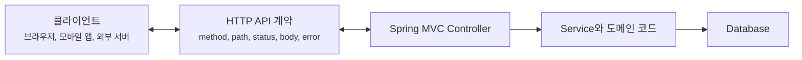
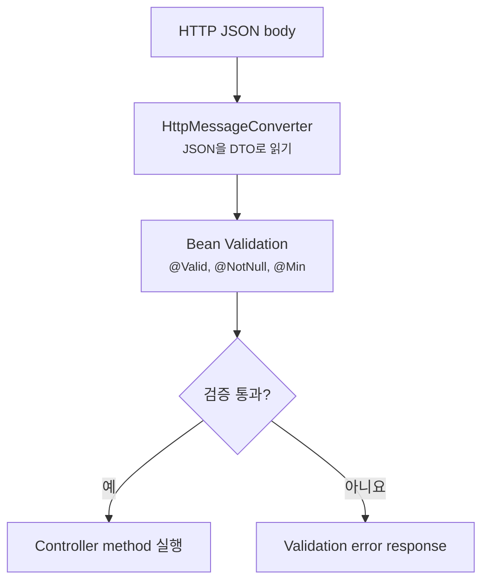
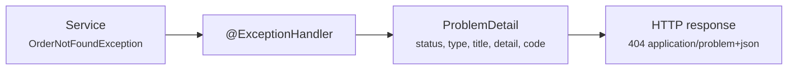

# REST API 설계와 에러 계약은 왜 컨트롤러 코드보다 먼저일까요?

> API는 서버 안의 메서드가 아니라, 서버 바깥의 누군가가 믿고 호출하는 약속이에요.

지난 글에서는 Spring MVC 요청이 `DispatcherServlet`을 지나 controller method로 도착하고, 반환값과 예외가 다시 HTTP 응답으로 바뀌는 흐름을 봤어요.

이제 그 흐름 위에 진짜 API를 올려볼게요.

처음에는 이런 controller를 만들기 쉬워요.

```java
package com.example.order;

import org.springframework.web.bind.annotation.PostMapping;
import org.springframework.web.bind.annotation.RequestBody;
import org.springframework.web.bind.annotation.RestController;

@RestController
public class OrderController {

    private final OrderService orderService;

    public OrderController(OrderService orderService) {
        this.orderService = orderService;
    }

    @PostMapping("/orders")
    public Order create(@RequestBody Order order) {
        return orderService.create(order);
    }
}
```

처음에는 간단해 보여요.

> "`POST /orders`로 주문 객체를 받고, 저장한 뒤 다시 돌려주면 되는 거 아닌가요?"

근데요, API를 쓰는 쪽에서는 바로 더 구체적인 질문을 하게 돼요.

> "필수값이 빠지면 어떤 status가 오나요?"  
> "에러 메시지는 사용자가 봐도 되는 문장인가요?"  
> "프론트엔드는 어떤 값으로 분기해야 하나요?"  
> "주문이 없을 때 404인가요, 200에 빈 body인가요?"  
> "필드 이름을 바꾸면 기존 앱은 깨지나요?"  
> "서버 내부 예외 class 이름이 응답으로 나가도 되나요?"

오늘은 controller method를 예쁘게 쓰는 법보다 한 단계 앞을 볼 거예요. **REST API 설계는 Java method signature가 아니라 클라이언트와 서버가 공유하는 HTTP 계약이에요.** Spring MVC는 `@RequestBody`, Bean Validation, `@ExceptionHandler`, `ProblemDetail`, message converter 같은 도구를 제공하지만, 어떤 요청과 응답을 약속할지는 우리가 먼저 정해야 해요.

!!! note "이 글의 기준"
    이 글은 Spring Boot 4.1.0과 Spring Framework 공식 문서의 Spring MVC, validation, error response 설명을 바탕으로 작성했어요. API 설계 원칙은 버전에 크게 묶이지 않지만, `ProblemDetail`, validation 예외, starter 이름, API versioning 설정처럼 구체적인 기능은 사용 중인 Spring Boot 버전 문서를 함께 확인하세요.

---

## API 계약은 "메서드 호출"이 아니에요

controller method만 보면 API가 Java 메서드처럼 느껴져요.

```java
@PostMapping("/orders")
public OrderResponse create(@RequestBody CreateOrderRequest request) {
    return orderService.create(request);
}
```

하지만 클라이언트가 보는 것은 Java method가 아니에요. 클라이언트가 보는 것은 HTTP 요청과 응답이에요.

```http
POST /orders HTTP/1.1
Content-Type: application/json
Accept: application/json

{
  "productId": 100,
  "quantity": 2
}
```

그리고 기대하는 응답은 이런 모양일 수 있어요.

```http
HTTP/1.1 201 Created
Location: /orders/42
Content-Type: application/json

{
  "id": 42,
  "status": "READY",
  "totalPrice": 15000
}
```

여기에는 이미 약속이 여러 개 들어 있어요.

| 약속 | 예시 |
|---|---|
| HTTP method | 주문 생성은 `POST /orders`로 해요 |
| 요청 body | `productId`, `quantity`를 JSON으로 받아요 |
| 성공 status | 새로 만들었으면 `201 Created`를 써요 |
| 성공 header | 생성된 자원 위치를 `Location`에 줄 수 있어요 |
| 성공 response | 내부 Entity가 아니라 클라이언트용 응답 DTO를 내려요 |
| 실패 response | 검증 실패, 권한 없음, 자원 없음, 충돌을 다른 status와 body로 표현해요 |

이 약속을 코드 안쪽에서만 생각하면 늦어요. service와 repository까지 다 만든 뒤에 response 모양을 바꾸려면 프론트엔드, 모바일 앱, 외부 연동, 테스트가 같이 흔들리거든요.



이 그림에서 API 계약은 controller 안에 숨어 있는 세부 구현이 아니에요. 서버 바깥과 서버 안쪽을 나누는 경계예요. 그래서 API 응답 모양을 바꾸는 일은 단순 리팩터링이 아니라 외부 약속을 바꾸는 일이 될 수 있어요.

---

## Entity를 그대로 주고받으면 처음에는 편하지만 오래가기 어려워요

처음 예제에서 controller가 `Order`를 그대로 받고 그대로 돌려줬죠.

```java
@PostMapping("/orders")
public Order create(@RequestBody Order order) {
    return orderService.create(order);
}
```

작은 예제에서는 편해요. 하지만 실제 프로젝트에서는 이 모양이 빨리 부담이 돼요.

| Entity를 API에 그대로 쓰면 | 왜 문제가 될까요? |
|---|---|
| DB 컬럼 구조가 응답에 드러나요 | 내부 저장 구조가 외부 계약이 돼요 |
| request와 response가 같은 모양이 돼요 | 생성할 때 받는 값과 조회할 때 보여줄 값은 다를 수 있어요 |
| 내부 필드를 숨기기 어려워요 | 원가, 내부 상태, 감사 필드가 노출될 수 있어요 |
| 필드 이름 변경이 어려워요 | DB나 도메인 리팩터링이 API breaking change가 돼요 |
| validation 위치가 흐려져요 | API 입력 검증과 도메인 규칙이 섞일 수 있어요 |

그래서 API 경계에는 보통 DTO를 둬요.

```java
package com.example.order.api;

import jakarta.validation.constraints.Min;
import jakarta.validation.constraints.NotNull;

public record CreateOrderRequest(
        @NotNull Long productId,
        @Min(1) int quantity
) {
}
```

```java
package com.example.order.api;

public record OrderResponse(
        Long id,
        String status,
        int totalPrice
) {
}
```

그리고 controller는 API DTO를 받고, service는 애플리케이션이 이해하는 명령으로 넘기는 식으로 경계를 나눌 수 있어요.

```java
package com.example.order.api;

import jakarta.validation.Valid;
import java.net.URI;
import org.springframework.http.ResponseEntity;
import org.springframework.web.bind.annotation.PostMapping;
import org.springframework.web.bind.annotation.RequestBody;
import org.springframework.web.bind.annotation.RequestMapping;
import org.springframework.web.bind.annotation.RestController;

@RestController
@RequestMapping("/orders")
public class OrderController {

    private final OrderService orderService;

    public OrderController(OrderService orderService) {
        this.orderService = orderService;
    }

    @PostMapping
    public ResponseEntity<OrderResponse> create(@Valid @RequestBody CreateOrderRequest request) {
        OrderResponse response = orderService.create(request);
        return ResponseEntity
                .created(URI.create("/orders/" + response.id()))
                .body(response);
    }
}
```

여기서 `ResponseEntity`는 status, header, body를 함께 표현하고 싶을 때 유용해요. 단순 조회처럼 항상 `200 OK`와 body만 있으면 DTO를 바로 return해도 되지만, 생성처럼 `201 Created`와 `Location` header를 명시하고 싶을 때는 응답 전체를 코드에 드러내는 편이 읽기 좋아요.

!!! tip "DTO는 복잡하게 만들자는 뜻이 아니에요"
    DTO는 "계층마다 파일을 늘리자"가 아니라 "외부 API 약속과 내부 모델을 분리하자"는 장치예요. 작은 API에서도 request DTO와 response DTO를 나누면 나중에 필드 추가, 숨김, 이름 변경을 더 안전하게 다룰 수 있어요.

---

## Validation은 service에 들어가기 전의 문지기예요

요청 body가 JSON에서 Java 객체로 바뀌었다고 해서 그 값이 의미 있는 값은 아니에요.

```json
{
  "productId": null,
  "quantity": 0
}
```

JSON 문법은 맞아요. DTO로도 만들 수 있어요. 하지만 주문 생성 요청으로는 이상하죠.

Spring MVC에서는 `@RequestBody`로 읽은 객체에 `@Valid`를 붙이면 Bean Validation 규칙을 적용할 수 있어요.

```java
import jakarta.validation.Valid;
import org.springframework.web.bind.annotation.RequestBody;

@PostMapping
public ResponseEntity<OrderResponse> create(@Valid @RequestBody CreateOrderRequest request) {
    OrderResponse response = orderService.create(request);
    return ResponseEntity.created(URI.create("/orders/" + response.id())).body(response);
}
```

```java
import jakarta.validation.constraints.Min;
import jakarta.validation.constraints.NotNull;

public record CreateOrderRequest(
        @NotNull Long productId,
        @Min(1) int quantity
) {
}
```

이때 검증은 controller method 본문에 들어오기 전에 실패할 수 있어요. 그러면 service는 호출되지 않고, Spring MVC의 예외 처리 흐름으로 넘어가요.



이 그림에서 중요한 건 validation이 비즈니스 규칙 전체를 대체하지 않는다는 점이에요. `quantity`가 1 이상인지, `productId`가 비어 있지 않은지 같은 입력 모양 검사는 DTO에서 빨리 걸러낼 수 있어요. 하지만 "이 상품이 지금 판매 가능한가", "이 사용자가 이 주문을 만들 권한이 있는가", "재고가 충분한가" 같은 규칙은 service나 domain 영역에서 판단해야 해요.

| 검증 위치 | 어울리는 질문 |
|---|---|
| DTO Bean Validation | 요청 값의 모양이 API 계약에 맞나요? |
| Service 또는 domain | 현재 시스템 상태에서 이 행동이 허용되나요? |
| Database constraint | 동시에 여러 요청이 와도 마지막 방어선이 지켜지나요? |

!!! warning "Validation이 안 먹으면 의존성부터 확인하세요"
    Bean Validation 구현체가 classpath에 있어야 검증이 동작해요. Spring Boot에서는 보통 `spring-boot-starter-validation`이 Hibernate Validator를 함께 올려줘요. `@Valid`를 붙였는데도 통과한다면 Annotation 위치, validation starter, nested object 구조를 같이 확인하세요.

조금 더 깊게 보면 Spring MVC의 validation 실패 예외는 method signature에 따라 달라질 수 있어요. `@RequestBody`나 `@ModelAttribute` 단일 객체 검증에서는 `MethodArgumentNotValidException`을 볼 수 있고, controller method parameter 자체에 `@Min`, `@NotBlank` 같은 제약을 붙인 경우에는 method validation 흐름에서 `HandlerMethodValidationException`을 볼 수 있어요.

처음에는 이름을 외울 필요까지는 없어요. 다만 error handler를 만들 때 "검증 실패는 한 종류의 예외만 온다"고 단정하면 빠지는 경우가 생겨요.

---

## 에러 응답은 나중에 대충 맞추면 안 돼요

성공 응답만 있으면 API는 반쪽이에요. 실제 클라이언트 코드는 실패를 더 자주 신경 써야 해요.

예를 들어 주문 조회 API가 있다고 해볼게요.

```http
GET /orders/999 HTTP/1.1
Accept: application/json
```

없는 주문이면 이런 응답을 줄 수 있어요.

```http
HTTP/1.1 404 Not Found
Content-Type: application/problem+json

{
  "type": "https://api.example.com/problems/order-not-found",
  "title": "Order not found",
  "status": 404,
  "detail": "주문을 찾을 수 없어요.",
  "instance": "/orders/999",
  "code": "ORDER_NOT_FOUND"
}
```

여기서 클라이언트가 믿을 수 있는 값은 무엇일까요?

| 필드 | 클라이언트가 읽는 의미 |
|---|---|
| HTTP status `404` | 요청한 자원이 없어요 |
| `type` | 이 에러 종류를 설명하는 안정적인 식별자예요 |
| `title` | 에러 종류의 짧은 제목이에요 |
| `detail` | 이번 요청에서 보여줄 수 있는 설명이에요 |
| `instance` | 문제가 발생한 요청 위치예요 |
| `code` | 프론트엔드나 앱이 분기하기 쉬운 서비스 내부 에러 코드예요 |

Spring Framework는 RFC 9457 형식의 문제 상세 응답을 표현하는 `ProblemDetail`을 제공해요. Spring Boot에서는 `spring.mvc.problemdetails.enabled=true`로 Spring MVC 기본 예외에 대한 Problem Details 지원을 켤 수 있고, 직접 `@ControllerAdvice`를 만들어 애플리케이션 예외를 원하는 계약으로 바꿀 수도 있어요.

```yaml
spring:
  mvc:
    problemdetails:
      enabled: true
```

애플리케이션 예외는 이렇게 중앙에서 바꿀 수 있어요.

```java
package com.example.order.api;

import java.net.URI;
import org.springframework.http.HttpStatus;
import org.springframework.http.ProblemDetail;
import org.springframework.web.bind.annotation.ExceptionHandler;
import org.springframework.web.bind.annotation.RestControllerAdvice;

@RestControllerAdvice
public class ApiExceptionHandler {

    @ExceptionHandler(OrderNotFoundException.class)
    public ProblemDetail handleOrderNotFound(OrderNotFoundException exception) {
        ProblemDetail problem = ProblemDetail.forStatusAndDetail(
                HttpStatus.NOT_FOUND,
                "주문을 찾을 수 없어요."
        );
        problem.setType(URI.create("https://api.example.com/problems/order-not-found"));
        problem.setTitle("Order not found");
        problem.setProperty("code", "ORDER_NOT_FOUND");
        return problem;
    }
}
```

이 코드는 "예외가 나면 JSON을 만든다"보다 더 구체적인 일을 해요. Java exception을 HTTP status와 공개 가능한 error body로 번역해요.



이 그림의 핵심은 exception class가 그대로 외부 계약이 되지 않는다는 점이에요. 내부에서는 `OrderNotFoundException`을 쓰더라도, 외부에는 `404`와 `ORDER_NOT_FOUND` 같은 안정적인 약속으로 보여줄 수 있어요.

!!! warning "에러 메시지를 클라이언트 분기 기준으로 쓰지 마세요"
    `detail` 문장은 바뀔 수 있어요. 번역될 수도 있고, 더 친절하게 고칠 수도 있어요. 앱 로직이 분기해야 한다면 `code`처럼 안정적인 값을 따로 두는 편이 좋아요.

---

## Status code는 장식이 아니라 계약의 일부예요

REST API에서 status code는 "성공인지 실패인지"만 말하지 않아요. 실패했을 때 누가 무엇을 고쳐야 하는지도 알려줘요.

| 상황 | 흔한 status | 읽는 법 |
|---|---|---|
| 조회 성공 | `200 OK` | 요청한 표현을 body로 받았어요 |
| 생성 성공 | `201 Created` | 새 자원이 만들어졌고 위치를 알려줄 수 있어요 |
| body 없는 성공 | `204 No Content` | 성공했지만 돌려줄 body는 없어요 |
| JSON 문법 오류 | `400 Bad Request` | 요청 자체를 해석할 수 없어요 |
| validation 실패 | `400 Bad Request` | 요청 형식은 읽었지만 값이 계약에 맞지 않아요 |
| 인증 필요 | `401 Unauthorized` | 로그인이나 token 확인이 필요해요 |
| 권한 없음 | `403 Forbidden` | 누구인지는 알지만 이 행동은 허용되지 않아요 |
| 자원 없음 | `404 Not Found` | 요청한 자원을 찾지 못했어요 |
| 상태 충돌 | `409 Conflict` | 현재 자원 상태 때문에 요청을 수행할 수 없어요 |
| 지원하지 않는 media type | `415 Unsupported Media Type` | `Content-Type`을 처리할 수 없어요 |
| 서버 내부 오류 | `500 Internal Server Error` | 클라이언트가 고칠 수 없는 서버 문제예요 |

모든 실패를 `200 OK`로 감싸고 body 안에 `success: false`를 넣는 방식은 처음에는 편해 보일 수 있어요. 하지만 HTTP cache, client library, monitoring, gateway, retry 정책은 status code를 먼저 봐요. status를 무시하면 HTTP가 이미 제공하는 신호를 잃어버리게 돼요.

반대로 status code만으로 충분하지도 않아요.

```http
HTTP/1.1 400 Bad Request
```

이것만 받으면 클라이언트는 무엇을 고쳐야 하는지 몰라요. 그래서 status code와 error body를 함께 설계해야 해요.

| HTTP status | error body에서 보강할 것 |
|---|---|
| `400` | 어떤 field가 왜 틀렸는지 |
| `404` | 어떤 자원 종류를 찾지 못했는지 |
| `409` | 어떤 현재 상태와 충돌했는지 |
| `500` | 내부 정보 없이 추적 가능한 request id나 일반 메시지 |

실무에서는 500 응답이 특히 중요해요. stack trace, SQL, 내부 class name, secret 값이 밖으로 나가면 안 돼요. 클라이언트에게는 일반적인 메시지와 추적 가능한 식별자를 주고, 자세한 내용은 서버 로그와 tracing에서 찾는 편이 안전해요.

---

## Validation error는 필드 단위로 읽을 수 있어야 해요

검증 실패 응답은 "잘못된 요청입니다"만으로 부족해요. 사용자가 고칠 수 있는 화면이라면 어떤 필드가 왜 틀렸는지 알려줘야 해요.

예를 들어 이런 요청이 왔다고 해볼게요.

```json
{
  "productId": null,
  "quantity": 0
}
```

응답은 이런 식으로 만들 수 있어요.

```json
{
  "type": "https://api.example.com/problems/validation-failed",
  "title": "Validation failed",
  "status": 400,
  "detail": "요청 값이 올바르지 않아요.",
  "code": "VALIDATION_FAILED",
  "invalidParams": [
    {
      "name": "productId",
      "reason": "상품 ID는 필수예요."
    },
    {
      "name": "quantity",
      "reason": "수량은 1 이상이어야 해요."
    }
  ]
}
```

여기서 `invalidParams`는 RFC 9457의 기본 필드는 아니에요. 하지만 `ProblemDetail`은 표준 필드 외의 속성을 추가할 수 있어요. 중요한 건 "추가해도 된다"가 아니라 "추가한 모양도 계약으로 관리해야 한다"예요.

검증 에러를 설계할 때는 이 질문을 먼저 해보면 좋아요.

| 질문 | 이유 |
|---|---|
| field 이름은 request JSON 이름과 같나요? | 화면이 어떤 입력칸을 표시할지 알아야 해요 |
| message는 사용자에게 보여줄 문장인가요? | 내부 개발자용 문장과 사용자 안내 문장은 달라요 |
| code는 field별로 필요한가요? | 다국어 처리나 화면 분기에 필요할 수 있어요 |
| nested object와 list index는 어떻게 표현하나요? | `items[0].quantity` 같은 위치 표현이 필요할 수 있어요 |
| 같은 API에서 항상 같은 shape인가요? | 클라이언트 parser가 안정적으로 동작해야 해요 |

!!! note "처음에는 작게 시작해도 돼요"
    모든 에러에 거대한 구조를 만들 필요는 없어요. 다만 한 번 공개한 field 이름, status, error code는 클라이언트가 의존할 수 있으니 신중하게 잡아야 해요.

---

## Error contract는 한곳에서 관리해야 해요

controller마다 직접 `try-catch`를 쓰면 금방 모양이 갈라져요.

```java
@GetMapping("/{id}")
public ResponseEntity<?> find(@PathVariable Long id) {
    try {
        return ResponseEntity.ok(orderService.find(id));
    } catch (OrderNotFoundException exception) {
        return ResponseEntity.status(404).body(Map.of("message", exception.getMessage()));
    }
}
```

이 방식은 작은 예제에서는 바로 보이지만, API가 늘어나면 이런 문제가 생겨요.

| 흩어진 예외 처리 | 나중에 생기는 문제 |
|---|---|
| controller마다 body 모양이 달라요 | 클라이언트가 API마다 다른 parser를 가져야 해요 |
| status 기준이 흔들려요 | 같은 상황이 어떤 곳은 400, 어떤 곳은 409가 돼요 |
| 내부 메시지가 새어나가요 | exception message가 그대로 외부에 노출돼요 |
| 공통 필드를 붙이기 어려워요 | request id, error code, timestamp 정책이 흩어져요 |

그래서 API error contract는 `@RestControllerAdvice` 같은 공통 경계에 모으는 편이 좋아요.

```java
@RestControllerAdvice
public class ApiExceptionHandler {

    @ExceptionHandler(OrderNotFoundException.class)
    public ProblemDetail handleOrderNotFound(OrderNotFoundException exception) {
        ProblemDetail problem = ProblemDetail.forStatusAndDetail(
                HttpStatus.NOT_FOUND,
                "주문을 찾을 수 없어요."
        );
        problem.setType(URI.create("https://api.example.com/problems/order-not-found"));
        problem.setTitle("Order not found");
        problem.setProperty("code", "ORDER_NOT_FOUND");
        return problem;
    }

    @ExceptionHandler(DuplicateOrderException.class)
    public ProblemDetail handleDuplicateOrder(DuplicateOrderException exception) {
        ProblemDetail problem = ProblemDetail.forStatusAndDetail(
                HttpStatus.CONFLICT,
                "이미 처리 중인 주문이에요."
        );
        problem.setType(URI.create("https://api.example.com/problems/duplicate-order"));
        problem.setTitle("Duplicate order");
        problem.setProperty("code", "DUPLICATE_ORDER");
        return problem;
    }
}
```

처음에는 여기까지만 해도 충분해요. 더 커지면 error code enum, message resolver, request id, 다국어 message, 보안 로그 정책을 추가할 수 있어요. 하지만 그때도 원칙은 같아요.

> 내부 예외를 외부 계약으로 번역하는 경계는 흩어뜨리지 않는다.

---

## API versioning은 URL 숫자보다 "바꿔도 되는 것"을 정하는 일이에요

API 설계를 하다 보면 곧 versioning 이야기가 나와요.

```http
GET /v1/orders/42
```

혹은 header를 쓸 수도 있어요.

```http
GET /orders/42 HTTP/1.1
X-Version: 1.0.0
```

Spring Boot 4.1 문서에는 Spring MVC API versioning을 property나 `WebMvcConfigurer`로 설정할 수 있는 흐름이 나와요. 예를 들어 header 기반 version을 쓸 수 있어요.

```yaml
spring:
  mvc:
    apiversion:
      default: 1.0.0
      use:
        header: X-Version
```

하지만 versioning에서 더 중요한 질문은 "숫자를 어디에 둘까?"가 아니에요.

> 어떤 변경을 기존 클라이언트에게 깨지는 변경으로 볼 것인가?

예를 들어 이런 변경들은 조심해야 해요.

| 변경 | 기존 클라이언트 영향 |
|---|---|
| response field 제거 | 기존 parser나 화면이 깨질 수 있어요 |
| field 타입 변경 | 숫자에서 문자열로 바뀌면 역직렬화가 실패할 수 있어요 |
| error code 이름 변경 | 클라이언트 분기 로직이 깨질 수 있어요 |
| validation 규칙 강화 | 이전에는 되던 요청이 실패할 수 있어요 |
| status code 변경 | retry, monitoring, gateway 정책이 달라질 수 있어요 |

반대로 response에 optional field를 추가하는 일은 대체로 덜 위험해요. 그래도 클라이언트가 unknown field를 어떻게 처리하는지 확인해야 해요. JSON은 느슨해 보여도, 각 클라이언트의 parser 설정은 다를 수 있거든요.

!!! tip "버전 숫자는 정책을 대신하지 못해요"
    `/v2`를 붙여도 어떤 변경이 breaking change인지 팀이 합의하지 않으면 같은 문제가 반복돼요. field 제거, 타입 변경, error code 변경, validation 강화 같은 기준을 먼저 정하세요.

---

## 실무에서는 문서와 테스트가 계약을 붙잡아줘야 해요

API 계약은 말로만 정하면 금방 흐려져요. 코드가 바뀌고, 예외가 추가되고, 화면 요구사항이 바뀌면 "원래 어떤 응답이었지?"가 애매해져요.

그래서 최소한 이 셋은 같이 잡는 편이 좋아요.

| 붙잡을 것 | 예시 |
|---|---|
| API 문서 | endpoint, request, response, error code, status |
| MVC test | controller가 계약대로 status와 body를 내는지 |
| error code 목록 | 클라이언트가 분기할 안정적인 값 |

예를 들어 controller test에서는 service 내부 구현보다 HTTP 계약을 확인하는 편이 좋아요.

```java
mockMvc.perform(post("/orders")
        .contentType(MediaType.APPLICATION_JSON)
        .content("""
                {
                  "productId": null,
                  "quantity": 0
                }
                """))
        .andExpect(status().isBadRequest())
        .andExpect(jsonPath("$.code").value("VALIDATION_FAILED"))
        .andExpect(jsonPath("$.invalidParams[0].name").exists());
```

이 테스트는 "어떤 validator class가 호출됐는가"보다 "클라이언트가 어떤 실패 응답을 받는가"를 붙잡아요. API 경계에서는 이 관점이 더 오래 버텨요.

나중에 `springdoc-openapi`를 붙이면 문서를 자동 생성할 수 있고, contract test를 붙이면 외부 연동까지 더 강하게 확인할 수 있어요. 하지만 자동 문서 도구도 계약을 대신 정해주지는 않아요. 먼저 status, body, error code, versioning 정책이 있어야 도구가 그 정책을 보여줄 수 있어요.

---

## 처음에는 여기까지만 잡아도 충분해요

REST API 설계는 멋진 URL 이름을 짓는 일만은 아니에요. Spring MVC controller method를 만들기 전에, 클라이언트가 믿고 사용할 요청과 응답의 모양을 정하는 일이에요.

처음에는 이 정도만 지켜도 좋아요.

| 초반 원칙 | 이유 |
|---|---|
| request DTO와 response DTO를 나눠요 | 입력과 출력의 변화 속도가 달라요 |
| 성공 status를 의도적으로 정해요 | `200`, `201`, `204`는 다른 약속이에요 |
| validation 실패 응답 모양을 정해요 | 사용자가 무엇을 고칠지 알아야 해요 |
| 에러에는 안정적인 `code`를 둬요 | 메시지보다 code가 분기 기준으로 안전해요 |
| 예외 처리는 공통 경계에 모아요 | API마다 에러 모양이 갈라지는 것을 막아요 |
| 내부 예외와 외부 응답을 분리해요 | 구현 변경이 API breaking change가 되지 않게 해요 |

조금 더 깊게 보면 이런 원칙이 남아요.

> REST API 계약은 Spring MVC가 자동으로 만들어주는 게 아니라, 우리가 정한 HTTP 경계를 Spring MVC 도구로 구현하는 거예요.

---

## 참고한 링크

- [Spring Framework Reference - Error Responses](https://docs.spring.io/spring-framework/reference/web/webmvc/mvc-ann-rest-exceptions.html)
- [Spring Framework Reference - Validation](https://docs.spring.io/spring-framework/reference/web/webmvc/mvc-controller/ann-validation.html)
- [Spring Boot Reference - Servlet Web Applications](https://docs.spring.io/spring-boot/reference/web/servlet.html)
- [Spring Boot Reference - Validation](https://docs.spring.io/spring-boot/reference/io/validation.html)
- [Spring Boot Reference - Build Systems](https://docs.spring.io/spring-boot/reference/using/build-systems.html)

---

## 자, 정리해볼까요?

!!! abstract "오늘 우리가 배운 것"
    - REST API는 controller method가 아니라 클라이언트와 서버가 공유하는 HTTP 계약이에요.
    - Entity를 API에 그대로 노출하면 내부 모델 변경이 외부 breaking change가 되기 쉬워요.
    - Bean Validation은 요청 값의 기본 모양을 service 앞에서 걸러주는 문지기예요.
    - Problem Details는 status, type, title, detail, instance 같은 표준 필드로 에러 응답을 표현하는 방식이에요.
    - 에러 메시지는 바뀔 수 있으니 클라이언트 분기에는 안정적인 error code를 두는 편이 좋아요.
    - API versioning은 숫자를 어디에 둘지보다 어떤 변경을 breaking change로 볼지 정하는 일이 먼저예요.

다음 글에서는 JSON 변환 자체를 더 깊게 볼 거예요. Spring Boot 4.x의 Jackson 3 방향, Jackson 2를 쓰던 프로젝트에서 만날 수 있는 차이, 날짜와 enum과 unknown field가 왜 API 호환성 문제로 이어지는지 살펴볼게요.
