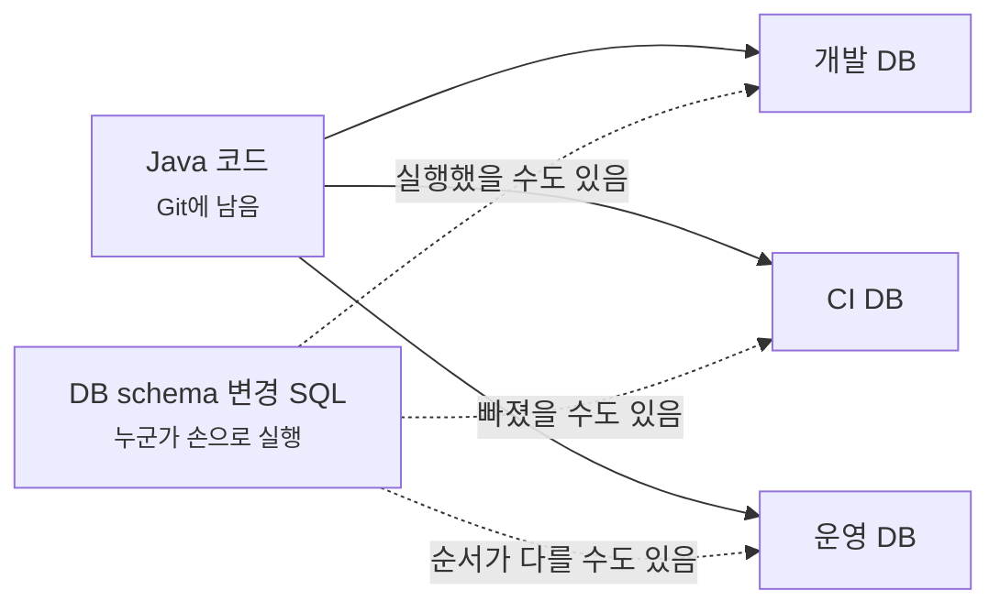
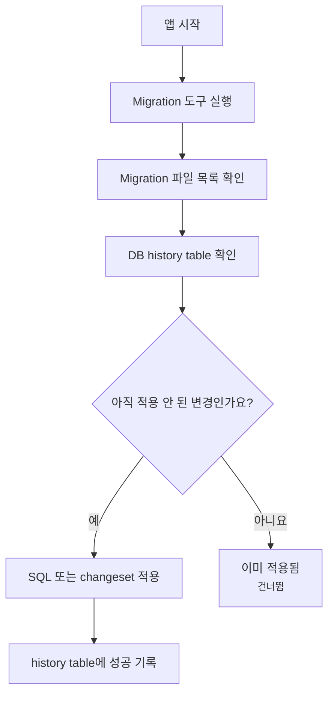
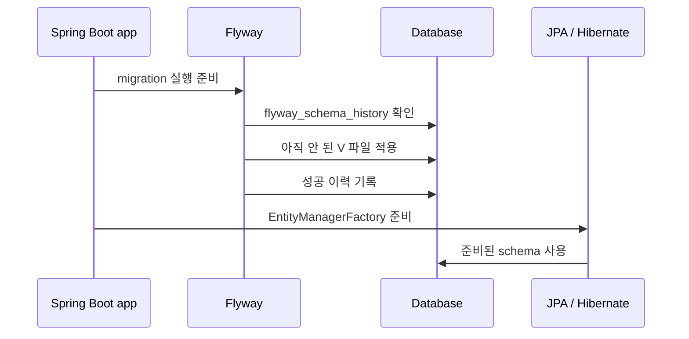
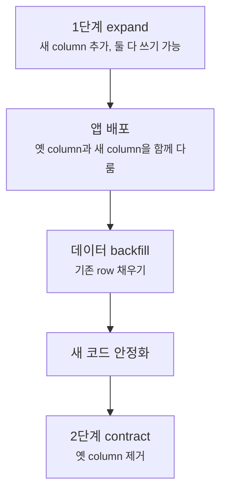
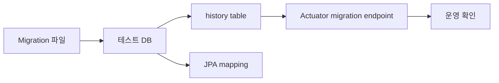
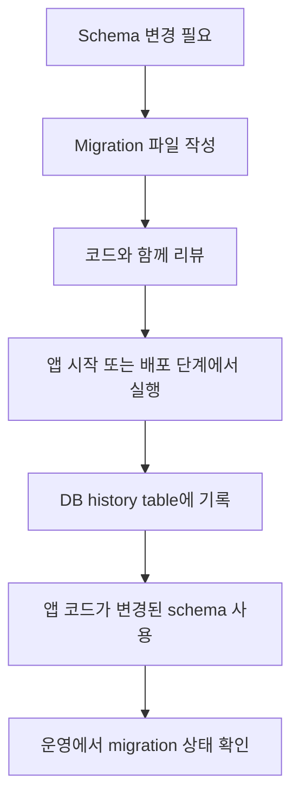

# Schema migration은 왜 Flyway와 Liquibase로 관리할까요?

> 컬럼 하나 추가했을 뿐인데, 어떤 서버는 뜨고 어떤 서버는 실패해요.

지난 글에서는 transaction 경계가 어디서 시작하고 어디서 commit되거나 rollback되는지 봤어요. 오늘은 그 transaction이 기대고 있는 바닥을 볼게요. 바로 database schema예요.

처음에는 schema 변경을 이렇게 생각하기 쉬워요.

> "테이블 하나 만들고, 컬럼 하나 추가하는 SQL이면 끝 아닌가요?"

혼자 개발할 때는 그럴 수 있어요. 그런데 팀 프로젝트와 운영 환경으로 가면 질문이 바뀌어요.

- 이 SQL은 누가, 언제, 어느 DB에 실행했나요?
- 개발 DB에는 있는데 운영 DB에는 없는 column을 코드가 읽으면 어떻게 되나요?
- 이미 운영 데이터가 있는데 `not null` column을 바로 추가해도 되나요?
- 서버 여러 대가 동시에 뜰 때 migration은 몇 번 실행되나요?
- 실패한 migration은 다시 실행해도 안전한가요?
- rollback은 코드를 이전 버전으로 돌리는 것과 같은 의미인가요?

오늘 목표는 Flyway와 Liquibase의 옵션을 많이 외우는 게 아니에요. **schema 변경도 애플리케이션 코드처럼 순서와 이력을 가진 배포 artifact**라는 감각을 잡는 거예요.

!!! note "이 글의 기준"
    이 글은 Spring Boot 4.x의 database initialization, Flyway, Liquibase 통합 문서와 Flyway/Liquibase의 migration 개념을 기준으로 작성했어요. Spring Boot 3.x 프로젝트에서도 "migration 파일을 version control에 넣고, 실행 이력을 DB에 남기고, JPA보다 먼저 적용한다"는 핵심 모델은 비슷하게 읽으면 돼요. 다만 starter 이름, 세부 property, 사용하는 migration 도구 버전은 프로젝트의 Spring Boot 버전 문서를 함께 확인하세요.

---

## 문제는 SQL이 아니라 "누가 실행했는지 모르는 SQL"이에요

Todo API가 처음에는 memory repository를 쓰다가 이제 DB를 쓰기로 했다고 해볼게요. 필요한 table은 단순해 보여요.

```sql
create table todos (
    id bigint generated by default as identity primary key,
    title varchar(200) not null,
    done boolean not null,
    created_at timestamp not null
);
```

처음 개발자는 이 SQL을 로컬 DB에 직접 실행해요. 잘 돼요. 테스트도 통과해요.

그런데 다음 개발자가 프로젝트를 clone하면 어떨까요? 로컬 DB에는 `todos` table이 없어요. CI는 어떨까요? 새 DB에서 테스트를 돌리면 table이 없어요. 운영 배포는요? 운영 DB에는 예전 table만 있고 새 column은 없을 수 있어요.

이때 문제는 `create table` SQL 자체가 어려운 게 아니에요. **그 SQL이 프로젝트의 일부로 남아 있지 않다**는 게 문제예요.



이 그림에서 Java 코드는 모든 환경에 같은 방식으로 전달되지만, schema 변경은 사람 손에 흩어져 있어요. 그래서 "내 컴퓨터에서는 됐는데 서버에서는 table이 없어요" 같은 문제가 생겨요.

Migration 도구는 이 흩어진 SQL을 프로젝트 안으로 다시 데려와요.

---

## Migration 파일은 DB를 위한 commit history에 가까워요

Git commit이 Java 코드 변경 이력을 남기듯이, schema migration은 DB 구조 변경 이력을 남겨요.

예를 들어 Flyway를 쓰면 보통 이런 파일을 만들어요.

```text
src/main/resources/
└── db/
    └── migration/
        ├── V1__create_todos_table.sql
        ├── V2__add_due_date_to_todos.sql
        └── V3__create_todo_tags_table.sql
```

`V1`, `V2`, `V3`는 실행 순서예요. 뒤의 설명은 사람이 읽기 위한 이름이에요. Spring Boot가 Flyway를 auto-configuration하면 기본 위치인 `classpath:db/migration`에서 이런 migration script를 찾아 실행할 수 있어요.

첫 파일은 이렇게 생길 수 있어요.

```sql
-- src/main/resources/db/migration/V1__create_todos_table.sql
create table todos (
    id bigint generated by default as identity primary key,
    title varchar(200) not null,
    done boolean not null,
    created_at timestamp not null
);
```

여기서 중요한 건 "앱 시작 때 SQL을 한 번 실행한다"가 아니에요. Migration 도구는 이미 적용된 파일을 DB 안의 history table에 기록해요. Flyway는 기본적으로 `flyway_schema_history` table을 사용하고, Liquibase는 `DATABASECHANGELOG`와 lock table을 사용해요.



이 흐름 덕분에 새 환경에서는 `V1`, `V2`, `V3`가 순서대로 실행되고, 이미 적용된 운영 DB에서는 새 migration만 실행돼요. 사람의 기억이 아니라 DB 안의 이력으로 판단하는 거예요.

!!! tip "Migration 파일은 실행 결과보다 실행 약속에 가까워요"
    중요한 건 "내가 방금 DB에 SQL을 쳤다"가 아니라 "이 프로젝트는 이 순서로 schema를 바꾼다"를 Git과 DB history에 같이 남기는 거예요.

---

## JPA의 `ddl-auto`와 migration은 맡은 일이 달라요

Spring Boot와 JPA를 쓰다 보면 `spring.jpa.hibernate.ddl-auto=update` 같은 설정을 먼저 만날 수 있어요. 그래서 이런 생각을 하기 쉬워요.

> "JPA가 Entity 보고 table을 맞춰주면 Flyway나 Liquibase가 필요 없지 않나요?"

개발 초반에는 편할 수 있어요. Entity를 바꾸면 로컬 DB에 table이나 column이 생기는 모습을 빨리 볼 수 있거든요. 하지만 운영 schema 변경을 맡기기에는 기대가 너무 달라요.

| 기준 | JPA schema generation | Flyway / Liquibase migration |
|---|---|---|
| 출발점 | 현재 Entity model | versioned migration 파일 |
| 관심사 | 현재 객체 구조와 DB 구조 맞추기 | 언제 어떤 변경을 적용했는지 기록하기 |
| 리뷰 단위 | Java Entity diff 중심 | SQL 또는 changeset diff 중심 |
| 운영 배포 | 의도하지 않은 변경이 섞일 위험이 큼 | 변경 파일을 명시적으로 검토 가능 |
| 실패 추적 | 어떤 변경이 실행됐는지 흐릴 수 있음 | history table에서 적용 상태 확인 |

예를 들어 Entity에 `dueDate` field를 추가했다고 해볼게요. 개발자는 "column이 하나 추가되면 되겠지"라고 생각해요. 하지만 운영 DB에는 이미 수백만 row가 있을 수 있어요.

```java
public class Todo {

    private Long id;
    private String title;
    private boolean done;
    private LocalDate dueDate;
}
```

여기서 운영 migration은 단순히 column을 만드는 문제를 넘어가요.

- 기존 row의 `due_date`는 어떤 값이어야 하나요?
- nullable로 먼저 추가하고 나중에 `not null`로 바꿔야 하나요?
- index가 필요하다면 언제 만들고, lock은 얼마나 잡히나요?
- 오래된 서버 코드와 새 DB schema가 잠깐 같이 살아도 되나요?
- 되돌릴 때 column을 바로 drop해도 데이터 손실이 괜찮나요?

이 질문들은 Entity만 보고 자동으로 결정하기 어려워요. 그래서 운영에서는 schema 변경을 별도 migration 파일로 명시하고, 코드 리뷰와 배포 계획의 일부로 다루는 편이 안전해요.

!!! warning "`ddl-auto=update`를 운영 migration 전략으로 삼지 마세요"
    로컬 개발 편의와 운영 배포 통제는 다른 문제예요. 운영 DB schema는 "현재 Entity와 비슷하게 맞춰줘"가 아니라 "이 변경을 이 순서로, 이 위험을 알고 적용해"에 가까워야 해요.

---

## Flyway는 순서가 선명한 SQL migration에 잘 맞아요

Flyway를 Spring Boot에 붙이면 큰 그림은 단순해요. 의존성을 넣고, 정해진 위치에 versioned SQL 파일을 두면, 앱 시작 시 적용되지 않은 migration이 순서대로 실행돼요.

Spring Boot 4.x 기준 Gradle 의존성은 이런 모양으로 시작할 수 있어요.

```gradle
dependencies {
    implementation 'org.springframework.boot:spring-boot-starter-data-jpa'
    implementation 'org.springframework.boot:spring-boot-starter-flyway'
    runtimeOnly 'org.postgresql:postgresql'
}
```

그리고 파일은 기본 위치에 둬요.

```text
src/main/resources/
└── db/
    └── migration/
        ├── V1__create_todos_table.sql
        └── V2__add_todos_due_date.sql
```

Spring Boot는 Flyway가 auto-configured된 경우 JPA가 DB를 사용하기 전에 migration이 먼저 적용되도록 순서를 잡아줄 수 있어요. 그래서 `EntityManagerFactory`가 table을 찾기 전에 migration이 schema를 준비하는 흐름을 만들 수 있죠.



이 순서가 중요해요. migration이 늦게 실행되면 JPA가 먼저 table을 찾다가 실패할 수 있고, 반대로 migration이 먼저 적용되면 앱 코드가 기대하는 DB 구조가 준비된 뒤 실행돼요.

Flyway는 이런 팀에 잘 맞아요.

| 잘 맞는 상황 | 이유 |
|---|---|
| SQL을 직접 읽고 리뷰하고 싶음 | migration 파일이 SQL 중심이라 DB 변경이 그대로 보여요 |
| 변경 순서가 단순하고 선형적임 | `V1`, `V2`, `V3` 흐름이 직관적이에요 |
| DB별 SQL 차이를 명시해도 괜찮음 | vendor-specific SQL을 숨기지 않고 관리할 수 있어요 |
| 운영 DBA와 SQL 리뷰를 해야 함 | 실제 실행 SQL을 놓고 이야기하기 쉬워요 |

물론 Flyway도 "SQL 파일만 던져두면 끝"은 아니에요. 이미 적용된 migration 파일을 나중에 고치면 checksum mismatch 같은 문제가 생길 수 있어요. 적용된 migration은 과거 이력이므로 고치기보다 새 migration을 추가하는 습관이 중요해요.

---

## Liquibase는 changeset과 rollback 의도를 더 구조적으로 남겨요

Liquibase는 migration을 changelog 안의 changeset으로 관리해요. XML, YAML, JSON, formatted SQL 같은 여러 형식을 사용할 수 있고, 각 changeset에는 `id`와 `author`가 붙어요.

예를 들어 YAML changelog는 이런 모양이 될 수 있어요.

```yaml
# src/main/resources/db/changelog/db.changelog-master.yaml
databaseChangeLog:
  - changeSet:
      id: 1-create-todos-table
      author: aha-notes
      changes:
        - createTable:
            tableName: todos
            columns:
              - column:
                  name: id
                  type: bigint
                  autoIncrement: true
                  constraints:
                    primaryKey: true
                    nullable: false
              - column:
                  name: title
                  type: varchar(200)
                  constraints:
                    nullable: false
              - column:
                  name: done
                  type: boolean
                  defaultValueBoolean: false
                  constraints:
                    nullable: false
```

Spring Boot 4.x 기준으로는 Liquibase starter를 넣어 시작할 수 있어요.

```gradle
dependencies {
    implementation 'org.springframework.boot:spring-boot-starter-data-jpa'
    implementation 'org.springframework.boot:spring-boot-starter-liquibase'
    runtimeOnly 'org.postgresql:postgresql'
}
```

Liquibase가 특히 눈에 띄는 지점은 rollback과 changeset metadata예요. changeset에 rollback 블록을 명시할 수 있고, DB 종류에 따라 추상화된 change type을 쓸 수 있어요. 다만 이 말이 "Liquibase면 운영 rollback이 자동으로 안전하다"는 뜻은 아니에요.

| 기대 | 실제로 확인할 것 |
|---|---|
| rollback 블록을 쓸 수 있음 | 데이터 손실이 없는 rollback인지 사람이 검토해야 해요 |
| DB 독립적인 change type을 쓸 수 있음 | 실제 DB별 생성 SQL과 제약 차이를 확인해야 해요 |
| changeset 이력이 남음 | 잘게 쪼갠 changeset이 배포 의미와 맞는지 봐야 해요 |
| lock table로 동시 실행을 조율함 | 앱 여러 대 시작, CI, 수동 실행 도구의 경계를 정해야 해요 |

Liquibase는 이런 팀에 잘 맞을 수 있어요.

| 잘 맞는 상황 | 이유 |
|---|---|
| SQL보다 선언적 changelog를 선호함 | table, column, constraint 변경을 구조화해 남길 수 있어요 |
| rollback SQL을 함께 설계하고 싶음 | changeset 근처에 되돌림 의도를 둘 수 있어요 |
| 여러 DB를 지원해야 함 | DB별 차이를 일부 추상화할 수 있어요 |
| 변경 metadata와 governance가 중요함 | id, author, context, label 같은 정보를 활용하기 좋아요 |

처음 배우는 입장에서는 Flyway가 더 직관적으로 느껴질 때가 많아요. SQL 파일 이름의 순서가 바로 migration 순서니까요. 반대로 팀이 rollback 정책, 승인 흐름, 다양한 DB 지원을 강하게 요구한다면 Liquibase가 더 맞을 수 있어요.

---

## 둘 중 하나만 고르면 되나요?

대부분의 애플리케이션에서는 하나만 고르는 편이 좋아요. Flyway와 Liquibase를 동시에 쓰면 "어떤 도구가 어떤 table을 언제 만들었는지"가 금방 흐려져요.

선택 기준을 아주 거칠게 잡으면 이렇게 볼 수 있어요.

| 질문 | Flyway 쪽으로 기울 때 | Liquibase 쪽으로 기울 때 |
|---|---|---|
| migration을 무엇으로 리뷰하나요? | SQL 그대로 리뷰하고 싶음 | structured changelog를 리뷰하고 싶음 |
| 변경 순서는 어떤가요? | 선형 version 흐름이면 충분함 | changeset metadata가 중요함 |
| rollback을 어떻게 보나요? | 대개 forward fix 전략을 선호함 | rollback script를 함께 설계하고 싶음 |
| DB 종류는 몇 개인가요? | 특정 DB의 SQL을 명시해도 됨 | 여러 DB 추상화가 필요함 |
| 팀 경험은 어디에 있나요? | DBA와 SQL 리뷰 문화가 강함 | changelog 기반 승인/자동화 문화가 있음 |

하지만 도구보다 더 중요한 공통 규칙이 있어요.

1. 이미 운영에 적용된 migration은 수정하지 않아요.
2. 새 schema 변경은 새 migration 파일로 추가해요.
3. migration 파일은 애플리케이션 코드와 같은 PR에서 리뷰해요.
4. 오래 걸리는 DDL, backfill, index 생성은 배포 계획과 분리해서 봐요.
5. rollback은 "파일이 있으니 가능"이 아니라 데이터 손실과 앱 호환성을 따져 결정해요.

도구는 이 규칙을 실행하게 도와줄 뿐이에요. 규칙이 없으면 Flyway든 Liquibase든 결국 "앱 시작할 때 SQL을 실행하는 편한 장치"로만 쓰이게 돼요.

---

## 운영 배포에서는 expand와 contract를 나눠 생각해요

Schema migration에서 가장 위험한 순간은 새 코드와 옛 코드, 새 schema와 옛 schema가 잠깐 섞이는 때예요. 서버가 한 대라면 덜 복잡해 보이지만, 실제 운영은 rolling deployment, 여러 instance, queue worker, batch job이 함께 움직일 수 있어요.

예를 들어 `todos.title`을 `todos.name`으로 바꾸고 싶다고 해볼게요. 한 번에 column을 rename하면 어떤 일이 생길까요?

- 새 서버는 `name`을 읽어요.
- 아직 내려가지 않은 옛 서버는 `title`을 읽어요.
- migration이 먼저 실행되어 `title`이 사라지면 옛 서버가 실패해요.
- 새 코드가 먼저 배포되면 아직 `name`이 없어 새 서버가 실패해요.

그래서 운영에서는 schema 변경을 두 단계 이상으로 나누는 경우가 많아요.



이 방식을 expand and contract라고 부를 수 있어요. 먼저 schema를 넓혀서 새 코드와 옛 코드가 같이 살 수 있게 만들고, 데이터가 안전하게 옮겨진 뒤 오래된 schema를 줄이는 흐름이에요.

처음에는 과해 보일 수 있어요. 하지만 사용자 요청이 계속 들어오는 운영 DB에서는 "한 번에 rename"보다 "잠깐 둘 다 허용하고 천천히 제거"가 훨씬 안전할 때가 많아요.

!!! warning "rollback은 항상 이전 schema로 되돌리는 일이 아니에요"
    배포 실패 때는 앱 코드를 이전 버전으로 돌리는 것이 더 빠를 수 있어요. 그런데 새 migration이 이미 데이터를 바꿨다면 schema rollback이 데이터 손실을 만들 수 있어요. 그래서 중요한 변경은 "이전 앱도 새 schema에서 버틸 수 있는가"를 먼저 설계해야 해요.

---

## 테스트와 운영 확인은 history table까지 봐야 해요

Migration을 넣었다면 테스트도 조금 달라져야 해요. 단순히 repository 테스트가 통과하는 것만으로는 migration이 올바른 순서로 적용됐는지 충분히 보이지 않을 수 있어요.

개발 중에는 이런 확인이 도움이 돼요.

```bash
./gradlew test
```

테스트 DB가 매번 새로 만들어지는 구조라면 migration 파일이 처음부터 끝까지 적용되는지 볼 수 있어요. Testcontainers를 쓰는 프로젝트라면 실제 PostgreSQL 같은 DB에서 migration과 JPA mapping을 함께 검증할 수도 있어요.

실행 중 앱에서는 Actuator endpoint를 통해 migration 이력을 확인할 수 있어요. Flyway를 쓰면 `/actuator/flyway`, Liquibase를 쓰면 `/actuator/liquibase` endpoint가 도움이 될 수 있어요. 물론 운영에서는 endpoint 노출 범위와 권한을 반드시 제한해야 해요.



이 그림의 핵심은 schema migration을 "앱이 뜨면 알아서 되겠지"로 두지 않는다는 점이에요. 테스트에서는 새 DB에 처음부터 적용해보고, 운영에서는 어떤 migration이 실제로 적용됐는지 확인할 수 있어야 해요.

리뷰할 때는 아래 질문을 자주 던져보세요.

| 질문 | 왜 중요할까요? |
|---|---|
| 이 migration은 이미 운영에 적용된 파일을 수정하나요? | 적용 이력과 checksum이 어긋날 수 있어요 |
| 기존 데이터가 있는 table에 `not null`을 바로 추가하나요? | 기존 row 때문에 실패하거나 기본값이 애매할 수 있어요 |
| index 생성이 오래 걸릴 수 있나요? | 배포 중 lock과 성능 저하를 만들 수 있어요 |
| migration과 Java 코드가 같은 PR에서 같이 보이나요? | 코드가 기대하는 schema와 실제 변경이 맞는지 확인해야 해요 |
| 실패 후 재실행이 가능한가요? | 반쯤 적용된 변경이 다음 배포를 막을 수 있어요 |
| rollback 계획은 데이터 손실을 고려했나요? | `drop column`은 되돌림이 아니라 삭제일 수 있어요 |

---

## 처음에는 여기까지만 잡아도 충분해요

Schema migration을 처음 만났다면 Flyway냐 Liquibase냐보다 아래 모델을 먼저 잡으면 돼요.



이 그림에서 migration 파일은 DB 변경의 출발점이고, history table은 적용 여부의 증거예요. Spring Boot는 Flyway나 Liquibase가 classpath에 있고 설정이 맞으면 이 흐름을 애플리케이션 시작 과정에 자연스럽게 연결해줘요.

그래서 schema 변경을 읽을 때는 항상 이렇게 물어보세요.

> "이 DB 변경은 어떤 파일로 남았고, 어떤 순서로 실행됐고, 운영에서 적용됐다는 증거는 어디에 있나요?"

이 질문이 migration 파일, history table, JPA startup order, rollback 계획, 운영 확인을 한 줄로 연결해줘요.

---

## 참고한 링크

- [Spring Boot Reference: Database Initialization](https://docs.spring.io/spring-boot/how-to/data-initialization.html)
- [Spring Boot Reference: SQL Databases](https://docs.spring.io/spring-boot/reference/data/sql.html)
- [Spring Boot Actuator API: Flyway](https://docs.spring.io/spring-boot/api/rest/actuator/flyway.html)
- [Spring Boot Actuator Endpoints](https://docs.spring.io/spring-boot/reference/actuator/endpoints.html)
- [Flyway Documentation](https://documentation.red-gate.com/fd)
- [Liquibase Documentation: Changelogs](https://docs.liquibase.com/concepts/changelogs/home.html)
- [Liquibase Documentation: Rollback Commands](https://docs.liquibase.com/commands/rollback/home.html)

---

## 자, 정리해볼까요?

!!! abstract "오늘 우리가 배운 것"
    - Schema migration은 SQL 실행 편의가 아니라 DB 변경의 순서와 이력을 관리하는 배포 약속이에요.
    - Flyway는 versioned SQL migration 흐름이 선명하고, 기본적으로 `classpath:db/migration` 아래의 `V<VERSION>__<NAME>.sql` 파일을 실행해요.
    - Liquibase는 changelog와 changeset으로 변경을 구조화하고, rollback 의도를 changeset 근처에 남길 수 있어요.
    - JPA의 schema generation은 개발 편의에는 쓸 수 있지만 운영 migration 전략을 대신하기에는 통제와 이력이 부족해요.
    - Spring Boot가 migration 도구를 auto-configuration하면 JPA가 schema를 사용하기 전에 migration을 먼저 적용하는 흐름을 만들 수 있어요.
    - 운영 schema 변경은 expand and contract처럼 새 코드와 옛 코드가 잠깐 공존하는 시간을 고려해야 해요.
    - Migration이 끝났다는 증거는 사람의 기억이 아니라 DB history table, 테스트, Actuator 같은 관측 지점에서 확인해야 해요.

다음 글에서는 복잡한 query를 어떻게 읽고 관리할지 볼게요. Querydsl, Specification, pagination, sorting이 왜 "repository method 이름을 길게 쓰는 문제"를 넘어서는지 이어서 살펴볼 거예요.
