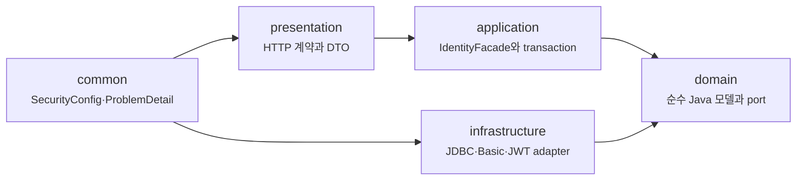
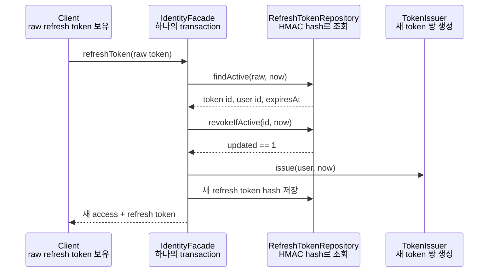
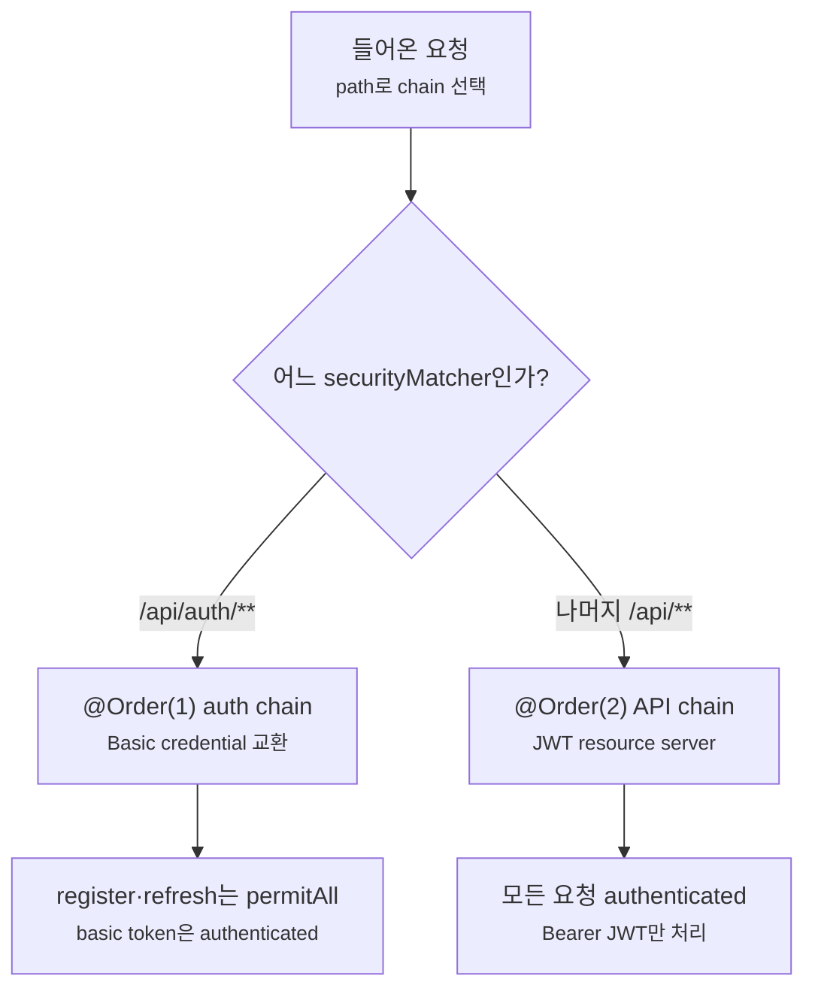

# Auth API는 실무 프로젝트처럼 어떻게 설계할까요?

> 로그인은 화면 하나가 아니라, 비밀번호를 확인하는 입구와 token을 검증하는 입구, 데이터 저장 규칙, 실패 응답, 테스트가 함께 움직이는 기능이에요.

서비스에 회원가입 화면과 로그인 화면을 붙이는 일은 겉으로 보면 단순해 보여요. 가입 정보를 저장하고, email과 password가 맞으면 token을 돌려주면 끝인 것 같죠.

근데요, 실제 요청이 오가기 시작하면 이야기가 달라져요. 로그인할 때 받은 credential을 보호 API에도 계속 보내야 하는지, 만료된 access token은 어떻게 다시 발급할지, 실패 응답은 누가 같은 모양으로 맞출지까지 결정해야 해요. 그러다 보면 이런 질문이 생겨요.

> “그래서 실제 프로젝트에서는 파일을 어디에 두죠?”  
> “HTTP Basic과 JWT를 한 애플리케이션에서 같이 써도 되나요?”  
> “refresh token은 DB에 그대로 저장해도 되나요?”  
> “성공하는 curl 하나만 보면 인증 구현이 끝난 걸까요?”

앞선 글에서는 Spring Security의 filter chain, JWT Resource Server, method security를 각각 떼어 살펴봤어요. 이번에는 그 조각들을 하나의 실행 가능한 `auth-api` 안에 모아볼 차례예요. 빈 Spring Boot shell에서 시작해 H2에 회원과 역할을 저장하고, HTTP Basic은 email/password를 token으로 바꾸는 한 경로에만 허용해요. 나머지 `/api/**`는 JWT Bearer token으로 보호하고, refresh token은 원문 대신 HMAC-SHA-256 결과를 저장한 뒤 한 번 사용할 때마다 회전시켜요.

처음부터 파일 이름을 모두 기억할 필요는 없어요. 이 글은 긴 실습이라 다섯 checkpoint로 끊어 읽을 수 있어요.

| checkpoint | 해당 절 | 여기까지만 읽어도 남는 것 |
|---|---:|---|
| 프로젝트 뼈대 | 1~3절 | API 계약과 package 경계, DB 모양 |
| application | 4~6절 | domain 규칙, 오류 언어, 유스케이스 순서 |
| JWT와 저장 | 7~9절 | RSA key, JDBC, token 발급 구현 |
| Security와 HTTP | 10~11절 | Basic/Bearer 분리와 controller 계약 |
| 검증 | 12~14절 | 통합 test, build, 실제 `curl` 흐름 |

한 번에 완독하기보다 checkpoint마다 코드를 실행해 보세요. 이미 익숙한 부분은 표를 보고 해당 절로 바로 이동해도 흐름이 끊기지 않아요.

!!! note "이번 글의 source 기준"
    이 글은 SOURCE-BACKED PRACTICE예요. 실습 코드는 [Auth API 실습 프로젝트 저장소](https://github.com/kmj8843/aha-spring-boot-auth-api/tree/auth-api-first-commit)의 `main` 브랜치, `auth-api-first-commit` 태그를 기준으로 확인할 수 있어요.

    저장소를 clone한 뒤 `git switch --detach auth-api-first-commit`으로 글과 같은 snapshot을 열고, `./gradlew test`로 15개 test를 재현할 수 있어요. 직접 만드는 흐름을 보고 싶다면 아래 생성 명령부터 차례대로 따라오면 돼요.

!!! note "이 글에서 '실무 프로젝트처럼'이라는 말의 범위"
    여기서 실무처럼 만든다는 말은 인증 서버의 모든 운영 요구를 완성한다는 뜻이 아니에요. HTTP 입구, application 유스케이스, domain port, JDBC와 Security adapter, test 경계를 실제 프로젝트에서 다시 찾을 수 있는 모양으로 나눈다는 뜻이에요.

    그래서 이 글은 한 요청이 어느 경계를 지나고, 어느 값이 DB에 남고, 어떤 test가 그 약속을 고정하는지에 집중해요. 계정 비활성화와 token 전체 폐기, refresh token 탈취 탐지, TLS, rate limit, 영구 key 관리처럼 별도의 운영 설계가 필요한 항목은 소스를 더 키우지 않고 마지막 절에서 현재 한계와 확장 방향을 정확히 밝힐게요.

!!! warning "아래 HTTP 예제는 localhost 실습 전용이에요"
    `curl` 예제의 `http://localhost:8080`은 한 컴퓨터 안에서 흐름을 관찰하기 위한 주소예요. Basic credential, access token, refresh token은 그 자체로 민감한 값이므로 localhost 밖으로 옮길 때는 반드시 TLS로 보호해야 해요. HTTP Basic은 password를 암호화하는 방식이 아니라 HTTP header에 실어 보내는 인증 방식이에요.

## 1. Spring 프로젝트 shell부터 실행해 봐요

완성된 저장소부터 열면 어떤 파일을 Spring Boot가 만들어줬고, 어떤 파일을 인증 기능 때문에 추가했는지 구분하기 어려워요. 그래서 먼저 아무 인증 규칙도 없는 project shell을 만들고, 이 출발점이 정상인지 확인할게요.

필요한 것은 Java 21, Spring CLI, `curl`, JSON을 읽을 `jq`예요. Gradle은 따로 설치하지 않아요. 생성된 Gradle wrapper만 사용해요.

```bash
java -version
spring --version
curl --version
jq --version
```

Spring Boot 4.0.7과 현재 프로젝트가 쓰는 starter를 지정해 shell을 만들어요.

```bash
spring init \
  --type=gradle-project \
  --java-version=21 \
  --dependencies=actuator,h2,jdbc,oauth2-resource-server,security,validation,web \
  --group-id=me.nvim.blog \
  --artifact-id=auth-api \
  --name=auth-api \
  --package-name=me.nvim.blog.auth \
  --boot-version=4.0.7 \
  auth-api

cd auth-api
./gradlew test
```

마지막 명령은 **생성된 shell 자체**가 정상인지 보는 기준선이에요. 아직 인증 기능을 검사하는 test는 아니에요. 이 명령이 실패하면 source를 더 얹기 전에 Java 21과 wrapper 다운로드부터 해결해야 해요.

기준선 test가 통과했어요. 인증 API에 필요한 부품을 올리기 위해 생성된 `build.gradle`을 현재 프로젝트와 똑같이 맞춰요. Boot 4에서는 기능별 main/test starter 이름이 세분화되어 있으므로 아래 파일 전체를 사용해요.

```gradle title="build.gradle" linenums="1"
plugins {
 id 'java'
 id 'org.springframework.boot' version '4.0.7'
 id 'io.spring.dependency-management' version '1.1.7'
}

group = 'me.nvim.blog'
version = '0.0.1-SNAPSHOT'

java {
 toolchain {
  languageVersion = JavaLanguageVersion.of(21)
 }
}

repositories {
 mavenCentral()
}

dependencies {
 implementation 'org.springframework.boot:spring-boot-h2console'
 implementation 'org.springframework.boot:spring-boot-starter-actuator'
 implementation 'org.springframework.boot:spring-boot-starter-jdbc'
 implementation 'org.springframework.boot:spring-boot-starter-security'
 implementation 'org.springframework.boot:spring-boot-starter-security-oauth2-resource-server'
 implementation 'org.springframework.boot:spring-boot-starter-validation'
 implementation 'org.springframework.boot:spring-boot-starter-webmvc'
 runtimeOnly 'com.h2database:h2'
 testImplementation 'org.springframework.boot:spring-boot-starter-jdbc-test'
 testImplementation 'org.springframework.boot:spring-boot-starter-security-oauth2-resource-server-test'
 testImplementation 'org.springframework.boot:spring-boot-starter-security-test'
 testImplementation 'org.springframework.boot:spring-boot-starter-validation-test'
 testImplementation 'org.springframework.boot:spring-boot-starter-webmvc-test'
 testRuntimeOnly 'org.junit.platform:junit-platform-launcher'
}

tasks.named('test') {
 useJUnitPlatform()
}
```

main class에는 나중에 만들 `TokenProperties`를 자동으로 찾도록 설정 속성 스캔(configuration properties scan)을 켜요.

```java title="src/main/java/me/nvim/blog/auth/AuthApiApplication.java" linenums="1"
package me.nvim.blog.auth;

import org.springframework.boot.SpringApplication;
import org.springframework.boot.autoconfigure.SpringBootApplication;
import org.springframework.boot.context.properties.ConfigurationPropertiesScan;

@SpringBootApplication
@ConfigurationPropertiesScan
public class AuthApiApplication {

    public static void main(String[] args) {
        SpringApplication.run(AuthApiApplication.class, args);
    }

}
```

생성된 빈 properties 설정 파일과 기본 context test는 지우고, 이 글에서 만드는 YAML 설정과 세 test class로 바꿀 거예요.

```bash
rm src/main/resources/*.properties
rm src/test/java/me/nvim/blog/auth/AuthApiApplicationTests.java
```

## 2. 코드보다 앞서 API 계약을 고정해요

project shell은 생겼지만 아직 어떤 요청을 받을지는 정하지 않았어요. class부터 만들면 Basic, Bearer, refresh token의 책임이 뒤섞이기 쉬우니 클라이언트가 볼 계약부터 고정할게요.

| 요청 | 인증 | 성공 | 역할 |
|---|---|---:|---|
| `GET /actuator/health` | 없음 | `200` | 실행 상태 확인 |
| `POST /api/auth/register` | 없음 | `201` | 일반 사용자 가입 |
| `POST /api/auth/token/basic` | HTTP Basic | `200` | email/password를 token 쌍으로 교환 |
| `POST /api/auth/token/refresh` | 없음, body의 refresh token | `200` | 기존 refresh token 폐기 후 새 token 쌍 발급 |
| `GET /api/me` | Bearer JWT | `200` | 현재 사용자 조회 |
| `GET /api/admin/users` | Bearer JWT + `ROLE_ADMIN` | `200` | 관리자 전용 목록 |

Basic은 email/password를 token으로 **교환하는 한 경로**에서만 쓰고, Bearer는 발급된 access token으로 보호 API에 들어갈 때 써요. refresh 경로에는 별도의 HTTP 인증 filter가 없지만, body의 token을 application layer가 HMAC hash·만료·폐기 상태로 검증해요.



이 그림은 호출 순서가 아니라 **코드가 의존하는 방향**이에요. controller는 `IdentityFacade`를 호출하고, application은 저장과 token 발급을 Java `interface`에 요청해요. 이 글에서는 그 interface를 **port**, JDBC나 Spring Security로 만든 구현 class를 **adapter**라고 부를게요.

| 안쪽에서 정한 port | 바깥쪽 adapter | 실제로 하는 일 |
|---|---|---|
| `UserAccountRepository` | `JdbcUserAccountRepository` | SQL로 회원을 저장하고 조회해요 |
| `RefreshTokenRepository` | `JdbcRefreshTokenRepository` | refresh token hash를 DB에 저장하고 찾아요 |
| `PasswordHasher` | `SpringPasswordHasher` | Spring Security의 `PasswordEncoder`로 비밀번호를 hash해요 |
| `TokenIssuer` | `JwtTokenIssuer` | RSA key로 JWT를 만들어요 |

즉 `IdentityFacade`는 SQL이나 JWT library를 직접 부르지 않아요. `userAccountRepository.save(...)`, `tokenIssuer.issue(...)`처럼 안쪽이 정한 규격만 사용해요. **안쪽은 원하는 일을 말하고, 바깥은 기술로 그 일을 구현한다.** port 설명은 여기까지만 기억하면 충분해요.

프로젝트 package는 다음 모양으로 자라요.

```text
me.nvim.blog.auth/
├── AuthApiApplication.java
├── identity/
│   ├── domain/
│   │   ├── UserAccount.java
│   │   ├── RefreshToken.java
│   │   └── UserAccountRepository.java
│   ├── application/
│   │   ├── IdentityFacade.java
│   │   ├── RegisterAccountCommand.java
│   │   └── AccountResult.java
│   ├── infrastructure/
│   │   ├── config/
│   │   ├── jdbc/
│   │   └── security/
│   └── presentation/
│       ├── AccountController.java
│       ├── RegisterRequest.java
│       └── UserSummaryResponse.java
└── common/
    ├── config/
    └── exception/
```

기능 이름인 `identity`를 먼저 두고 그 안을 계층으로 나눴어요. 계정 기능을 고칠 때 관련 파일은 함께 찾되, 변경 이유는 package로 구분하기 위해서예요.

| 작성 위치 | 참조해도 되는 주요 대상 | 들어오면 경계를 다시 봐야 하는 대상 |
|---|---|---|
| `domain` | domain 객체, Java 표준 타입 | controller, `Request`/`Response`, JDBC, JWT library |
| `application` | domain model과 port | presentation DTO, `ResponseEntity`, SQL, `JdbcClient` |
| `presentation` | application의 facade, command, result | repository 구현체, SQL, token 서명 세부 기술 |
| `infrastructure` | domain port, framework와 외부 기술 | controller, `Request`/`Response`, 화면에 노출할 HTTP 계약 |

표는 framework의 절대 규칙이 아니라 코드 리뷰 기준이에요. `application`이 `RegisterRequest`를 import하면 JSON 계약이 안쪽으로 샌 것이고, controller가 `JdbcUserAccountRepository`를 바로 부르면 HTTP가 저장 기술까지 알게 된 거예요.

여기서 흔히 헷갈리는 `Request → Command → Result → Response`도 한 문장으로 정리할 수 있어요. **HTTP 모양은 presentation이, 유스케이스의 입력과 출력은 application이 소유해요.** 값이 같아 보여도 바뀌는 이유가 다르면 분리하고, 단순 조회처럼 의미가 분명하면 모든 값을 억지로 wrapper에 넣지 않아요. 실제 변환 코드는 6절과 11절에서 바로 볼게요.

!!! note "이 구조만 정답은 아니에요"
    어떤 팀은 port를 `application/port/out`에 두고 domain에는 model만 둬요. 이 글은 작은 프로젝트라 domain을 “핵심 model과 바깥에 요구하는 계약”까지 넓게 잡았어요. package 이름보다 중요한 것은 안쪽 interface가 JDBC 구현을 import하지 않는 의존 방향이에요.

## 3. 설정, schema, 초기 역할을 만들어요

HTTP 계약과 package 경계가 잡혔어요. domain object나 repository 구현에 앞서 설정과 schema를 고정하면, 뒤에서 등장하는 `expiresAt`, `tokenHash`, `ROLE_USER`가 어디에 저장되는지 연결해서 볼 수 있어요.

애플리케이션이 사용할 값과 DB 모양은 다음과 같아요.

```text
src/main/resources/
├── * application.yml
├── * schema.sql
└── * data.sql
```

```yaml title="src/main/resources/application.yml" linenums="1"
spring:
  application:
    name: auth-api
  datasource:
    url: jdbc:h2:mem:auth_api;MODE=PostgreSQL;DATABASE_TO_LOWER=TRUE;DEFAULT_NULL_ORDERING=HIGH
    username: sa
    password: ""
  sql:
    init:
      mode: always
  h2:
    console:
      enabled: true
      path: /h2-console

management:
  endpoints:
    web:
      exposure:
        include: health,info
  endpoint:
    health:
      probes:
        enabled: true

auth:
  token:
    issuer: ${AUTH_TOKEN_ISSUER:http://localhost:8080}
    audience: ${AUTH_TOKEN_AUDIENCE:auth-api}
    key-id: ${AUTH_TOKEN_KEY_ID:auth-api-local}
    private-key-pem: ${AUTH_TOKEN_PRIVATE_KEY_PEM:}
    public-key-pem: ${AUTH_TOKEN_PUBLIC_KEY_PEM:}
    access-token-ttl: 15m
    refresh-token-ttl: 7d
    refresh-token-hmac-secret: ${AUTH_REFRESH_TOKEN_HMAC_SECRET:blog-study-only-refresh-token-hmac-secret}
```

H2는 메모리에서 뜨고, 실행할 때마다 `schema.sql`과 `data.sql`을 적용해요. access token은 15분, refresh token은 7일이에요. 환경 변수가 없으면 학습용 값과 임시 RSA 키를 사용하지만, 이 기본값은 운영 secret이 아니에요.

```sql title="src/main/resources/schema.sql" linenums="1"
create table app_user (
    id uuid primary key,
    email varchar(320) not null unique,
    password_hash varchar(255) not null,
    display_name varchar(80) not null,
    enabled boolean not null default true,
    created_at timestamp with time zone not null
);

create table app_role (
    name varchar(40) primary key
);

create table app_user_role (
    user_id uuid not null,
    role_name varchar(40) not null,
    primary key (user_id, role_name),
    constraint fk_app_user_role_user foreign key (user_id) references app_user(id),
    constraint fk_app_user_role_role foreign key (role_name) references app_role(name)
);

create table refresh_token (
    id uuid primary key,
    user_id uuid not null,
    token_hash char(64) not null unique,
    created_at timestamp with time zone not null,
    expires_at timestamp with time zone not null,
    revoked_at timestamp with time zone,
    constraint fk_refresh_token_user foreign key (user_id) references app_user(id)
);

create index idx_refresh_token_user on refresh_token(user_id);
create index idx_refresh_token_active on refresh_token(token_hash, expires_at, revoked_at);
```

```sql title="src/main/resources/data.sql" linenums="1"
insert into app_role (name) values ('ROLE_USER');
insert into app_role (name) values ('ROLE_ADMIN');
```

회원과 역할을 다대다 표로 나누었고, refresh token table에는 원문 열이 없어요. HMAC-SHA-256 결과는 32 byte, 16진수로 64글자라서 `char(64)`에 들어가요.

아직 repository와 security bean이 없으므로 여기서 애플리케이션 전체를 띄우는 checkpoint를 만들지는 않을게요. 파일 모양만 확인해요.

## 4. Spring 없는 domain으로 규칙을 잠가요

DB 표를 만들었으니 곧바로 JDBC 코드를 쓰고 싶을 수 있어요. 하지만 저장 기술부터 시작하면 회원의 기본 역할이나 token의 만료·폐기 규칙까지 SQL 모양에 끌려가기 쉬워요. 그래서 안쪽 규칙을 먼저 만들고, JDBC는 그 규칙에 맞춰 나중에 연결할게요.

domain에는 Spring import가 하나도 없어야 해요. 계정과 token이라는 업무 개념, 그리고 바깥 구현에 요구할 port를 만들어요. 전체 파일은 [실습 저장소의 domain package](https://github.com/kmj8843/aha-spring-boot-auth-api/tree/auth-api-first-commit/src/main/java/me/nvim/blog/auth/identity/domain)에서 볼 수 있고, 본문에서는 규칙이 들어 있는 `UserAccount`와 저장 계약에 집중할게요.

```text
src/main/java/me/nvim/blog/auth/identity/domain/
├── * IssuedToken.java
├── * PasswordHasher.java
├── * RefreshToken.java
├── * RefreshTokenRepository.java
├── * TokenIssuer.java
├── * UserAccount.java
└── * UserAccountRepository.java
```

```java title="src/main/java/me/nvim/blog/auth/identity/domain/UserAccount.java" linenums="1"
package me.nvim.blog.auth.identity.domain;

import java.time.Instant;
import java.util.List;
import java.util.Locale;
import java.util.Objects;
import java.util.UUID;

public record UserAccount(
        UUID id,
        String email,
        String passwordHash,
        String displayName,
        boolean enabled,
        Instant createdAt,
        List<String> roles) {

    public UserAccount {
        Objects.requireNonNull(id, "id");
        Objects.requireNonNull(email, "email");
        Objects.requireNonNull(passwordHash, "passwordHash");
        Objects.requireNonNull(displayName, "displayName");
        Objects.requireNonNull(createdAt, "createdAt");
        roles = List.copyOf(roles);
    }

    public static UserAccount register(String email, String passwordHash, String displayName) {
        return new UserAccount(
                UUID.randomUUID(),
                email.toLowerCase(Locale.ROOT),
                passwordHash,
                displayName,
                true,
                Instant.now(),
                List.of("ROLE_USER"));
    }
}
```

`register`는 email을 소문자로 정규화하고 공개 가입자의 역할을 무조건 `ROLE_USER`로 정해요. 전달받은 role 목록은 방어적으로 복사해서 바깥 코드가 계정 권한을 몰래 바꾸지 못하게 해요.

`IssuedToken`과 `RefreshToken`은 값만 담는 record예요. `PasswordHasher`와 `TokenIssuer`도 각각 `hash(...)`, `issue(...)` method 하나를 선언해요. 이 네 파일에는 정책을 설명하는 추가 코드가 없으므로 저장소에서 확인하고, 저장 port 두 개는 method 모양을 함께 볼게요.

```java title="src/main/java/me/nvim/blog/auth/identity/domain/UserAccountRepository.java" linenums="1"
package me.nvim.blog.auth.identity.domain;

import java.util.List;
import java.util.Optional;
import java.util.UUID;

public interface UserAccountRepository {

    UserAccount save(UserAccount userAccount);

    Optional<UserAccount> findByEmail(String email);

    Optional<UserAccount> findById(UUID id);

    List<UserAccount> findAll();
}
```

```java title="src/main/java/me/nvim/blog/auth/identity/domain/RefreshTokenRepository.java" linenums="1"
package me.nvim.blog.auth.identity.domain;

import java.time.Instant;
import java.util.Optional;
import java.util.UUID;

public interface RefreshTokenRepository {

    void save(UUID userId, String rawToken, Instant expiresAt);

    Optional<RefreshToken> findActive(String rawToken, Instant now);

    boolean revokeIfActive(UUID tokenId, Instant revokedAt);
}
```

잠깐 이름만 살펴볼게요. port는 `findActive(rawToken, now)`처럼 **원하는 일**을 말하고, HMAC이나 column 이름은 드러내지 않아요. 실제 hash와 SQL은 8절의 JDBC adapter가 맡아요.

```text
IdentityFacade
    -> UserAccountRepository interface
        <- JdbcUserAccountRepository implementation
```

`IdentityFacade`는 이 interface만 호출하고, Spring은 실행할 때 JDBC 구현 bean을 연결해요. 저장 기술이 바뀌어도 application의 회원가입·token 회전 순서를 건드리지 않기 위한 경계예요.

잠깐 멈춰서 Spring context 없이 domain 규칙 두 개를 검사해요.

```java title="src/test/java/me/nvim/blog/auth/identity/domain/UserAccountTests.java" linenums="1"
package me.nvim.blog.auth.identity.domain;

import static org.junit.jupiter.api.Assertions.assertEquals;
import static org.junit.jupiter.api.Assertions.assertThrows;

import java.time.Instant;
import java.util.ArrayList;
import java.util.List;
import java.util.UUID;

import org.junit.jupiter.api.Test;

class UserAccountTests {

    @Test
    void registrationNormalizesEmailAndAssignsUserRole() {
        UserAccount userAccount = UserAccount.register("User@Example.COM", "password-hash", "User");

        assertEquals("user@example.com", userAccount.email());
        assertEquals(List.of("ROLE_USER"), userAccount.roles());
    }

    @Test
    void rolesAreDefensivelyCopied() {
        List<String> roles = new ArrayList<>(List.of("ROLE_USER"));
        UserAccount userAccount = new UserAccount(
                UUID.randomUUID(),
                "user@example.com",
                "password-hash",
                "User",
                true,
                Instant.now(),
                roles);

        roles.add("ROLE_ADMIN");

        assertEquals(List.of("ROLE_USER"), userAccount.roles());
        assertThrows(UnsupportedOperationException.class, () -> userAccount.roles().add("ROLE_ADMIN"));
    }
}
```

여기서는 정확히 이 test만 실행할 수 있어요. main source에는 아직 구현되지 않은 class 참조가 없으므로 실제로 통과하는 첫 checkpoint예요.

```bash
./gradlew test --tests me.nvim.blog.auth.identity.domain.UserAccountTests
```

## 5. 실패는 HTTP 경계에서 `ProblemDetail`로 번역해요

domain의 정상 규칙을 만들었지만 인증 API는 실패하는 장면이 더 많아요. 이미 가입한 email, 잘못된 가입 입력, 만료되거나 재사용된 refresh token을 각 class가 제각각 예외로 던지면 클라이언트가 보는 응답도 흔들려요. 그렇다고 domain이 `401`이나 `409` 같은 HTTP 숫자를 알게 만들면 안쪽 규칙이 웹 기술에 묶여요.

안쪽에서는 `EMAIL_ALREADY_USED`, `INVALID_REFRESH_TOKEN` 같은 업무 오류로 말하고, HTTP 경계에서만 이를 `ProblemDetail`로 번역하는 공통 어휘를 만들어요.

```text
src/main/java/me/nvim/blog/auth/common/exception/
├── * BusinessException.java
├── * ErrorCode.java
└── * GlobalExceptionHandler.java
```

```java title="src/main/java/me/nvim/blog/auth/common/exception/ErrorCode.java" linenums="1"
package me.nvim.blog.auth.common.exception;

public enum ErrorCode {

    EMAIL_ALREADY_USED(
            409,
            "https://blog.nvim.me/problems/email-already-used",
            "Email already used",
            "Email is already registered"),
    INVALID_REFRESH_TOKEN(
            401,
            "https://blog.nvim.me/problems/invalid-refresh-token",
            "Invalid refresh token",
            "Refresh token is invalid, expired, or already used"),
    UNAUTHORIZED(
            401,
            "https://blog.nvim.me/problems/unauthorized",
            "Unauthorized",
            "Authentication is required");

    private final int status;
    private final String type;
    private final String title;
    private final String detail;

    ErrorCode(int status, String type, String title, String detail) {
        this.status = status;
        this.type = type;
        this.title = title;
        this.detail = detail;
    }

    public int status() {
        return this.status;
    }

    public String type() {
        return this.type;
    }

    public String title() {
        return this.title;
    }

    public String detail() {
        return this.detail;
    }
}
```

```java title="src/main/java/me/nvim/blog/auth/common/exception/BusinessException.java" linenums="1"
package me.nvim.blog.auth.common.exception;

public class BusinessException extends RuntimeException {

    private final ErrorCode errorCode;

    public BusinessException(ErrorCode errorCode) {
        this(errorCode, errorCode.detail(), null);
    }

    public BusinessException(ErrorCode errorCode, String detail, Throwable cause) {
        super(detail, cause);
        this.errorCode = errorCode;
    }

    public ErrorCode errorCode() {
        return this.errorCode;
    }
}
```

```java title="src/main/java/me/nvim/blog/auth/common/exception/GlobalExceptionHandler.java" linenums="1"
package me.nvim.blog.auth.common.exception;

import java.net.URI;
import java.util.LinkedHashMap;
import java.util.Map;

import org.springframework.http.HttpStatus;
import org.springframework.http.HttpStatusCode;
import org.springframework.http.ProblemDetail;
import org.springframework.validation.FieldError;
import org.springframework.web.bind.MethodArgumentNotValidException;
import org.springframework.web.bind.annotation.ExceptionHandler;
import org.springframework.web.bind.annotation.RestControllerAdvice;

@RestControllerAdvice
public class GlobalExceptionHandler {

    @ExceptionHandler(BusinessException.class)
    ProblemDetail handleBusinessException(BusinessException ex) {
        ErrorCode errorCode = ex.errorCode();
        ProblemDetail problem = ProblemDetail.forStatusAndDetail(
                HttpStatusCode.valueOf(errorCode.status()),
                ex.getMessage());
        problem.setType(URI.create(errorCode.type()));
        problem.setTitle(errorCode.title());
        return problem;
    }

    @ExceptionHandler(MethodArgumentNotValidException.class)
    ProblemDetail handleValidationFailure(MethodArgumentNotValidException ex) {
        ProblemDetail problem = ProblemDetail.forStatusAndDetail(HttpStatus.BAD_REQUEST, "Request validation failed");
        problem.setType(URI.create("https://blog.nvim.me/problems/validation-failed"));
        problem.setTitle("Validation failed");
        problem.setProperty("errors", fieldErrors(ex));
        return problem;
    }

    private static Map<String, String> fieldErrors(MethodArgumentNotValidException ex) {
        Map<String, String> errors = new LinkedHashMap<>();
        for (FieldError fieldError : ex.getBindingResult().getFieldErrors()) {
            errors.putIfAbsent(fieldError.getField(), fieldError.getDefaultMessage());
        }
        return errors;
    }
}
```

Spring MVC가 validation 실패를 `MethodArgumentNotValidException`으로 전달하면 advice가 `400` Problem Detail과 필드별 `errors`를 만들어요. 중복 email, 이미 쓴 refresh token처럼 controller까지 들어온 뒤 발생한 업무 실패도 같은 응답 형식으로 번역돼요.

여기에는 중요한 경계가 하나 있어요. 틀린 Basic password, 없거나 잘못된 Bearer token, 권한 부족은 controller보다 앞선 Spring Security filter에서 거절돼요. 이런 실패는 `@RestControllerAdvice`를 지나지 않기 때문에 현재 source에서는 업무 오류와 같은 `ProblemDetail` body를 보장하지 않고 `401` 또는 `403` status만 고정해요.

모든 실패 body를 하나의 계약으로 맞춰야 하는 API라면 `AuthenticationEntryPoint`와 `AccessDeniedHandler`에서도 같은 Problem Detail을 쓰고, body까지 통합 test로 확인해야 해요. 이번 실습은 **controller 안쪽의 오류 번역**과 **Security filter의 인증·인가 거절**이 서로 다른 경계라는 점까지만 보여줘요.

또 하나, 예제의 `https://blog.nvim.me/problems/...` 값은 problem type을 구분하는 식별자로 사용하지만 현재 해당 설명 page까지 제공하지는 않아요. HTTP URL을 type으로 쓴다면 운영에서는 사람이 읽을 수 있는 안정적인 설명 page를 함께 게시하는 편이 좋아요. 아직 문서를 운영하지 않는 API라면 준비되지 않은 URL을 약속하기보다 `about:blank`나 실제로 관리할 수 있는 type 체계를 선택해야 해요.

## 6. 유스케이스는 `IdentityFacade`에 모아요

domain이 할 수 있는 일과 실패할 때 쓸 언어가 준비됐어요. 하지만 회원가입 하나만 해도 “password hash → 계정 저장 → DB unique constraint로 중복 확정”이라는 순서가 필요하고, refresh에는 “활성 token 조회 → 폐기 → 새 token 발급 → 저장” 순서가 필요해요. 이 흐름을 controller나 repository에 흩어놓지 않고 application layer의 한 입구에 모을게요.

중복 email을 저장 전에 한 번 조회하는 방식은 동시에 들어온 두 요청을 완전히 막지 못해요. 그래서 이 source는 사전 조회보다 DB의 unique constraint를 최종 기준으로 삼고, 저장 중 발생한 `DuplicateKeyException`을 `EMAIL_ALREADY_USED` 업무 오류로 바꿔요.

HTTP request를 domain에 바로 넘기지 않아요. presentation의 입력은 command로, domain의 출력은 result로 바뀌어요. 2절에서 길게 설명하는 대신 실제 코드에서 역할을 확인해 볼게요.

```text
src/main/java/me/nvim/blog/auth/identity/application/
├── * AccountResult.java
├── * IdentityFacade.java
├── * IssueTokenCommand.java
├── * RefreshTokenCommand.java
├── * RegisterAccountCommand.java
└── * TokenResult.java
```

command 세 개는 유스케이스 입력만 담고, result 두 개는 공개 가능한 출력만 담는 record예요. 반복되는 field 선언과 `from(...)` 변환은 [실습 저장소의 application package](https://github.com/kmj8843/aha-spring-boot-auth-api/tree/auth-api-first-commit/src/main/java/me/nvim/blog/auth/identity/application)에서 확인할 수 있어요. 여기서는 이 객체들을 실제로 조합하는 facade 전체를 봐요.

facade는 presentation이 동기 방식으로 들어오는 유일한 입구예요. 가입, 조회, token 발급, refresh 회전의 transaction 경계도 여기 있어요.

```java title="src/main/java/me/nvim/blog/auth/identity/application/IdentityFacade.java" linenums="1"
package me.nvim.blog.auth.identity.application;

import java.time.Instant;
import java.util.List;

import org.springframework.stereotype.Service;
import org.springframework.transaction.annotation.Transactional;

import me.nvim.blog.auth.common.exception.BusinessException;
import me.nvim.blog.auth.common.exception.ErrorCode;
import me.nvim.blog.auth.identity.domain.IssuedToken;
import me.nvim.blog.auth.identity.domain.PasswordHasher;
import me.nvim.blog.auth.identity.domain.RefreshToken;
import me.nvim.blog.auth.identity.domain.RefreshTokenRepository;
import me.nvim.blog.auth.identity.domain.TokenIssuer;
import me.nvim.blog.auth.identity.domain.UserAccount;
import me.nvim.blog.auth.identity.domain.UserAccountRepository;

@Service
public class IdentityFacade {

    private final UserAccountRepository userAccountRepository;
    private final RefreshTokenRepository refreshTokenRepository;
    private final PasswordHasher passwordHasher;
    private final TokenIssuer tokenIssuer;

    public IdentityFacade(
            UserAccountRepository userAccountRepository,
            RefreshTokenRepository refreshTokenRepository,
            PasswordHasher passwordHasher,
            TokenIssuer tokenIssuer) {
        this.userAccountRepository = userAccountRepository;
        this.refreshTokenRepository = refreshTokenRepository;
        this.passwordHasher = passwordHasher;
        this.tokenIssuer = tokenIssuer;
    }

    @Transactional
    public AccountResult register(RegisterAccountCommand command) {
        UserAccount userAccount = UserAccount.register(
                command.email(),
                this.passwordHasher.hash(command.password()),
                command.displayName());
        return AccountResult.from(this.userAccountRepository.save(userAccount));
    }

    @Transactional(readOnly = true)
    public AccountResult findByEmail(String email) {
        return this.userAccountRepository.findByEmail(email)
                .map(AccountResult::from)
                .orElseThrow(() -> new BusinessException(ErrorCode.UNAUTHORIZED));
    }

    @Transactional(readOnly = true)
    public List<AccountResult> findAll() {
        return this.userAccountRepository.findAll().stream()
                .map(AccountResult::from)
                .toList();
    }

    @Transactional
    public TokenResult issueToken(IssueTokenCommand command) {
        UserAccount userAccount = this.userAccountRepository.findByEmail(command.email())
                .orElseThrow(() -> new BusinessException(ErrorCode.UNAUTHORIZED));
        return issueToken(userAccount, Instant.now());
    }

    @Transactional
    public TokenResult refreshToken(RefreshTokenCommand command) {
        Instant now = Instant.now();
        RefreshToken refreshToken = this.refreshTokenRepository
                .findActive(command.refreshToken(), now)
                .orElseThrow(() -> new BusinessException(ErrorCode.INVALID_REFRESH_TOKEN));
        UserAccount userAccount = this.userAccountRepository.findById(refreshToken.userId())
                .orElseThrow(() -> new BusinessException(ErrorCode.INVALID_REFRESH_TOKEN));

        if (!this.refreshTokenRepository.revokeIfActive(refreshToken.id(), now)) {
            throw new BusinessException(ErrorCode.INVALID_REFRESH_TOKEN);
        }
        return issueToken(userAccount, now);
    }

    private TokenResult issueToken(UserAccount userAccount, Instant issuedAt) {
        IssuedToken issuedToken = this.tokenIssuer.issue(userAccount, issuedAt);
        this.refreshTokenRepository.save(
                userAccount.id(),
                issuedToken.refreshToken(),
                issuedToken.refreshTokenExpiresAt());
        return TokenResult.from(issuedToken);
    }
}
```

`issueToken`이 비밀번호를 다시 받지 않는 게 처음엔 이상해 보이죠? `/api/auth/token/basic` 앞의 Spring Security filter가 이미 비밀번호를 확인하고 `Authentication`을 만들어요. controller는 검증을 통과한 email만 facade에 넘겨요. 이 경계를 뒤에서 두 filter chain으로 고정할 거예요.

refresh에서는 “조회 후 폐기”만 믿지 않고 `revokeIfActive`의 update 결과도 검사해요. 같은 token을 동시에 두 요청이 쓰더라도 먼저 폐기한 요청만 다음 token을 받을 수 있게 하는 핵심 조건이에요.



원문은 client와 발급 순간에만 보이고 DB 비교는 HMAC hash로 해요. 이전 token의 폐기가 성공한 뒤에만 새 token을 저장하므로 rotation이 “새 token도 주고 옛 token도 살려두는” 동작이 되지 않아요.

!!! note "이 rotation이 막는 범위"
    현재 구현은 같은 refresh token으로 두 요청이 **둘 다 성공하는 일**을 막아요. 하지만 탈취한 token을 공격자가 먼저 사용했을 때 새로 발급된 공격자 쪽 token까지 찾아 폐기하는 replay 탐지는 아니에요. 피해자가 뒤늦게 옛 token을 보내면 `401`을 받지만, 먼저 성공한 요청이 받은 새 token은 계속 유효해요.

    운영에서 탈취 재사용까지 대응하려면 refresh token에 family나 parent 관계를 남기고, 이미 폐기된 token이 다시 제시되면 그 family의 활성 token을 함께 폐기해야 해요. 이 글은 그 단계까지 구현하지 않고 **원자적인 1회 사용과 교체**만 다뤄요.

## 7. JWT 서명 재료를 준비해요

`IdentityFacade`는 `TokenIssuer` port에 “token을 발급해 달라”고 요청해요. 바깥쪽 adapter가 실제 JWT를 만들려면 만료 시간, 발급자, 대상자, RSA key가 필요하죠. 문자열 설정을 필요한 곳마다 직접 읽지 않고, 시작할 때 한 번 검증되는 설정 객체와 key bean으로 준비할게요.

`application.yml`의 `auth.token`을 타입 있는 record로 묶어요. TTL은 양수여야 하고, private/public PEM은 반드시 쌍으로 들어와야 해요.

```text
src/main/java/me/nvim/blog/auth/identity/infrastructure/config/
├── * RsaKeyConfig.java
└── * TokenProperties.java
```

```java title="src/main/java/me/nvim/blog/auth/identity/infrastructure/config/TokenProperties.java" linenums="1"
package me.nvim.blog.auth.identity.infrastructure.config;

import java.time.Duration;

import org.springframework.boot.context.properties.ConfigurationProperties;
import org.springframework.validation.annotation.Validated;

import jakarta.validation.constraints.NotBlank;
import jakarta.validation.constraints.NotNull;

@Validated
@ConfigurationProperties("auth.token")
public record TokenProperties(
        @NotBlank String issuer,
        @NotBlank String audience,
        @NotBlank String keyId,
        String privateKeyPem,
        String publicKeyPem,
        @NotNull Duration accessTokenTtl,
        @NotNull Duration refreshTokenTtl,
        @NotBlank String refreshTokenHmacSecret) {

    public TokenProperties {
        if (accessTokenTtl != null && (accessTokenTtl.isZero() || accessTokenTtl.isNegative())) {
            throw new IllegalArgumentException("accessTokenTtl must be positive");
        }
        if (refreshTokenTtl != null && (refreshTokenTtl.isZero() || refreshTokenTtl.isNegative())) {
            throw new IllegalArgumentException("refreshTokenTtl must be positive");
        }
        if (hasText(privateKeyPem) != hasText(publicKeyPem)) {
            throw new IllegalArgumentException("privateKeyPem and publicKeyPem must be configured together");
        }
    }

    public boolean hasConfiguredSigningKey() {
        return hasText(this.privateKeyPem) && hasText(this.publicKeyPem);
    }

    private static boolean hasText(String value) {
        return value != null && !value.isBlank();
    }
}
```

RSA 설정은 PEM이 있으면 PKCS#8 private key와 X.509 public key를 읽고, 없으면 학습용 2048-bit key pair를 실행할 때 만들어요. 같은 pair에서 encoder와 decoder를 만들어요.

```java title="src/main/java/me/nvim/blog/auth/identity/infrastructure/config/RsaKeyConfig.java" linenums="1"
package me.nvim.blog.auth.identity.infrastructure.config;

import java.security.KeyFactory;
import java.security.KeyPair;
import java.security.KeyPairGenerator;
import java.security.NoSuchAlgorithmException;
import java.security.interfaces.RSAPrivateKey;
import java.security.interfaces.RSAPublicKey;
import java.security.spec.PKCS8EncodedKeySpec;
import java.security.spec.X509EncodedKeySpec;
import java.util.Base64;

import org.springframework.context.annotation.Bean;
import org.springframework.context.annotation.Configuration;
import org.springframework.security.oauth2.jwt.JwtDecoder;
import org.springframework.security.oauth2.jwt.JwtEncoder;
import org.springframework.security.oauth2.jwt.NimbusJwtDecoder;
import org.springframework.security.oauth2.jwt.NimbusJwtEncoder;

import com.nimbusds.jose.jwk.JWKSet;
import com.nimbusds.jose.jwk.RSAKey;
import com.nimbusds.jose.jwk.source.ImmutableJWKSet;

@Configuration
public class RsaKeyConfig {

    @Bean
    KeyPair tokenSigningKeyPair(TokenProperties tokenProperties) {
        if (tokenProperties.hasConfiguredSigningKey()) {
            return parseConfiguredKeyPair(tokenProperties);
        }
        try {
            KeyPairGenerator generator = KeyPairGenerator.getInstance("RSA");
            generator.initialize(2048);
            return generator.generateKeyPair();
        } catch (NoSuchAlgorithmException ex) {
            throw new IllegalStateException("RSA key generation is not available", ex);
        }
    }

    @Bean
    JwtEncoder jwtEncoder(KeyPair tokenSigningKeyPair, TokenProperties tokenProperties) {
        RSAPublicKey publicKey = (RSAPublicKey) tokenSigningKeyPair.getPublic();
        RSAPrivateKey privateKey = (RSAPrivateKey) tokenSigningKeyPair.getPrivate();
        RSAKey rsaKey = new RSAKey.Builder(publicKey)
                .privateKey(privateKey)
                .keyID(tokenProperties.keyId())
                .build();
        return new NimbusJwtEncoder(new ImmutableJWKSet<>(new JWKSet(rsaKey)));
    }

    @Bean
    JwtDecoder jwtDecoder(KeyPair tokenSigningKeyPair) {
        RSAPublicKey publicKey = (RSAPublicKey) tokenSigningKeyPair.getPublic();
        return NimbusJwtDecoder.withPublicKey(publicKey).build();
    }

    private static KeyPair parseConfiguredKeyPair(TokenProperties tokenProperties) {
        try {
            KeyFactory keyFactory = KeyFactory.getInstance("RSA");
            RSAPrivateKey privateKey = (RSAPrivateKey) keyFactory.generatePrivate(
                    new PKCS8EncodedKeySpec(parsePem(tokenProperties.privateKeyPem())));
            RSAPublicKey publicKey = (RSAPublicKey) keyFactory.generatePublic(
                    new X509EncodedKeySpec(parsePem(tokenProperties.publicKeyPem())));
            return new KeyPair(publicKey, privateKey);
        } catch (Exception ex) {
            throw new IllegalStateException("Configured RSA signing key is invalid", ex);
        }
    }

    private static byte[] parsePem(String pem) {
        String base64 = pem
                .replaceAll("-----BEGIN [^-]+-----", "")
                .replaceAll("-----END [^-]+-----", "")
                .replaceAll("\\s", "");
        return Base64.getDecoder().decode(base64);
    }
}
```

설정한 PEM을 같은 key pair로 복원하는지는 `RsaKeyConfigTests`가 byte 배열까지 비교해요. [전체 test 코드](https://github.com/kmj8843/aha-spring-boot-auth-api/blob/auth-api-first-commit/src/test/java/me/nvim/blog/auth/identity/infrastructure/config/RsaKeyConfigTests.java)는 저장소에서 보고, 여기서는 domain test와 함께 checkpoint만 실행할게요.

```bash
./gradlew test \
  --tests me.nvim.blog.auth.identity.domain.UserAccountTests \
  --tests me.nvim.blog.auth.identity.infrastructure.config.RsaKeyConfigTests
```

## 8. domain port를 JDBC adapter로 구현해요

여기까지 안쪽 코드는 “회원을 저장해 달라”, “활성 refresh token을 찾아 달라”고 요청만 했어요. 이 절에서는 준비된 설정과 schema를 사용해 그 요청을 실제 DB 작업으로 바꿔요.

`UserAccountRepository`와 `RefreshTokenRepository`의 실제 DB 구현을 만들어요. Spring Data가 interface를 대신 구현하게 하지 않고 `JdbcClient`로 SQL을 눈에 보이게 적어요.

```text
src/main/java/me/nvim/blog/auth/identity/infrastructure/jdbc/
├── * JdbcInstantReader.java
├── * JdbcRefreshTokenRepository.java
└── * JdbcUserAccountRepository.java
```

회원 adapter는 계정과 role row를 함께 저장하고, unique email 위반을 `EMAIL_ALREADY_USED` 업무 오류로 바꿔요. 조회·mapping과 H2 timestamp 차이를 처리하는 코드는 [JDBC package 전체](https://github.com/kmj8843/aha-spring-boot-auth-api/tree/auth-api-first-commit/src/main/java/me/nvim/blog/auth/identity/infrastructure/jdbc)에서 확인할 수 있어요.

여기서 자세히 볼 쪽은 refresh token이에요. 원문에 application secret을 섞어 HMAC-SHA-256을 계산하고, DB에는 16진수 hash만 저장해요. 활성 token 조회와 폐기의 핵심 SQL은 다음 두 조건을 공유해요.

```java title="src/main/java/me/nvim/blog/auth/identity/infrastructure/jdbc/JdbcRefreshTokenRepository.java" linenums="1"
@Override
public Optional<RefreshToken> findActive(String rawToken, Instant now) {
    return this.jdbcClient.sql("""
            select id, user_id, expires_at
            from refresh_token
            where token_hash = :tokenHash
              and revoked_at is null
              and expires_at > :now
            """)
            .param("tokenHash", hash(rawToken))
            .param("now", OffsetDateTime.ofInstant(now, ZoneOffset.UTC))
            .query(this::mapRefreshToken)
            .optional();
}

@Override
public boolean revokeIfActive(UUID tokenId, Instant revokedAt) {
    int updated = this.jdbcClient.sql("""
            update refresh_token
            set revoked_at = :revokedAt
            where id = :id
              and revoked_at is null
              and expires_at > :revokedAt
            """)
            .param("id", tokenId)
            .param("revokedAt", OffsetDateTime.ofInstant(revokedAt, ZoneOffset.UTC))
            .update();
    return updated == 1;
}
```

`findActive`로 읽은 뒤에도 `revokeIfActive`의 update 결과를 다시 확인하는 이유는 동시 요청 때문이에요. 같은 token을 두 요청이 함께 읽더라도 `updated == 1`을 얻은 한 요청만 새 token으로 진행할 수 있어요. HMAC 생성과 저장 코드는 본질적으로 `hash(rawToken)`을 양쪽에서 동일하게 적용하는 구현이라 저장소 링크로 넘겼어요.

## 9. password와 token 발급 adapter를 연결해요

DB adapter가 저장 port를 채웠다면, 아직 비어 있는 기술 경계는 password hash와 인증이에요. domain은 password를 어떤 algorithm으로 hash하는지, JWT를 어떤 library로 서명하는지 몰라야 하죠. 이번에는 그 port들을 Spring Security 구현과 연결할게요.

domain port와 Spring Security 사이를 잇는 네 class를 만들어요.

```text
src/main/java/me/nvim/blog/auth/identity/infrastructure/security/
├── * DatabaseUserDetailsService.java
├── * JwtTokenIssuer.java
├── * SpringPasswordHasher.java
└── * UserPrincipal.java
```

Basic 쪽 세 class는 번역 역할이 분명해요. `UserPrincipal`은 `UserAccount`를 `UserDetails`로 바꾸고 role 문자열을 `GrantedAuthority`로 옮겨요. `DatabaseUserDetailsService`는 email을 소문자로 정규화해 계정을 찾고, `SpringPasswordHasher`는 domain의 `PasswordHasher`를 `PasswordEncoder`로 구현해요. 짧지만 반복적인 위임 코드는 [security package 전체](https://github.com/kmj8843/aha-spring-boot-auth-api/tree/auth-api-first-commit/src/main/java/me/nvim/blog/auth/identity/infrastructure/security)에서 확인할 수 있어요.

실제로 token 모양을 결정하는 `JwtTokenIssuer`는 본문에서 볼게요.

JWT adapter는 RSA private key로 access token을 서명하고 32 byte 무작위 refresh token을 만들어요. JWT에는 `iss`, `sub`, `aud`, `iat`, `exp`와 우리 claim인 `email`, `roles`가 들어가요.

```java title="src/main/java/me/nvim/blog/auth/identity/infrastructure/security/JwtTokenIssuer.java" linenums="1"
package me.nvim.blog.auth.identity.infrastructure.security;

import java.security.SecureRandom;
import java.time.Instant;
import java.util.Base64;
import java.util.List;

import org.springframework.security.oauth2.jwt.JwtClaimsSet;
import org.springframework.security.oauth2.jwt.JwtEncoder;
import org.springframework.security.oauth2.jwt.JwtEncoderParameters;
import org.springframework.stereotype.Component;

import me.nvim.blog.auth.identity.domain.IssuedToken;
import me.nvim.blog.auth.identity.domain.TokenIssuer;
import me.nvim.blog.auth.identity.domain.UserAccount;
import me.nvim.blog.auth.identity.infrastructure.config.TokenProperties;

@Component
class JwtTokenIssuer implements TokenIssuer {

    private static final int REFRESH_TOKEN_BYTES = 32;

    private final JwtEncoder jwtEncoder;
    private final TokenProperties tokenProperties;
    private final SecureRandom secureRandom = new SecureRandom();

    JwtTokenIssuer(JwtEncoder jwtEncoder, TokenProperties tokenProperties) {
        this.jwtEncoder = jwtEncoder;
        this.tokenProperties = tokenProperties;
    }

    @Override
    public IssuedToken issue(UserAccount userAccount, Instant issuedAt) {
        Instant accessTokenExpiresAt = issuedAt.plus(this.tokenProperties.accessTokenTtl());
        Instant refreshTokenExpiresAt = issuedAt.plus(this.tokenProperties.refreshTokenTtl());
        return new IssuedToken(
                createAccessToken(userAccount, issuedAt, accessTokenExpiresAt),
                accessTokenExpiresAt,
                createRefreshToken(),
                refreshTokenExpiresAt);
    }

    private String createAccessToken(UserAccount userAccount, Instant issuedAt, Instant expiresAt) {
        JwtClaimsSet claims = JwtClaimsSet.builder()
                .issuer(this.tokenProperties.issuer())
                .subject(userAccount.id().toString())
                .audience(List.of(this.tokenProperties.audience()))
                .issuedAt(issuedAt)
                .expiresAt(expiresAt)
                .claim("email", userAccount.email())
                .claim("roles", userAccount.roles())
                .build();
        return this.jwtEncoder.encode(JwtEncoderParameters.from(claims)).getTokenValue();
    }

    private String createRefreshToken() {
        byte[] bytes = new byte[REFRESH_TOKEN_BYTES];
        this.secureRandom.nextBytes(bytes);
        return Base64.getUrlEncoder().withoutPadding().encodeToString(bytes);
    }
}
```

access token은 서명된 JWT라서 resource server가 자체 검증할 수 있어요. refresh token은 의미 없는 opaque random 문자열이고, 우리 DB와 application만 상태를 판단해요.

## 10. 두 `SecurityFilterChain`의 책임을 갈라요

password를 확인할 provider와 JWT를 만들 adapter는 준비됐어요. 하지만 이것만으로는 Spring Security가 **어느 URL에서 어느 인증 방식을 사용할지** 알 수 없어요. 그 선택을 filter chain의 matcher와 순서로 명시해야 해요.

이 프로젝트의 핵심은 인증 방식을 섞지 않는 두 chain이에요.

```text
src/main/java/me/nvim/blog/auth/common/config/
└── * SecurityConfig.java
```



Spring Security는 먼저 matcher가 맞는 chain 하나를 고른 뒤 그 chain의 filter만 적용해요. 그래서 `/api/me`에는 Basic filter가 없고, email/password가 맞아도 Basic header만으로는 통과할 수 없어요.

```java title="src/main/java/me/nvim/blog/auth/common/config/SecurityConfig.java" linenums="1"
package me.nvim.blog.auth.common.config;

import static org.springframework.security.config.Customizer.withDefaults;

import java.util.ArrayList;
import java.util.Collection;
import java.util.List;

import org.springframework.context.annotation.Bean;
import org.springframework.context.annotation.Configuration;
import org.springframework.core.annotation.Order;
import org.springframework.security.config.annotation.method.configuration.EnableMethodSecurity;
import org.springframework.security.config.annotation.web.builders.HttpSecurity;
import org.springframework.security.config.annotation.web.configurers.AbstractHttpConfigurer;
import org.springframework.security.config.http.SessionCreationPolicy;
import org.springframework.security.core.GrantedAuthority;
import org.springframework.security.core.authority.SimpleGrantedAuthority;
import org.springframework.security.crypto.factory.PasswordEncoderFactories;
import org.springframework.security.crypto.password.PasswordEncoder;
import org.springframework.security.oauth2.jwt.Jwt;
import org.springframework.security.oauth2.server.resource.authentication.JwtAuthenticationConverter;
import org.springframework.security.oauth2.server.resource.authentication.JwtGrantedAuthoritiesConverter;
import org.springframework.security.web.SecurityFilterChain;

@Configuration
@EnableMethodSecurity
public class SecurityConfig {

    @Bean
    @Order(1)
    SecurityFilterChain authSecurityFilterChain(HttpSecurity http) {
        http
                .securityMatcher("/api/auth/**")
                .csrf(AbstractHttpConfigurer::disable)
                .sessionManagement((session) -> session.sessionCreationPolicy(SessionCreationPolicy.STATELESS))
                .authorizeHttpRequests((authorize) -> authorize
                        .requestMatchers("/api/auth/register", "/api/auth/token/refresh").permitAll()
                        .requestMatchers("/api/auth/token/basic").authenticated()
                        .anyRequest().denyAll())
                .httpBasic(withDefaults());
        return http.build();
    }

    @Bean
    @Order(2)
    SecurityFilterChain apiSecurityFilterChain(
            HttpSecurity http,
            JwtAuthenticationConverter jwtAuthenticationConverter) {
        http
                .securityMatcher("/api/**")
                .csrf(AbstractHttpConfigurer::disable)
                .sessionManagement((session) -> session.sessionCreationPolicy(SessionCreationPolicy.STATELESS))
                .authorizeHttpRequests((authorize) -> authorize.anyRequest().authenticated())
                .oauth2ResourceServer((oauth2) -> oauth2
                        .jwt((jwt) -> jwt.jwtAuthenticationConverter(jwtAuthenticationConverter)));
        return http.build();
    }

    @Bean
    PasswordEncoder passwordEncoder() {
        return PasswordEncoderFactories.createDelegatingPasswordEncoder();
    }

    @Bean
    JwtAuthenticationConverter jwtAuthenticationConverter() {
        JwtGrantedAuthoritiesConverter scopeAuthorities = new JwtGrantedAuthoritiesConverter();
        JwtAuthenticationConverter converter = new JwtAuthenticationConverter();
        converter.setPrincipalClaimName("email");
        converter.setJwtGrantedAuthoritiesConverter((jwt) -> mergeAuthorities(jwt, scopeAuthorities));
        return converter;
    }

    private static Collection<GrantedAuthority> mergeAuthorities(
            Jwt jwt,
            JwtGrantedAuthoritiesConverter scopeAuthorities) {
        List<GrantedAuthority> authorities = new ArrayList<>(scopeAuthorities.convert(jwt));
        List<String> roles = jwt.getClaimAsStringList("roles");
        if (roles != null) {
            for (String role : roles) {
                authorities.add(new SimpleGrantedAuthority(role));
            }
        }
        return authorities;
    }
}
```

두 chain 모두 server-side session을 만들지 않는 `STATELESS`예요. 이 실습은 browser가 자동으로 credential을 붙이는 화면이 아니라, `curl` 같은 비브라우저 client가 `Authorization` header를 직접 넣는 localhost API를 전제로 CSRF를 꺼요. **`STATELESS`이거나 API라는 이유만으로 CSRF가 자동으로 안전해지는 것은 아니에요.** browser가 Basic credential이나 cookie를 자동 전송하는 구성이라면 CSRF 보호를 유지하거나, 별도의 token 전달 방식과 origin 정책을 함께 설계해야 해요.

`JwtAuthenticationConverter`는 principal 이름으로 `email` claim을 쓰고, 기본 scope 권한과 `roles` claim을 합쳐 method security가 `ROLE_ADMIN`을 볼 수 있게 해요.

!!! note "이 시점의 정확한 JWT 검증 범위"
    `RsaKeyConfig`의 decoder는 RSA 공개키로 서명과 표준 시간 claim을 검증하지만, 현재 source는 `issuer`와 `audience` validator를 명시적으로 연결하지 않았어요. token을 만들 때 두 claim을 넣는 것과, 받을 때 기대값을 강제하는 것은 별개의 일이라는 점을 기억해야 해요.

## 11. HTTP 계약을 controller로 열어요

두 filter chain이 현관에서 credential을 검사하도록 했지만, 아직 그 뒤에서 JSON을 받을 controller가 없어요. 2절에서 약속한 HTTP 계약을 실제 URL과 DTO로 열어볼게요.

바깥 요청이 들어올 presentation layer를 만들어요. request는 Bean Validation으로 “HTTP 입력 모양”을 검사하고 command로 바뀌어요. response는 result에서 필요한 필드만 내보내므로 password hash는 API에 노출되지 않아요.

```text
src/main/java/me/nvim/blog/auth/identity/presentation/
├── * AccountController.java
├── * AdminController.java
├── * AdminUsersResponse.java
├── * AuthTokenController.java
├── * RefreshTokenRequest.java
├── * RegisterRequest.java
├── * TokenResponse.java
└── * UserSummaryResponse.java
```

```java title="src/main/java/me/nvim/blog/auth/identity/presentation/RegisterRequest.java" linenums="1"
package me.nvim.blog.auth.identity.presentation;

import jakarta.validation.constraints.Email;
import jakarta.validation.constraints.NotBlank;
import jakarta.validation.constraints.Size;
import me.nvim.blog.auth.identity.application.RegisterAccountCommand;

public record RegisterRequest(
        @NotBlank @Email @Size(max = 320) String email,
        @NotBlank @Size(min = 8, max = 72) String password,
        @NotBlank @Size(max = 80) String displayName) {

    RegisterAccountCommand toCommand() {
        return new RegisterAccountCommand(this.email, this.password, this.displayName);
    }
}
```

!!! warning "현재 password 길이 검증은 문자 수와 byte 수가 달라요"
    `@Size(max = 72)`는 Java 문자열의 문자 수를 검사하지만, 기본 `DelegatingPasswordEncoder`가 새 password에 사용하는 bcrypt의 입력 한계는 UTF-8 기준 72 byte예요. 그래서 ASCII 72자는 처리할 수 있어도 한글처럼 한 글자가 여러 byte인 password는 72자보다 짧아도 encoder에서 거절될 수 있어요. 현재 source는 이 예외를 validation `ProblemDetail`로 바꾸지 않으므로 그런 입력은 `500`이 될 수 있어요.

    운영 API에서는 hash 전에 UTF-8 byte 길이를 검증해 `400`으로 돌려주거나, 선택한 password hash algorithm에 맞는 별도 입력 정책을 둬야 해요. 이 글에서는 DTO와 encoder의 경계가 서로 다른 단위를 볼 수 있다는 한계만 명시하고 source는 그대로 유지해요.

`RefreshTokenRequest`는 빈 token을 거르고 `RefreshTokenCommand`로 바꿔요. 세 response record는 application result에서 공개 필드만 복사해요. 같은 모양의 선언을 모두 싣기보다 [presentation package 전체](https://github.com/kmj8843/aha-spring-boot-auth-api/tree/auth-api-first-commit/src/main/java/me/nvim/blog/auth/identity/presentation)에서 확인하도록 맡길게요.

계정 controller는 가입 request를 command로 바꿔 `IdentityFacade`에 넘기고 `201 Created`를 만들어요. `/api/me`는 Bearer filter가 검증해 둔 `Authentication.getName()`으로 계정을 조회해요. 두 method 모두 저장 adapter를 직접 알지 않는다는 점만 확인하면 돼요.

!!! warning "현재 `Location`에는 따라갈 GET이 없어요"
    가입 응답의 `Location`은 `/api/users/{id}`를 가리키지만 현재 프로젝트에는 그 경로의 `GET` controller가 없어요. header 형식을 만들었다고 실제 resource 조회 API까지 구현된 것은 아니며, 운영 계약에서는 route를 추가하거나 `Location` 정책을 바꿔야 해요.

token controller의 Basic method는 password를 직접 읽지 않아요. 앞선 filter가 인증을 끝낸 `Authentication`의 이름을 사용해 token을 발급해요. refresh method는 body를 application command로 넘겨요.

```java title="src/main/java/me/nvim/blog/auth/identity/presentation/AuthTokenController.java" linenums="1"
package me.nvim.blog.auth.identity.presentation;

import org.springframework.security.core.Authentication;
import org.springframework.web.bind.annotation.PostMapping;
import org.springframework.web.bind.annotation.RequestBody;
import org.springframework.web.bind.annotation.RestController;

import jakarta.validation.Valid;
import me.nvim.blog.auth.identity.application.IdentityFacade;
import me.nvim.blog.auth.identity.application.IssueTokenCommand;

@RestController
public class AuthTokenController {

    private final IdentityFacade identityFacade;

    public AuthTokenController(IdentityFacade identityFacade) {
        this.identityFacade = identityFacade;
    }

    @PostMapping("/api/auth/token/basic")
    public TokenResponse basic(Authentication authentication) {
        return TokenResponse.from(
                this.identityFacade.issueToken(new IssueTokenCommand(authentication.getName())));
    }

    @PostMapping("/api/auth/token/refresh")
    public TokenResponse refresh(@Valid @RequestBody RefreshTokenRequest request) {
        return TokenResponse.from(this.identityFacade.refreshToken(request.toCommand()));
    }
}
```

admin controller는 URL 인증을 통과한 뒤 `@PreAuthorize("hasRole('ADMIN')")`로 역할을 한 번 더 확인해요. 공개 가입은 항상 `ROLE_USER`만 만들기 때문에, 뒤의 통합 test는 관리자를 repository에 직접 준비해서 method security를 검사해요.

## 12. 전체 경계를 통합 test로 잠가요

필요한 class는 모두 생겼어요. 그래도 개별 코드를 읽는 것만으로는 Spring이 올바른 bean을 연결했는지, 두 filter chain 중 맞는 하나를 골랐는지, 예외가 약속한 JSON으로 번역됐는지 알 수 없어요. 여기부터는 여러 경계를 한꺼번에 통과하는 요청으로 확인해야 해요.

domain test 2개와 RSA 설정 test 1개에 Spring context, H2, MockMvc, 두 filter chain을 함께 띄우는 통합 test 12개를 더해 총 15개를 만들어요.

test profile에서는 refresh HMAC secret만 test 전용 값으로 덮어써요.

```yaml title="src/test/resources/application-test.yml" linenums="1"
auth:
  token:
    refresh-token-hmac-secret: integration-test-refresh-token-hmac-secret
```

12개를 모두 펼치면 test 목록만으로 흐름이 다시 늘어져요. 그래서 본문에는 **회원가입→Basic 발급→Bearer 조회**, **Bearer API의 Basic 거절**, **refresh rotation**을 대표로 남겼어요. [통합 test 전체](https://github.com/kmj8843/aha-spring-boot-auth-api/blob/auth-api-first-commit/src/test/java/me/nvim/blog/auth/identity/presentation/AuthApiIntegrationTests.java)에는 validation, Problem Detail, JWT `kid`, admin 권한 같은 나머지 경계도 들어 있어요.

```java title="src/test/java/me/nvim/blog/auth/identity/presentation/AuthApiIntegrationTests.java" linenums="1"
package me.nvim.blog.auth.identity.presentation;

import static org.springframework.security.test.web.servlet.request.SecurityMockMvcRequestPostProcessors.httpBasic;
import static org.springframework.test.web.servlet.request.MockMvcRequestBuilders.get;
import static org.springframework.test.web.servlet.request.MockMvcRequestBuilders.post;
import static org.springframework.test.web.servlet.result.MockMvcResultMatchers.header;
import static org.springframework.test.web.servlet.result.MockMvcResultMatchers.jsonPath;
import static org.springframework.test.web.servlet.result.MockMvcResultMatchers.status;

import java.util.UUID;

import org.junit.jupiter.api.Test;
import org.springframework.beans.factory.annotation.Autowired;
import org.springframework.boot.test.context.SpringBootTest;
import org.springframework.boot.webmvc.test.autoconfigure.AutoConfigureMockMvc;
import org.springframework.http.HttpHeaders;
import org.springframework.http.MediaType;
import org.springframework.test.annotation.DirtiesContext;
import org.springframework.test.context.ActiveProfiles;
import org.springframework.test.web.servlet.MockMvc;
import org.springframework.test.web.servlet.MvcResult;

import tools.jackson.databind.JsonNode;
import tools.jackson.databind.ObjectMapper;

@SpringBootTest
@AutoConfigureMockMvc
@ActiveProfiles("test")
@DirtiesContext(classMode = DirtiesContext.ClassMode.AFTER_EACH_TEST_METHOD)
class AuthApiIntegrationTests {

    @Autowired
    private MockMvc mvc;

    @Autowired
    private ObjectMapper objectMapper;

    @Test
    void registersUserIssuesBasicTokenAndReadsMeWithBearerToken() throws Exception {
        String email = uniqueEmail("user");

        this.mvc.perform(post("/api/auth/register")
                .contentType(MediaType.APPLICATION_JSON)
                .content("""
                        {"email":"%s","password":"correct-password","displayName":"User One"}
                        """.formatted(email)))
                .andExpect(status().isCreated())
                .andExpect(header().string("Location", org.hamcrest.Matchers.containsString("/api/users/")))
                .andExpect(jsonPath("$.email").value(email))
                .andExpect(jsonPath("$.roles[0]").value("ROLE_USER"));

        TokenPair tokenPair = issueTokenWithBasic(email, "correct-password");

        this.mvc.perform(get("/api/me")
                .header(HttpHeaders.AUTHORIZATION, "Bearer " + tokenPair.accessToken()))
                .andExpect(status().isOk())
                .andExpect(jsonPath("$.email").value(email))
                .andExpect(jsonPath("$.roles[0]").value("ROLE_USER"));
    }

    @Test
    void bearerApiDoesNotAcceptBasicCredentials() throws Exception {
        String email = uniqueEmail("basic-only");
        register(email, "correct-password", "Basic Only");

        this.mvc.perform(get("/api/me").with(httpBasic(email, "correct-password")))
                .andExpect(status().isUnauthorized());
    }

    @Test
    void refreshTokenRotatesAndOldRefreshTokenCannotBeUsedAgain() throws Exception {
        String email = uniqueEmail("refresh");
        register(email, "correct-password", "Refresh User");
        TokenPair original = issueTokenWithBasic(email, "correct-password");

        MvcResult refreshResult = this.mvc.perform(post("/api/auth/token/refresh")
                .contentType(MediaType.APPLICATION_JSON)
                .content("""
                        {"refreshToken":"%s"}
                        """.formatted(original.refreshToken())))
                .andExpect(status().isOk())
                .andExpect(jsonPath("$.tokenType").value("Bearer"))
                .andReturn();

        JsonNode refreshed = this.objectMapper.readTree(refreshResult.getResponse().getContentAsString());
        String rotatedRefreshToken = refreshed.get("refreshToken").asString();

        this.mvc.perform(post("/api/auth/token/refresh")
                .contentType(MediaType.APPLICATION_JSON)
                .content("""
                        {"refreshToken":"%s"}
                        """.formatted(original.refreshToken())))
                .andExpect(status().isUnauthorized());

        this.mvc.perform(post("/api/auth/token/refresh")
                .contentType(MediaType.APPLICATION_JSON)
                .content("""
                        {"refreshToken":"%s"}
                        """.formatted(rotatedRefreshToken)))
                .andExpect(status().isOk());
    }

    private void register(String email, String password, String displayName) throws Exception {
        this.mvc.perform(post("/api/auth/register")
                .contentType(MediaType.APPLICATION_JSON)
                .content("""
                        {"email":"%s","password":"%s","displayName":"%s"}
                        """.formatted(email, password, displayName)))
                .andExpect(status().isCreated());
    }

    private TokenPair issueTokenWithBasic(String email, String password) throws Exception {
        MvcResult result = this.mvc.perform(post("/api/auth/token/basic").with(httpBasic(email, password)))
                .andExpect(status().isOk())
                .andExpect(jsonPath("$.tokenType").value("Bearer"))
                .andReturn();

        JsonNode body = this.objectMapper.readTree(result.getResponse().getContentAsString());
        return new TokenPair(body.get("accessToken").asString(), body.get("refreshToken").asString());
    }

    private static String uniqueEmail(String prefix) {
        return prefix + "-" + UUID.randomUUID() + "@example.com";
    }

    private record TokenPair(String accessToken, String refreshToken) {
    }
}
```

`@SpringBootTest`는 전체 bean graph를 만들고, `@AutoConfigureMockMvc`는 실제 servlet/filter 흐름을 process 안에서 호출해요. 각 test 뒤 context를 다시 만들어 H2 상태와 임시 RSA key가 test 사이에 섞이지 않게 해요.

15개 test가 고정하는 경계는 다음과 같아요.

| 층 | 개수 | 확인하는 것 |
|---|---:|---|
| domain unit | 2 | email 정규화, 기본 역할, role 방어적 복사 |
| RSA config unit | 1 | 설정한 PEM private/public key 복원 |
| HTTP 통합 | 12 | 가입, validation, ProblemDetail, health, Basic/Bearer 분리, JWT `kid`, admin 권한, refresh rotation |

## 13. 전체 tree에서 build와 test를 확인해요

지금까지는 역할별로 파일을 하나씩 추가했어요. 여기서 전체 tree를 다시 보면 처음에 그린 `presentation → application → domain`, 그리고 바깥의 `infrastructure`가 실제 package에 어떻게 놓였는지 한눈에 연결할 수 있어요.

실행에 필요한 project tree를 펼치면 다음과 같아요. Gradle이 생성하는 `.gradle/`, `build/`는 제외했어요.

```text
auth-api/
├── build.gradle
├── settings.gradle
├── gradlew
├── gradlew.bat
├── gradle/
│   └── wrapper/
│       ├── gradle-wrapper.jar
│       └── gradle-wrapper.properties
└── src/
    ├── main/
    │   ├── java/me/nvim/blog/auth/
    │   │   ├── AuthApiApplication.java
    │   │   ├── common/
    │   │   │   ├── config/
    │   │   │   │   └── SecurityConfig.java
    │   │   │   └── exception/
    │   │   │       ├── BusinessException.java
    │   │   │       ├── ErrorCode.java
    │   │   │       └── GlobalExceptionHandler.java
    │   │   └── identity/
    │   │       ├── domain/
    │   │       │   ├── IssuedToken.java
    │   │       │   ├── PasswordHasher.java
    │   │       │   ├── RefreshToken.java
    │   │       │   ├── RefreshTokenRepository.java
    │   │       │   ├── TokenIssuer.java
    │   │       │   ├── UserAccount.java
    │   │       │   └── UserAccountRepository.java
    │   │       ├── application/
    │   │       │   ├── AccountResult.java
    │   │       │   ├── IdentityFacade.java
    │   │       │   ├── IssueTokenCommand.java
    │   │       │   ├── RefreshTokenCommand.java
    │   │       │   ├── RegisterAccountCommand.java
    │   │       │   └── TokenResult.java
    │   │       ├── infrastructure/
    │   │       │   ├── config/
    │   │       │   │   ├── RsaKeyConfig.java
    │   │       │   │   └── TokenProperties.java
    │   │       │   ├── jdbc/
    │   │       │   │   ├── JdbcInstantReader.java
    │   │       │   │   ├── JdbcRefreshTokenRepository.java
    │   │       │   │   └── JdbcUserAccountRepository.java
    │   │       │   └── security/
    │   │       │       ├── DatabaseUserDetailsService.java
    │   │       │       ├── JwtTokenIssuer.java
    │   │       │       ├── SpringPasswordHasher.java
    │   │       │       └── UserPrincipal.java
    │   │       └── presentation/
    │   │           ├── AccountController.java
    │   │           ├── AdminController.java
    │   │           ├── AdminUsersResponse.java
    │   │           ├── AuthTokenController.java
    │   │           ├── RefreshTokenRequest.java
    │   │           ├── RegisterRequest.java
    │   │           ├── TokenResponse.java
    │   │           └── UserSummaryResponse.java
    │   └── resources/
    │       ├── application.yml
    │       ├── data.sql
    │       └── schema.sql
    └── test/
        ├── java/me/nvim/blog/auth/identity/
        │   ├── domain/
        │   │   └── UserAccountTests.java
        │   ├── infrastructure/config/
        │   │   └── RsaKeyConfigTests.java
        │   └── presentation/
        │       └── AuthApiIntegrationTests.java
        └── resources/
            └── application-test.yml
```

모든 production bean과 test가 모였으니 전체 checkpoint를 실행해요.

```bash
./gradlew clean test
./gradlew build
```

`auth-api-first-commit` snapshot에서 `./gradlew clean test --console=plain`을 다시 실행한 결과는 다음과 같았어요.

```text
> Task :test

BUILD SUCCESSFUL
```

생성된 XML test report를 합산하면 `tests=15`, `failures=0`, `errors=0`, `skipped=0`이에요. 실행 시간처럼 환경마다 달라지는 값은 증거에서 제외하고, 재현할 때 확인할 결과만 남겼어요.

두 번째 명령도 test task를 포함해요. 첫 번째 명령 뒤 HTML report의 class별 결과를 보고 싶다면 다음 파일을 browser로 열면 돼요.

```text
build/reports/tests/test/index.html
```

report에서 `UserAccountTests` 2개, `RsaKeyConfigTests` 1개, `AuthApiIntegrationTests` 12개, 합계 15개가 모두 통과했는지 확인해요. 숫자만 맞는 것보다 실패 경계의 이름을 함께 읽는 게 중요해요.

## 14. 실제 server를 `curl`과 `jq`로 끝까지 사용해요

통합 test는 애플리케이션 안쪽의 servlet과 filter 흐름을 통과했어요. 마지막 확인은 실제 server port를 열고 외부 client로 요청하는 일이에요. 회원가입부터 refresh token 재사용 거절까지 같은 status가 나오는지 볼게요. “Basic은 발급 창구, Bearer는 보호 API의 출입증”이라는 경계가 여기서 눈에 보여요. Security filter가 만든 `401` body까지 `ProblemDetail`로 통일됐다는 뜻은 아니에요.

첫 번째 terminal에서 server를 띄워요.

```bash
./gradlew bootRun
```

두 번째 terminal은 `auth-api` directory에서 시작해요. 응답 body는 임시 directory에 두고, HTTP status와 JSON 필드를 따로 검사해요.

```bash
BASE_URL='http://localhost:8080'
EMAIL="user-$(date +%s)@example.com"
PASSWORD='correct-password'
WORK_DIR="$(mktemp -d)"

HEALTH_STATUS="$(
  curl -sS \
    -o "$WORK_DIR/health.json" \
    -w '%{http_code}' \
    "$BASE_URL/actuator/health"
)"
printf 'health=%s\n' "$HEALTH_STATUS"
jq . "$WORK_DIR/health.json"
test "$HEALTH_STATUS" = '200'
test "$(jq -r '.status' "$WORK_DIR/health.json")" = 'UP'
```

가입은 `201`이고 가입 응답에는 `ROLE_USER`가 있어야 해요.

```bash
REGISTER_STATUS="$(
  jq -n \
    --arg email "$EMAIL" \
    --arg password "$PASSWORD" \
    --arg displayName 'User One' \
    '{email: $email, password: $password, displayName: $displayName}' |
  curl -sS \
    -o "$WORK_DIR/register.json" \
    -w '%{http_code}' \
    -X POST "$BASE_URL/api/auth/register" \
    -H 'Content-Type: application/json' \
    --data-binary @-
)"
printf 'register=%s\n' "$REGISTER_STATUS"
jq . "$WORK_DIR/register.json"
test "$REGISTER_STATUS" = '201'
test "$(jq -r '.email' "$WORK_DIR/register.json")" = "$EMAIL"
test "$(jq -r '.roles[0]' "$WORK_DIR/register.json")" = 'ROLE_USER'
```

이번에는 Basic credential을 token 쌍으로 교환해요. `TokenResponse`의 실제 필드인 `tokenType`, `accessToken`, `accessTokenExpiresAt`, `refreshToken`, `refreshTokenExpiresAt`을 그대로 사용해요.

```bash
TOKEN_STATUS="$(
  curl -sS \
    -o "$WORK_DIR/token.json" \
    -w '%{http_code}' \
    -X POST "$BASE_URL/api/auth/token/basic" \
    -u "$EMAIL:$PASSWORD"
)"
printf 'basic-token=%s\n' "$TOKEN_STATUS"
jq '{tokenType, accessTokenExpiresAt, refreshTokenExpiresAt}' "$WORK_DIR/token.json"
test "$TOKEN_STATUS" = '200'
test "$(jq -r '.tokenType' "$WORK_DIR/token.json")" = 'Bearer'

ACCESS_TOKEN="$(jq -er '.accessToken' "$WORK_DIR/token.json")"
REFRESH_TOKEN="$(jq -er '.refreshToken' "$WORK_DIR/token.json")"
```

Bearer access token으로 `/api/me`를 부르면 `200`이에요.

```bash
ME_STATUS="$(
  curl -sS \
    -o "$WORK_DIR/me.json" \
    -w '%{http_code}' \
    "$BASE_URL/api/me" \
    -H "Authorization: Bearer $ACCESS_TOKEN"
)"
printf 'bearer-me=%s\n' "$ME_STATUS"
jq . "$WORK_DIR/me.json"
test "$ME_STATUS" = '200'
test "$(jq -r '.email' "$WORK_DIR/me.json")" = "$EMAIL"
```

같은 email/password가 맞더라도 `/api/me`에 Basic을 보내면 `401`이어야 해요. 두 chain의 경계가 실제로 보이는 요청이에요.

```bash
BASIC_ME_STATUS="$(
  curl -sS \
    -o "$WORK_DIR/basic-me.json" \
    -w '%{http_code}' \
    "$BASE_URL/api/me" \
    -u "$EMAIL:$PASSWORD"
)"
printf 'basic-me=%s\n' "$BASIC_ME_STATUS"
test "$BASIC_ME_STATUS" = '401'
```

refresh token을 한 번 사용하면 새 access/refresh token 쌍이 `200`으로 와요. 새 응답에서도 실제 필드명을 사용해 값을 꺼내요.

```bash
REFRESH_STATUS="$(
  jq -n \
    --arg refreshToken "$REFRESH_TOKEN" \
    '{refreshToken: $refreshToken}' |
  curl -sS \
    -o "$WORK_DIR/refreshed-token.json" \
    -w '%{http_code}' \
    -X POST "$BASE_URL/api/auth/token/refresh" \
    -H 'Content-Type: application/json' \
    --data-binary @-
)"
printf 'refresh=%s\n' "$REFRESH_STATUS"
jq '{tokenType, accessTokenExpiresAt, refreshTokenExpiresAt}' "$WORK_DIR/refreshed-token.json"
test "$REFRESH_STATUS" = '200'

NEW_ACCESS_TOKEN="$(jq -er '.accessToken' "$WORK_DIR/refreshed-token.json")"
NEW_REFRESH_TOKEN="$(jq -er '.refreshToken' "$WORK_DIR/refreshed-token.json")"
test -n "$NEW_ACCESS_TOKEN"
test -n "$NEW_REFRESH_TOKEN"
test "$NEW_REFRESH_TOKEN" != "$REFRESH_TOKEN"
```

마지막으로 **옛** refresh token을 다시 보내요. 이미 `revoked_at`이 기록됐으므로 `401`이어야 해요.

```bash
REUSE_STATUS="$(
  jq -n \
    --arg refreshToken "$REFRESH_TOKEN" \
    '{refreshToken: $refreshToken}' |
  curl -sS \
    -o "$WORK_DIR/reused-refresh.json" \
    -w '%{http_code}' \
    -X POST "$BASE_URL/api/auth/token/refresh" \
    -H 'Content-Type: application/json' \
    --data-binary @-
)"
printf 'old-refresh-reuse=%s\n' "$REUSE_STATUS"
jq . "$WORK_DIR/reused-refresh.json"
test "$REUSE_STATUS" = '401'

rm -rf "$WORK_DIR"
```

이 흐름에서 확인한 status는 차례대로 health `200`, register `201`, Basic token `200`, Bearer `/api/me` `200`, Basic `/api/me` `401`, refresh `200`, 이전 refresh token 재사용 `401`이에요. success path만이 아니라 “맞는 credential을 틀린 입구에 보냈을 때”와 “이미 쓴 token을 다시 보냈을 때”까지 관찰했어요.

## 지금 구현의 운영 경계를 숨기지 않을게요

여기까지 실제 요청이 모두 예상대로 움직였어요. 그렇다고 “로컬에서 실행된다”와 “운영에 배포할 준비가 됐다”가 같은 말은 아니에요. 오히려 지금 빠진 것을 분명히 적어야 이 실습 코드를 출발점으로 안전하게 확장할 수 있어요.

이 프로젝트는 구조와 보안 경계를 학습하기 위한 실행 가능한 기준점이지, 그대로 배포할 완제품은 아니에요.

- `http://localhost:8080`은 로컬 관찰용이에요. 외부 환경에서는 Basic password와 두 token을 모두 TLS로 보호해야 하고, token 발급 경로에는 rate limit, 반복 실패 지연, credential stuffing 탐지와 audit log 같은 abuse control이 필요해요.
- base `application.yml`에서 H2 console이 켜져 있고, 두 `SecurityFilterChain`은 `/api/auth/**`와 `/api/**`에만 맞아요. 따라서 H2 console과 그 밖의 경로는 현재 Spring Security filter chain 밖에 있어요. 운영에서는 console을 dev profile로 옮기거나 끄고, 마지막 catch-all chain으로 의도하지 않은 경로를 거절해야 해요. H2 in-memory 대신 실제 DB와 migration 도구도 필요해요.
- RSA PEM 환경 변수가 없으면 실행할 때 임시 key pair를 만들어요. 재시작하면 기존 access token의 서명을 더는 검증할 수 없고, 여러 instance가 서로의 token을 검증할 수도 없어요. 운영에서는 secret store의 고정 key와 rotation 전략이 필요해요.
- JWT를 만들 때 `issuer`와 `audience`를 넣지만 현재 `JwtDecoder`에는 두 claim의 기대값 validator가 명시되어 있지 않아요. 공개키가 맞는 token이라도 의도한 발급자와 수신자인지 별도 검증하도록 강화해야 해요.
- 현재 계정의 `enabled` 값은 Basic 로그인에서는 확인하지만 refresh 유스케이스에서는 다시 확인하지 않아요. 이 프로젝트에는 계정 비활성화 API가 없지만, 그 기능을 추가한다면 비활성 계정의 refresh를 거절하고 해당 계정의 refresh token도 함께 폐기해야 해요. 이미 발급된 stateless access token은 별도 폐기 수단이 없다면 만료 시점까지 유효하다는 점도 운영 정책에 포함해야 해요.
- 현재 rotation은 같은 refresh token의 동시·순차 재사용이 두 번 성공하지 않게 만들 뿐, 탈취 재사용을 탐지해 token family 전체를 폐기하지는 않아요. 운영에서 replay 대응이 필요하면 family나 parent 관계와 전체 폐기 정책을 추가해야 해요.
- `@Size(max = 72)`는 문자 수를 보고 bcrypt는 UTF-8 byte 수를 봐요. 다국어 password를 받는 운영 API는 hash 전에 byte 경계를 검증하고 validation 오류로 돌려줘야 해요.
- `GlobalExceptionHandler`가 만드는 Problem Detail은 controller 안쪽의 validation과 업무 예외에 적용돼요. Security filter에서 먼저 끝나는 Basic/Bearer 인증 실패와 `403`까지 같은 body로 맞추려면 별도의 `AuthenticationEntryPoint`와 `AccessDeniedHandler`가 필요해요.
- 가입 응답의 `Location: /api/users/{id}`가 가리키는 GET route는 아직 없어요. API 계약을 완성할 때 route나 header 중 하나를 맞춰야 해요.
- 공개 가입은 `ROLE_USER`만 만들어요. admin provisioning API, 운영자 승인, audit trail은 없어요. 통합 test의 admin은 repository로 직접 준비한 test fixture예요.
- refresh token HMAC secret에 학습용 기본값이 있어요. 운영에서는 충분히 긴 무작위 secret을 외부 secret store에서 주입하고 교체 계획을 세워야 해요.

## 참고한 링크

이 글에서 사용한 설정과 Security 동작을 더 깊게 확인하고 싶다면 아래 공식 문서를 이어서 보면 돼요.

- [Spring Boot 공식 문서: Database Initialization](https://docs.spring.io/spring-boot/how-to/data-initialization.html)
- [Spring Boot 공식 문서: H2 Web Console](https://docs.spring.io/spring-boot/reference/data/sql.html#data.sql.h2-web-console)
- [Spring Security 공식 문서: Servlet Security Architecture](https://docs.spring.io/spring-security/reference/servlet/architecture.html)
- [Spring Security 공식 문서: Java Configuration과 multiple filter chain](https://docs.spring.io/spring-security/reference/servlet/configuration/java.html)
- [Spring Security 공식 문서: CSRF와 stateless browser application](https://docs.spring.io/spring-security/reference/features/exploits/csrf.html#csrf-when-stateless)
- [Spring Security 공식 문서: OAuth 2.0 Resource Server JWT](https://docs.spring.io/spring-security/reference/servlet/oauth2/resource-server/jwt.html)
- [Spring Framework 공식 문서: Error Responses와 ProblemDetail](https://docs.spring.io/spring-framework/reference/web/webmvc/mvc-ann-rest-exceptions.html)

## 자, 정리해볼까요?

!!! abstract "오늘 우리가 배운 것"
    - 인증 API는 controller 하나가 아니라 credential 확인, token 발급·검증, 저장, 실패 계약, 권한 검사를 각각의 경계로 나눠야 해요.
    - `presentation -> application -> domain`으로 의존하고, JDBC와 Spring Security는 domain port를 구현하는 infrastructure adapter로 두었어요.
    - HTTP Basic은 token 교환 경로에만, JWT Bearer는 보호 API에만 적용하도록 두 `SecurityFilterChain`을 분리했어요.
    - refresh token 원문 대신 HMAC-SHA-256 결과를 저장하고, 조건부 폐기 뒤 새 token을 발급해 원자적인 1회 사용과 교체를 만들었어요. token family 전체를 폐기하는 replay 탐지는 다음 운영 단계예요.
    - domain 2개, RSA 설정 1개, HTTP 통합 12개, 모두 15개 test와 실제 `curl` 흐름으로 성공과 거절 경계를 함께 확인했어요.
    - source-backed라는 말은 운영 준비가 끝났다는 뜻이 아니에요. TLS와 abuse control, 비활성 계정과 token 폐기, 임시 RSA key, H2 console, issuer/audience validator, 불완전한 `Location`, admin provisioning 같은 남은 경계를 사실대로 기록해야 해요.

다음 글에서는 이 프로젝트의 test를 unit, slice, full-context로 다시 나눠 보면서, 빠른 test와 실제 경계를 증명하는 test가 왜 서로를 대신할 수 없는지 살펴볼게요.
