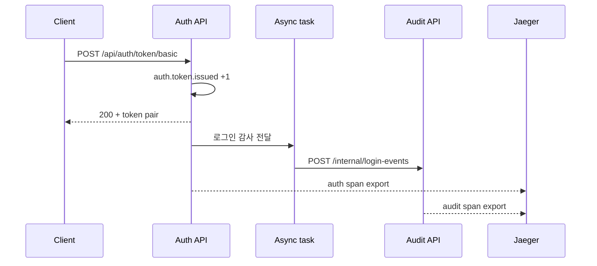
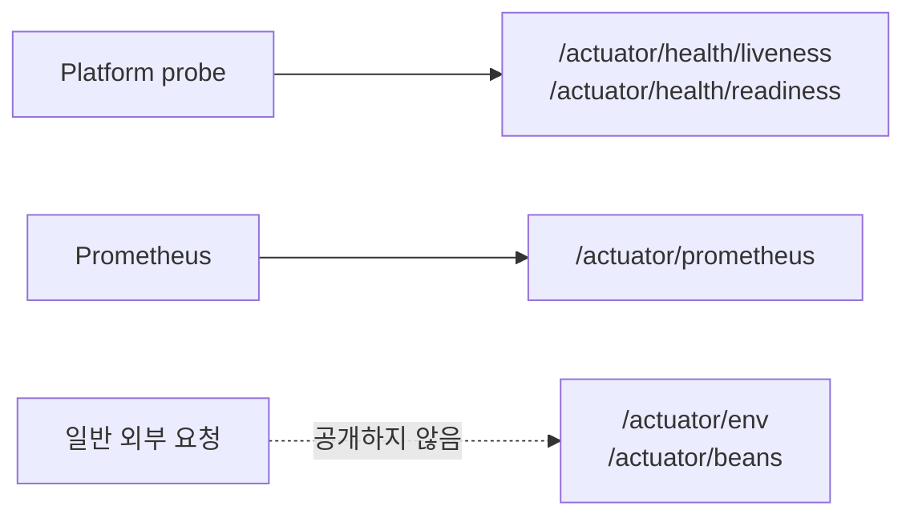
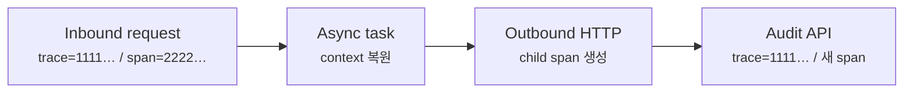
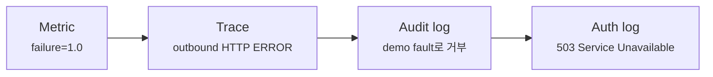

# Auth API에 metrics와 tracing을 실제로 어떻게 붙일까요?

> `/actuator/health`가 `UP`이라고 해서, **로그인 뒤 비동기 작업과 다른 service까지 추적할 수 있다는 뜻은 아니에요.**

Auth API가 정상 실행 중이에요. Health check도 `UP`이고, token 발급 요청도 `200 OK`를 돌려줘요. 그런데 로그인 감사(audit) 정보를 다른 service로 비동기 전송하다가 실패한다면 어떻게 알 수 있을까요?

서버가 살아 있다는 health만으로는 부족해요. 몇 번 성공하고 실패했는지 보여주는 metric, 한 요청이 어디를 지났는지 보여주는 trace, 그 요청에서 무슨 일이 있었는지 남기는 log가 서로 이어져야 하죠.

[앞 글](micrometer-tracing-logs-and-correlation-id.md)에서는 이 연결을 개념과 작은 code로 살펴봤어요. 이번에는 기존 `auth-api`에 직접 붙여 볼게요.

- Actuator는 `health`와 `prometheus`만 HTTP에 공개해요.
- Token 발급 성공과 감사 전달 결과를 custom Counter로 기록해요.
- `@Async` 작업이 작은 `audit-api`를 호출해요.
- OpenTelemetry trace를 Jaeger에서 확인해요.
- `@Async` 경계를 넘은 trace context가 유지되는지 test와 실행 결과로 확인해요.
- 마지막에는 실패 metric에서 출발해 trace와 양쪽 log로 원인을 좁혀요.

처음부터 모든 file을 외울 필요는 없어요. 이번 실습은 다음 checkpoint로 끊어 읽으면 돼요.

| checkpoint | 확인할 것 | 통과 기준 |
|---|---|---|
| 관측 입구 | Actuator와 Prometheus | Health probe와 metric만 공개돼요 |
| Application 신호 | Custom Counter | Token 발급 뒤 Counter가 `1.0`이 돼요 |
| 실행 경계 | `@Async`와 `RestClient` | Thread와 service가 바뀌어도 trace ID가 같아요 |
| 장애 조사 | Metric → trace → log | 실패 위치와 `503` 원인을 한 요청으로 이어요 |

!!! note "이번 글의 source 기준"
    이 글은 SOURCE-BACKED PRACTICE예요. Auth API 실습 프로젝트 저장소[`auth-api-first-commit`](https://github.com/kmj8843/aha-spring-boot-auth-api/tree/auth-api-first-commit)에서 시작해 아래 변경을 차례대로 적용해요.

    최종 상태에서는 `./gradlew test`로 20개 test를 실행하고, `./gradlew bootRun`, `./gradlew bootRunAudit`, `docker compose up -d`로 두 application과 Jaeger를 재현할 수 있어요.

    완성된 전체 코드는 Auth API 실습 프로젝트의 [`auth-api-observability`](https://github.com/kmj8843/aha-spring-boot-auth-api/tree/auth-api-observability)에서 확인할 수 있어요.

처음 repository를 받는다면 다음 명령으로 시작점을 고정해요. Java 21과 Docker가 먼저 준비되어 있어야 해요.

```bash
git clone https://github.com/kmj8843/aha-spring-boot-auth-api.git
cd aha-spring-boot-auth-api
git switch --detach auth-api-first-commit
```

!!! warning "고장 주입은 local 학습용이에요"
    `AUDIT_API_FORCE_FAILURE`와 `X-Demo-Failure`는 metric, trace, log를 따라가는 연습을 위한 장치예요. 운영 API에 누구나 켤 수 있는 실패 header를 그대로 두면 안 돼요. 실제 fault injection은 test 환경과 권한이 제한된 운영 도구에서만 사용해야 해요.

---

## 1. 먼저 어떤 요청을 관찰할지 정해요

기존 Auth API는 Basic credential을 access token과 refresh token으로 바꾸는 endpoint를 이미 갖고 있어요.

```text
POST /api/auth/token/basic
```

이번에는 이 요청이 성공한 뒤 두 가지 일을 추가할게요.

1. `auth.token.issued` Counter를 올려요.
2. 별도 thread에서 `audit-api`로 로그인 감사 event를 보내요.

두 번째 작업은 실패해도 token 발급 응답을 되돌리지 않아요. 그래서 사용자는 `200 OK`를 받았는데 감사 전달은 실패하는 장면이 생길 수 있어요. 바로 이런 **부분 실패**가 관측 신호를 연습하기 좋은 경계예요.



HTTP 응답은 먼저 성공할 수 있지만, 비동기 전달 결과는 나중에 결정돼요. 따라서 endpoint status만 보지 말고 `auth.audit.delivery` metric과 trace를 함께 봐야 해요.

---

## 2. 필요한 dependency와 Jaeger부터 준비해요

기존 Actuator에 OpenTelemetry, `RestClient`, Prometheus registry를 추가해요.

```text
auth-api/
├── ~ build.gradle
└── + compose.yaml
```

```gradle title="build.gradle" linenums="1" hl_lines="9 10 11"
dependencies {
    implementation 'org.springframework.boot:spring-boot-h2console'
    implementation 'org.springframework.boot:spring-boot-starter-actuator'
    implementation 'org.springframework.boot:spring-boot-starter-jdbc'
    implementation 'org.springframework.boot:spring-boot-starter-security'
    implementation 'org.springframework.boot:spring-boot-starter-security-oauth2-resource-server'
    implementation 'org.springframework.boot:spring-boot-starter-validation'
    implementation 'org.springframework.boot:spring-boot-starter-webmvc'
    implementation 'org.springframework.boot:spring-boot-starter-opentelemetry'
    implementation 'org.springframework.boot:spring-boot-starter-restclient'
    runtimeOnly 'io.micrometer:micrometer-registry-prometheus'
    runtimeOnly 'com.h2database:h2'
    testImplementation 'org.springframework.boot:spring-boot-starter-jdbc-test'
    testImplementation 'org.springframework.boot:spring-boot-starter-security-oauth2-resource-server-test'
    testImplementation 'org.springframework.boot:spring-boot-starter-security-test'
    testImplementation 'org.springframework.boot:spring-boot-starter-validation-test'
    testImplementation 'org.springframework.boot:spring-boot-starter-webmvc-test'
    testRuntimeOnly 'org.junit.platform:junit-platform-launcher'
}
```

각 dependency의 역할은 달라요.

| Dependency | 준비하는 것 |
|---|---|
| `starter-actuator` | Health, metric 같은 운영 endpoint |
| `starter-opentelemetry` | Micrometer tracing과 OTLP trace export |
| `starter-restclient` | 자동 설정된 `RestClient.Builder` |
| `micrometer-registry-prometheus` | `/actuator/prometheus` text 형식 |

Trace를 받을 backend는 Jaeger all-in-one container 하나로 시작해요.

```yaml title="compose.yaml" linenums="1"
services:
  jaeger:
    image: jaegertracing/all-in-one:1.76.0
    environment:
      COLLECTOR_OTLP_ENABLED: "true"
    ports:
      - "127.0.0.1:4318:4318"
      - "127.0.0.1:16686:16686"
```

`4318`은 application이 OTLP over HTTP로 span을 보내는 port예요. `16686`은 사람이 trace를 검색하는 Jaeger UI port예요. 앞의 `127.0.0.1`은 인증 없는 local 도구가 다른 network interface에 열리지 않게 해요.

!!! note "왜 Jaeger 하나만 띄우나요?"
    이번 목표는 collector, storage, query cluster를 운영하는 법이 아니라 trace가 실제로 service 경계를 넘는지 확인하는 일이에요. Jaeger all-in-one은 local 학습용으로는 충분하지만, 여러 instance와 장기 보존이 필요한 운영 구성을 대신하지는 않아요.

---

## 3. Actuator는 필요한 endpoint만 열어요

Dependency를 넣었다고 모든 Actuator endpoint가 HTTP로 공개되는 것은 아니에요. 어떤 endpoint를 열지는 별도로 정해야 해요.

```text
src/main/resources/
└── ~ application.yml
```

기존 datasource와 token 설정은 그대로 두고, local 실습 범위를 고정하는 `server.address`, `management`, `observability.audit` 영역을 다음처럼 맞춰요.

```yaml title="src/main/resources/application.yml" linenums="16" hl_lines="1 2 8 13-29"
server:
  address: 127.0.0.1

management:
  endpoints:
    web:
      exposure:
        include: health,prometheus
  endpoint:
    health:
      probes:
        enabled: true
  tracing:
    sampling:
      probability: 1.0
  opentelemetry:
    tracing:
      export:
        otlp:
          endpoint: ${OTEL_EXPORTER_OTLP_TRACES_ENDPOINT:http://localhost:4318/v1/traces}
  otlp:
    metrics:
      export:
        enabled: false

observability:
  audit:
    base-url: ${AUDIT_API_BASE_URL:http://localhost:8081}
    force-failure: ${AUDIT_API_FORCE_FAILURE:false}
```

`base-url`은 auth API가 audit API를 호출할 주소이고, `force-failure`는 local 장애 연습에서만 쓰는 switch예요. Local 실습에서는 모든 request를 확인하려고 sampling을 `1.0`으로 둬요. Metric은 OTLP로 보내지 않고 Prometheus endpoint에서 pull할 것이므로 OTLP metric export는 꺼요.

Auth API도 `127.0.0.1`에만 binding해 인증 없이 공개한 health와 Prometheus endpoint가 같은 host 밖으로 나가지 않게 했어요.

여기서 중요한 보안 경계는 `include`예요. `env`, `beans`, `configprops`, `heapdump`를 편하다는 이유로 전부 공개하면 설정과 application 내부 정보가 노출될 수 있어요.



Health와 metric도 운영에서는 management network나 별도 인증 경계 뒤에 두는 편이 좋아요. 이번 localhost 실습은 “노출 목록을 최소화한다”는 첫 경계만 다뤄요.

---

## 4. Auth API 쪽 file은 의존 순서대로 만들어요

JVM memory와 HTTP latency는 framework가 이미 잘 측정해요. 하지만 “token을 몇 번 발급했는가?”와 “감사 전달이 성공했는가?”는 application만 아는 사건이에요.

이번 절에서는 다음 다섯 file을 위에서 아래 순서대로 만들거나 수정해요.

```text
me.nvim.blog.auth/
├── ~ AuthApiApplication.java
├── observability/
│   ├── + AuditClientProperties.java
│   ├── + LoginAuditReporter.java
│   └── + TokenIssueMonitor.java
└── identity/presentation/
    └── ~ AuthTokenController.java
```

### 먼저 async 실행을 켜요

`@Async` method가 실제 별도 executor에서 실행되도록 main application에 `@EnableAsync`를 추가해요. 기존 file 전체에서 import와 Annotation 한 줄이 바뀌어요.

```java title="src/main/java/me/nvim/blog/auth/AuthApiApplication.java" linenums="1" hl_lines="6 10"
package me.nvim.blog.auth;

import org.springframework.boot.SpringApplication;
import org.springframework.boot.autoconfigure.SpringBootApplication;
import org.springframework.boot.context.properties.ConfigurationPropertiesScan;
import org.springframework.scheduling.annotation.EnableAsync;

@SpringBootApplication
@ConfigurationPropertiesScan
@EnableAsync
public class AuthApiApplication {

    public static void main(String[] args) {
        SpringApplication.run(AuthApiApplication.class, args);
    }

}
```

### Audit client 설정을 먼저 type으로 묶어요

`application.yml`의 `observability.audit` 값을 읽을 record를 만들어요. `baseUrl`을 단순 문자열이 아니라 `URI`로 binding하므로 잘못된 URI는 application 시작 경계에서 드러나요.

```java title="src/main/java/me/nvim/blog/auth/observability/AuditClientProperties.java" linenums="1"
package me.nvim.blog.auth.observability;

import java.net.URI;

import org.springframework.boot.context.properties.ConfigurationProperties;

@ConfigurationProperties("observability.audit")
public record AuditClientProperties(URI baseUrl, boolean forceFailure) {
}
```

Main application에 이미 `@ConfigurationPropertiesScan`이 있으므로 별도의 `@EnableConfigurationProperties`는 추가하지 않아요.

### 그다음 LoginAuditReporter를 만들어요

이제 위에서 만든 `AuditClientProperties`를 사용해 audit API 주소와 local 고장 주입 여부를 받아요. `LoginAuditReporter`는 두 번째 Counter와 outbound HTTP 호출을 맡아요.

```java title="src/main/java/me/nvim/blog/auth/observability/LoginAuditReporter.java" linenums="1"
package me.nvim.blog.auth.observability;

import org.slf4j.Logger;
import org.slf4j.LoggerFactory;
import org.springframework.scheduling.annotation.Async;
import org.springframework.stereotype.Component;
import org.springframework.web.client.RestClient;
import org.springframework.web.client.RestClientException;

import io.micrometer.core.instrument.Counter;
import io.micrometer.core.instrument.MeterRegistry;

@Component
public class LoginAuditReporter {

    private static final Logger log = LoggerFactory.getLogger(LoginAuditReporter.class);

    private final RestClient restClient;
    private final boolean forceFailure;
    private final Counter succeededDeliveryCounter;
    private final Counter failedDeliveryCounter;

    public LoginAuditReporter(
            RestClient.Builder restClientBuilder,
            AuditClientProperties properties,
            MeterRegistry meterRegistry) {
        this.restClient = restClientBuilder.baseUrl(properties.baseUrl().toString()).build();
        this.forceFailure = properties.forceFailure();
        this.succeededDeliveryCounter = meterRegistry.counter("auth.audit.delivery", "result", "success");
        this.failedDeliveryCounter = meterRegistry.counter("auth.audit.delivery", "result", "failure");
    }

    @Async
    public void report() {
        try {
            this.restClient.post()
                    .uri("/internal/login-events")
                    .header("X-Demo-Failure", Boolean.toString(this.forceFailure))
                    .retrieve()
                    .toBodilessEntity();
            this.succeededDeliveryCounter.increment();
            log.info("login audit delivered");
        }
        catch (RestClientException exception) {
            this.failedDeliveryCounter.increment();
            log.warn("login audit delivery failed", exception);
        }
    }
}
```

`@Async`가 caller와 다른 thread에서 실행하고, 자동 설정된 `RestClient.Builder`가 HTTP client instrumentation을 받아요. 결과 tag는 `success`, `failure` 두 값만 사용해 cardinality를 제한해요.

### Reporter를 사용하는 TokenIssueMonitor를 만들어요

`LoginAuditReporter`를 만든 다음에야 이를 생성자로 받는 monitor를 만들 수 있어요.

```java title="src/main/java/me/nvim/blog/auth/observability/TokenIssueMonitor.java" linenums="1"
package me.nvim.blog.auth.observability;

import org.springframework.stereotype.Component;

import io.micrometer.core.instrument.Counter;
import io.micrometer.core.instrument.MeterRegistry;

@Component
public class TokenIssueMonitor {

    private final Counter issuedTokenCounter;
    private final LoginAuditReporter loginAuditReporter;

    public TokenIssueMonitor(MeterRegistry meterRegistry, LoginAuditReporter loginAuditReporter) {
        this.issuedTokenCounter = Counter.builder("auth.token.issued")
                .description("Successfully issued Basic authentication tokens")
                .register(meterRegistry);
        this.loginAuditReporter = loginAuditReporter;
    }

    public void recordIssuedToken() {
        this.issuedTokenCounter.increment();
        this.loginAuditReporter.report();
    }
}
```

Counter는 계속 증가하는 누적값이에요. 현재 동시 로그인 수처럼 오르내리는 값을 Counter로 표현하면 안 돼요. 반면 “성공한 token 발급 횟수”는 사건이 발생할 때마다 하나씩 늘어나므로 잘 맞아요.

### 마지막으로 기존 controller 전체를 수정해요

Import, field, constructor parameter, Basic token method가 함께 달라져요. Method만 복사하면 `tokenIssueMonitor` field가 없어 compile되지 않으므로 아래 file 전체 모양을 확인하세요.

```java title="src/main/java/me/nvim/blog/auth/identity/presentation/AuthTokenController.java" linenums="1" hl_lines="11 17 19 21 26 28 29"
package me.nvim.blog.auth.identity.presentation;

import org.springframework.security.core.Authentication;
import org.springframework.web.bind.annotation.PostMapping;
import org.springframework.web.bind.annotation.RequestBody;
import org.springframework.web.bind.annotation.RestController;

import jakarta.validation.Valid;
import me.nvim.blog.auth.identity.application.IdentityFacade;
import me.nvim.blog.auth.identity.application.IssueTokenCommand;
import me.nvim.blog.auth.observability.TokenIssueMonitor;

@RestController
public class AuthTokenController {

    private final IdentityFacade identityFacade;
    private final TokenIssueMonitor tokenIssueMonitor;

    public AuthTokenController(IdentityFacade identityFacade, TokenIssueMonitor tokenIssueMonitor) {
        this.identityFacade = identityFacade;
        this.tokenIssueMonitor = tokenIssueMonitor;
    }

    @PostMapping("/api/auth/token/basic")
    public TokenResponse basic(Authentication authentication) {
        TokenResponse response = TokenResponse.from(
                this.identityFacade.issueToken(new IssueTokenCommand(authentication.getName())));
        this.tokenIssueMonitor.recordIssuedToken();
        return response;
    }

    @PostMapping("/api/auth/token/refresh")
    public TokenResponse refresh(@Valid @RequestBody RefreshTokenRequest request) {
        return TokenResponse.from(this.identityFacade.refreshToken(request.toCommand()));
    }
}
```

비밀번호가 틀리면 Spring Security filter 단계에서 controller까지 오지 않아요. 그래서 `auth.token.issued`는 **성공적으로 발급한 token 수**만 세요. Email, user ID, token 값도 metric tag로 넣지 않았어요. 계속 새로운 값이 생기는 식별자를 tag로 쓰면 time series가 폭발하고, 개인정보나 credential이 관측 system으로 새어 나갈 수 있기 때문이에요.

`./gradlew compileJava`를 실행해 여기까지 만든 다섯 file이 서로 연결되는지 확인해요.

```bash
./gradlew compileJava
```

## 5. 세 component가 한 요청에서 어떻게 움직이는지 확인해요

Token 발급 성공 뒤에는 다음 순서가 돼요.

1. `AuthTokenController`가 `TokenIssueMonitor.recordIssuedToken()`을 호출해요.
2. `TokenIssueMonitor`가 `auth.token.issued`를 올려요.
3. `LoginAuditReporter.report()`가 async executor로 넘어가요.
4. Audit API 응답에 따라 `auth.audit.delivery`의 `success` 또는 `failure`를 올려요.

!!! note "이 예제의 실패 처리 범위"
    실패를 Counter와 log에 남기고 token 발급 응답은 유지해요. 하지만 이것만으로 audit event의 신뢰성 있는 전달이 완성되지는 않아요. 운영에서는 outbox, message broker, retry와 DLQ, idempotency 같은 별도 설계가 필요해요. 이 주제는 뒤의 messaging 글에서 이어갈게요.

---

## 6. 작은 downstream application을 같은 project에서 실행해요

분산 trace를 확인하려면 실제로 process와 port가 다른 service가 하나 더 필요해요. 새 repository를 만들기보다 같은 source set 안에 최소 `audit-api` entry point를 둬요.

```text
auth-api/
├── ~ build.gradle
└── src/main/
    ├── java/me/nvim/blog/
    │   ├── auth/
    │   │   └── AuthApiApplication.java
    │   └── audit/
    │       ├── + AuditApiApplication.java
    │       └── + AuditController.java
    └── resources/
        └── + application-audit.yml
```

먼저 두 번째 application의 진입점을 만들어요. Audit API에는 datasource와 로그인 기능이 필요하지 않으므로 관련 자동 설정(auto-configuration)을 제외해요. 이 제외는 아래 local 학습용 service에만 적용되고 기존 Auth API의 보안 설정에는 영향을 주지 않아요.

```java title="src/main/java/me/nvim/blog/audit/AuditApiApplication.java" linenums="1"
package me.nvim.blog.audit;

import org.springframework.boot.SpringApplication;
import org.springframework.boot.autoconfigure.SpringBootApplication;
import org.springframework.boot.jdbc.autoconfigure.DataSourceAutoConfiguration;
import org.springframework.boot.security.autoconfigure.SecurityAutoConfiguration;
import org.springframework.boot.security.autoconfigure.actuate.web.servlet.ManagementWebSecurityAutoConfiguration;
import org.springframework.boot.security.autoconfigure.web.servlet.ServletWebSecurityAutoConfiguration;

@SpringBootApplication(exclude = {
        DataSourceAutoConfiguration.class,
        ManagementWebSecurityAutoConfiguration.class,
        SecurityAutoConfiguration.class,
        ServletWebSecurityAutoConfiguration.class
})
public class AuditApiApplication {

    public static void main(String[] args) {
        SpringApplication.run(AuditApiApplication.class, args);
    }
}
```

이제 Audit endpoint를 만들어요. 성공이면 `202 Accepted`, 고장 주입 header가 있으면 `503 Service Unavailable`을 돌려줘요.

```java title="src/main/java/me/nvim/blog/audit/AuditController.java" linenums="1"
package me.nvim.blog.audit;

import org.slf4j.Logger;
import org.slf4j.LoggerFactory;
import org.springframework.http.ResponseEntity;
import org.springframework.web.bind.annotation.PostMapping;
import org.springframework.web.bind.annotation.RequestHeader;
import org.springframework.web.bind.annotation.RestController;

@RestController
class AuditController {

    private static final Logger log = LoggerFactory.getLogger(AuditController.class);

    @PostMapping("/internal/login-events")
    ResponseEntity<Void> recordLoginEvent(
            @RequestHeader(name = "X-Demo-Failure", defaultValue = "false") boolean forceFailure) {
        if (forceFailure) {
            log.warn("login audit rejected by demo fault");
            return ResponseEntity.status(503).build();
        }

        log.info("login audit accepted");
        return ResponseEntity.accepted().build();
    }
}
```

Gradle에는 두 번째 application을 실행할 task를 추가해요.

```gradle title="build.gradle" linenums="44" hl_lines="1 2 3 4 5 6 7 8 9 10 11"
springBoot {
    mainClass = 'me.nvim.blog.auth.AuthApiApplication'
}

tasks.register('bootRunAudit', org.springframework.boot.gradle.tasks.run.BootRun) {
    group = 'application'
    description = 'Runs the downstream audit API on port 8081'
    mainClass = 'me.nvim.blog.audit.AuditApiApplication'
    classpath = sourceSets.main.runtimeClasspath
    args '--spring.profiles.active=audit'
}
```

```yaml title="src/main/resources/application-audit.yml" linenums="1"
spring:
  application:
    name: audit-api

server:
  address: 127.0.0.1
  port: 8081
```

Application 이름은 trace backend가 span을 어느 service로 묶을지 정하는 중요한 resource 정보예요. 두 process가 모두 `auth-api`라는 이름을 쓰면 trace는 이어져도 어느 service에서 처리했는지 구분하기 어려워져요. `server.address`도 loopback으로 고정했으므로 보안을 제외한 Audit API와 fault-injection header는 이 host 밖에서 접근할 수 없어요.

!!! warning "다른 host에서 호출할 때는 보안 설계가 먼저예요"
    `server.address`만 바꿔 이 Audit API를 network에 공개하면 안 돼요. 비local 환경에서는 service 간 mTLS나 제한된 credential, authorization, network policy를 적용하고, Jaeger와 OTLP endpoint에도 TLS와 인증·권한 제어를 붙여야 해요.

여기까지 만든 진입점과 controller가 연결되는지 다시 compile해요.

```bash
./gradlew compileJava
```

---

## 7. 실행하기 전에 `@Async`의 trace 경계를 이어요

여기까지 두 application의 source와 실행 task를 만들었지만, 아직 요청을 보내기 위한 준비가 모두 끝난 것은 아니에요. Auth API가 요청을 받는 thread와 `LoginAuditReporter`가 동작하는 thread가 다르기 때문이에요.

Trace context는 현재 실행 흐름에 매달려 있어요. 아무 설정 없이 `@Async` 경계를 넘으면 async log의 correlation ID가 비거나, Audit API에서 별도의 trace가 시작될 수 있어요. HTTP 호출은 `202 Accepted`로 성공할 수도 있어서 status만 봐서는 이 단절을 알아차리기 어렵고요.

그래서 지금 바로 application을 실행하지 않을게요. 먼저 async worker thread로 trace context를 전달할 준비를 마친 뒤, 8번에서 test로 전파를 증명하고 9~10번에서 두 application을 직접 실행해 같은 trace를 확인할 거예요.

Spring Boot 4.0.7에서는 thread가 바뀔 때 observation context를 복원할 `ContextPropagatingTaskDecorator` Bean을 직접 등록해야 해요.

```text
src/main/java/me/nvim/blog/auth/common/
└── config/
    └── + ContextPropagationConfig.java
```

```java title="src/main/java/me/nvim/blog/auth/common/config/ContextPropagationConfig.java" linenums="1"
package me.nvim.blog.auth.common.config;

import org.springframework.context.annotation.Bean;
import org.springframework.context.annotation.Configuration;
import org.springframework.core.task.support.ContextPropagatingTaskDecorator;

@Configuration(proxyBeanMethods = false)
public class ContextPropagationConfig {

    @Bean
    ContextPropagatingTaskDecorator contextPropagatingTaskDecorator() {
        return new ContextPropagatingTaskDecorator();
    }
}
```

이 Bean이 auto-configured `AsyncTaskExecutor`에 연결되면 submit 시점의 context를 capture하고, worker thread에서 다시 scope로 열어요.

| 기준 | Context propagation 설정 | 독자가 확인할 것 |
|---|---|---|
| Spring Boot 4.0.x | `ContextPropagatingTaskDecorator` Bean 등록 | Custom executor를 만들었다면 decorator를 실제로 연결했나요? |
| Spring Boot 4.1.x | Auto-configured executor라면 `spring.task.execution.propagate-context=true` 사용 가능 | 현재 project version과 4.1 문서를 섞지 않았나요? |

!!! warning "존재하지 않는 설정은 조용히 지나갈 수 있어요"
    Spring Boot 4.0.7에 4.1의 `spring.task.execution.propagate-context`를 적어도 application이 반드시 실패하는 것은 아니에요. 설정 file에 문자열이 있다는 사실보다 현재 version의 configuration metadata와 실제 trace를 확인해야 해요.

설정이 제대로 연결되면 trace ID는 유지되고 span ID는 경계마다 달라져야 해요. 하나의 요청 여정 안에서 auth의 async 작업과 audit의 HTTP 처리가 서로 다른 span으로 기록되기 때문이에요.



이 그림은 아직 실행 결과가 아니라, 다음 절부터 확인할 기대 흐름이에요. 단순히 downstream에 `traceparent` header가 존재하는지만 보면 새 trace가 시작된 경우도 통과해요. 그래서 test는 **알려진 incoming trace ID가 그대로 유지되는지** 비교해야 해요.

---

## 8. Test는 endpoint와 metric과 trace를 따로 증명해요

이번 변경 뒤 test는 모두 20개예요. 새 관측 test가 고정하는 계약은 다음과 같아요.

- Liveness와 readiness, Prometheus endpoint는 `200`이에요.
- `/actuator/env`는 노출되지 않아 `404`예요.
- Token 발급 뒤 `auth_token_issued_total 1.0`이 보여요.
- Async downstream request가 incoming trace ID를 유지해요.
- Audit API는 정상 요청에 `202`, 고장 주입 요청에 `503`을 돌려줘요.

이번 절에서 바꾸는 test file은 세 개예요.

```text
src/test/
├── java/me/nvim/blog/
│   ├── audit/
│   │   └── + AuditApiIntegrationTests.java
│   └── auth/observability/
│       └── + ObservabilityIntegrationTests.java
└── resources/
    └── ~ application-test.yml
```

먼저 기존 test profile에서 외부 trace export를 꺼요. 대부분의 test는 Jaeger가 없어도 독립적으로 실행되어야 하고, 실제 전파를 검증하는 test만 뒤에서 local test server 쪽으로 export를 다시 켜요.

```yaml title="src/test/resources/application-test.yml" linenums="1" hl_lines="5 6 7 8"
auth:
  token:
    refresh-token-hmac-secret: integration-test-refresh-token-hmac-secret

management:
  tracing:
    export:
      enabled: false
```

Audit API test는 고장 주입 switch의 두 결과를 각각 고정해요.

```java title="src/test/java/me/nvim/blog/audit/AuditApiIntegrationTests.java" linenums="1"
package me.nvim.blog.audit;

import static org.springframework.test.web.servlet.request.MockMvcRequestBuilders.post;
import static org.springframework.test.web.servlet.result.MockMvcResultMatchers.status;

import org.junit.jupiter.api.Test;
import org.springframework.beans.factory.annotation.Autowired;
import org.springframework.boot.test.context.SpringBootTest;
import org.springframework.boot.webmvc.test.autoconfigure.AutoConfigureMockMvc;
import org.springframework.test.context.ActiveProfiles;
import org.springframework.test.web.servlet.MockMvc;

@SpringBootTest(classes = AuditApiApplication.class)
@AutoConfigureMockMvc
@ActiveProfiles("test")
class AuditApiIntegrationTests {

    @Autowired
    private MockMvc mvc;

    @Test
    void acceptsLoginAuditWhenFailureSimulationIsOff() throws Exception {
        this.mvc.perform(post("/internal/login-events")
                .header("X-Demo-Failure", "false"))
                .andExpect(status().isAccepted());
    }

    @Test
    void rejectsLoginAuditWhenFailureSimulationIsOn() throws Exception {
        this.mvc.perform(post("/internal/login-events")
                .header("X-Demo-Failure", "true"))
                .andExpect(status().isServiceUnavailable());
    }
}
```

Auth API의 관측 test는 작은 HTTP server를 직접 열어요. 한 context는 audit request의 `traceparent`를 받고, 다른 context는 test 중 생성된 OTLP trace를 받아요. 그래서 외부 Jaeger 없이도 endpoint 노출, metric 증가, async trace 전파를 한 file에서 검증할 수 있어요.

```java title="src/test/java/me/nvim/blog/auth/observability/ObservabilityIntegrationTests.java" linenums="1"
package me.nvim.blog.auth.observability;

import static org.hamcrest.Matchers.containsString;
import static org.junit.jupiter.api.Assertions.assertNotNull;
import static org.junit.jupiter.api.Assertions.assertTrue;
import static org.springframework.security.test.web.servlet.request.SecurityMockMvcRequestPostProcessors.httpBasic;
import static org.springframework.test.web.servlet.request.MockMvcRequestBuilders.get;
import static org.springframework.test.web.servlet.request.MockMvcRequestBuilders.post;
import static org.springframework.test.web.servlet.result.MockMvcResultMatchers.content;
import static org.springframework.test.web.servlet.result.MockMvcResultMatchers.status;

import java.io.IOException;
import java.io.OutputStream;
import java.net.InetAddress;
import java.net.InetSocketAddress;
import java.util.UUID;
import java.util.concurrent.CountDownLatch;
import java.util.concurrent.TimeUnit;
import java.util.concurrent.atomic.AtomicReference;

import com.sun.net.httpserver.HttpServer;
import org.junit.jupiter.api.AfterAll;
import org.junit.jupiter.api.Test;
import org.springframework.beans.factory.annotation.Autowired;
import org.springframework.boot.test.context.SpringBootTest;
import org.springframework.boot.webmvc.test.autoconfigure.AutoConfigureMockMvc;
import org.springframework.http.MediaType;
import org.springframework.test.annotation.DirtiesContext;
import org.springframework.test.context.ActiveProfiles;
import org.springframework.test.context.DynamicPropertyRegistry;
import org.springframework.test.context.DynamicPropertySource;
import org.springframework.test.web.servlet.MockMvc;

@SpringBootTest
@AutoConfigureMockMvc
@ActiveProfiles("test")
@DirtiesContext(classMode = DirtiesContext.ClassMode.AFTER_EACH_TEST_METHOD)
class ObservabilityIntegrationTests {

    private static final String incomingTraceId = "11111111111111111111111111111111";
    private static final AtomicReference<CountDownLatch> auditRequestLatch =
            new AtomicReference<>(new CountDownLatch(0));
    private static final AtomicReference<String> receivedTraceparent = new AtomicReference<>();
    private static final HttpServer auditServer = startAuditServer();

    @Autowired
    private MockMvc mvc;

    @DynamicPropertySource
    static void auditServerProperties(DynamicPropertyRegistry registry) {
        registry.add("observability.audit.base-url",
                () -> "http://localhost:" + auditServer.getAddress().getPort());
        registry.add("management.tracing.export.enabled", () -> "true");
        registry.add("management.opentelemetry.tracing.export.otlp.endpoint",
                () -> "http://localhost:" + auditServer.getAddress().getPort() + "/v1/traces");
    }

    @AfterAll
    static void stopAuditServer() {
        auditServer.stop(0);
    }

    @Test
    void exposesHealthProbesAndPrometheusButNotEnvironment() throws Exception {
        this.mvc.perform(get("/actuator/health/liveness"))
                .andExpect(status().isOk());
        this.mvc.perform(get("/actuator/health/readiness"))
                .andExpect(status().isOk());
        this.mvc.perform(get("/actuator/prometheus"))
                .andExpect(status().isOk());
        this.mvc.perform(get("/actuator/env"))
                .andExpect(status().isNotFound());
    }

    @Test
    void tokenIssuanceIncrementsBusinessMetric() throws Exception {
        // Given
        String email = "metric-" + UUID.randomUUID() + "@example.com";

        // When
        this.mvc.perform(post("/api/auth/register")
                .contentType(MediaType.APPLICATION_JSON)
                .content("""
                        {"email":"%s","password":"correct-password","displayName":"Metric User"}
                        """.formatted(email)))
                .andExpect(status().isCreated());
        this.mvc.perform(post("/api/auth/token/basic").with(httpBasic(email, "correct-password")))
                .andExpect(status().isOk());

        // Then
        this.mvc.perform(get("/actuator/prometheus"))
                .andExpect(status().isOk())
                .andExpect(content().string(containsString("auth_token_issued_total 1.0")));
    }

    @Test
    void propagatesTraceContextAcrossAsyncAuditDelivery() throws Exception {
        // Given
        CountDownLatch requestReceived = new CountDownLatch(1);
        auditRequestLatch.set(requestReceived);
        receivedTraceparent.set(null);
        String email = "trace-" + UUID.randomUUID() + "@example.com";
        this.mvc.perform(post("/api/auth/register")
                .contentType(MediaType.APPLICATION_JSON)
                .content("""
                        {"email":"%s","password":"correct-password","displayName":"Trace User"}
                        """.formatted(email)))
                .andExpect(status().isCreated());

        // When
        this.mvc.perform(post("/api/auth/token/basic")
                .with(httpBasic(email, "correct-password"))
                .header("traceparent", "00-" + incomingTraceId + "-2222222222222222-01"))
                .andExpect(status().isOk());

        // Then
        assertTrue(requestReceived.await(5, TimeUnit.SECONDS));
        String traceparent = receivedTraceparent.get();
        assertNotNull(traceparent);
        assertTrue(traceparent.matches("00-" + incomingTraceId + "-[0-9a-f]{16}-01"));
    }

    private static HttpServer startAuditServer() {
        try {
            HttpServer server = HttpServer.create(
                    new InetSocketAddress(InetAddress.getLoopbackAddress(), 0), 0);
            server.createContext("/internal/login-events", exchange -> {
                receivedTraceparent.set(exchange.getRequestHeaders().getFirst("traceparent"));
                exchange.sendResponseHeaders(202, -1);
                exchange.close();
                auditRequestLatch.get().countDown();
            });
            server.createContext("/v1/traces", exchange -> {
                exchange.getRequestBody().transferTo(OutputStream.nullOutputStream());
                exchange.sendResponseHeaders(200, -1);
                exchange.close();
            });
            server.start();
            return server;
        }
        catch (IOException exception) {
            throw new IllegalStateException("Could not start test audit server", exception);
        }
    }
}
```

Trace test의 핵심은 고정된 incoming `traceparent`예요. 이 test는 decorator가 없을 때 실제로 실패했고, Bean을 등록한 뒤 통과했어요. `sleep`으로 대충 기다리지 않고 `CountDownLatch`로 downstream request 도착 신호를 기다리기 때문에 timing에 덜 흔들려요.

```bash
./gradlew test
```

검증 결과는 다음과 같았어요.

```text
BUILD SUCCESSFUL
```

---

## 9. 이제 세 process를 직접 실행해요

Terminal을 세 개 열어요.

첫 번째 terminal에서는 Jaeger를 띄워요.

```bash
docker compose up -d
```

두 번째 terminal에서는 audit API를 실행해요.

```bash
./gradlew bootRunAudit
```

세 번째 terminal에서는 auth API를 실행해요.

```bash
./gradlew bootRun
```

준비가 끝나면 두 application의 readiness를 확인해요.

```bash
curl -s http://localhost:8080/actuator/health/readiness
curl -s http://localhost:8081/actuator/health/readiness
```

실제 응답은 둘 다 같았어요.

```json
{"status":"UP"}
```

노출하지 않은 endpoint도 확인해요.

```bash
curl -s -o /dev/null -w '%{http_code}\n' \
  http://localhost:8080/actuator/env
```

```text
404
```

Health가 성공했다는 증거와 불필요한 endpoint가 닫혔다는 증거는 서로 다른 확인이에요.

---

## 10. 요청 하나가 metric과 두 service trace를 만들어요

먼저 새 사용자를 등록해요.

```bash
EMAIL="observability-$(date +%s)@example.com"

curl -s -o /dev/null -w 'register=%{http_code}\n' \
  -H 'Content-Type: application/json' \
  -d "{\"email\":\"$EMAIL\",\"password\":\"correct-password\",\"displayName\":\"Observability QA\"}" \
  http://localhost:8080/api/auth/register
```

Token 응답에는 credential이 있으므로 terminal이나 공용 임시 file에 남기지 않고 status만 확인해요. 나중에 trace를 바로 찾을 수 있도록 알려진 `traceparent`도 함께 보내요.

```bash
curl -s -o /dev/null -w 'token=%{http_code}\n' \
  -H 'traceparent: 00-11111111111111111111111111111111-2222222222222222-01' \
  -u "$EMAIL:correct-password" \
  -X POST http://localhost:8080/api/auth/token/basic
```

```text
register=201
token=200
```

Audit 전달은 별도 thread에서 끝나므로 바로 한 번 읽으면 Counter가 아직 `0.0`일 수 있어요. 최대 5초 동안 성공 Counter를 기다린 뒤 application metric만 골라 봐요.

```bash
for attempt in {1..20}; do
  METRICS="$(curl -fsS http://localhost:8080/actuator/prometheus)"
  grep -q '^auth_audit_delivery_total{result="success"} 1.0$' <<< "$METRICS" && break
  sleep 0.25
done

grep -E '^auth_(token_issued|audit_delivery)_total' <<< "$METRICS"
```

실제 정상 실행 결과예요.

```text
auth_audit_delivery_total{result="failure"} 0.0
auth_audit_delivery_total{result="success"} 1.0
auth_token_issued_total 1.0
```

Trace export와 Jaeger indexing도 비동기로 끝나요. [Jaeger UI](http://localhost:16686)에서 `auth-api` service를 선택하고 trace ID `11111111111111111111111111111111`을 검색하되, 바로 보이지 않으면 몇 초 뒤 다시 조회해요. 한 trace 안에 두 service가 보여요.

```text
traceID=11111111111111111111111111111111
audit-api
auth-api
http post /internal/login-events
http post /api/auth/token/basic
```

같은 trace ID 아래에 `auth-api`와 `audit-api`가 함께 있고, 각 HTTP 작업은 별도 span으로 보였어요. 이것이 “두 service 모두 trace가 있다”와 “한 요청이 두 service를 지나갔다”의 차이예요.

---

## 11. 작은 장애를 만들고 metric에서 원인까지 내려가요

마지막으로 audit API가 `503`을 돌려주는 local 고장 주입을 켜요. 실행 중인 auth API를 멈추고 다음 환경 변수와 함께 다시 시작해요.

```bash
AUDIT_API_FORCE_FAILURE=true ./gradlew bootRun
```

Auth API를 재시작하면 이 예제의 memory DB도 초기화돼요. 따라서 새 사용자를 다시 등록한 뒤, 알려진 두 번째 trace ID와 함께 token을 발급해요.

```bash
FAILURE_EMAIL="failure-$(date +%s)@example.com"

curl -s -o /dev/null -w 'register=%{http_code}\n' \
  -H 'Content-Type: application/json' \
  -d "{\"email\":\"$FAILURE_EMAIL\",\"password\":\"correct-password\",\"displayName\":\"Failure QA\"}" \
  http://localhost:8080/api/auth/register

curl -s -o /dev/null -w 'token=%{http_code}\n' \
  -H 'traceparent: 00-33333333333333333333333333333333-4444444444444444-01' \
  -u "$FAILURE_EMAIL:correct-password" \
  -X POST http://localhost:8080/api/auth/token/basic
```

이번에도 async 전달이 끝날 때까지 최대 5초 기다린 뒤 metric을 조회해요.

```bash
for attempt in {1..20}; do
  METRICS="$(curl -fsS http://localhost:8080/actuator/prometheus)"
  grep -q '^auth_audit_delivery_total{result="failure"} 1.0$' <<< "$METRICS" && break
  sleep 0.25
done

grep -E '^auth_(token_issued|audit_delivery)_total' <<< "$METRICS"
```

재시작했으므로 이 실행의 metric 결과는 다음과 같아요.

```text
auth_audit_delivery_total{result="failure"} 1.0
auth_audit_delivery_total{result="success"} 0.0
auth_token_issued_total 1.0
```

여기서 첫 번째 판단을 할 수 있어요.

- Token은 정상 발급됐어요.
- 하지만 감사 전달은 실패했어요.

Jaeger에서 같은 시각의 trace를 열면 outbound HTTP span이 `ERROR`였어요.

```text
traceID=33333333333333333333333333333333
auth-api
audit-api
http post    ERROR
```

마지막으로 같은 trace ID를 log에서 찾으면 양쪽 판단이 이어져요.

```text
audit-api [33333333333333333333333333333333-ef531d7dd81f930e]
login audit rejected by demo fault

auth-api [33333333333333333333333333333333-ed2457eab0776de9]
login audit delivery failed
HttpServerErrorException$ServiceUnavailable: 503 Service Unavailable
```

이번 장애 조사는 이렇게 흘렀어요.



Metric은 실패가 생겼다는 사실을 알려줬고, trace는 실패한 구간을 `auth-api → audit-api` 호출로 좁혔어요. 양쪽 log가 같은 trace ID로 실제 `503` 원인을 확인해 줬죠.

!!! tip "관측 신호마다 한 질문씩 맡겨 보세요"
    “몇 번 실패했지?”는 metric, “어느 구간이 실패했지?”는 trace, “그 구간에서 무슨 예외였지?”는 log에 먼저 물으면 도구를 무작정 오가는 일이 줄어요.

실습이 끝나면 `bootRun`과 `bootRunAudit`을 실행한 두 terminal에서 각각 `Ctrl+C`를 눌러 process를 멈춰요. 그다음 Jaeger container를 내려요.

```bash
docker compose down
```

---

## 12. 이 실습이 아직 해결하지 않은 것도 분명히 해요

이번 project는 관측 흐름을 보이기 위해 일부러 작게 만들었어요. 운영으로 가져가기 전에는 다음 경계를 더 설계해야 해요.

- Jaeger all-in-one 대신 보존 기간과 고가용성을 갖춘 collector와 backend가 필요해요.
- Sampling `1.0`은 traffic과 비용을 보고 낮추거나 정책형 sampling으로 바꿔야 해요.
- Prometheus endpoint는 public internet이 아니라 management network와 인증 경계 안에 둬야 해요.
- Async audit 실패를 log로만 남기면 재시작 뒤 복구할 수 없어요. Outbox나 broker를 사용한 durable delivery가 필요해요.
- Fault injection header는 local 실습 밖으로 노출하면 안 돼요.
- Token, password, email 같은 값이 log, metric tag, span attribute에 들어가지 않는지 수집 pipeline 전체에서 확인해야 해요.

관측성은 dependency를 추가하는 순간 완성되는 기능이 아니에요. **실패한 요청을 실제로 만들고, metric에서 trace로, trace에서 log로 이동할 수 있을 때** 비로소 운영 도구가 application 이야기와 연결돼요.

## 참고한 링크

- [Spring Boot 4.0 공식 문서: Observability와 context propagation](https://docs.spring.io/spring-boot/4.0/reference/actuator/observability.html)
- [Spring Boot 공식 문서: Tracing](https://docs.spring.io/spring-boot/reference/actuator/tracing.html)
- [Spring Boot 공식 문서: Metrics](https://docs.spring.io/spring-boot/reference/actuator/metrics.html)
- [Spring Boot 공식 문서: Actuator endpoint 노출과 보안](https://docs.spring.io/spring-boot/reference/actuator/endpoints.html)
- [Spring Boot 공식 문서: RestClient](https://docs.spring.io/spring-boot/reference/io/rest-client.html)
- [Jaeger 공식 문서: All-in-one 시작하기](https://www.jaegertracing.io/docs/1.76/getting-started/)

## 자, 정리해볼까요?

!!! abstract "오늘 우리가 배운 것"
    - Health는 application이 살아 있는지 답하지만, business 작업의 성공 횟수와 service 사이 실패까지 알려주지는 않아요.
    - `auth.token.issued`와 `auth.audit.delivery` Counter는 token 발급과 비동기 전달이라는 application 사건을 보여줘요.
    - Metric tag는 `success`, `failure`처럼 제한된 값만 사용하고 email, user ID, token 같은 고유값을 넣지 않아요.
    - 자동 설정된 `RestClient.Builder`를 사용해야 outbound HTTP instrumentation과 trace propagation이 적용돼요.
    - Spring Boot 4.0.x의 `@Async` context propagation에는 `ContextPropagatingTaskDecorator` Bean이 필요하고, 4.1.x의 편의 속성과 구분해야 해요.
    - Downstream에 trace가 있다는 사실만으로는 부족해요. Incoming trace ID와 같은지 비교해야 새 trace로 끊긴 문제를 잡을 수 있어요.
    - 실제 장애 조사는 metric으로 이상을 찾고, trace로 실패 구간을 좁힌 뒤, 같은 trace ID의 log로 원인을 확인하는 순서로 이어져요.

다음 글에서는 한 application 안의 component가 서로 강하게 엮이지 않고 사건을 알리는 방법을 살펴볼게요. `ApplicationEventPublisher`, `@EventListener`, `@TransactionalEventListener`가 transaction 전후에 언제 실행되고, 내부 event가 외부 message broker와는 왜 다른지 이어서 볼 거예요.
