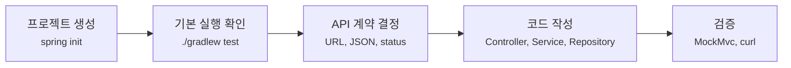
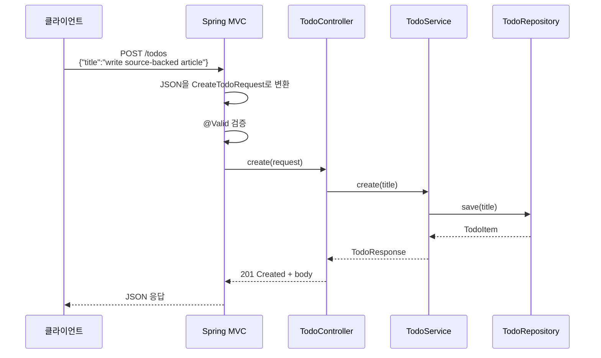
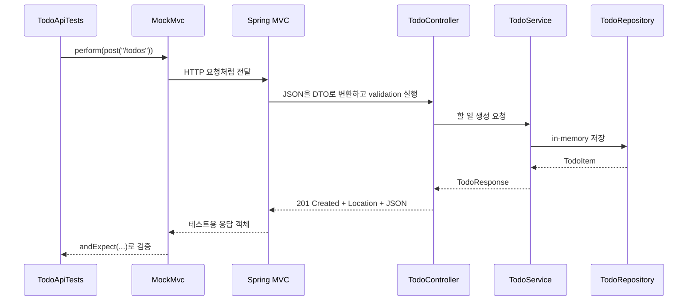

# Todo API 첫 커밋은 어떻게 차근차근 만들까요?

> 설명만 읽을 때는 알겠는데, 빈 폴더에서 첫 API를 만들려고 하면 갑자기 손이 멈춰요.

지금까지는 Spring Boot가 왜 필요한지, `main` 메서드가 어떻게 실행 중인 앱이 되는지, 빈(bean)이 어떻게 만들어지는지, 웹 요청이 Spring MVC 안에서 어떤 순서로 지나가는지, JSON 계약이 왜 중요한지까지 봤어요.

그런데 실제 프로젝트를 시작하면 질문이 바뀌어요.

> "프로젝트 생성 명령은 뭘 써야 하지?"  
> "생성된 파일 중 어디부터 봐야 하지?"  
> "컨트롤러부터 만들까요, 테스트부터 만들까요?"  
> "정말 서버가 뜨고 HTTP 응답이 나가는지 어디서 확인하죠?"

오늘은 작은 Todo API를 처음부터 만들어볼게요. 완성된 구조를 먼저 던져두고 설명하지 않고, **프로젝트 목표 → 프로젝트 초기화 → 생성된 파일 확인 → API 코드 작성 → 테스트 → 실행 확인** 순서로 갈 거예요.

!!! note "이번 글의 코드 기준"
    실습 코드는 [실습 프로젝트 저장소](https://github.com/kmj8843/aha-spring-boot-todo-api/tree/todo-api-first-commit)의 `main` 브랜치, `todo-api-first-commit` 태그를 기준으로 확인할 수 있어요.

    이 글의 실행 기준은 Spring Boot 4.0.7, Java 21, Gradle wrapper예요. 그래서 명령도 전역 `gradle`이 아니라 `./gradlew`를 사용해요.

---

## 오늘 만들 프로젝트의 목표부터 잡아볼게요

처음부터 "실무형 Todo 서비스"를 만들지는 않을 거예요. 인증, DB, pagination, OpenAPI, Docker까지 한 번에 넣으면 첫 커밋이 아니라 작은 프로젝트 하나가 되어버려요.

오늘 목표는 딱 이 정도예요.

| 목표 | 이번 글에서 만들 것 |
|---|---|
| 프로젝트 시작 | Spring CLI로 Java 21, Gradle 프로젝트 생성 |
| API 계약 | `GET /todos`, `POST /todos`, `GET /todos/{id}`, `PATCH /todos/{id}/done` |
| 입력 검증 | 빈 제목은 `400 Bad Request`로 거절 |
| 저장소 | 재시작하면 사라지는 인메모리 저장소 |
| 실행 증거 | `./gradlew test`와 실제 `curl` 응답 |

처음부터 DB를 붙이지 않는 이유는 단순해요. 오늘 보고 싶은 핵심은 데이터베이스가 아니라 **Spring MVC가 HTTP 요청을 Java 코드로 넘기고, Java 응답을 JSON으로 돌려주는 첫 흐름**이에요.



이 흐름의 핵심은 "먼저 프로젝트가 서 있는지 확인하고, 그다음 API를 얹는다"는 점이에요. 생성 직후부터 테스트가 통과해야 나중에 실패가 생겼을 때 우리가 추가한 코드 쪽을 의심할 수 있어요.

---

## Spring CLI로 프로젝트를 만들어요

먼저 Spring CLI로 프로젝트를 생성해요.

```bash
spring init \
  --type=gradle-project \
  --java-version=21 \
  --dependencies=web,validation \
  --group-id=me.nvim.blog \
  --artifact-id=todo-api \
  --name=todo-api \
  --package-name=me.nvim.blog.todo \
  --boot-version=4.0.7 \
  todo-api
```

명령이 끝나면 `todo-api` 프로젝트 폴더가 생겨요. 그 안으로 들어갑니다.

```bash
cd todo-api
```

여기서 옵션을 하나씩 보면 이런 뜻이에요.

| 옵션 | 의미 |
|---|---|
| `--type=gradle-project` | Gradle Groovy DSL 프로젝트로 생성해요 |
| `--java-version=21` | Java 21 기준 프로젝트로 생성해요 |
| `--dependencies=web,validation` | Spring MVC와 validation을 넣어요 |
| `--group-id`, `--artifact-id` | 빌드 좌표와 프로젝트 이름을 정해요 |
| `--package-name` | Java package 시작점을 정해요 |
| `--boot-version=4.0.7` | 사용할 Spring Boot 버전을 고정해요 |

!!! tip "왜 `--type=gradle-project`까지 쓰나요?"
    Spring Initializr는 Gradle Groovy와 Gradle Kotlin 프로젝트를 모두 만들 수 있어요. 그래서 `--build=gradle`만 쓰면 환경에 따라 더 구체적인 타입을 고르라는 메시지를 볼 수 있어요. 이 글에서는 독자가 같은 결과를 보도록 `--type=gradle-project`를 명시해요.

---

## 생성된 프로젝트에서 먼저 볼 파일은 많지 않아요

생성 직후에는 파일이 꽤 많아 보여요. 하지만 처음에는 아래 정도만 보면 충분해요.

| 파일 | 먼저 볼 이유 |
|---|---|
| `build.gradle` | Java 버전, Spring Boot 버전, starter 의존성을 확인해요 |
| `gradlew`, `gradlew.bat` | 프로젝트가 사용하는 Gradle wrapper예요 |
| `src/main/java/.../TodoApiApplication.java` | 앱을 시작하는 `main` 클래스예요 |
| `src/main/resources/application.properties` | 설정을 넣는 파일이에요 |
| `src/test/java/.../TodoApiApplicationTests.java` | 생성 직후 context test예요 |

`build.gradle`의 중요한 부분은 이렇게 생겼어요.

```gradle
plugins {
    id 'java'
    id 'org.springframework.boot' version '4.0.7'
    id 'io.spring.dependency-management' version '1.1.7'
}

java {
    toolchain {
        languageVersion = JavaLanguageVersion.of(21)
    }
}

dependencies {
    implementation 'org.springframework.boot:spring-boot-starter-validation'
    implementation 'org.springframework.boot:spring-boot-starter-webmvc'
    testImplementation 'org.springframework.boot:spring-boot-starter-validation-test'
    testImplementation 'org.springframework.boot:spring-boot-starter-webmvc-test'
    testRuntimeOnly 'org.junit.platform:junit-platform-launcher'
}
```

여기서 `spring-boot-starter-webmvc`가 Spring MVC, 내장 Tomcat, HTTP message conversion을 준비해요. `spring-boot-starter-validation`은 `@NotBlank`, `@Size` 같은 Jakarta Bean Validation을 연결해요.

생성 직후 테스트도 먼저 돌려볼게요.

```bash
./gradlew test
```

실제로 확인한 결과는 이렇게 끝났어요.

```text
> Task :test

BUILD SUCCESSFUL in 21s
```

아직 Todo API는 하나도 만들지 않았는데 테스트가 통과했죠. 이건 "프로젝트 생성 자체는 정상"이라는 기준점이에요.

---

## 이제 API 계약을 먼저 정해요

코드를 만들기 전에 오늘의 HTTP 계약을 먼저 잡아둘게요.

| 기능 | HTTP | 성공 응답 |
|---|---|---|
| 할 일 목록 조회 | `GET /todos` | `200 OK`와 JSON 배열 |
| 할 일 생성 | `POST /todos` | `201 Created`, `Location`, 생성된 JSON |
| 할 일 단건 조회 | `GET /todos/{id}` | `200 OK`와 JSON 객체 |
| 할 일 완료 처리 | `PATCH /todos/{id}/done` | `200 OK`와 변경된 JSON |

생성 요청 JSON은 이렇게 받을 거예요.

```json
{
  "title": "write source-backed article"
}
```

응답 JSON은 이렇게 생겼으면 해요.

```json
{
  "id": 1,
  "title": "write source-backed article",
  "done": false,
  "createdAt": "2026-07-02T06:46:23.513306873Z"
}
```

여기서 중요한 건 `createdAt` 값 자체가 아니에요. 서버가 Todo를 만들 때 생성 시각을 넣고, JSON 응답으로 직렬화한다는 점이에요.

---

## 소스 코드는 DTO와 TodoItem부터 만들어요

실제로 소스를 짤 때는 controller부터 만들면 바로 `TodoService`가 없다는 에러를 만나기 쉬워요. 그래서 먼저 가장 바깥 계약인 요청 DTO, 응답 DTO부터 만들고, 응답 DTO가 필요로 하는 내부 상태 객체 `TodoItem`도 같은 단계에서 만들게요.

지금 만들 파일은 여기예요.

```text
todo-api/
└── src/
    └── main/
        └── java/
            └── me.nvim.blog.todo/
                ├── TodoApiApplication.java
                └── todo/
                    ├── + CreateTodoRequest.java
                    ├── + TodoItem.java
                    └── + TodoResponse.java
```

`src/main/java/me/nvim/blog/todo/todo/CreateTodoRequest.java`를 만들어요. 클라이언트가 보내는 요청 모양이에요.

```java
package me.nvim.blog.todo.todo;

import jakarta.validation.constraints.NotBlank;
import jakarta.validation.constraints.Size;

public record CreateTodoRequest(
        @NotBlank
        @Size(max = 80)
        String title
) {
}
```

`@NotBlank`와 `@Size(max = 80)`는 이 객체가 HTTP 경계에서 검증되어야 한다는 표시예요. 이 객체가 service 깊숙한 곳까지 "검증 안 된 문자열"을 끌고 들어가지 않게 해줘요.

다음은 `src/main/java/me/nvim/blog/todo/todo/TodoItem.java`예요.

```java
package me.nvim.blog.todo.todo;

import java.time.Instant;

class TodoItem {

    private final long id;
    private final String title;
    private final Instant createdAt;
    private boolean done;

    TodoItem(long id, String title, Instant createdAt, boolean done) {
        this.id = id;
        this.title = title;
        this.createdAt = createdAt;
        this.done = done;
    }

    long id() {
        return this.id;
    }

    String title() {
        return this.title;
    }

    Instant createdAt() {
        return this.createdAt;
    }

    boolean done() {
        return this.done;
    }

    void markDone() {
        this.done = true;
    }
}
```

`TodoItem`은 HTTP 요청이나 응답 DTO가 아니에요. 서버 안에서 관리하는 Todo의 현재 상태예요. `done`이 바뀔 수 있기 때문에 record가 아니라 class로 만들었고, package-private으로 둬서 같은 `todo` package 안에서만 쓰게 했어요.

여기서 `TodoItem`을 먼저 만드는 이유가 있어요. 곧 만들 `TodoResponse`가 `TodoItem`을 받아 응답 DTO로 바꾸기 때문이에요. `TodoResponse`만 먼저 만들면 `TodoItem`을 찾을 수 없어서 컴파일 에러가 나겠죠. 그래서 이 둘은 같은 단계에서 만드는 게 좋아요.

이제 `src/main/java/me/nvim/blog/todo/todo/TodoResponse.java`를 만들어요.

```java
package me.nvim.blog.todo.todo;

import java.time.Instant;

public record TodoResponse(
        long id,
        String title,
        boolean done,
        Instant createdAt
) {

    static TodoResponse from(TodoItem todo) {
        return new TodoResponse(todo.id(), todo.title(), todo.done(), todo.createdAt());
    }
}
```

`TodoResponse`를 따로 두는 이유는 내부 저장 객체를 그대로 밖으로 내보내지 않기 위해서예요. 지금은 둘이 비슷해 보여도, 나중에 내부 상태와 API 응답 모양은 달라질 수 있어요.

여기까지 만들고 한 번 확인해도 돼요.

```bash
./gradlew test
```

아직 API endpoint는 없지만, 새로 만든 세 파일은 서로 필요한 참조를 모두 갖고 있어서 컴파일 에러가 나지 않아야 해요.

---

## 저장 경계와 시간을 준비해요

다음은 저장 경계를 만들 차례예요. 아직 DB는 쓰지 않고 메모리에 저장할 거예요. 생성 시각을 넣기 위해 `Clock`도 빈(bean)으로 준비해요.

이번 단계에서 만들 파일은 두 개예요.

```text
todo-api/
└── src/
    └── main/
        └── java/
            └── me.nvim.blog.todo/
                ├── TodoApiApplication.java
                └── todo/
                    ├── CreateTodoRequest.java
                    ├── + TimeConfig.java
                    ├── TodoItem.java
                    ├── + TodoRepository.java
                    └── TodoResponse.java
```

먼저 `src/main/java/me/nvim/blog/todo/todo/TimeConfig.java`를 만들어요.

```java
package me.nvim.blog.todo.todo;

import java.time.Clock;

import org.springframework.context.annotation.Bean;
import org.springframework.context.annotation.Configuration;

@Configuration
class TimeConfig {

    @Bean
    Clock clock() {
        return Clock.systemUTC();
    }
}
```

그리고 `src/main/java/me/nvim/blog/todo/todo/TodoRepository.java`를 만들어요.

```java
package me.nvim.blog.todo.todo;

import java.time.Clock;
import java.util.ArrayList;
import java.util.List;
import java.util.Optional;
import java.util.concurrent.ConcurrentHashMap;
import java.util.concurrent.ConcurrentMap;
import java.util.concurrent.atomic.AtomicLong;

import org.springframework.stereotype.Repository;

@Repository
public class TodoRepository {

    private final AtomicLong sequence = new AtomicLong();
    private final ConcurrentMap<Long, TodoItem> todos = new ConcurrentHashMap<>();
    private final Clock clock;

    public TodoRepository(Clock clock) {
        this.clock = clock;
    }

    public TodoItem save(String title) {
        long id = this.sequence.incrementAndGet();
        TodoItem todo = new TodoItem(id, title, this.clock.instant(), false);
        this.todos.put(id, todo);
        return todo;
    }

    public List<TodoItem> findAll() {
        return new ArrayList<>(this.todos.values());
    }

    public Optional<TodoItem> findById(long id) {
        return Optional.ofNullable(this.todos.get(id));
    }
}
```

"DB도 없는데 repository라는 이름을 써도 되나요?"라는 생각이 들 수 있어요.

괜찮아요. 여기서 repository는 JPA라는 특정 기술 이름이 아니라 **저장 경계**예요. 지금은 메모리이고, 나중에는 JDBC, JPA, Redis, 외부 API가 될 수 있어요. 첫 커밋에서 경계를 만들어두면 나중에 저장 방식을 바꿀 때 controller부터 다시 흔들 필요가 줄어들어요.

다만 한계도 분명히 알아야 해요.

| 이번 선택 | 한계 |
|---|---|
| 메모리 저장소 | 앱을 재시작하면 데이터가 사라져요 |
| `AtomicLong` id | 여러 서버 인스턴스에서는 id를 공유할 수 없어요 |
| transaction 없음 | 여러 저장 작업을 하나로 묶는 보장이 없어요 |
| 단순 상태 변경 | 복잡한 domain rule은 아직 다루지 않아요 |

여기서도 확인할 수 있어요.

```bash
./gradlew test
```

repository는 `TodoItem`과 `Clock`을 모두 찾을 수 있고, `Clock` 빈도 준비되어 있어서 context test가 깨지지 않아야 해요.

---

## Service에서 Todo 흐름을 연결해요

이제 application behavior를 담는 service를 만들어요.

```text
todo-api/
└── src/
    └── main/
        └── java/
            └── me.nvim.blog.todo/
                ├── TodoApiApplication.java
                └── todo/
                    ├── CreateTodoRequest.java
                    ├── TimeConfig.java
                    ├── TodoItem.java
                    ├── TodoRepository.java
                    ├── TodoResponse.java
                    └── + TodoService.java
```

`src/main/java/me/nvim/blog/todo/todo/TodoService.java`를 만들어요.

```java
package me.nvim.blog.todo.todo;

import java.util.Comparator;
import java.util.List;

import org.springframework.http.HttpStatus;
import org.springframework.stereotype.Service;
import org.springframework.web.server.ResponseStatusException;

@Service
public class TodoService {

    private final TodoRepository todoRepository;

    public TodoService(TodoRepository todoRepository) {
        this.todoRepository = todoRepository;
    }

    public List<TodoResponse> findAll() {
        return this.todoRepository.findAll().stream()
                .sorted(Comparator.comparingLong(TodoItem::id))
                .map(TodoResponse::from)
                .toList();
    }

    public TodoResponse create(String title) {
        return TodoResponse.from(this.todoRepository.save(title));
    }

    public TodoResponse findById(long id) {
        return this.todoRepository.findById(id)
                .map(TodoResponse::from)
                .orElseThrow(() -> new ResponseStatusException(HttpStatus.NOT_FOUND, "Todo not found"));
    }

    public TodoResponse markDone(long id) {
        TodoItem todo = this.todoRepository.findById(id)
                .orElseThrow(() -> new ResponseStatusException(HttpStatus.NOT_FOUND, "Todo not found"));
        todo.markDone();
        return TodoResponse.from(todo);
    }
}
```

처음에는 service가 얇아 보여요. 그래도 괜찮아요. controller가 HTTP 계약을 맡고, service가 "Todo를 만든다", "완료 처리한다", "없으면 404로 본다" 같은 application behavior를 맡도록 자리를 나누는 게 목적이에요.

여기서도 한 번 확인해요.

```bash
./gradlew test
```

`TodoService`는 이미 존재하는 `TodoRepository`, `TodoItem`, `TodoResponse`만 참조하므로 이 단계에서도 중간 에러 없이 지나갈 수 있어요.

---

## 마지막에 Controller를 붙여요

이제 HTTP endpoint를 열 차례예요. controller를 마지막에 만드는 이유는 간단해요. controller는 DTO와 service를 모두 참조하니까, 앞 단계가 준비된 뒤 붙이는 편이 가장 덜 헷갈려요.

```text
todo-api/
└── src/
    └── main/
        └── java/
            └── me.nvim.blog.todo/
                ├── TodoApiApplication.java
                └── todo/
                    ├── CreateTodoRequest.java
                    ├── TimeConfig.java
                    ├── + TodoController.java
                    ├── TodoItem.java
                    ├── TodoRepository.java
                    ├── TodoResponse.java
                    └── TodoService.java
```

`src/main/java/me/nvim/blog/todo/todo/TodoController.java`를 만들어요.

```java
package me.nvim.blog.todo.todo;

import java.net.URI;
import java.util.List;

import org.springframework.http.ResponseEntity;
import org.springframework.web.bind.annotation.GetMapping;
import org.springframework.web.bind.annotation.PatchMapping;
import org.springframework.web.bind.annotation.PathVariable;
import org.springframework.web.bind.annotation.PostMapping;
import org.springframework.web.bind.annotation.RequestBody;
import org.springframework.web.bind.annotation.RequestMapping;
import org.springframework.web.bind.annotation.RestController;
import org.springframework.web.servlet.support.ServletUriComponentsBuilder;

import jakarta.validation.Valid;

@RestController
@RequestMapping("/todos")
public class TodoController {

    private final TodoService todoService;

    public TodoController(TodoService todoService) {
        this.todoService = todoService;
    }

    @GetMapping
    public List<TodoResponse> findAll() {
        return this.todoService.findAll();
    }

    @PostMapping
    public ResponseEntity<TodoResponse> create(@Valid @RequestBody CreateTodoRequest request) {
        TodoResponse created = this.todoService.create(request.title());
        URI location = ServletUriComponentsBuilder.fromCurrentRequest()
                .path("/{id}")
                .buildAndExpand(created.id())
                .toUri();
        return ResponseEntity.created(location).body(created);
    }

    @GetMapping("/{id}")
    public TodoResponse findById(@PathVariable long id) {
        return this.todoService.findById(id);
    }

    @PatchMapping("/{id}/done")
    public TodoResponse markDone(@PathVariable long id) {
        return this.todoService.markDone(id);
    }
}
```

controller는 HTTP와 가까운 결정을 해요.

- 어떤 URL을 열지
- 어떤 method를 받을지
- request body를 어떤 DTO로 읽을지
- 성공했을 때 status를 무엇으로 줄지
- `Location` header를 넣을지

반대로 "Todo를 어떻게 저장하고 완료 처리할지"는 controller가 직접 알 필요가 없어요. 그 일은 service로 넘겨요.



이 그림에서 우리가 직접 호출하지 않은 일이 많죠. JSON 변환, validation 실행, controller method 호출, response body 쓰기는 Spring MVC가 맡아요. 우리는 그 흐름에 필요한 경계를 코드로 알려주는 거예요.

controller까지 붙였으면 다시 확인해요.

```bash
./gradlew test
```

이제 실제 endpoint도 열려 있지만, 아직 API 계약을 강하게 검증하는 테스트는 없어요. 다음 단계에서 그 테스트를 추가할게요.

---

## 설정에 Problem Details를 켜요

validation 실패 응답은 그냥 400만 내려도 되지만, 이 시리즈에서는 REST API 글에서 본 Problem Details 흐름을 같이 확인할 거예요.

이번 단계에서 수정할 파일은 하나예요.

```text
todo-api/
└── src/
    └── main/
        ├── java/
        │   └── me.nvim.blog.todo/
        │       ├── TodoApiApplication.java
        │       └── todo/
        │           ├── CreateTodoRequest.java
        │           ├── TimeConfig.java
        │           ├── TodoController.java
        │           ├── TodoItem.java
        │           ├── TodoRepository.java
        │           ├── TodoResponse.java
        │           └── TodoService.java
        └── resources/
            └── ~ application.properties
```

`src/main/resources/application.properties`에 한 줄을 추가해요.

```properties
spring.application.name=todo-api
spring.mvc.problemdetails.enabled=true
```

이제 Spring MVC가 처리하는 기본 에러 응답에서 `application/problem+json` 형태를 확인할 수 있어요. field별 상세 에러 계약은 아직 만들지 않을 거예요. 첫 커밋에서는 "입력 검증 실패가 HTTP 400 문제 응답이 된다"는 경계까지만 잡아요.

---

## 테스트로 첫 API 계약을 붙잡아요

마지막으로 API 테스트를 추가해요. 이 시점에는 controller, service, repository, DTO가 모두 만들어져 있으니 테스트 파일을 추가해도 참조 에러가 나지 않아요.

```text
todo-api/
└── src/
    ├── main/
    │   └── java/
    │       └── me.nvim.blog.todo/
    │           ├── TodoApiApplication.java
    │           └── todo/
    │               ├── CreateTodoRequest.java
    │               ├── TimeConfig.java
    │               ├── TodoController.java
    │               ├── TodoItem.java
    │               ├── TodoRepository.java
    │               ├── TodoResponse.java
    │               └── TodoService.java
    └── test/
        └── java/
            └── me.nvim.blog.todo/
                ├── TodoApiApplicationTests.java
                └── + TodoApiTests.java
```

Boot 4의 Web MVC 테스트에서는 `AutoConfigureMockMvc` import가 아래 package에 있어요.

```java
import org.springframework.boot.webmvc.test.autoconfigure.AutoConfigureMockMvc;
```

`src/test/java/me/nvim/blog/todo/TodoApiTests.java`를 만들어요.

```java
package me.nvim.blog.todo;

import static org.hamcrest.Matchers.endsWith;
import static org.hamcrest.Matchers.hasSize;
import static org.springframework.test.web.servlet.request.MockMvcRequestBuilders.get;
import static org.springframework.test.web.servlet.request.MockMvcRequestBuilders.patch;
import static org.springframework.test.web.servlet.request.MockMvcRequestBuilders.post;
import static org.springframework.test.web.servlet.result.MockMvcResultMatchers.header;
import static org.springframework.test.web.servlet.result.MockMvcResultMatchers.jsonPath;
import static org.springframework.test.web.servlet.result.MockMvcResultMatchers.status;

import org.junit.jupiter.api.Test;
import org.springframework.beans.factory.annotation.Autowired;
import org.springframework.boot.test.context.SpringBootTest;
import org.springframework.boot.webmvc.test.autoconfigure.AutoConfigureMockMvc;
import org.springframework.http.MediaType;
import org.springframework.test.annotation.DirtiesContext;
import org.springframework.test.web.servlet.MockMvc;

@SpringBootTest
@AutoConfigureMockMvc
@DirtiesContext(classMode = DirtiesContext.ClassMode.AFTER_EACH_TEST_METHOD)
class TodoApiTests {

    @Autowired
    private MockMvc mvc;

    @Test
    void createsTodoAndReturnsLocation() throws Exception {
        this.mvc.perform(post("/todos")
                        .contentType(MediaType.APPLICATION_JSON)
                        .content("""
                                {"title":"first blog todo"}
                                """))
                .andExpect(status().isCreated())
                .andExpect(header().string("Location", endsWith("/todos/1")))
                .andExpect(jsonPath("$.id").value(1))
                .andExpect(jsonPath("$.title").value("first blog todo"))
                .andExpect(jsonPath("$.done").value(false));
    }

    @Test
    void rejectsBlankTitle() throws Exception {
        this.mvc.perform(post("/todos")
                        .contentType(MediaType.APPLICATION_JSON)
                        .content("""
                                {"title":" "}
                                """))
                .andExpect(status().isBadRequest());
    }

    @Test
    void listsAndMarksTodoDone() throws Exception {
        this.mvc.perform(post("/todos")
                        .contentType(MediaType.APPLICATION_JSON)
                        .content("""
                                {"title":"write source-backed article"}
                                """))
                .andExpect(status().isCreated());

        this.mvc.perform(get("/todos"))
                .andExpect(status().isOk())
                .andExpect(jsonPath("$", hasSize(1)))
                .andExpect(jsonPath("$[0].done").value(false));

        this.mvc.perform(patch("/todos/1/done"))
                .andExpect(status().isOk())
                .andExpect(jsonPath("$.done").value(true));
    }
}
```

여기서 테스트가 "된다"만 보고 넘어가면 아쉬워요. 이 파일은 실제 서버 포트를 열지는 않지만, Spring Boot 앱을 테스트용으로 띄우고 HTTP 요청처럼 controller까지 밀어 넣어요.

먼저 class 위와 field에 붙은 Annotation부터 볼게요.

| 코드 | 하는 일 |
|---|---|
| `@SpringBootTest` | `TodoApiApplication`을 기준으로 Spring Boot application context를 만들어요. Controller, service, repository, validation 설정까지 실제 앱에 가깝게 올라와요. |
| `@AutoConfigureMockMvc` | 테스트에서 `MockMvc`를 사용할 수 있게 준비해요. 내장 Tomcat 포트를 열지 않고도 Spring MVC 요청 흐름을 테스트할 수 있어요. |
| `@DirtiesContext(classMode = AFTER_EACH_TEST_METHOD)` | 테스트 메서드가 하나 끝날 때마다 context를 더럽혀졌다고 표시해요. 그래서 다음 테스트는 repository의 in-memory 상태가 남은 context를 재사용하지 않아요. |
| `@Autowired` | Spring이 만들어둔 `MockMvc` 객체를 이 field에 넣어줘요. 테스트 코드가 직접 `new MockMvc(...)`를 하지 않는 이유가 여기 있어요. |
| `@Test` | JUnit이 실행할 테스트 메서드라는 표시예요. Gradle의 `test` 작업은 이 Annotation이 붙은 메서드를 찾아 실행해요. |

조금 더 깊게 보면, 이 테스트는 "controller 메서드를 직접 호출하는 테스트"가 아니에요. 요청을 문자열과 header로 만들고, Spring MVC가 실제 요청을 처리할 때 쓰는 경로를 지나가게 해요.



그래서 `MockMvc` 테스트는 빠르면서도 꽤 넓은 경계를 잡아요. JSON 변환, validation, URL mapping, HTTP status, header, response body까지 한 번에 확인할 수 있죠.

아래 메서드 호출들도 각각 역할이 있어요.

| 코드 | 확인하는 기능 |
|---|---|
| `post("/todos")`, `get("/todos")`, `patch("/todos/1/done")` | 실제 HTTP method와 URL을 테스트 요청으로 만들어요. Controller의 `@PostMapping`, `@GetMapping`, `@PatchMapping`과 맞아야 해요. |
| `.contentType(MediaType.APPLICATION_JSON)` | request body가 JSON이라는 header를 붙여요. 이 값이 있어야 Spring MVC가 JSON body를 Java DTO로 읽는 흐름이 자연스러워요. |
| `.content("""...""")` | 클라이언트가 보낸 JSON body를 넣어요. 여기서는 `CreateTodoRequest`로 변환될 입력이에요. |
| `.andExpect(status().isCreated())` | HTTP status가 `201 Created`인지 확인해요. "생성 성공"이라는 API 계약을 붙잡는 부분이에요. |
| `.andExpect(status().isBadRequest())` | validation 실패가 `400 Bad Request`로 바뀌는지 확인해요. 빈 제목을 service까지 보내지 않는다는 뜻이기도 해요. |
| `.andExpect(header().string("Location", endsWith("/todos/1")))` | 생성 응답에 새 리소스 위치가 들어가는지 확인해요. `Location` header는 REST API에서 생성된 자원을 다시 찾을 단서가 돼요. |
| `.andExpect(jsonPath("$.title").value("first blog todo"))` | JSON 응답 body 안의 값을 확인해요. `$.title`은 최상위 객체의 `title` field를 뜻해요. |
| `.andExpect(jsonPath("$", hasSize(1)))` | 목록 응답이 배열이고, 항목이 1개인지 확인해요. `hasSize`는 Hamcrest matcher예요. |

정리하면 이 파일은 "service 로직만 맞나요?"를 보는 테스트가 아니에요. **우리 API를 클라이언트가 HTTP로 불렀을 때 약속한 모양으로 응답하나요?**를 보는 테스트예요.

테스트를 다시 실행해요.

```bash
./gradlew test
```

실제로 확인한 결과는 이렇게 끝났어요.

```text
> Task :test

BUILD SUCCESSFUL in 6s
```

이 테스트가 모든 설계를 증명하지는 않아요. 하지만 적어도 첫 커밋의 HTTP 계약은 붙잡아요.

| 테스트 | 붙잡는 계약 |
|---|---|
| 생성 요청 | `POST /todos`가 `201 Created`, `Location`, JSON body를 돌려줘요 |
| 빈 제목 요청 | validation 실패가 `400 Bad Request`가 돼요 |
| 목록과 완료 처리 | 생성된 Todo가 조회되고 `PATCH /todos/{id}/done`으로 변경돼요 |

---

## 실제 서버도 띄워봐요

테스트만 통과했다고 끝내지 않고, 실제 HTTP 서버를 띄워볼게요.

```bash
./gradlew bootRun --args='--server.port=18080'
```

실행 로그에서는 이런 줄을 확인했어요.

```text
:: Spring Boot ::                (v4.0.7)
Starting TodoApiApplication using Java 21.0.5
Tomcat started on port 18080 (http) with context path '/'
Started TodoApiApplication in 1.563 seconds
```

이제 생성 요청을 보내요.

```bash
curl -i -X POST http://localhost:18080/todos \
  -H 'Content-Type: application/json' \
  -d '{"title":"write source-backed article"}'
```

응답은 이렇게 왔어요.

```http
HTTP/1.1 201
Location: http://localhost:18080/todos/1
Content-Type: application/json

{"id":1,"title":"write source-backed article","done":false,"createdAt":"2026-07-02T06:46:23.513306873Z"}
```

빈 제목을 보내면 validation이 동작해요.

```bash
curl -i -X POST http://localhost:18080/todos \
  -H 'Content-Type: application/json' \
  -d '{"title":" "}'
```

응답은 이렇게 확인했어요.

```http
HTTP/1.1 400
Content-Type: application/problem+json

{"detail":"Invalid request content.","instance":"/todos","status":400,"title":"Bad Request"}
```

목록 조회와 완료 처리도 확인해요.

```http
GET /todos

[{"id":1,"title":"write source-backed article","done":false,"createdAt":"2026-07-02T06:46:23.513306873Z"}]
```

```http
PATCH /todos/1/done

{"id":1,"title":"write source-backed article","done":true,"createdAt":"2026-07-02T06:46:23.513306873Z"}
```

여기까지 오면 첫 커밋은 단순한 코드 묶음이 아니에요. 프로젝트 생성, wrapper 테스트, API 계약, validation, JSON 응답, 실제 HTTP 확인까지 하나의 기준점으로 남아요.

---

## 이번 커밋에서 일부러 하지 않은 것들

이번 글은 첫 커밋이라서 일부러 많은 것을 미뤘어요.

| 아직 하지 않은 것 | 왜 미뤘나요? |
|---|---|
| DB 저장 | 먼저 Spring MVC와 API 경계를 보려는 글이에요 |
| 인증과 권한 | 사용자와 Todo 소유자 개념이 생긴 뒤 다루는 편이 좋아요 |
| field별 validation error body | error contract를 별도로 설계해야 해요 |
| pagination | 목록이 커지는 상황을 아직 만들지 않았어요 |
| OpenAPI 문서화 | API 모양이 조금 더 안정된 뒤 붙이는 편이 자연스러워요 |
| Docker image | 실행 경계보다 첫 코드 경계가 먼저예요 |

이건 빠뜨린 목록이 아니라 다음 글들이 들어올 자리예요. 첫 커밋은 작아야 해요. 대신 나중에 자랄 방향이 보여야 해요.

---

## 참고한 링크

- [Spring Boot Reference - Spring Boot CLI](https://docs.spring.io/spring-boot/cli/using-the-cli.html)
- [Spring Boot Reference - Developing Your First Spring Boot Application](https://docs.spring.io/spring-boot/tutorial/first-application/index.html)
- [Spring Boot Reference - Spring MVC](https://docs.spring.io/spring-boot/reference/web/servlet.html)
- [Spring Boot Reference - Validation](https://docs.spring.io/spring-boot/reference/io/validation.html)

---

## 자, 정리해볼까요?

!!! abstract "오늘 우리가 배운 것"
    - 첫 실습 글은 완성된 구조를 먼저 설명하기보다 프로젝트 목표, 초기화, 생성 파일 확인, 코드 작성, 테스트, 실행 확인 순서로 가는 편이 좋아요.
    - Spring CLI로 `todo-api` 프로젝트를 만들고, Java 21과 Gradle wrapper 기준으로 시작했어요.
    - `spring-boot-starter-webmvc`는 Spring MVC와 HTTP/JSON 처리 흐름을 준비하고, `spring-boot-starter-validation`은 Bean Validation을 연결해요.
    - controller는 HTTP 계약을 맡고, service는 application behavior를 맡고, repository는 저장 경계를 맡아요.
    - `./gradlew test`와 실제 `curl` 응답을 함께 확인해야 첫 커밋이 말뿐인 예제가 아니라 실행 가능한 기준점이 돼요.

다음 글에서는 Spring MVC와 WebFlux를 비교해볼 거예요. 둘 다 "웹 요청을 처리한다"는 말은 같지만, 요청을 붙잡는 모델과 확장 방식은 꽤 다르게 생겼어요.
