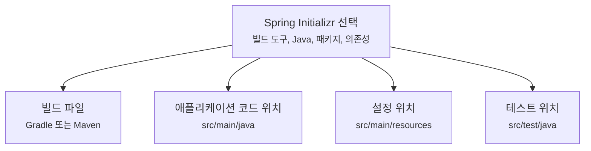
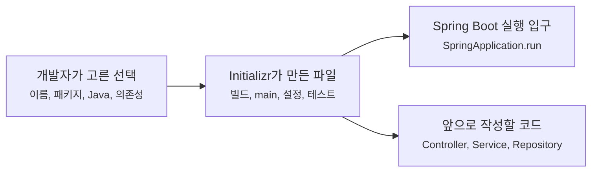

# Spring Boot 프로젝트는 처음에 무엇을 만들어줄까요?

> 압축 파일을 풀었을 뿐인데 `src`, `build.gradle`, `gradlew`, `Application.java` 같은 파일이 한꺼번에 생겨요.

처음 Spring Boot 프로젝트를 만들면 코드를 작성하기도 전에 이미 꽤 많은 것이 준비돼 있어요.

아직 컨트롤러도 없고, 데이터베이스도 연결하지 않았는데요. 프로젝트 폴더 안에는 빌드 도구 파일, 실행 진입점, 설정 파일, 테스트 폴더, 래퍼(wrapper) 스크립트가 들어 있어요.

그래서 첫 화면에서 이런 생각이 들 수 있어요.

> "나는 웹 프로젝트 하나 만들겠다고 했을 뿐인데, 이 파일들은 다 무슨 역할이지?"  
> "Maven이랑 Gradle 중에 뭘 골라야 하지?"  
> "패키지 이름을 대충 적어도 되는 걸까?"  
> "DevTools는 개발할 때만 쓰는 건가?"

오늘은 Spring Boot 프로젝트를 직접 만들 때 마주치는 선택지와, 생성된 파일들이 어떤 일을 맡는지 보려고 해요. 목표는 모든 옵션을 외우는 게 아니라 **처음 만들어진 프로젝트를 읽을 수 있는 눈**을 갖는 거예요.

!!! note "이 글의 기준"
    예시는 Spring Boot 4.x 흐름을 기준으로 설명해요. 구체적인 지원 Java 버전, Maven/Gradle 버전, DevTools 동작처럼 버전에 따라 바뀔 수 있는 내용은 Spring Boot 4.1.0 공식 문서를 확인해 작성했어요. 실제 프로젝트를 만들 때는 `start.spring.io` 화면의 현재 선택지를 한 번 더 확인하세요.

---

## 프로젝트 생성기는 빈 폴더에 첫 배치를 깔아줘요

Spring Boot 프로젝트를 만드는 가장 흔한 입구는 [Spring Initializr](https://start.spring.io/)예요.

브라우저에서 옵션을 고르고 압축 파일을 내려받는 방식이죠.

```text
Project: Gradle - Groovy 또는 Maven
Language: Java
Spring Boot: 4.x
Group: com.example
Artifact: order
Name: order
Package name: com.example.order
Packaging: Jar
Java: 17 이상
Dependencies: Spring Web, Spring Boot DevTools
```

이 화면은 "어떤 코드를 작성할래?"보다 먼저 "어떤 애플리케이션 뼈대를 만들래?"를 묻고 있어요.

식당으로 비유하면 아직 메뉴를 정한 단계가 아니에요. 주방 위치, 계산대 위치, 냉장고 전원, 직원 출입문처럼 **영업을 시작할 수 있는 기본 배치**를 정하는 단계에 가까워요.

Spring Initializr는 그 선택지를 바탕으로 이런 것들을 만들어줘요.

| 선택한 것 | 생성되는 것 |
|---|---|
| 빌드 도구 | `build.gradle` 또는 `pom.xml` |
| 언어 | Java/Kotlin/Groovy 소스 폴더와 기본 코드 |
| Group, Artifact, Name | 프로젝트 좌표, 패키지 후보, 애플리케이션 이름 |
| Packaging | 실행 가능한 `jar` 또는 별도 서버 배포용 `war` 방향 |
| Java 버전 | 빌드 도구가 사용할 Java 언어 수준 |
| Dependencies | 스타터(starter) 의존성, 개발 도구, 테스트 의존성 |

여기서 중요한 건 Initializr가 업무 코드를 만들어주는 게 아니라는 점이에요.

주문 조회, 결제, 회원 가입 같은 코드는 여전히 우리가 작성해야 해요. 대신 그 코드를 올릴 수 있는 Spring Boot 프로젝트의 첫 구조를 맞춰줘요.

---

## 명령줄에서는 `spring init`으로 같은 일을 할 수 있어요

브라우저 대신 터미널에서 만들 수도 있어요. Spring Boot CLI를 설치했다면 `spring init` 명령이 Spring Initializr를 호출해 프로젝트를 만들어줘요.

먼저 CLI가 없다면 설치부터 해야 해요. Spring Boot 4.1.0 공식 문서 기준으로는 이런 방법들이 안내돼요.

```bash
# SDKMAN!을 쓰는 경우
sdk install springboot
spring --version

# macOS에서 Homebrew를 쓰는 경우
brew tap spring-io/tap
brew install spring-boot

# Windows에서 Scoop을 쓰는 경우
scoop bucket add extras
scoop install springboot
```

직접 설치하고 싶다면 공식 문서의 Spring Boot CLI 압축 파일을 내려받고, 압축을 푼 뒤 `bin/spring` 또는 Windows의 `bin/spring.bat`이 실행되도록 `PATH`를 잡으면 돼요.

설치가 끝났다면 먼저 두 명령을 기억해두면 좋아요.

```bash
spring
spring help init
```

`spring`만 입력하면 사용할 수 있는 명령 목록이 나오고, `spring help init`은 프로젝트 생성에 쓸 수 있는 옵션을 보여줘요.

그다음 Gradle 프로젝트를 만들려면 이렇게 실행할 수 있어요.

```bash
spring init \
  --dependencies=web,devtools \
  --build=gradle \
  --type=gradle-project \
  --java-version=17 \
  order
```

이 명령은 대략 이렇게 읽으면 돼요.

| 옵션 | 뜻 |
|---|---|
| `--dependencies=web,devtools` | 웹 애플리케이션과 개발 편의 기능을 넣어요 |
| `--build=gradle` | Gradle 프로젝트로 만들어요 |
| `--type=gradle-project` | 압축 파일이 아니라 풀린 Gradle 프로젝트 디렉터리로 만들어요 |
| `--java-version=17` | Java 17 언어 수준을 기준으로 잡아요 |
| `order` | 생성할 프로젝트 디렉터리 이름이에요 |

공식 CLI 문서 기준으로 `spring init`은 기본 대상 서비스를 `https://start.spring.io`로 잡아요. 그래서 브라우저에서 누르는 "Generate" 버튼과 같은 생성 서비스를 명령줄에서 쓰는 셈이에요.

사용할 수 있는 의존성 이름이나 프로젝트 타입이 헷갈리면 `--list`로 현재 서비스가 제공하는 선택지를 볼 수 있어요.

```bash
spring init --list
```

예를 들어 `--build=gradle`만 넣었을 때 CLI가 `gradle-project`와 `gradle-project-kotlin` 중 더 구체적인 타입을 고르라고 말할 수 있어요. 이럴 때는 위 예시처럼 `--type=gradle-project`를 함께 적으면 돼요.

처음 배우는 단계라면 브라우저가 더 편할 수 있어요. 옵션을 눈으로 볼 수 있으니까요. 팀에서 반복 생성하거나 문서에 재현 가능한 명령을 남길 때는 CLI가 편해요.

---

## Maven과 Gradle은 "프로젝트를 어떻게 지을지" 정하는 도구예요

Spring Boot를 시작할 때 가장 먼저 헷갈리는 선택지가 Maven과 Gradle이에요.

둘 다 핵심 역할은 같아요.

- 필요한 라이브러리를 내려받아요.
- 소스 코드를 컴파일해요.
- 테스트를 실행해요.
- 실행 가능한 애플리케이션으로 패키징해요.
- Spring Boot가 관리하는 의존성 버전 조합을 적용해요.

Spring Boot 공식 문서는 의존성 관리를 지원하고 Maven Central의 아티팩트를 사용할 수 있는 빌드 시스템을 권장하고, 실무적으로는 Maven 또는 Gradle을 고르라고 안내해요.

초보자 입장에서 아주 단순하게 나누면 이래요.

| 선택 | 처음 읽을 파일 | 느낌 |
|---|---|---|
| Maven | `pom.xml` | XML이 길지만 구조가 명시적이에요 |
| Gradle | `build.gradle` 또는 `build.gradle.kts` | 짧고 유연하지만 스크립트처럼 읽혀요 |

예를 들어 Gradle 프로젝트를 만들면 이런 파일을 보게 돼요.

```gradle
plugins {
    id 'java'
    id 'org.springframework.boot' version '4.1.0'
    id 'io.spring.dependency-management' version '1.1.7'
}

group = 'com.example'
version = '0.0.1-SNAPSHOT'

java {
    toolchain {
        languageVersion = JavaLanguageVersion.of(17)
    }
}

repositories {
    mavenCentral()
}

dependencies {
    implementation 'org.springframework.boot:spring-boot-starter-webmvc'
    developmentOnly 'org.springframework.boot:spring-boot-devtools'
    testImplementation 'org.springframework.boot:spring-boot-starter-webmvc-test'
    testRuntimeOnly 'org.junit.platform:junit-platform-launcher'
}
```

실제 생성 파일의 버전과 표기는 선택한 Spring Boot 버전, Gradle DSL, Initializr 설정에 따라 조금 달라질 수 있어요. 하지만 읽는 기준은 같아요.

`plugins`는 Spring Boot 프로젝트를 빌드하는 방법을 붙이고, `dependencies`는 이 애플리케이션이 어떤 기능 묶음에 기대는지 보여줘요.

여기서 `spring-boot-starter-webmvc`가 바로 스타터(starter)예요. Spring Boot 4.x 기준으로 Spring MVC 웹 애플리케이션을 만들 때 자주 필요한 Spring MVC, 내장 서버, JSON 처리 같은 조합을 한 번에 끌어오는 출발점이에요.

| 4.x 기준 | 3.x에서 볼 수 있는 차이 | 독자가 지금 확인할 것 |
|---|---|---|
| `spring-boot-starter-webmvc`, `spring-boot-starter-webmvc-test`처럼 웹 기술별 스타터 이름이 보일 수 있어요 | 기존 글이나 프로젝트에서는 `spring-boot-starter-web`, `spring-boot-starter-test` 조합을 많이 볼 수 있어요 | 새 프로젝트는 `start.spring.io`가 생성한 `build.gradle` 또는 `pom.xml`을 기준으로 읽으세요 |

---

## 처음 생성된 폴더를 펼쳐볼게요

웹과 DevTools를 넣은 Java 프로젝트라면 대략 이런 모양을 보게 돼요.

```text
order/
├── build.gradle
├── gradlew
├── gradlew.bat
├── settings.gradle
└── src/
    ├── main/
    │   ├── java/
    │   │   └── com/
    │   │       └── example/
    │   │           └── order/
    │   │               └── OrderApplication.java
    │   └── resources/
    │       ├── static/
    │       ├── templates/
    │       └── application.properties
    └── test/
        └── java/
            └── com/
                └── example/
                    └── order/
                        └── OrderApplicationTests.java
```

처음에는 파일이 많아 보이지만, 역할을 나누면 단순해져요.

| 위치 | 역할 |
|---|---|
| `build.gradle` 또는 `pom.xml` | 빌드 방법과 의존성 목록 |
| `gradlew`, `mvnw` | 내 컴퓨터에 Gradle/Maven이 없어도 정해진 방식으로 빌드하게 해주는 래퍼 |
| `src/main/java` | 실제 애플리케이션 Java 코드 |
| `src/main/resources` | 설정 파일, 정적 파일, 템플릿 같은 리소스 |
| `src/test/java` | 테스트 코드 |
| `application.properties` 또는 `application.yml` | 애플리케이션 설정 |

즉, 생성기는 "앞으로 코드를 어디에 놓을지"를 먼저 정해줘요.



이 그림에서 Spring Boot가 대신한 일은 업무 기능 작성이 아니에요. 빌드, 실행, 설정, 테스트를 놓을 기본 자리를 정리한 일이에요.

---

## `OrderApplication.java`는 실행의 입구예요

생성된 프로젝트에서 가장 먼저 볼 Java 파일은 보통 이런 모양이에요.

```java
package com.example.order;

import org.springframework.boot.SpringApplication;
import org.springframework.boot.autoconfigure.SpringBootApplication;

@SpringBootApplication
public class OrderApplication {

    public static void main(String[] args) {
        SpringApplication.run(OrderApplication.class, args);
    }
}
```

이 파일은 작지만, Spring Boot 애플리케이션의 출발점이에요.

| 코드 | 먼저 이해할 역할 |
|---|---|
| `package com.example.order;` | 이 클래스가 프로젝트의 어느 패키지에 있는지 표시해요 |
| `@SpringBootApplication` | Spring Boot 애플리케이션의 기본 설정 입구예요 |
| `main` 메서드 | Java 프로그램 실행이 시작되는 지점이에요 |
| `SpringApplication.run(...)` | Spring 애플리케이션을 준비하고 실행해요 |

오늘은 `@SpringBootApplication`의 내부 구성을 모두 열지는 않을게요. 뒤 글에서 `main` 메서드가 어떤 단계를 거쳐 실행 중 애플리케이션으로 바뀌는지 따로 볼 거예요.

지금은 한 가지만 기억하면 돼요.

> 생성된 `Application` 클래스는 "여기서부터 우리 애플리케이션을 시작해줘"라고 Spring Boot에 넘기는 입구예요.

---

## 패키지 이름은 나중의 탐색 범위를 정해요

패키지 이름은 단순한 폴더명이 아니에요.

Spring Boot 공식 문서는 기본 패키지(default package)를 피하고, `com.example.project`처럼 역방향 도메인 이름을 따르는 패키지명을 권장해요. 또 `@SpringBootApplication`이 붙은 메인 클래스를 다른 클래스들보다 상위의 루트 패키지에 두는 편을 권장해요.

예를 들어 이런 구조가 자연스러워요.

```text
com.example.order
├── OrderApplication
├── order
│   ├── OrderController
│   ├── OrderService
│   └── OrderRepository
└── payment
    ├── PaymentClient
    └── PaymentService
```

`OrderApplication`이 `com.example.order`에 있으면, 그 아래의 `com.example.order.order`, `com.example.order.payment` 같은 패키지들이 애플리케이션의 자연스러운 탐색 범위가 돼요.

반대로 메인 클래스를 너무 깊은 곳에 두면 나중에 컴포넌트 스캔(component scan)에서 "왜 이 클래스는 등록이 안 되지?" 같은 질문을 만나기 쉬워요.

이건 다음 글들에서 빈(bean)과 컴포넌트 스캔을 배울 때 다시 중요해져요.

---

## `application.properties`는 비어 있어도 의미가 있어요

처음 생성된 `application.properties` 파일에는 애플리케이션 이름 정도만 들어 있거나, 선택에 따라 거의 비어 있을 수 있어요.

설정이 적다고 해서 설정 기능이 없는 건 아니에요. 오히려 "여기에 애플리케이션 설정을 둘 수 있다"는 자리가 먼저 생긴 거예요.

예를 들어 나중에는 이런 설정을 넣게 돼요.

```properties
spring.application.name=order
server.port=8081
```

이 파일은 코드가 아니라 실행 환경에 가까운 값을 담는 곳이에요.

- 서버 포트
- 애플리케이션 이름
- 데이터베이스 연결 정보
- 로그 레벨
- 외부 API 주소
- 프로필(profile)별 설정

다만 비밀값은 조심해야 해요. 비밀번호나 토큰을 아무 생각 없이 저장소에 커밋하면 안 돼요. 설정 파일과 환경 변수, 프로필, 시크릿 경계는 뒤에서 별도 글로 다룰 거예요.

---

## DevTools는 초반 학습 마찰을 줄여줘요

처음 Spring Boot를 배울 때 가장 답답한 순간 중 하나는 작은 코드를 바꿀 때마다 애플리케이션을 다시 켜는 일이에요.

Spring Boot DevTools는 개발 중 피드백을 빠르게 만들기 위한 도구예요.

Gradle에서는 보통 이런 의존성으로 들어가요.

```gradle
dependencies {
    developmentOnly("org.springframework.boot:spring-boot-devtools")
}
```

Maven에서는 선택적(optional) 의존성으로 넣는 형태가 공식 문서에 소개돼요.

```xml
<dependencies>
    <dependency>
        <groupId>org.springframework.boot</groupId>
        <artifactId>spring-boot-devtools</artifactId>
        <optional>true</optional>
    </dependency>
</dependencies>
```

DevTools가 도와주는 대표적인 일은 자동 재시작(automatic restart)이에요. 클래스패스(classpath)에 있는 파일이 바뀌면 애플리케이션을 다시 시작해서 변경을 반영해요.

단, 이것도 "파일을 저장만 하면 언제나 즉시 반영된다"는 뜻은 아니에요. Spring Boot는 IDE나 빌드 도구가 변경된 파일을 컴파일하고 클래스패스 위치로 복사해주기를 기대해요. 그래서 IDE 설정에 따라 자동 빌드를 켜야 체감이 좋아질 수 있어요.

그리고 중요한 운영 경계가 있어요.

DevTools는 개발 편의를 위한 도구예요. 공식 문서도 완전히 패키징된 애플리케이션을 `java -jar`로 실행하는 경우에는 개발 도구가 자동으로 비활성화된다고 설명해요. 운영 환경에서 억지로 켜는 것은 보안상 위험할 수 있어요.

!!! warning "LiveReload는 최신 문서에서 확인하세요"
    DevTools에는 브라우저 새로고침을 돕는 LiveReload 서버도 포함돼 왔어요. 다만 Spring Boot 4.1.0 공식 문서에서는 LiveReload 기능이 지원과 인기도 감소로 deprecated 상태라고 설명해요. 새 프로젝트에서 이 기능에 기대기보다, 현재 쓰는 Boot 버전의 DevTools 문서를 확인하는 편이 안전해요.

---

## 내가 만든 것과 Boot가 만든 것을 나눠볼게요

첫 프로젝트를 만들고 나면 "내가 한 일"과 "Spring Boot가 준비한 일"을 분리해서 보는 습관이 중요해요.

| 내가 선택하거나 작성한 것 | Spring Boot와 생성기가 준비한 것 |
|---|---|
| 프로젝트 이름 | 빌드 파일과 기본 폴더 구조 |
| 패키지 이름 | 메인 애플리케이션 클래스 위치 |
| Java 버전 | 빌드 도구의 Java 언어 수준 설정 |
| 필요한 기능 목록 | 스타터 의존성 |
| 나중에 작성할 컨트롤러/서비스 | 실행 진입점, 테스트 뼈대, 설정 파일 자리 |

이렇게 나누어 보면 Spring Boot 프로젝트가 덜 신비롭게 보여요.



아직 컨트롤러를 만들지 않았더라도 프로젝트는 이미 "Spring Boot 애플리케이션으로 실행될 준비"를 갖춘 상태예요.

다음 단계부터 우리가 작성할 코드는 이 구조 위에 올라가요.

---

## 자, 정리해볼까요?

!!! abstract "처음 생성된 프로젝트에서 볼 것"
    - Spring Initializr는 업무 코드를 대신 쓰는 도구가 아니라, Spring Boot 프로젝트의 첫 구조를 만들어주는 도구예요.
    - Maven과 Gradle은 의존성, 컴파일, 테스트, 패키징을 맡는 빌드 도구예요.
    - `Application.java`의 `main` 메서드는 Spring Boot 애플리케이션 실행의 입구예요.
    - 패키지 이름과 메인 클래스 위치는 나중에 컴포넌트 스캔 범위와 연결돼요.
    - DevTools는 개발 피드백을 빠르게 돕지만, 운영 환경에서 켜두는 도구가 아니에요.

이제 프로젝트 폴더가 낯설지는 않을 거예요.

다음 글에서는 이름만 자주 듣던 세 단어, 제어의 역전(IoC), 의존성 주입(dependency injection), 관점 지향 프로그래밍(AOP)을 Spring Boot를 읽는 세 가지 기준점으로 잡아볼게요.

---

## 참고한 링크

- [Spring Initializr](https://start.spring.io/)
- [Spring Boot Reference: System Requirements](https://docs.spring.io/spring-boot/system-requirements.html)
- [Spring Boot Reference: Build Systems](https://docs.spring.io/spring-boot/reference/using/build-systems.html)
- [Spring Boot Reference: Structuring Your Code](https://docs.spring.io/spring-boot/reference/using/structuring-your-code.html)
- [Spring Boot Reference: Developer Tools](https://docs.spring.io/spring-boot/reference/using/devtools.html)
- [Spring Boot Reference: Installing Spring Boot](https://docs.spring.io/spring-boot/installing.html)
- [Spring Boot CLI: Using the CLI](https://docs.spring.io/spring-boot/cli/using-the-cli.html)
