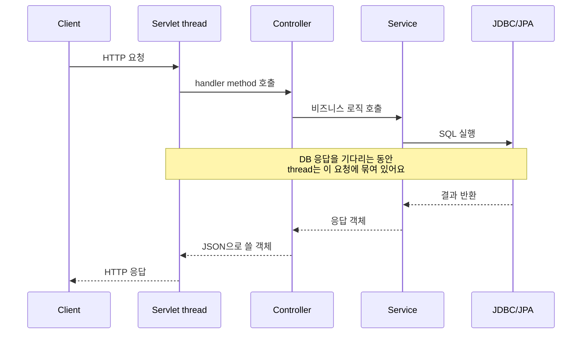
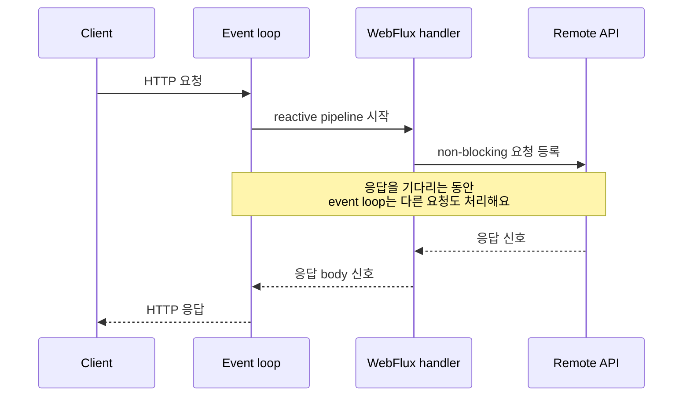
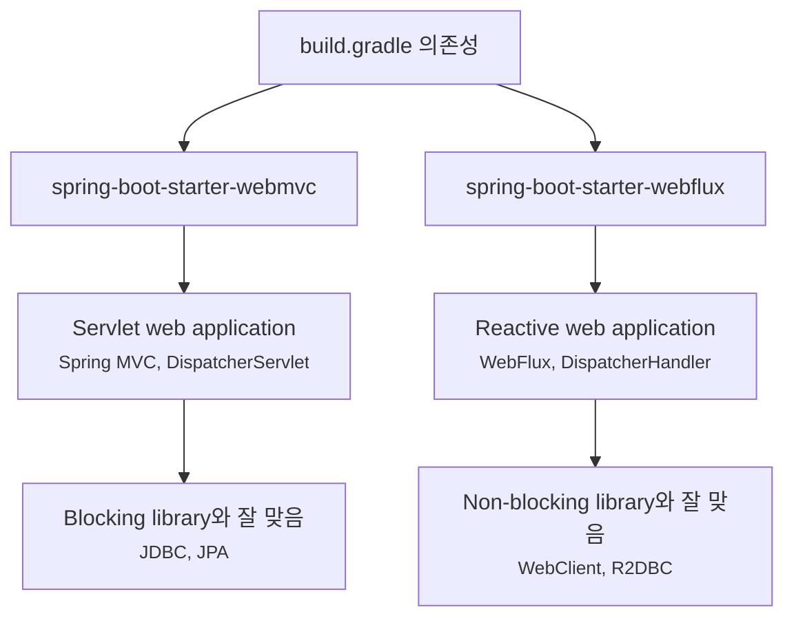

# Spring MVC와 WebFlux는 언제 다르게 선택해야 할까요?

> 이름은 비슷한데, 둘은 "컨트롤러 작성법"보다 **기다리는 방식을 어떻게 다룰지**에서 갈라져요.

지난 글에서는 작은 Todo API를 Spring MVC로 만들어봤어요. `@RestController`를 만들고, `GET /todos`, `POST /todos` 같은 요청을 받고, JSON으로 응답했죠.

그런데 Spring Boot 웹 자료를 찾다 보면 곧 이런 단어를 만나게 돼요.

> "MVC 말고 WebFlux를 써야 하나요?"  
> "Reactive가 더 빠른 거 아닌가요?"  
> "요즘은 WebFlux가 최신 방식인가요?"  
> "JPA 쓰는 프로젝트도 WebFlux로 바꾸면 성능이 좋아지나요?"

처음에는 WebFlux가 Spring MVC의 다음 버전처럼 보일 수 있어요. 근데요, 사실은 그렇게 읽으면 위험해요. **Spring MVC와 WebFlux는 구버전/신버전 관계가 아니라, 서로 다른 실행 모델을 가진 두 웹 stack이에요.**

오늘은 Annotation 이름보다 먼저, 요청을 처리하는 thread와 I/O 대기 방식을 볼 거예요. 결론부터 말하면 대부분의 일반적인 REST API, 특히 JDBC나 JPA를 쓰는 서비스는 Spring MVC가 더 자연스러워요. WebFlux는 "더 최신이라서"가 아니라, 애플리케이션 전체가 non-blocking 흐름으로 설계될 때 힘을 발휘해요.

!!! note "이 글의 기준"
    이 글은 Spring Boot 4.1.0과 Spring Framework 7.0.8 공식 문서의 Servlet Web Applications, Reactive Web Applications, Spring Web MVC, Spring WebFlux 설명을 기준으로 작성했어요. 개념 자체는 Spring Boot 3.x 프로젝트를 읽을 때도 유효하지만, starter 이름과 auto-configuration package는 Boot 4.x 기준으로 읽어주세요.

---

## 겉모습이 비슷해서 더 헷갈려요

Spring MVC controller는 이렇게 생겼어요.

```java
package com.example.order;

import org.springframework.web.bind.annotation.GetMapping;
import org.springframework.web.bind.annotation.PathVariable;
import org.springframework.web.bind.annotation.RestController;

@RestController
public class OrderController {

    private final OrderService orderService;

    public OrderController(OrderService orderService) {
        this.orderService = orderService;
    }

    @GetMapping("/orders/{id}")
    public OrderResponse findOrder(@PathVariable long id) {
        return orderService.findOrder(id);
    }
}
```

WebFlux controller도 Annotation 기반으로 쓰면 겉모습이 꽤 비슷해요.

```java
package com.example.order;

import org.springframework.web.bind.annotation.GetMapping;
import org.springframework.web.bind.annotation.PathVariable;
import org.springframework.web.bind.annotation.RestController;
import reactor.core.publisher.Mono;

@RestController
public class ReactiveOrderController {

    private final ReactiveOrderService orderService;

    public ReactiveOrderController(ReactiveOrderService orderService) {
        this.orderService = orderService;
    }

    @GetMapping("/orders/{id}")
    public Mono<OrderResponse> findOrder(@PathVariable long id) {
        return orderService.findOrder(id);
    }
}
```

둘 다 `@RestController`, `@GetMapping`, `@PathVariable`을 쓰죠. 그래서 처음에는 "반환 타입만 `Mono`로 바꾸면 WebFlux인가요?"라고 느끼기 쉬워요.

하지만 중요한 차이는 controller 모양보다 아래쪽에 있어요.

| 질문 | Spring MVC | WebFlux |
|---|---|---|
| 기본 stack | Servlet 기반 | Reactive 기반 |
| 대표 starter | `spring-boot-starter-webmvc` | `spring-boot-starter-webflux` |
| 기본 서버 감각 | Tomcat 같은 Servlet container | Reactor Netty 같은 non-blocking runtime |
| 요청 처리 가정 | 처리 중 thread가 기다려도 됨 | 처리 중 event loop를 막으면 안 됨 |
| 흔한 반환 | `OrderResponse`, `List<OrderResponse>` | `Mono<OrderResponse>`, `Flux<OrderResponse>` |
| 잘 맞는 persistence | JDBC, JPA처럼 blocking API | R2DBC처럼 reactive API |

여기서 `Mono`는 "값이 0개 또는 1개 나중에 올 수 있다"는 reactive 타입이에요. `Flux`는 "값이 0개 이상 여러 개 흐를 수 있다"는 타입이고요. 단순히 `Optional`이나 `List`의 멋진 이름이 아니라, 데이터가 준비되는 시점과 흐름을 runtime이 조합할 수 있게 표현하는 타입이에요.

처음에는 여기까지만 잡아도 충분해요. **MVC는 요청마다 일하는 thread가 기다릴 수 있는 모델이고, WebFlux는 기다리는 동안 thread를 붙잡지 않는 모델이에요.**

---

## MVC는 "기다리는 thread"를 전제로 해요

식당에 비유하면 Spring MVC는 손님 한 명을 직원 한 명이 맡는 방식에 가까워요.

손님이 주문하고, 주방에서 음식이 나올 때까지 직원이 그 주문을 담당해요. 중간에 주방을 기다리는 시간이 있어도 직원은 그 주문의 흐름 안에 있어요. 손님이 많아지면 직원도 더 필요해지죠.

Spring MVC 요청 흐름도 비슷하게 읽을 수 있어요.



이 그림에서 핵심은 thread가 요청 흐름을 따라 끝까지 붙어 있다는 점이에요. DB 호출이나 외부 API 호출처럼 시간이 걸리는 작업이 있으면 그 thread는 기다려요. 이걸 blocking이라고 불러요.

blocking이 무조건 나쁜 건 아니에요. 오히려 많은 업무 시스템에서는 이 모델이 읽기 쉽고, 디버깅하기 쉽고, 사용할 수 있는 라이브러리 선택지도 넓어요.

```java
@Service
public class OrderService {

    private final OrderRepository orderRepository;

    public OrderService(OrderRepository orderRepository) {
        this.orderRepository = orderRepository;
    }

    public OrderResponse findOrder(long id) {
        Order order = orderRepository.findById(id)
                .orElseThrow(() -> new OrderNotFoundException(id));

        return new OrderResponse(order.id(), order.status(), order.createdAt());
    }
}
```

이 코드는 눈으로 따라가기 쉬워요. `findById`를 호출하고, 없으면 예외를 던지고, 있으면 response DTO로 바꿔요. JDBC나 JPA repository는 보통 이런 방식과 잘 맞아요. 호출한 thread가 DB 응답을 기다리고, 결과가 오면 다음 줄로 넘어가니까요.

실무에서는 이 단순함이 꽤 큰 장점이에요.

| MVC가 편한 지점 | 이유 |
|---|---|
| JPA, JDBC 사용 | 대표 Java DB 라이브러리가 blocking API예요 |
| 트랜잭션 코드 | `@Transactional`과 thread-bound context를 이해하기 쉬워요 |
| 디버깅 | stack trace와 breakpoint가 직선적으로 이어져요 |
| 팀 학습 비용 | imperative Java 코드에 익숙한 팀이 많아요 |
| 라이브러리 선택 | 오래된 Java 생태계 대부분이 blocking 기준이에요 |

그래서 "Spring MVC는 옛날 방식"이라고 말하면 설명이 너무 거칠어요. Spring MVC는 Servlet 기반의 성숙한 웹 stack이고, blocking 라이브러리를 쓰는 많은 서버 애플리케이션에는 여전히 가장 자연스러운 선택이에요.

---

## WebFlux는 "안 기다리는 thread"를 전제로 해요

WebFlux는 다른 질문에서 출발해요.

> "요청 중간에 외부 API 응답을 오래 기다려야 한다면, 그동안 thread를 붙잡고 있어야 할까요?"

예를 들어 주문 화면 하나를 만들기 위해 세 군데 외부 서비스를 불러야 한다고 해볼게요.

- 주문 서비스에서 주문 정보를 가져와요.
- 배송 서비스에서 배송 상태를 가져와요.
- 포인트 서비스에서 적립 정보를 가져와요.

각 호출이 네트워크 때문에 300ms씩 걸릴 수 있어요. 이때 요청마다 thread 하나를 붙잡고 기다리면, 동시 요청이 많아질수록 thread와 memory 부담이 커져요.

WebFlux의 non-blocking 모델은 이런 상황에서 다르게 움직여요.



여기서는 "기다리는 동안 같은 thread가 멈춰 있다"는 전제가 달라져요. 외부 I/O가 끝나면 신호가 오고, 그 신호를 이어서 처리해요. 그래서 WebFlux 코드에서는 `Mono`, `Flux`, `map`, `flatMap`, `zip` 같은 단어가 자주 나와요.

```java
@Service
public class OrderViewService {

    private final OrderClient orderClient;
    private final DeliveryClient deliveryClient;
    private final PointClient pointClient;

    public OrderViewService(
            OrderClient orderClient,
            DeliveryClient deliveryClient,
            PointClient pointClient
    ) {
        this.orderClient = orderClient;
        this.deliveryClient = deliveryClient;
        this.pointClient = pointClient;
    }

    public Mono<OrderViewResponse> findOrderView(long orderId) {
        Mono<OrderResponse> order = orderClient.findOrder(orderId);
        Mono<DeliveryResponse> delivery = deliveryClient.findDelivery(orderId);
        Mono<PointResponse> points = pointClient.findPoints(orderId);

        return Mono.zip(order, delivery, points)
                .map(tuple -> new OrderViewResponse(
                        tuple.getT1(),
                        tuple.getT2(),
                        tuple.getT3()
                ));
    }
}
```

처음 보면 MVC 코드보다 어렵죠. 이유가 있어요. WebFlux는 "한 줄 실행하고 결과가 오면 다음 줄"이라는 감각보다, "나중에 올 값들의 흐름을 미리 조립한다"는 감각에 가까워요.

그래서 WebFlux는 성능 버튼이 아니에요. 사고방식, 라이브러리, 테스트, 디버깅 방식까지 같이 바뀌는 선택이에요.

---

## WebFlux가 항상 더 빠른 건 아니에요

가장 흔한 오해가 이거예요.

> "Reactive면 더 빠르다."

사실은 아니에요. non-blocking과 reactive는 요청 하나의 CPU 계산을 마법처럼 빠르게 만들지 않아요. 오히려 작은 요청 하나만 보면 reactive pipeline을 구성하고 흐름을 추적하는 비용이 더 복잡할 수 있어요.

WebFlux의 장점은 보통 이런 상황에서 드러나요.

| 상황 | WebFlux가 의미 있어지는 이유 |
|---|---|
| 느리고 예측하기 어려운 네트워크 I/O가 많음 | 기다리는 동안 thread를 점유하지 않아요 |
| 많은 동시 연결을 오래 유지함 | 작은 thread 수로 더 많은 연결을 다룰 수 있어요 |
| reactive DB, reactive client를 함께 사용함 | stack 전체가 non-blocking으로 이어져요 |
| streaming 응답이 중요함 | `Flux`로 여러 값을 흐름처럼 내보낼 수 있어요 |

반대로 이런 상황이라면 WebFlux로 바꾸는 이득이 작거나, 오히려 복잡도만 커질 수 있어요.

| 상황 | 조심해야 하는 이유 |
|---|---|
| JPA, JDBC 중심 | DB 호출이 blocking이라 event loop를 막을 수 있어요 |
| CPU 계산이 대부분 | non-blocking I/O가 병목을 해결하지 못해요 |
| 팀이 reactive 디버깅에 익숙하지 않음 | 장애 분석과 코드 리뷰 비용이 커져요 |
| 일부 controller만 `Mono`로 감싼 상태 | 실행 모델은 바뀌지 않고 타입만 복잡해질 수 있어요 |

여기부터는 조금 더 깊게 볼게요. WebFlux에서 가장 위험한 실수는 event loop에서 blocking 작업을 하는 거예요.

```java
@GetMapping("/orders/{id}")
public Mono<OrderResponse> findOrder(@PathVariable long id) {
    return Mono.just(orderRepository.findById(id)
            .map(OrderResponse::from)
            .orElseThrow(() -> new OrderNotFoundException(id)));
}
```

겉으로는 `Mono<OrderResponse>`를 반환하니까 WebFlux처럼 보여요. 하지만 `orderRepository.findById(id)`가 JPA repository라면 이미 그 줄에서 DB 응답을 기다려요. `Mono.just(...)`는 blocking 호출을 non-blocking으로 바꿔주는 도구가 아니에요. 이미 계산된 값을 `Mono` 안에 넣을 뿐이에요.

blocking API를 꼭 호출해야 한다면 별도 scheduler로 밀어내는 escape hatch가 있긴 해요.

```java
@GetMapping("/orders/{id}")
public Mono<OrderResponse> findOrder(@PathVariable long id) {
    return Mono.fromCallable(() -> orderRepository.findById(id)
                    .map(OrderResponse::from)
                    .orElseThrow(() -> new OrderNotFoundException(id)))
            .subscribeOn(Schedulers.boundedElastic());
}
```

하지만 이건 "이제 완벽한 WebFlux"라는 뜻이 아니에요. blocking 작업을 별도 thread pool로 옮긴 거예요. 프로젝트의 핵심 persistence가 계속 JPA라면, 처음부터 Spring MVC로 두고 필요한 outbound HTTP client만 `WebClient`로 쓰는 편이 더 단순할 수 있어요.

!!! warning "Mono로 감싼다고 non-blocking이 되지는 않아요"
    blocking 메서드를 먼저 호출한 뒤 `Mono.just()`에 넣으면 이미 늦어요. WebFlux의 이점은 타입 이름이 아니라 호출 경로 전체가 non-blocking으로 이어질 때 생겨요.

---

## 의존성을 보면 어느 stack으로 뜨는지 감이 와요

Spring Boot에서는 starter가 중요한 신호예요.

MVC 앱은 보통 이렇게 시작해요.

```gradle
dependencies {
    implementation "org.springframework.boot:spring-boot-starter-webmvc"
}
```

WebFlux 앱은 이렇게 시작해요.

```gradle
dependencies {
    implementation "org.springframework.boot:spring-boot-starter-webflux"
}
```

이 둘은 단순히 controller Annotation 몇 개를 넣는 차이가 아니에요. 어떤 auto-configuration이 적용되고, 어떤 web server factory가 준비되고, 어떤 HTTP runtime을 기본으로 삼는지가 달라져요.



이 그림의 핵심은 starter가 "어떤 programming model을 쓸지"뿐 아니라 "어떤 runtime 가정을 할지"까지 끌고 온다는 점이에요. MVC는 Servlet stack 위에서 `DispatcherServlet`이 요청을 controller로 보내고, WebFlux는 reactive stack 위에서 `DispatcherHandler`가 handler 흐름을 이어가요.

!!! note "Boot 3.x 글을 같이 읽을 때"
    Spring Boot 3.x 자료에서는 MVC starter를 `spring-boot-starter-web`으로 설명하는 경우가 많아요. 이 블로그의 Spring Boot 4.x 기준 예제에서는 MVC starter를 `spring-boot-starter-webmvc`로 읽고 있어요. 기존 프로젝트를 유지보수한다면 실제 `build.gradle`이나 `pom.xml`의 의존성을 먼저 확인하세요.

---

## Spring MVC 앱에서도 WebClient는 쓸 수 있어요

여기서 또 하나 헷갈리는 지점이 있어요.

> "외부 API를 많이 부르면 무조건 WebFlux 앱으로 바꿔야 하나요?"

그렇지는 않아요. Spring MVC 앱에서도 reactive `WebClient`를 사용할 수 있어요. 웹 서버 stack은 MVC로 유지하면서, outbound HTTP 호출만 `WebClient`로 다루는 식이에요.

예를 들어 MVC controller가 있고, service 안에서 외부 API를 호출한다고 해볼게요.

```java
@Service
public class ShipmentLookupService {

    private final WebClient webClient;

    public ShipmentLookupService(WebClient.Builder webClientBuilder) {
        this.webClient = webClientBuilder
                .baseUrl("https://shipment.example")
                .build();
    }

    public ShipmentResponse findShipment(long orderId) {
        return webClient.get()
                .uri("/shipments/{orderId}", orderId)
                .retrieve()
                .bodyToMono(ShipmentResponse.class)
                .block();
    }
}
```

여기서는 마지막에 `.block()`을 호출하죠. MVC 앱에서는 요청 thread가 기다리는 모델이므로, 이 선택이 코드상으로는 자연스러울 수 있어요. 다만 timeout, retry, circuit breaker 같은 outbound API 경계 설계를 반드시 같이 해야 해요. 이 주제는 뒤의 HTTP client 글에서 더 자세히 볼 거예요.

반대로 WebFlux 앱에서는 controller 흐름 안에서 `.block()`을 호출하면 매우 조심해야 해요. event loop를 막을 수 있기 때문이에요.

```java
// WebFlux handler 안에서는 이런 모양을 피해야 해요.
ShipmentResponse shipment = webClient.get()
        .uri("/shipments/{orderId}", orderId)
        .retrieve()
        .bodyToMono(ShipmentResponse.class)
        .block();
```

WebFlux 앱이라면 흐름을 끝까지 `Mono`로 이어가는 쪽이 맞아요.

```java
public Mono<ShipmentResponse> findShipment(long orderId) {
    return webClient.get()
            .uri("/shipments/{orderId}", orderId)
            .retrieve()
            .bodyToMono(ShipmentResponse.class);
}
```

실무에서 중요한 기준은 "어떤 client 클래스를 썼느냐"가 아니에요. **요청 처리 경계 안에서 thread를 막는 호출을 해도 되는 stack인지**가 중요해요.

---

## 테스트와 디버깅도 선택 기준이에요

Spring MVC와 WebFlux는 테스트 도구의 감각도 달라져요.

MVC controller를 테스트할 때는 보통 MockMvc를 자주 봐요.

```java
@WebMvcTest(OrderController.class)
class OrderControllerTest {

    @Autowired
    private MockMvc mockMvc;

    @Test
    void findOrder() throws Exception {
        mockMvc.perform(get("/orders/1"))
                .andExpect(status().isOk())
                .andExpect(jsonPath("$.id").value(1));
    }
}
```

WebFlux 쪽에서는 WebTestClient를 자주 봐요.

```java
@WebFluxTest(ReactiveOrderController.class)
class ReactiveOrderControllerTest {

    @Autowired
    private WebTestClient webTestClient;

    @Test
    void findOrder() {
        webTestClient.get()
                .uri("/orders/1")
                .exchange()
                .expectStatus().isOk()
                .expectBody()
                .jsonPath("$.id").isEqualTo(1);
    }
}
```

테스트 도구 이름만 다른 게 아니에요. 실패를 읽는 방식도 달라져요.

| 디버깅 질문 | MVC에서 자주 보는 곳 | WebFlux에서 추가로 보는 곳 |
|---|---|---|
| 요청이 controller까지 왔나요? | handler mapping, MockMvc, servlet filter | route/handler mapping, WebTestClient |
| 왜 느린가요? | servlet thread pool, DB pool, 외부 API timeout | event loop blocking, scheduler, backpressure |
| 예외가 어디서 났나요? | stack trace, `@ExceptionHandler` | reactive operator chain, error signal |
| DB 호출이 병목인가요? | JDBC/JPA query, connection pool | R2DBC driver, publisher 흐름, blocking 혼입 |

처음 팀이 Spring Boot를 배우는 중이라면 이 차이가 큽니다. WebFlux는 "컨트롤러만 조금 바꾸면 되는 선택"이 아니라, 장애를 읽는 방식까지 함께 바꾸는 선택이에요.

---

## 그러면 무엇을 선택하면 될까요?

선택을 너무 어렵게 만들 필요는 없어요. 먼저 지금 애플리케이션이 무엇을 기다리는지 보면 돼요.

| 프로젝트 상황 | 먼저 선택할 stack |
|---|---|
| 일반적인 CRUD API, JPA/JDBC 중심 | Spring MVC |
| 관리자 페이지, 백오피스, 내부 API | Spring MVC |
| 기존 MVC 앱이 잘 동작 중 | 유지. 필요한 부분만 개선 |
| 외부 API 호출이 조금 있음 | MVC + WebClient도 가능 |
| 많은 원격 I/O를 동시에 조합함 | WebFlux 검토 |
| streaming, SSE, 많은 장기 연결이 핵심 | WebFlux 검토 |
| R2DBC, reactive Redis 등 non-blocking stack으로 끝까지 설계 | WebFlux |
| "최신이라서" 바꾸고 싶음 | 바꾸지 말고 병목부터 측정 |

실무에서는 이 질문들이 더 직접적이에요.

- 우리 DB 접근은 JPA/JDBC인가요, R2DBC인가요?
- 외부 API latency가 실제 병목인가요?
- thread pool과 connection pool 중 무엇이 먼저 고갈되나요?
- reactive operator와 scheduler를 팀이 코드 리뷰할 수 있나요?
- 장애가 났을 때 event loop blocking을 찾을 관측 도구가 있나요?
- WebFlux로 바꿨을 때 테스트와 운영 runbook도 같이 바뀌나요?

이 질문에 답하지 않고 "WebFlux가 빠르다더라"로 시작하면, 나중에 타입은 복잡해졌는데 병목은 그대로인 상황을 만나기 쉬워요.

!!! tip "짧게 기억하기"
    Spring MVC는 blocking 라이브러리와 명령형 Java 코드가 자연스러운 선택이에요. WebFlux는 non-blocking I/O를 애플리케이션 경계 전체로 밀고 갈 때 선택할 수 있는 별도의 stack이에요.

---

## 자, 정리해볼까요?

!!! abstract "오늘 우리가 배운 것"
    - Spring MVC와 WebFlux는 구버전/신버전 관계가 아니라 서로 다른 웹 stack이에요.
    - MVC는 Servlet 기반이고, 요청 처리 중 thread가 blocking 호출을 기다릴 수 있다는 전제로 동작해요.
    - WebFlux는 reactive 기반이고, event loop를 막지 않는 non-blocking 흐름을 전제로 동작해요.
    - `Mono.just()`로 blocking 결과를 감싼다고 non-blocking 코드가 되지는 않아요.
    - JPA/JDBC 중심의 일반적인 CRUD API라면 Spring MVC가 보통 더 단순하고 자연스러워요.
    - WebFlux는 많은 원격 I/O, streaming, reactive persistence처럼 stack 전체가 non-blocking으로 이어질 때 검토할 가치가 커져요.

다음 글에서는 WebSocket과 STOMP를 볼 거예요. HTTP 요청-응답처럼 한 번 묻고 한 번 답하는 흐름이 아니라, 서버와 브라우저가 연결을 열어두고 메시지를 주고받을 때 Spring Boot가 어떤 도구를 제공하는지 살펴볼게요.

## 참고한 링크

- [Spring Boot Reference Documentation: Web](https://docs.spring.io/spring-boot/reference/web/index.html)
- [Spring Boot Reference Documentation: Servlet Web Applications](https://docs.spring.io/spring-boot/reference/web/servlet.html)
- [Spring Boot Reference Documentation: Reactive Web Applications](https://docs.spring.io/spring-boot/reference/web/reactive.html)
- [Spring Framework Reference Documentation: Spring Web MVC](https://docs.spring.io/spring-framework/reference/web/webmvc.html)
- [Spring Framework Reference Documentation: Spring WebFlux](https://docs.spring.io/spring-framework/reference/web/webflux.html)
- [Spring Framework Reference Documentation: WebFlux Overview](https://docs.spring.io/spring-framework/reference/web/webflux/new-framework.html)
