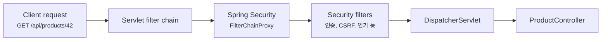
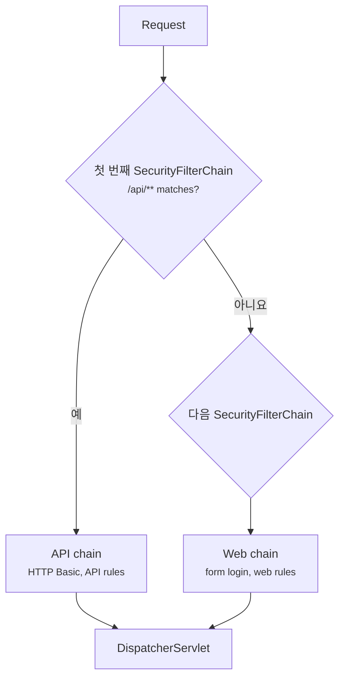
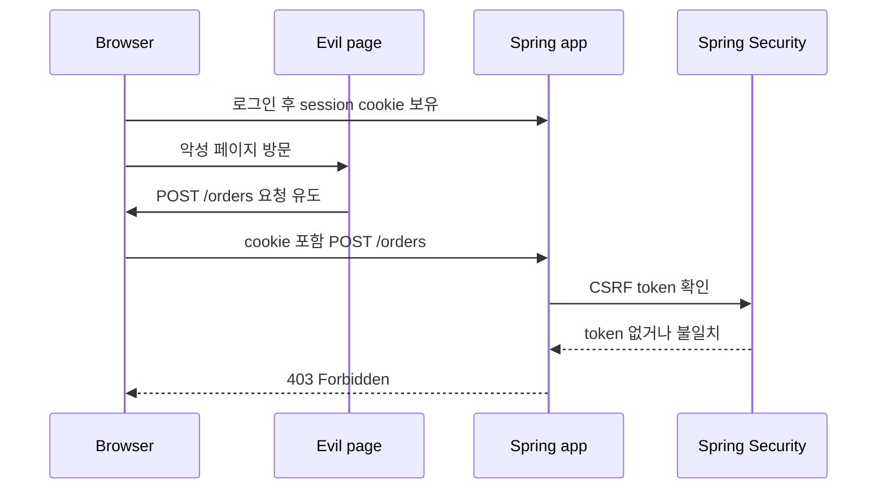

# Spring Security는 왜 filter chain부터 봐야 할까요?

> 컨트롤러 코드는 그대로인데, starter 하나 넣었더니 모든 API가 갑자기 로그인 화면으로 막혀요.

지난 글에서는 MongoDB와 Elasticsearch를 봤어요. 저장소를 고를 때도 "무엇이 더 빠른가요?"보다 "어떤 문제를 풀고 있나요?"를 먼저 물어봐야 했죠.

Spring Security도 비슷해요. 처음에는 이런 식으로 보이기 쉬워요.

> "`@PreAuthorize` 붙이고, 로그인 설정 조금 하면 되는 거 아닌가요?"

그런데 실제로는 로그인 Annotation보다 먼저 움직이는 것이 있어요. 바로 **filter chain**이에요.

Spring MVC 요청은 컨트롤러로 바로 들어오지 않아요. Servlet filter를 먼저 지나고, 그 안에서 Spring Security가 요청을 검사해요. 그래서 보안 문제를 읽을 때는 "이 컨트롤러에 어떤 Annotation이 붙었나?"보다 먼저 물어봐야 해요.

- 이 요청이 Spring Security filter chain을 지나나요?
- 어떤 `SecurityFilterChain`이 선택되나요?
- 사용자가 누구인지 확인했나요?
- 확인된 사용자가 이 URL을 볼 권한이 있나요?
- 브라우저가 자동으로 보내는 cookie 때문에 CSRF 방어가 필요한가요?
- 다른 origin에서 오는 요청이라면 CORS는 어디서 허용하나요?

오늘 목표는 Spring Security를 설정 파일 조각으로 외우는 게 아니에요. **요청이 filter chain을 통과하면서 인증(authentication), 인가(authorization), 공격 방어가 차례로 붙는 구조**를 먼저 잡는 거예요.

!!! note "이 글의 기준"
    이 글은 Spring Boot 4.x의 Spring Security auto-configuration 문서와 Spring Security 7.x 계열의 Servlet architecture, request authorization, CSRF, password storage 문서를 기준으로 작성했어요. Spring Boot 3.x 프로젝트에서도 filter chain, `SecurityFilterChain`, 인증과 인가 분리라는 핵심 모델은 거의 같은 방향으로 읽을 수 있어요.

---

## starter 하나가 들어오면 요청의 입구가 달라져요

아주 작은 API를 생각해볼게요.

```java
package com.example.product;

import org.springframework.web.bind.annotation.GetMapping;
import org.springframework.web.bind.annotation.PathVariable;
import org.springframework.web.bind.annotation.RequestMapping;
import org.springframework.web.bind.annotation.RestController;

@RestController
@RequestMapping("/api/products")
public class ProductController {

    @GetMapping("/{productId}")
    public ProductResponse getProduct(@PathVariable long productId) {
        return new ProductResponse(productId, "Keyboard");
    }
}
```

Security starter가 없으면 보통 이 요청은 Spring MVC로 들어가요.

```http
GET /api/products/42
```

그런데 `spring-boot-starter-security`가 classpath에 들어오면 Spring Boot는 기본 보안 구성을 준비해요. 공식 문서 기준으로 web application은 기본적으로 보호되고, 기본 사용자는 `user`, 비밀번호는 실행 로그에 생성되어 출력돼요. 이 기본 비밀번호는 개발용이에요.

처음 보는 사람 입장에서는 갑자기 이렇게 느껴져요.

> "왜 내가 만든 API가 잠겼죠? 컨트롤러는 바꾼 게 없는데요."

컨트롤러가 바뀐 게 아니에요. **컨트롤러 앞에 보안 filter chain이 생긴 거예요.**



이 그림에서 중요한 점은 Spring Security가 컨트롤러 안쪽 기능이 아니라는 거예요. 요청이 Spring MVC에 도착하기 전에 Servlet filter 단계에서 먼저 움직여요.

그래서 보안 설정이 잘못되면 컨트롤러 method에 breakpoint를 걸어도 아예 도착하지 않을 수 있어요. 이때는 컨트롤러보다 filter chain을 먼저 봐야 해요.

---

## `FilterChainProxy`가 어떤 보안 줄을 탈지 고르는 문지기예요

Spring Security의 Servlet 지원은 `FilterChainProxy`를 중심으로 읽을 수 있어요. `FilterChainProxy`는 요청을 받아서 현재 요청에 맞는 `SecurityFilterChain`을 고르고, 그 chain 안의 보안 filter들을 실행해요.

`SecurityFilterChain`은 하나만 있을 수도 있고 여러 개일 수도 있어요.

예를 들어 API와 관리자 화면을 다르게 보호하고 싶다고 해볼게요.

```java
package com.example.security;

import static org.springframework.security.config.Customizer.withDefaults;

import org.springframework.context.annotation.Bean;
import org.springframework.context.annotation.Configuration;
import org.springframework.core.annotation.Order;
import org.springframework.security.config.annotation.web.builders.HttpSecurity;
import org.springframework.security.web.SecurityFilterChain;

@Configuration
public class SecurityConfig {

    @Bean
    @Order(1)
    SecurityFilterChain apiSecurity(HttpSecurity http) throws Exception {
        http
                .securityMatcher("/api/**")
                .authorizeHttpRequests((authorize) -> authorize
                        .requestMatchers("/api/public/**").permitAll()
                        .anyRequest().authenticated()
                )
                .httpBasic(withDefaults());

        return http.build();
    }

    @Bean
    @Order(2)
    SecurityFilterChain webSecurity(HttpSecurity http) throws Exception {
        http
                .authorizeHttpRequests((authorize) -> authorize
                        .requestMatchers("/", "/assets/**").permitAll()
                        .anyRequest().authenticated()
                )
                .formLogin(withDefaults());

        return http.build();
    }
}
```

이 코드는 완성된 운영 보안이 아니라 chain 선택을 보여주는 예시예요. 핵심은 `securityMatcher("/api/**")`예요. `/api/**` 요청은 첫 번째 chain이 맡고, 나머지 web 요청은 두 번째 chain이 맡아요.



Spring Security 문서는 여러 `SecurityFilterChain`이 있을 때 **처음 매칭된 chain만 실행된다**고 설명해요. 이 말은 순서가 중요하다는 뜻이에요. 넓은 규칙이 앞에 있으면 뒤의 세밀한 규칙은 기회조차 못 얻을 수 있어요.

!!! warning "여러 chain을 둘 때는 좁은 matcher를 앞에 두세요"
    `/api/**`처럼 좁은 범위를 먼저 두고, `any request`에 가까운 넓은 chain은 뒤에 두는 편이 안전해요. 보안 규칙은 "나중에 더 구체적인 규칙이 덮어쓰겠지"라고 읽으면 위험해요.

---

## 인증과 인가는 서로 다른 질문이에요

Spring Security를 처음 배울 때 가장 많이 섞이는 말이 인증과 인가예요.

| 질문 | 영어 이름 | 묻는 것 |
|---|---|---|
| 인증 | authentication | 당신은 누구인가요? |
| 인가 | authorization | 그 사람이 이 일을 해도 되나요? |

로그인에 성공했다는 건 인증이 된 거예요. 하지만 인증된 사용자가 모든 관리자 API를 호출해도 된다는 뜻은 아니에요. 그건 인가가 결정해요.

예를 들어 이런 규칙을 볼게요.

```java
package com.example.security;

import static org.springframework.security.config.Customizer.withDefaults;

import org.springframework.context.annotation.Bean;
import org.springframework.context.annotation.Configuration;
import org.springframework.http.HttpMethod;
import org.springframework.security.config.annotation.web.builders.HttpSecurity;
import org.springframework.security.web.SecurityFilterChain;

@Configuration
public class SecurityConfig {

    @Bean
    SecurityFilterChain securityFilterChain(HttpSecurity http) throws Exception {
        http
                .authorizeHttpRequests((authorize) -> authorize
                        .requestMatchers(HttpMethod.GET, "/api/products/**").permitAll()
                        .requestMatchers("/api/admin/**").hasRole("ADMIN")
                        .anyRequest().authenticated()
                )
                .httpBasic(withDefaults());

        return http.build();
    }
}
```

이 설정은 대략 이렇게 읽으면 돼요.

| 요청 | 규칙 |
|---|---|
| `GET /api/products/42` | 누구나 볼 수 있어요 |
| `/api/admin/**` | `ROLE_ADMIN` 권한이 필요해요 |
| 그 외 요청 | 로그인한 사용자여야 해요 |

Spring Security의 request authorization에서는 `AuthorizationFilter`가 `authorizeHttpRequests`에 적힌 pattern과 rule을 순서대로 보고, 처음 맞는 규칙을 적용해요.

그래서 순서가 중요해요.

```java
.authorizeHttpRequests((authorize) -> authorize
        .anyRequest().authenticated()
        .requestMatchers("/api/public/**").permitAll()
)
```

이런 식으로 쓰면 `/api/public/**` 규칙은 의미가 없어질 수 있어요. 이미 `anyRequest()`가 먼저 잡아버렸기 때문이에요.

!!! tip "인가 규칙 읽는 법"
    `authorizeHttpRequests`는 위에서 아래로 읽으세요. "이 요청에 처음으로 맞는 줄이 무엇인가요?"가 핵심이에요.

---

## 비밀번호는 저장하는 값이 아니라 비교할 수 있게 바꿔둔 값이에요

인증 이야기를 하면 결국 사용자와 비밀번호가 나와요. 여기서도 초보자가 자주 하는 위험한 생각이 있어요.

> "DB에 비밀번호를 저장했다가 로그인할 때 비교하면 되지 않나요?"

비밀번호 원문을 저장하면 안 돼요. Spring Security 문서는 `PasswordEncoder`가 비밀번호를 안전하게 저장하기 위해 일방향 변환을 수행한다고 설명해요. 일방향이라는 말은 다시 원래 비밀번호로 복원하지 않는다는 뜻이에요.

현대적인 password storage에서는 bcrypt, PBKDF2, scrypt, argon2 같은 adaptive one-way function을 써요. 일부러 계산 비용을 들여서 공격자가 대량으로 추측하기 어렵게 만드는 방식이에요.

Spring Security에서는 보통 `DelegatingPasswordEncoder`를 많이 만나요.

```java
package com.example.security;

import org.springframework.context.annotation.Bean;
import org.springframework.context.annotation.Configuration;
import org.springframework.security.crypto.factory.PasswordEncoderFactories;
import org.springframework.security.crypto.password.PasswordEncoder;

@Configuration
public class PasswordConfig {

    @Bean
    PasswordEncoder passwordEncoder() {
        return PasswordEncoderFactories.createDelegatingPasswordEncoder();
    }
}
```

이 encoder로 비밀번호를 encode하면 저장 문자열에 어떤 알고리즘을 썼는지 prefix가 붙을 수 있어요.

```text
{bcrypt}$2a$10$...
```

이 prefix는 사소한 장식이 아니에요. 예전 형식과 새 형식이 섞인 시스템에서 "이 값은 어떤 방식으로 검증해야 하지?"를 판단하는 단서가 돼요.

개발용 in-memory 사용자를 만들면 이런 모양이 돼요.

```java
package com.example.security;

import org.springframework.context.annotation.Bean;
import org.springframework.context.annotation.Configuration;
import org.springframework.security.core.userdetails.User;
import org.springframework.security.core.userdetails.UserDetails;
import org.springframework.security.core.userdetails.UserDetailsService;
import org.springframework.security.crypto.password.PasswordEncoder;
import org.springframework.security.provisioning.InMemoryUserDetailsManager;

@Configuration
public class UserConfig {

    @Bean
    UserDetailsService users(PasswordEncoder passwordEncoder) {
        UserDetails admin = User.withUsername("admin")
                .password(passwordEncoder.encode("change-me"))
                .roles("ADMIN")
                .build();

        return new InMemoryUserDetailsManager(admin);
    }
}
```

이 예시는 학습용이에요. 운영에서는 보통 DB, OAuth2, LDAP, identity provider 같은 실제 사용자 저장소나 인증 체계를 붙여요. 그래도 비밀번호를 직접 다루는 프로젝트라면 원문 저장 금지는 출발선이에요.

---

## CSRF는 "로그인했으니 안전하다"의 반대편에 있어요

CSRF(Cross-Site Request Forgery)는 처음 들으면 이름부터 멀게 느껴져요. 하지만 장면은 단순해요.

1. 사용자가 `bank.example.com`에 로그인해 있어요.
2. 브라우저는 그 사이트의 session cookie를 자동으로 보낼 수 있어요.
3. 사용자가 악성 페이지를 열었어요.
4. 악성 페이지가 사용자의 브라우저를 시켜 `POST /transfer` 같은 요청을 보내게 해요.
5. 서버는 cookie만 보고 "로그인한 사용자 요청이네"라고 착각할 수 있어요.

이 공격이 무서운 이유는 사용자가 비밀번호를 다시 입력하지 않아도 브라우저가 cookie를 자동으로 붙일 수 있기 때문이에요.

Spring Security는 unsafe HTTP method, 예를 들어 `POST` 요청 등에 대해 CSRF 보호를 기본으로 제공해요. HTML form 기반 서비스라면 이 기본값이 중요한 보호막이에요.



이 그림에서 인증은 이미 되어 있을 수 있어요. 문제는 "정말 우리 화면에서 사용자가 의도한 요청인가요?"예요. CSRF token은 그 질문에 답하기 위한 장치예요.

REST API에서는 이야기가 조금 갈라져요.

| 클라이언트 모양 | CSRF 판단 |
|---|---|
| 브라우저 + session cookie + HTML form | CSRF 보호가 매우 중요해요 |
| 브라우저 SPA + cookie 기반 인증 | CSRF token 전달 방식을 설계해야 해요 |
| 모바일 앱이나 서버 간 호출 + Authorization header bearer token | cookie 자동 전송 문제가 아니므로 CSRF 위험 모델이 달라져요 |

그래서 "REST API니까 무조건 CSRF를 꺼요"라고 외우면 안 돼요. **브라우저가 인증 정보를 자동으로 붙이는 구조인지**를 먼저 봐야 해요.

```java
package com.example.security;

import static org.springframework.security.config.Customizer.withDefaults;

import org.springframework.context.annotation.Bean;
import org.springframework.context.annotation.Configuration;
import org.springframework.security.config.annotation.web.builders.HttpSecurity;
import org.springframework.security.web.SecurityFilterChain;

@Configuration
public class SecurityConfig {

    @Bean
    SecurityFilterChain securityFilterChain(HttpSecurity http) throws Exception {
        http
                .csrf(withDefaults())
                .authorizeHttpRequests((authorize) -> authorize
                        .requestMatchers("/api/public/**").permitAll()
                        .anyRequest().authenticated()
                );

        return http.build();
    }
}
```

이 코드는 기본 CSRF 구성을 명시적으로 보여주는 예시예요. 실제 API 서버에서 token 기반 인증을 쓰고 session을 만들지 않는다면 다른 구성이 필요할 수 있어요. 그 판단은 다음 글들에서 JWT, OAuth2 resource server를 다룰 때 더 자세히 볼게요.

!!! warning "CSRF를 끄기 전에 질문부터 바꾸세요"
    "API라서 꺼도 되나요?"보다 "이 요청의 인증 정보가 브라우저에 의해 자동으로 붙나요?"를 먼저 물어보세요. Cookie 기반이면 JSON API여도 CSRF 설계가 필요할 수 있어요.

---

## CORS는 보안 권한이 아니라 브라우저의 출처 규칙이에요

CORS도 Spring Security 글에서 자주 같이 나와요. 그런데 CORS는 로그인 권한과 같은 말이 아니에요.

예를 들어 frontend가 `https://app.example.com`에서 열리고, API는 `https://api.example.com`에 있다고 해볼게요. 브라우저는 다른 origin으로 요청을 보낼 때 CORS 규칙을 확인해요.

서버가 "이 origin에서 오는 요청을 허용한다"고 응답하지 않으면 브라우저가 응답을 frontend JavaScript에 넘겨주지 않아요.

Spring Security를 쓰는 프로젝트에서는 CORS 처리가 security filter chain과 만나는 지점이 있어요. Preflight 요청인 `OPTIONS`가 인증 전에 거절되면 frontend에서는 "CORS 에러"처럼 보이지만 실제 원인은 보안 filter가 먼저 막은 것일 수 있어요.

```java
package com.example.security;

import static org.springframework.security.config.Customizer.withDefaults;

import org.springframework.context.annotation.Bean;
import org.springframework.context.annotation.Configuration;
import org.springframework.security.config.annotation.web.builders.HttpSecurity;
import org.springframework.security.web.SecurityFilterChain;

@Configuration
public class SecurityConfig {

    @Bean
    SecurityFilterChain securityFilterChain(HttpSecurity http) throws Exception {
        http
                .cors(withDefaults())
                .authorizeHttpRequests((authorize) -> authorize
                        .requestMatchers("/api/public/**").permitAll()
                        .anyRequest().authenticated()
                );

        return http.build();
    }
}
```

이 코드만으로 모든 CORS 정책이 완성되는 건 아니에요. 실제 허용 origin, method, header는 Spring MVC의 CORS configuration이나 `CorsConfigurationSource` 같은 곳에서 정해야 해요.

여기서 기억할 점은 하나예요.

| 헷갈리는 말 | 실제 의미 |
|---|---|
| CORS 허용 | 브라우저가 다른 origin 응답을 frontend 코드에 넘겨도 되는가 |
| 인증 | 요청한 사용자가 누구인가 |
| 인가 | 그 사용자가 이 resource에 접근해도 되는가 |

CORS를 열었다고 권한 검사가 끝난 게 아니에요. 반대로 권한이 있어도 CORS 응답이 맞지 않으면 브라우저 frontend는 응답을 읽지 못할 수 있어요.

---

## 운영 설정은 "일단 다 막고 예외를 열기"가 기본이에요

처음 보안 설정을 만들 때 가장 위험한 코드는 보통 이런 모양이에요.

```java
.authorizeHttpRequests((authorize) -> authorize
        .anyRequest().permitAll()
)
```

로컬에서 빨리 테스트하려고 열어둔 설정이 운영에 들어가면, 컨트롤러가 아무리 잘 작성되어 있어도 모든 요청이 열릴 수 있어요.

보안 설정은 보통 반대로 읽는 편이 좋아요.

1. 공개해도 되는 endpoint를 먼저 명시해요.
2. 관리자 endpoint처럼 더 좁은 권한을 먼저 명시해요.
3. 나머지는 인증을 요구하거나 거부해요.

```java
.authorizeHttpRequests((authorize) -> authorize
        .requestMatchers(HttpMethod.GET, "/api/products/**").permitAll()
        .requestMatchers("/api/admin/**").hasRole("ADMIN")
        .anyRequest().authenticated()
)
```

이 규칙은 "닫힌 기본값"에 가까워요. 새 API가 추가되면 적어도 인증은 필요해져요. 공개 API라면 의도적으로 `permitAll()`에 추가해야 해요.

실무에서는 여기에 더 많은 질문이 붙어요.

| 질문 | 왜 중요한가요? |
|---|---|
| Actuator endpoint는 어디까지 노출하나요? | health는 열어도 metrics, env, beans는 민감할 수 있어요 |
| error dispatch도 인가 규칙을 지나나요? | Spring Security는 dispatch에도 authorization을 적용할 수 있어요 |
| static resource는 보안 filter를 지나나요? | 완전히 무시할지, permit할지 선택이 달라요 |
| method security도 필요한가요? | URL만으로 표현하기 어려운 소유권 검사가 있어요 |
| 테스트가 보안 규칙을 포함하나요? | `@WebMvcTest`와 full context test에서 보이는 범위가 달라요 |

!!! tip "보안 설정 code review에서 먼저 볼 줄"
    `anyRequest()`가 무엇을 하고 있는지 먼저 보세요. 그 줄은 새로 추가되는 endpoint의 기본 운명을 정해요.

---

## 막혔을 때는 컨트롤러보다 filter chain을 먼저 확인해요

Spring Security 문제는 증상이 비슷하게 보여요.

- 401 Unauthorized가 나요.
- 403 Forbidden이 나요.
- 로그인 화면으로 redirect돼요.
- CORS 에러처럼 보여요.
- 컨트롤러 breakpoint가 안 걸려요.

이때는 아래 순서로 좁혀가면 덜 헤매요.

| 증상 | 먼저 볼 것 |
|---|---|
| 컨트롤러에 도착하지 않아요 | 요청이 어떤 `SecurityFilterChain`에 잡히는지 |
| 401이 나요 | 인증 정보가 없거나 실패했는지 |
| 403이 나요 | 인증은 됐지만 인가가 거절됐는지, CSRF token이 빠졌는지 |
| CORS처럼 보여요 | preflight `OPTIONS`가 허용되는지, CORS configuration이 있는지 |
| 공개 API가 잠겼어요 | `authorizeHttpRequests` 규칙 순서와 `anyRequest()` |
| Spring Boot 기본 비밀번호가 계속 떠요 | 직접 `UserDetailsService`, `AuthenticationProvider`, `AuthenticationManager`를 제공했는지 |

Spring Security는 startup DEBUG log에서 구성된 filter 목록을 확인할 수 있고, 요청마다 security event를 더 자세히 찍도록 설정할 수도 있어요. 운영에서는 민감 정보가 로그에 섞이지 않게 조심해야 하지만, 로컬 디버깅에서는 filter chain을 보는 게 큰 단서가 돼요.

```yaml
logging:
  level:
    org.springframework.security: DEBUG
```

이 설정은 로컬에서 잠깐 쓰는 디버깅 도구로 생각하세요. 운영에 그대로 켜두면 로그 양과 민감 정보 노출 위험을 같이 봐야 해요.

---

## 참고한 링크

- [Spring Boot Reference - Spring Security](https://docs.spring.io/spring-boot/reference/web/spring-security.html)
- [Spring Security Reference - Servlet Architecture](https://docs.spring.io/spring-security/reference/servlet/architecture.html)
- [Spring Security Reference - Authorize HttpServletRequests](https://docs.spring.io/spring-security/reference/servlet/authorization/authorize-http-requests.html)
- [Spring Security Reference - Cross Site Request Forgery](https://docs.spring.io/spring-security/reference/servlet/exploits/csrf.html)
- [Spring Security Reference - Password Storage](https://docs.spring.io/spring-security/reference/features/authentication/password-storage.html)

---

## 자, 정리해볼까요?

!!! abstract "오늘 우리가 배운 것"
    - Spring Security는 컨트롤러 안쪽이 아니라 요청 앞단의 filter chain에서 먼저 움직여요.
    - `FilterChainProxy`는 요청에 맞는 `SecurityFilterChain`을 고르고, 처음 매칭된 chain만 실행해요.
    - 인증(authentication)은 "누구인가"이고, 인가(authorization)는 "이 일을 해도 되는가"예요.
    - CSRF는 cookie 기반 브라우저 요청에서 특히 중요하고, CORS는 권한이 아니라 브라우저 origin 규칙이에요.
    - 보안 설정은 공개 endpoint를 명시하고, 나머지를 닫는 방향으로 읽는 편이 안전해요.

처음에는 여기까지만 잡아도 충분해요. 더 깊게 보면 Spring Security의 핵심 원리는 하나예요. **보안은 컨트롤러 method에 붙은 장식이 아니라, 요청이 애플리케이션에 들어오는 경로 전체에 걸린 runtime 경계**예요.

다음에는 이 경계 위에서 JWT, OAuth2 login, resource server가 각각 어떤 문제를 푸는지 이어서 볼게요.
