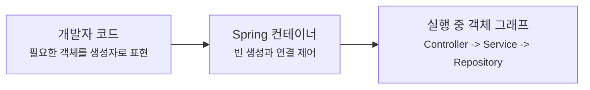
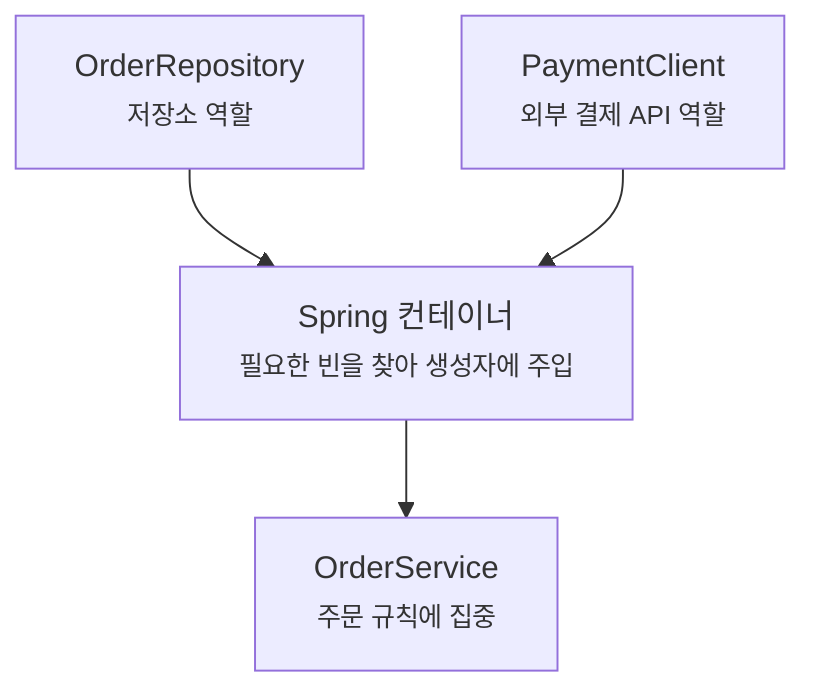
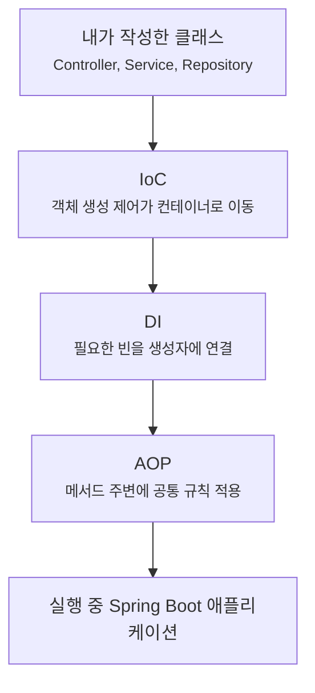

# IoC, DI, AOP는 왜 Spring을 읽는 세 가지 기준점일까요?

> `@Service` 하나 붙였을 뿐인데 객체가 생기고, 생성자에 값이 들어오고, 어떤 메서드는 호출 앞뒤로 추가 동작까지 붙어요.

처음 Spring Boot 코드를 보면 이상한 장면이 자주 나와요.

내가 `new OrderService()`를 쓴 적이 없는데 `OrderService` 객체가 쓰이고요. `OrderRepository`를 직접 넘긴 적도 없는데 생성자에 들어와요. 나중에는 `@Transactional` 같은 애노테이션을 붙였을 뿐인데 트랜잭션이 시작되고 끝나요.

이쯤에서 이런 생각이 들어요.

> "객체는 누가 만든 거지?"  
> "필요한 객체는 누가 넣어준 거지?"  
> "메서드 안에 없는 동작은 어디서 끼어든 거지?"

오늘 볼 제어의 역전(IoC), 의존성 주입(dependency injection), 관점 지향 프로그래밍(AOP)은 이 질문들에 답하는 세 가지 기준점이에요.

!!! note "이 글의 범위"
    오늘은 IoC, DI, AOP를 깊은 내부 구현까지 파고들지 않아요. 목표는 Spring Boot 코드를 읽을 때 "이건 객체 생성 책임 이야기구나", "이건 연결 방식 이야기구나", "이건 메서드 주변에 붙는 공통 규칙 이야기구나" 하고 구분하는 거예요.

---

## 먼저 직접 만든 코드부터 볼게요

주문 목록을 조회하는 작은 코드를 직접 조립한다고 해볼게요.

```java
package com.example.order;

class OrderController {

    private final OrderService orderService;

    OrderController() {
        OrderRepository orderRepository = new OrderRepository();
        this.orderService = new OrderService(orderRepository);
    }

    String orders() {
        return orderService.findOrders();
    }
}
```

이 코드는 한눈에 이해되긴 해요. 컨트롤러가 저장소를 만들고, 서비스를 만들고, 그 서비스를 써요.

근데요, 역할을 자세히 보면 컨트롤러가 너무 많은 일을 하고 있어요.

| 코드가 하는 일 | 원래 컨트롤러의 책임일까요? |
|---|---|
| HTTP 요청을 받아 주문 목록을 돌려줌 | 맞아요 |
| `OrderRepository`를 직접 생성함 | 애매해요 |
| `OrderService`를 직접 생성함 | 애매해요 |
| 서비스가 어떤 저장소를 쓸지 결정함 | 점점 부담돼요 |

작을 때는 괜찮아요. 하지만 테스트에서 가짜 저장소를 넣고 싶거나, 저장소 구현이 바뀌거나, 여러 서비스가 같은 객체를 공유해야 하면 금방 불편해져요.

그래서 Spring은 질문을 바꿔요.

> "컨트롤러가 객체를 직접 만들 필요가 있을까?"

---

## IoC는 "내가 하던 제어를 컨테이너가 가져가는 것"이에요

제어의 역전(inversion of control, IoC)이라는 말은 처음 들으면 너무 거창해요.

여기서는 이렇게 잡아볼게요.

> 내가 직접 하던 객체 생성과 연결의 제어를 Spring 컨테이너에게 넘기는 것.

직접 제어할 때는 흐름이 이래요.

```java
OrderRepository repository = new OrderRepository();
OrderService service = new OrderService(repository);
OrderController controller = new OrderController(service);
```

개발자 코드가 "무엇을 만들지", "어떤 순서로 만들지", "누구에게 넣을지"를 모두 결정해요.

Spring을 쓰면 클래스는 자기에게 필요한 것을 드러내고, 객체 생성과 연결은 Spring 컨테이너가 맡아요.

```java
package com.example.order;

import org.springframework.stereotype.Service;

@Service
class OrderService {

    private final OrderRepository orderRepository;

    OrderService(OrderRepository orderRepository) {
        this.orderRepository = orderRepository;
    }

    String findOrders() {
        return "orders";
    }
}
```

`OrderService`는 이제 `OrderRepository`를 직접 만들지 않아요. 대신 "나는 `OrderRepository`가 필요해요"라고 생성자로 말해요.

Spring 컨테이너는 애플리케이션을 시작할 때 관리할 객체들을 만들고, 필요한 관계를 맞춰요. 이렇게 Spring이 관리하는 객체를 빈(bean)이라고 불러요.



이 그림에서 방향이 바뀐 게 핵심이에요. 예전에는 개발자 코드가 객체를 직접 만들었고, 이제는 개발자 코드가 필요한 관계를 표현하면 컨테이너가 실제 객체 그래프를 만들어요.

---

## DI는 IoC가 코드에 나타나는 가장 흔한 모양이에요

IoC가 큰 원칙이라면, 의존성 주입(dependency injection, DI)은 그 원칙이 코드에 나타나는 대표적인 방식이에요.

의존성이라는 말도 어렵게 들리지만 사실 단순해요.

`OrderService`가 일을 하려면 `OrderRepository`가 필요하죠. 그러면 `OrderService`는 `OrderRepository`에 의존한다고 말해요.

```java
package com.example.order;

import org.springframework.stereotype.Repository;

@Repository
class OrderRepository {

    String findAll() {
        return "orders";
    }
}
```

```java
package com.example.order;

import org.springframework.stereotype.Service;

@Service
class OrderService {

    private final OrderRepository orderRepository;

    OrderService(OrderRepository orderRepository) {
        this.orderRepository = orderRepository;
    }

    String findOrders() {
        return orderRepository.findAll();
    }
}
```

여기서 `OrderService`는 저장소를 직접 만들지 않고, 생성자로 받아요. Spring 컨테이너가 `OrderRepository` 빈을 찾아서 `OrderService`를 만들 때 넣어줘요.

이게 의존성 주입이에요.

| 표현 | 뜻 |
|---|---|
| 의존성 | 이 클래스가 일하려고 필요한 다른 객체 |
| 주입 | 필요한 객체를 바깥에서 넣어주는 일 |
| 생성자 주입 | 생성자 파라미터로 필요한 객체를 받는 방식 |
| 빈 | Spring 컨테이너가 만들고 관리하는 객체 |

Spring Boot 코드에서 생성자만 있고 `new`가 없는데 객체가 들어온다면, 대부분 이 흐름을 보고 있는 거예요.

---

## "직접 만들지 않는다"는 게 왜 중요할까요?

겉으로 보면 직접 `new`를 쓰는 편이 더 명확해 보일 수 있어요.

사실은, 애플리케이션이 커질수록 직접 만드는 코드가 오히려 중요한 결정을 숨겨요.

예를 들어 결제 서비스가 이런 모양이라고 해볼게요.

```java
package com.example.order;

import org.springframework.stereotype.Service;

@Service
class PaymentService {

    private final PaymentClient paymentClient;
    private final OrderRepository orderRepository;

    PaymentService(PaymentClient paymentClient, OrderRepository orderRepository) {
        this.paymentClient = paymentClient;
        this.orderRepository = orderRepository;
    }
}
```

생성자를 보면 이 서비스가 무엇에 기대고 있는지 바로 보여요.

반대로 클래스 안에서 `new PaymentClient()`를 숨어서 호출하면, 테스트와 변경이 어려워져요. 외부 결제 API를 진짜로 부르지 않고 테스트하고 싶은데, 클래스가 이미 직접 만들어버렸으니까요.

DI를 쓰면 클래스는 "필요한 것"을 공개하고, 실행 환경은 "무엇을 넣을지"를 결정할 수 있어요.



이 구조에서는 `OrderService`가 조립 담당자가 아니에요. 서비스는 주문 규칙에 집중하고, Spring 컨테이너가 필요한 협력 객체를 넣어줘요.

!!! tip "처음에는 생성자를 먼저 보세요"
    Spring Boot 코드에서 어떤 클래스가 이해되지 않으면, 메서드보다 생성자를 먼저 보세요. 생성자 파라미터에는 이 클래스가 기대는 협력 객체가 드러나요.

---

## AOP는 "여러 곳에 반복되는 규칙"을 메서드 주변에 붙여요

이제 세 번째 기준점인 관점 지향 프로그래밍(AOP)을 볼게요.

주문을 저장할 때 이런 일이 필요하다고 해볼게요.

- 메서드가 시작되면 트랜잭션을 열어요.
- 메서드가 정상 종료되면 커밋해요.
- 예외가 나면 롤백해요.
- 실행 시간을 기록해요.
- 권한이 있는지 확인해요.

이런 코드를 모든 서비스 메서드에 직접 쓰면 어떻게 될까요?

```java
String createOrder() {
    transaction.begin();
    try {
        String orderId = saveOrder();
        transaction.commit();
        return orderId;
    } catch (RuntimeException ex) {
        transaction.rollback();
        throw ex;
    }
}
```

업무 코드는 `saveOrder()`인데, 주변 코드가 훨씬 커져요. 게다가 이 패턴은 주문, 결제, 배송, 회원 서비스 곳곳에 반복돼요.

AOP는 이런 반복 규칙을 "업무 코드 바깥의 관점"으로 분리하려고 해요.

| 반복되는 관심사 | 흔한 예 |
|---|---|
| 트랜잭션 | 성공하면 커밋, 실패하면 롤백 |
| 보안 | 메서드 실행 전에 권한 확인 |
| 로깅 | 호출 시간, 요청 정보 기록 |
| 캐시 | 이미 계산한 결과 재사용 |

여기서 중요한 건 AOP가 비즈니스 로직을 대신 작성한다는 뜻이 아니라는 점이에요.

업무 메서드는 주문을 만들고, AOP는 그 메서드 주변에 공통 규칙을 붙여요.


Spring AOP는 보통 프록시(proxy)를 통해 동작해요. 호출자가 실제 서비스 객체를 바로 부르는 것처럼 보여도, 중간에 프록시가 서서 메서드 앞뒤의 공통 규칙을 처리할 수 있어요.

---

## 그래서 애노테이션은 스위치처럼 보이지만, 뒤에는 구조가 있어요

Spring Boot를 쓰다 보면 애노테이션 하나가 많은 일을 하는 것처럼 보여요.

```java
package com.example.order;

import org.springframework.stereotype.Service;
import org.springframework.transaction.annotation.Transactional;

@Service
class OrderService {

    @Transactional
    String createOrder() {
        return "order-id";
    }
}
```

처음에는 `@Transactional`이 메서드 안으로 들어와서 코드를 바꾸는 것처럼 느껴질 수 있어요.

사실은 그렇게 이해하면 나중에 헷갈려요. 핵심은 "메서드 내부가 바뀐다"가 아니라 "그 메서드를 호출하는 경로에 프록시가 끼어 공통 규칙을 적용한다"에 가까워요.

그래서 나중에 이런 질문들이 생겨요.

- 왜 같은 클래스 안에서 자기 메서드를 호출하면 트랜잭션이 기대처럼 안 걸릴 수 있을까요?
- 왜 `final` 클래스나 메서드가 프록시와 충돌할 수 있을까요?
- 왜 인터페이스가 있느냐 없느냐에 따라 프록시 방식 이야기가 나올까요?

오늘 전부 풀지는 않을게요. 다만 지금은 이것만 잡으면 돼요.

> AOP를 만나면 "메서드 안에 없는 공통 동작이 호출 경로 어디에 붙었을까?"를 물어보면 돼요.

!!! warning "애노테이션만 보고 내부 동작을 단정하면 위험해요"
    `@Transactional`, `@Cacheable`, 보안 애노테이션처럼 메서드 주변 동작을 바꾸는 기능은 프록시와 호출 경로의 영향을 받아요. "붙였으니 무조건 된다"보다 "누가 이 메서드를 어떤 경로로 호출하나"를 같이 봐야 해요.

---

## 세 단어를 한 화면에 놓아볼게요

IoC, DI, AOP는 서로 같은 말이 아니에요. 하지만 Spring Boot 코드를 읽을 때는 자주 붙어서 보여요.

| 기준점 | 먼저 물어볼 질문 | 코드에서 보이는 모양 |
|---|---|---|
| IoC | 객체 생성과 연결의 제어권이 누구에게 있나요? | Spring 컨테이너, 빈 등록, 애플리케이션 컨텍스트 |
| DI | 이 클래스가 필요한 객체는 어떻게 들어오나요? | 생성자 파라미터, `@Service`, `@Repository`, `@Bean` |
| AOP | 메서드 안에 없는 공통 규칙은 어디서 적용되나요? | 프록시, `@Transactional`, 보안, 캐시, 로깅 |

식당 장면으로 다시 연결하면 이래요.

| 식당에서는 | Spring에서는 |
|---|---|
| 주방장이 직원을 직접 뽑지 않음 | 객체 생성 제어가 컨테이너로 이동함, IoC |
| 필요한 담당자가 주방에 배치됨 | 필요한 의존성이 생성자에 들어옴, DI |
| 계산, 위생 점검, 출입 기록 같은 규칙이 공통으로 적용됨 | 메서드 주변에 트랜잭션, 보안, 로깅이 붙음, AOP |

이 세 가지를 같이 보면 Spring Boot의 "내가 안 한 일"이 조금씩 나뉘어요.



이 그림은 정확한 실행 순서를 모두 표현한 내부 구조도는 아니에요. 대신 Spring Boot 코드를 읽을 때 질문을 나누는 지도에 가까워요.

---

## Spring Boot 프로젝트에서는 어디서 처음 만나게 될까요?

지난 글에서 본 `OrderApplication`을 다시 떠올려볼게요.

```java
package com.example.order;

import org.springframework.boot.SpringApplication;
import org.springframework.boot.autoconfigure.SpringBootApplication;

@SpringBootApplication
public class OrderApplication {

    public static void main(String[] args) {
        SpringApplication.run(OrderApplication.class, args);
    }
}
```

여기서 `SpringApplication.run(...)`은 그냥 객체 하나를 실행하는 호출이 아니에요. 뒤 글에서 더 자세히 보겠지만, 애플리케이션을 준비하고 Spring 컨테이너를 만들고 빈을 등록하는 흐름의 입구예요.

`@SpringBootApplication`은 자동 설정(auto-configuration), 컴포넌트 스캔(component scan), 설정 클래스 역할을 한곳에 묶어주는 대표 애노테이션이에요.

그래서 우리가 만든 클래스가 이런 식으로 같은 루트 패키지 아래에 있으면요.

```java
package com.example.order;

import org.springframework.web.bind.annotation.GetMapping;
import org.springframework.web.bind.annotation.RestController;

@RestController
class OrderController {

    private final OrderService orderService;

    OrderController(OrderService orderService) {
        this.orderService = orderService;
    }

    @GetMapping("/orders")
    String orders() {
        return orderService.findOrders();
    }
}
```

Spring은 컴포넌트 스캔으로 컨트롤러와 서비스 같은 후보를 찾고, 컨테이너에 빈으로 등록하고, 생성자에 필요한 빈을 연결해요.

이 한 장면 안에 오늘 본 세 기준점 중 IoC와 DI가 이미 들어 있어요. 여기에 트랜잭션, 보안, 캐시 같은 공통 규칙이 붙기 시작하면 AOP 질문까지 따라와요.

---

## 자, 정리해볼까요?

!!! abstract "오늘 우리가 잡은 세 기준점"
    - IoC는 객체 생성과 연결의 제어가 개발자 코드에서 Spring 컨테이너로 이동하는 흐름이에요.
    - DI는 필요한 객체를 클래스 안에서 직접 만들지 않고, 생성자 같은 통로로 바깥에서 넣어주는 방식이에요.
    - AOP는 트랜잭션, 보안, 로깅처럼 여러 곳에 반복되는 공통 규칙을 메서드 주변에 붙이는 방식이에요.
    - Spring Boot 코드를 읽을 때는 "누가 만들었지?", "누가 넣어줬지?", "메서드 밖의 동작은 어디서 붙었지?"를 나눠서 보면 덜 헷갈려요.

이제 `@Service`, 생성자, `@Transactional` 같은 조각들이 조금 다르게 보일 거예요.

다음 글에서는 이 기준점을 들고 `main` 메서드로 들어가 볼게요. `SpringApplication.run(...)` 한 줄이 어떻게 설정을 읽고, 컨테이너를 만들고, 실행 중 애플리케이션으로 이어지는지 살펴볼 차례예요.

---

## 참고한 링크

- [Spring Framework Reference: The IoC Container](https://docs.spring.io/spring-framework/reference/core/beans.html)
- [Spring Framework Reference: Introduction to the Spring IoC Container and Beans](https://docs.spring.io/spring-framework/reference/core/beans/introduction.html)
- [Spring Framework Reference: Dependency Injection](https://docs.spring.io/spring-framework/reference/core/beans/dependencies/factory-collaborators.html)
- [Spring Framework Reference: AOP Proxies](https://docs.spring.io/spring-framework/reference/core/aop/introduction-proxies.html)
- [Spring Framework Reference: Proxying Mechanisms](https://docs.spring.io/spring-framework/reference/core/aop/proxying.html)
- [Spring Boot Reference: Using the @SpringBootApplication Annotation](https://docs.spring.io/spring-boot/reference/using/using-the-springbootapplication-annotation.html)
