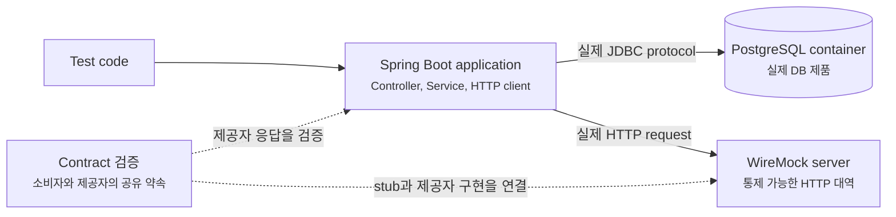
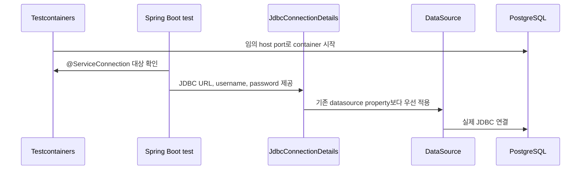
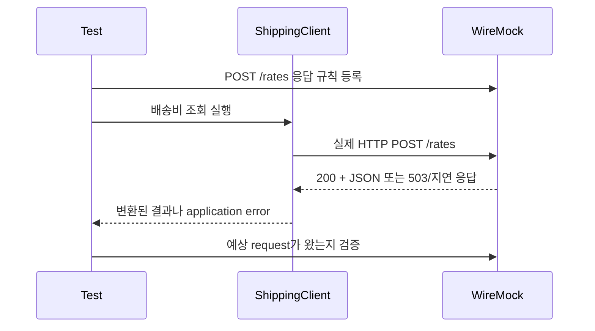
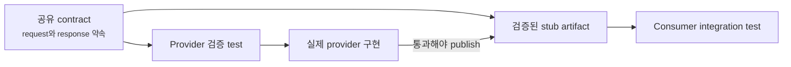

# Testcontainers와 WireMock은 무엇을 진짜로 바꿔줄까요?

> 가짜를 실제 부품으로 바꿨다고 해서, 곧바로 운영 환경 전체를 재현한 것은 아니에요.

로컬에서는 H2를 쓰는 test가 모두 통과했어요. 그런데 배포하자 PostgreSQL query가 실패해요. 외부 배송 API는 mock으로 바꿔 두었는데, 실제 응답에 field 하나가 빠지자 주문 처리도 멈췄어요.

이런 일을 겪으면 다음에는 모든 것을 실제로 띄우고 싶어져요.

> “Testcontainers로 PostgreSQL을 띄우고, 외부 API도 진짜 server에 호출하면 안전하지 않을까요?”

근데요, CI에서 다른 회사의 운영 API를 호출하는 것은 느리고 불안정하며 실제 데이터까지 건드릴 수 있어요. 반대로 모든 외부 응답을 우리가 마음대로 만든 stub으로 바꾸면, 그 stub이 실제 제공자와 달라져도 test는 계속 초록색일 수 있죠.

그래서 필요한 것은 “전부 진짜”와 “전부 가짜” 중 하나를 고르는 일이 아니에요. **어떤 경계는 실제 제품으로 확인하고, 어떤 경계는 통제 가능한 대역으로 재현하며, 두 서비스가 공유하는 약속은 양쪽에서 따로 검증하는 일**이에요.

[앞 글](testing-map-unit-slice-integration.md)에서는 unit, slice, full-context, random-port test가 실제로 어디까지 통과하는지 나눠 봤어요. 이번에는 그 바깥에 있는 database 제품, 외부 HTTP server, 서비스 사이 계약까지 test 경계를 넓혀 볼게요.

!!! note "이 글의 기준"
    예제는 Spring Boot 4.x, Java 21, JUnit Jupiter를 기준으로 해요. Testcontainers와 WireMock 같은 외부 library의 version은 계속 바뀔 수 있으므로, 실제 project에서는 Spring Boot dependency management와 각 library의 공식 문서를 함께 확인하세요.

---

## 먼저 바꿀 경계를 세 칸으로 나눠 봐요

주문 API가 PostgreSQL에 주문을 저장하고 배송 API를 호출한다고 해볼게요. 한 요청 안에서도 확인할 경계는 서로 달라요.



Application은 PostgreSQL과는 실제 database protocol로 대화하고, 배송 API 자리에는 우리가 통제하는 HTTP server를 둬요. Contract 검증은 한 단계 옆에서 “그 HTTP 대역이 제공자 구현과 같은 약속을 말하는가?”를 확인해요.

| 도구 | 실제로 바꾸는 것 | 잘 잡는 문제 | 혼자서는 못 잡는 문제 |
|---|---|---|---|
| Testcontainers | H2나 수동 설치 service를 disposable container로 교체 | 실제 DB dialect, driver, schema migration, mapping | 운영 데이터 양, cloud 권한, network topology |
| WireMock | 외부 HTTP 제공자를 local stub server로 교체 | request URL·header·body, 응답, timeout, 오류 처리 | 실제 제공자가 그 응답 계약을 지키는지 |
| Contract test | 소비자 기대와 제공자 구현 사이의 공유 계약을 실행 가능한 자산으로 만듦 | field·status·header 변경으로 생기는 호환성 파손 | 전체 business journey, 실제 network 품질 |

셋은 경쟁 도구가 아니에요. 서로 다른 불확실성을 줄이는 도구예요.

---

## H2가 통과해도 PostgreSQL이 실패할 수 있어요

Embedded database는 빠르고 준비가 쉬워요. Repository test를 처음 만들 때 유용하죠. 하지만 H2와 PostgreSQL은 이름만 다른 같은 database가 아니에요.

- 지원하는 SQL 문법과 type이 달라요.
- identifier의 대소문자 처리나 예약어가 달라질 수 있어요.
- JSON, array, UUID 같은 vendor type의 동작이 달라요.
- index, lock, transaction isolation에서 보이는 현상이 달라요.
- Flyway나 Liquibase migration이 실제 운영 database에서만 실패할 수 있어요.

이 차이가 요구사항에 포함된다면 test도 같은 제품을 통과해야 해요. Testcontainers는 이때 PostgreSQL process를 직접 설치하고 port를 고정하는 대신, test가 쓸 container를 준비하고 종료하는 생명주기를 맡아요.

!!! tip "‘운영과 똑같다’보다 ‘문제에 중요한 축이 같다’라고 읽어요"
    PostgreSQL container를 썼다면 database 제품과 major version, driver protocol은 운영에 가까워져요. 하지만 CPU, storage, replica, 방화벽, 데이터 양까지 같아지는 것은 아니에요. Test가 같게 만든 축을 정확히 말할 수 있어야 해요.

---

## Testcontainers는 test가 쓸 실제 service를 잠깐 띄워요

PostgreSQL integration test에는 다음 test dependency가 필요해요. Spring Boot가 관리하는 dependency version을 사용한다면 Testcontainers module에 version을 하나씩 적지 않아도 돼요.

```gradle title="build.gradle" linenums="1" hl_lines="3 4 5"
dependencies {
    runtimeOnly 'org.postgresql:postgresql'
    testImplementation 'org.springframework.boot:spring-boot-testcontainers'
    testImplementation 'org.testcontainers:testcontainers-junit-jupiter'
    testImplementation 'org.testcontainers:testcontainers-postgresql'
}
```

여기서 역할은 셋으로 나뉘어요.

| Dependency | 맡는 일 |
|---|---|
| `spring-boot-testcontainers` | Container를 Spring Boot의 service connection으로 연결 |
| `testcontainers-junit-jupiter` | JUnit test 생명주기와 container 생명주기 연결 |
| `testcontainers-postgresql` | PostgreSQL 전용 container type 제공 |

이제 integration test에 PostgreSQL container를 선언해 볼게요.

```java title="src/test/java/com/example/order/OrderRepositoryIntegrationTests.java" linenums="1"
package com.example.order;

import static org.assertj.core.api.Assertions.assertThat;

import org.junit.jupiter.api.Test;
import org.springframework.beans.factory.annotation.Autowired;
import org.springframework.boot.test.context.SpringBootTest;
import org.springframework.boot.testcontainers.service.connection.ServiceConnection;
import org.testcontainers.containers.PostgreSQLContainer;
import org.testcontainers.junit.jupiter.Container;
import org.testcontainers.junit.jupiter.Testcontainers;

@Testcontainers
@SpringBootTest
class OrderRepositoryIntegrationTests {

    @Container
    @ServiceConnection
    static final PostgreSQLContainer<?> postgres =
            new PostgreSQLContainer<>("postgres:17-alpine");

    @Autowired
    private OrderRepository orders;

    @Test
    void savesAndReadsAnOrderWithPostgreSql() {
        Order saved = this.orders.save(Order.pending("ORD-1001"));

        Order found = this.orders.findById(saved.id()).orElseThrow();

        assertThat(found.orderNumber()).isEqualTo("ORD-1001");
    }
}
```

`static` container는 이 test class의 test들이 함께 사용해요. Testcontainers의 JUnit extension은 class가 시작되기 전에 container를 띄우고 class가 끝난 뒤 정리해요. Method마다 새 container가 꼭 필요한 특별한 이유가 없다면, 시작 비용 때문에 class 단위 공유가 보통 더 자연스러워요.

!!! warning "Container image tag는 의도적으로 고정해요"
    `postgres:latest`를 쓰면 같은 commit의 test가 어느 날 다른 database version으로 실행될 수 있어요. 운영에서 쓰는 major version과 맞춘 tag를 고정하고, upgrade는 별도 변경으로 test하세요.

### 개발자가 쓴 것은 container 선언까지예요

위 code에는 `spring.datasource.url`, username, password를 복사하는 부분이 없어요. 이 연결은 `@ServiceConnection`이 맡아요.



Testcontainers는 실행 중인 container의 실제 port와 자격 증명을 알고 있어요. Spring Boot는 그것을 `JdbcConnectionDetails`로 바꾸고 `DataSource` 자동 설정에 전달해요. 그래서 개발자가 임의 port를 미리 알아내어 설정 파일에 적지 않아도 돼요.

이 지점이 단순한 편의보다 중요해요. Test property에 오래된 URL이 남아 있어도 service connection이 접속 정보보다 우선하므로, test가 어느 database를 보는지 container 선언에서 바로 읽을 수 있어요.

### `@DynamicPropertySource`가 사라진 것은 아니에요

`@ServiceConnection`이 지원하는 service라면 접속 정보를 직접 옮기는 code를 줄여 줘요. 하지만 모든 custom container와 모든 application property를 자동으로 이해하는 것은 아니에요.

예를 들어 회사 내부 emulator가 `orders.vendor.base-url`이라는 custom property를 요구한다면 `@DynamicPropertySource`로 실행 중 port를 넘길 수 있어요.

```java
@DynamicPropertySource
static void vendorProperties(DynamicPropertyRegistry registry) {
    registry.add("orders.vendor.base-url", vendor::getBaseUrl);
}
```

선택 기준은 간단해요.

| 상황 | 먼저 고를 연결 방식 |
|---|---|
| Spring Boot가 아는 database, Redis, Kafka 같은 service | `@ServiceConnection` |
| Application 전용 property 이름으로 값을 전달 | `@DynamicPropertySource` |
| 여러 test가 같은 container 선언을 재사용 | test configuration의 container bean 또는 `@ImportTestcontainers` |

특히 여러 test class가 같은 Spring context를 cache한다면 container 생명주기도 context와 맞아야 해요. 한 class가 container를 먼저 종료했는데 다른 class가 cache된 context를 재사용하면, bean은 남아 있지만 service는 사라진 이상한 실패가 생길 수 있어요. 이런 경우에는 container를 Spring bean으로 관리하거나 공통 선언을 `@ImportTestcontainers`로 가져오는 방식을 검토하세요.

---

## Schema migration도 같은 container 안에서 지나가야 해요

Testcontainers를 연결했는데 test 시작 전에 `schema.sql`로 간단한 table만 만든다면, 운영에서 쓰는 Flyway migration 전체는 여전히 검증하지 않은 셈이에요.

앞서 [schema migration 글](schema-migration-flyway-liquibase.md)에서 본 것처럼 application 시작 순서를 그대로 쓰면 다음 경계를 한 번에 확인할 수 있어요.

Container가 준비되면 Flyway가 production migration을 순서대로 적용하고, Spring `ApplicationContext`가 열린 뒤 그 schema 위에서 repository test가 실행돼요. 이 흐름이 통과하면 “새 database에 현재 migration을 적용한 뒤 application query가 동작한다”는 꽤 구체적인 근거가 생겨요.

반면 이미 수년간 변경된 운영 database를 앞으로 migration할 수 있는지, 대용량 table 변경이 허용 시간 안에 끝나는지는 이 test만으로 알 수 없어요. 오래된 schema snapshot과 migration rehearsal, staging 관찰이 따로 필요한 이유예요.

---

## Docker Compose와 Testcontainers는 같은 문제를 다른 크기로 다뤄요

둘 다 container를 쓰니 하나만 남겨야 할 것처럼 보일 수 있어요. 하지만 주 사용 장면이 달라요.

| 질문 | Testcontainers | Docker Compose |
|---|---|---|
| 누가 시작하나요? | Test code와 library | 개발자 또는 Spring Boot의 Compose 지원 |
| 생명주기 단위 | Test class, context, suite | 개발 session이나 application 실행 |
| 접속 정보 | `@ServiceConnection` 등으로 동적 연결 | Compose service를 보고 service connection 생성 |
| 잘 맞는 장면 | 격리된 자동 integration test | 개발 중 DB·Redis·broker를 함께 띄우기 |
| 기본 test 동작 | Test가 직접 사용 | Spring Boot Compose 지원은 test에서 기본 skip |

로컬 개발에 PostgreSQL과 Redis가 늘 함께 필요하다면 `compose.yml`이 읽기 좋아요.

```yaml title="compose.yml"
services:
  postgres:
    image: postgres:17-alpine
    environment:
      POSTGRES_DB: orders
      POSTGRES_USER: orders
      POSTGRES_PASSWORD: orders
    ports:
      - "5432"
    healthcheck:
      test: ["CMD-SHELL", "pg_isready -U orders"]
      interval: 2s
      timeout: 2s
      retries: 10

  redis:
    image: redis:8-alpine
    ports:
      - "6379"
```

Host port를 `5432:5432`처럼 고정하지 않고 container port만 적으면 빈 host port를 쓸 수 있어요. Spring Boot의 Docker Compose 지원은 mapping된 실제 port를 찾아 service connection을 만들어요.

```gradle title="build.gradle" linenums="1" hl_lines="2"
dependencies {
    developmentOnly 'org.springframework.boot:spring-boot-docker-compose'
}
```

이 dependency가 있으면 Spring Boot는 일반적인 이름의 Compose file을 찾고, application 시작 때 service를 준비하고, 종료 때 lifecycle 설정에 따라 멈춰요. 이미 service가 실행 중이라면 접속 정보만 사용해요.

그렇다고 CI test가 자동으로 `compose.yml`을 쓰는 것은 아니에요. Spring Boot의 Compose 지원은 기본적으로 test에서 skip돼요. Test에서도 켤 수 있지만, `spring.docker.compose.skip.in-tests=false`와 test classpath 설정을 명시해야 해요.

!!! tip "개발 환경과 test 환경의 목표를 나눠요"
    개발자가 여러 service를 켜 두고 반복 실행하는 장면에는 Docker Compose가 편하고, test마다 알려진 상태와 자동 cleanup이 필요한 장면에는 Testcontainers가 잘 맞아요. 같은 image와 healthcheck 원칙을 공유할 수는 있지만 생명주기까지 억지로 같게 만들 필요는 없어요.

---

## 외부 HTTP API는 실제 운영 server 대신 WireMock으로 재현해요

이번에는 주문 application이 배송비 API를 호출한다고 해볼게요. 실제 제공자 server를 CI에서 호출하면 다음 문제가 생겨요.

- Network 상태나 상대 service 배포 때문에 우리 test가 실패해요.
- Rate limit과 사용 요금이 test 결과에 섞여요.
- `500`, timeout, 깨진 JSON을 원하는 시점에 만들기 어려워요.
- Test data가 외부 system에 남을 수 있어요.
- Secret 없이는 새 개발자와 pull request CI가 test를 실행하지 못해요.

WireMock은 이 외부 HTTP 경계를 local HTTP server로 바꿔요. Method 호출을 흉내 내는 Mockito mock과 달리, application의 실제 HTTP client가 socket을 열고 URL, header, body를 보내도록 만들 수 있어요.



Test는 먼저 응답 규칙을 등록해요. Application code는 WireMock인지 모르고 평소의 HTTP client를 사용해요. 마지막에는 반환값뿐 아니라 실제로 어떤 request를 보냈는지도 확인할 수 있어요.

### 성공 응답만 만들면 외부 경계를 절반만 test한 거예요

WireMock의 공식 Spring Boot integration을 사용하면 random port로 server를 띄우고 base URL을 application property에 넣을 수 있어요.

```gradle title="build.gradle" linenums="1" hl_lines="2"
dependencies {
    testImplementation 'org.wiremock.integrations:wiremock-spring-boot:4.0.9'
}
```

```java title="src/test/java/com/example/order/ShippingClientIntegrationTests.java" linenums="1"
package com.example.order;

import static com.github.tomakehurst.wiremock.client.WireMock.equalToJson;
import static com.github.tomakehurst.wiremock.client.WireMock.post;
import static com.github.tomakehurst.wiremock.client.WireMock.postRequestedFor;
import static com.github.tomakehurst.wiremock.client.WireMock.serverError;
import static com.github.tomakehurst.wiremock.client.WireMock.urlEqualTo;
import static com.github.tomakehurst.wiremock.client.WireMock.verify;
import static org.assertj.core.api.Assertions.assertThatThrownBy;

import org.junit.jupiter.api.Test;
import org.springframework.beans.factory.annotation.Autowired;
import org.springframework.boot.test.context.SpringBootTest;
import org.wiremock.spring.ConfigureWireMock;
import org.wiremock.spring.EnableWireMock;

@SpringBootTest
@EnableWireMock(@ConfigureWireMock(baseUrlProperties = "shipping.base-url"))
class ShippingClientIntegrationTests {

    @Autowired
    private ShippingClient shippingClient;

    @Test
    void translatesAProviderFailureWithoutSilentlyRetryingForever() {
        com.github.tomakehurst.wiremock.client.WireMock.stubFor(
                post("/rates").willReturn(serverError()));

        assertThatThrownBy(() -> this.shippingClient.quote("10001", 1200))
                .isInstanceOf(ShippingUnavailableException.class);

        verify(1, postRequestedFor(urlEqualTo("/rates"))
                .withRequestBody(equalToJson("""
                        {"postalCode":"10001","weightGrams":1200}
                        """)));
    }
}
```

이 test는 illustrative한 작은 모양이에요. 핵심은 `shipping.base-url`이 WireMock의 random base URL로 들어가고, `ShippingClient`는 production과 같은 HTTP serialization과 error handling을 지난다는 점이에요.

실무에서는 성공 하나보다 실패 표를 먼저 만들어 두는 편이 좋아요.

| 외부 응답 | Application이 결정할 일 |
|---|---|
| `200`이지만 optional field 없음 | 기본값을 쓸지, 계약 위반으로 볼지 |
| `400` | 우리 request 오류로 분류하고 retry하지 않을지 |
| `429` | `Retry-After`를 읽고 제한된 retry를 할지 |
| `500` / `503` | 일시 장애로 분류할지, fallback을 쓸지 |
| 응답 지연 | Client timeout 뒤 어떤 error를 돌려줄지 |
| 깨진 JSON | Parsing failure를 domain error로 어떻게 감쌀지 |

WireMock은 fixed delay, connection fault, malformed response 같은 상태를 반복해서 만들 수 있어요. 다만 retry를 test할 때는 횟수와 총 대기 시간이 무한히 늘지 않도록 clock이나 backoff 설정을 test용으로 통제해야 해요.

!!! warning "WireMock을 production logic 복제품으로 만들지 마세요"
    Stub에 제공자의 모든 업무 규칙을 다시 구현하면 두 번째 가짜 service를 유지하게 돼요. 우리 application이 의존하는 최소 request와 대표 response만 표현하고, 실제 제공자와의 일치는 contract test나 sandbox smoke test로 따로 확인하세요.

---

## WireMock test와 contract test는 같은 말이 아니에요

우리가 다음 stub을 직접 만들었다고 해볼게요.

```http
POST /rates HTTP/1.1
Content-Type: application/json

{"postalCode":"10001","weightGrams":1200}
```

```json
{
  "amount": 3200,
  "currency": "KRW"
}
```

이 stub을 상대로 consumer test가 통과하면 무엇을 알 수 있을까요?

> “주문 application은 이 request를 보내며, 이런 response가 오면 처리할 수 있다.”

하지만 다음 사실은 알 수 없어요.

> “실제 배송 API도 지금 이 request를 받고 이 response를 보낸다.”

Stub을 우리 팀이 손으로 만들었기 때문이에요. 실제 제공자가 `amount`를 `price`로 바꿨는데 stub은 그대로라면 test는 거짓 안정감을 줘요.

Contract test는 이 끊어진 연결을 고정하려고 해요. 공유 계약 하나에서 **제공자 구현을 확인할 test**와 **소비자가 사용할 stub**을 함께 만들거나, 소비자가 작성한 기대를 제공자 CI에서도 실행해요.



중요한 화살표는 provider 구현에서 stub으로 이어지는 조건이에요. 제공자의 generated test가 contract를 통과해야 그 contract에서 나온 stub을 배포하게 만들면, consumer가 사용하는 대역과 provider 구현 사이에 CI 근거가 생겨요.

Spring 생태계에서는 Spring Cloud Contract가 이런 흐름을 지원해요. HTTP와 message 계약을 정의하고, provider test와 WireMock stub을 만들며, Stub Runner로 consumer test에서 배포된 stub을 실행할 수 있어요.

### Contract에는 소비자가 실제로 의존하는 것만 넣어요

배송 API response에 field가 스무 개 있어도 주문 application이 `amount`와 `currency`만 읽는다면, consumer contract도 그 의존성을 중심으로 작성하는 편이 좋아요.

| Contract에 넣을 것 | 보통 넣지 않을 것 |
|---|---|
| Consumer가 보내야 하는 method, path, 필수 header | Provider 내부 service 호출 순서 |
| Consumer가 실제 사용하는 request field | 사용하지 않는 모든 response field |
| 의미 있는 status와 response field | Provider의 database schema |
| 호환성을 깨는 type과 필수 여부 | 전체 business scenario의 모든 분기 |

Contract가 너무 느슨하면 breaking change를 못 잡고, 너무 세밀하면 소비자가 쓰지도 않는 변화 때문에 양쪽 build가 자주 깨져요. **실제 소비자의 의존성을 최소한으로 정확하게 표현하는 것**이 핵심이에요.

!!! note "OpenAPI schema와 contract test도 역할이 달라요"
    OpenAPI는 API 전체 모양을 설명하고 문서와 code generation에 유용해요. Contract test는 특정 상호작용을 실제 provider와 consumer build에서 실행해요. OpenAPI validation으로 넓은 schema를 확인하고, 중요한 consumer journey를 contract로 고정하는 식으로 함께 쓸 수 있어요.

---

## CI에서는 빠른 test와 infrastructure test를 분리하되 빠뜨리지 말아요

Testcontainers가 편해도 image pull과 service startup에는 시간이 들어요. WireMock은 상대적으로 가볍지만 Spring context와 HTTP client까지 열면 pure unit test보다 느려요. 그래서 CI는 보통 피드백 속도와 실제 경계 검증을 단계로 나눠요.

CI에서는 unit test, slice test, infrastructure integration test, contract verification, packaging 순으로 비용이 커지는 단계를 배치할 수 있어요. 앞 단계가 빨리 실패하면 뒤의 비싼 작업을 기다리지 않아도 돼요.

하지만 infrastructure test를 야간 build로만 밀어 버리면, database나 외부 API 경계를 깨뜨린 commit이 main branch에 오래 남을 수 있어요. 핵심 경계는 pull request에서 실행하는 편이 안전해요.

### CI가 우연에 기대지 않게 만드는 점검표

- Docker를 사용할 수 있는 runner인지 확인해요.
- Image tag와 dependency version을 재현 가능하게 고정해요.
- Container readiness는 임의 `sleep`보다 healthcheck와 wait strategy로 확인해요.
- Test끼리 고정 port와 고정 database 이름을 공유하지 않게 해요.
- Test data는 각 test가 만들고 식별할 수 있게 해요.
- 외부 운영 API의 secret이 없어도 기본 test suite가 돌아가게 해요.
- Container log와 application log는 실패했을 때만 충분히 남겨요.
- Contract stub은 provider 검증을 통과한 version만 소비자가 사용하게 해요.
- Parallel test를 켤 때 container와 공유 state가 실제로 격리되는지 확인해요.

Testcontainers의 container reuse 기능은 local 반복 속도를 줄일 수 있지만, test 사이에 state가 남을 수 있어요. CI의 신뢰성을 위해 무조건 켜기보다 schema 초기화와 데이터 격리를 먼저 설계하세요.

### 실패 위치를 이름에서 읽을 수 있게 해요

| 실패한 test | 먼저 의심할 경계 |
|---|---|
| H2 repository test만 실패 | Query와 mapping 자체 |
| PostgreSQL container test만 실패 | Vendor SQL, migration, driver, 실제 type |
| WireMock client test만 실패 | Outbound request, serialization, timeout, error mapping |
| Provider contract verification 실패 | Provider 구현이 공유 계약을 깨뜨림 |
| Consumer test가 새 stub에서 실패 | Consumer가 새 계약을 처리하지 못함 |
| 모두 통과하고 deployment만 실패 | Network, secret, 권한, proxy, 운영 data 같은 남은 경계 |

도구 이름을 test class에 마구 붙이는 것보다, 실패가 알려주는 경계를 이름과 build task로 분리하는 편이 운영할 때 더 유용해요.

---

## 그렇다면 어디까지 실제로 띄우면 될까요?

새 integration test를 만들 때는 “더 진짜인가?”보다 다음 질문을 물어보세요.

1. **지금 production과 다른 부품 때문에 놓칠 수 있는 오류는 무엇인가요?**  
   PostgreSQL 문법과 migration이 문제라면 Testcontainers로 같은 database 제품을 써요.

2. **외부 service를 실제로 호출하지 않고도 재현해야 할 응답은 무엇인가요?**  
   성공뿐 아니라 timeout, rate limit, server error를 WireMock으로 만들어요.

3. **그 stub이 실제 provider와 같다는 근거는 어디에 있나요?**  
   공유 contract를 provider CI에서 검증하고, 통과한 stub을 consumer가 사용하게 해요.

4. **이 test가 여전히 재현하지 못하는 production 조건은 무엇인가요?**  
   대용량 data, network policy, TLS, IAM, replica failover는 staging이나 별도 운영 검증으로 넘겨요.

5. **실패했을 때 어느 팀이 어떤 artifact를 고쳐야 하나요?**  
   Application code, migration, contract, stub version의 소유권을 분명히 해요.

좋은 integration test는 현실을 통째로 복사하지 않아요. **이번 변경에서 깨질 가능성이 높은 경계를 실제에 가깝고 반복 가능한 형태로 선택**해요.

## 참고한 링크

- [Spring Boot 공식 문서: Testcontainers](https://docs.spring.io/spring-boot/reference/testing/testcontainers.html)
- [Spring Boot 공식 문서: Development-time Services와 Docker Compose](https://docs.spring.io/spring-boot/reference/features/dev-services.html)
- [Spring Boot 공식 문서: Managed Dependency Coordinates](https://docs.spring.io/spring-boot/4.0/appendix/dependency-versions/coordinates.html)
- [Testcontainers 공식 문서: JUnit 5 integration](https://java.testcontainers.org/test_framework_integration/junit_5/)
- [Testcontainers 공식 문서: PostgreSQL module](https://java.testcontainers.org/modules/databases/postgres/)
- [WireMock 공식 문서: Spring Boot integration](https://wiremock.org/docs/spring-boot/)
- [WireMock 공식 문서: Spring Boot에서 WireMock 사용하기](https://wiremock.org/docs/solutions/spring-boot-integration/)
- [Spring Cloud Contract 공식 문서: 소개와 contract의 목적](https://docs.spring.io/spring-cloud-contract/reference/getting-started/introducing-spring-cloud-contract.html)
- [Spring Cloud Contract 공식 문서: Consumer-driven contract 흐름](https://docs.spring.io/spring-cloud-contract/reference/using/cdc-producer-side.html)

## 자, 정리해볼까요?

!!! abstract "오늘 우리가 배운 것"
    - Testcontainers는 database나 broker 같은 실제 제품을 disposable container로 띄워, embedded 대역이 놓치는 dialect와 migration과 driver 경계를 확인해요.
    - `@ServiceConnection`은 실행 중 container의 접속 정보를 `ConnectionDetails`로 바꾸고 기존 connection property보다 우선 적용해요.
    - Docker Compose는 여러 service를 오래 켜 두는 개발 session에, Testcontainers는 격리된 자동 integration test에 더 자연스럽게 맞아요.
    - WireMock은 실제 HTTP client를 통과시키면서 성공, 오류, timeout을 반복 재현하지만, 손으로 만든 stub이 실제 provider와 같다는 사실까지 보증하지는 않아요.
    - Contract test는 provider 구현 검증과 consumer용 stub을 하나의 공유 약속에서 이어, 서비스 사이 호환성 파손을 CI에서 드러내요.
    - CI에서는 unit과 slice test로 빠르게 실패하고, 핵심 Testcontainers·WireMock·contract 검증도 pull request 안에서 빠뜨리지 않아야 해요.
    - 어떤 도구를 썼는지보다 **무엇을 실제로 통과했고 무엇이 아직 가짜인지** 설명할 수 있어야 test를 과신하지 않아요.

다음 글에서는 이렇게 test한 application을 운영에서 어떻게 바라보는지 살펴볼게요. Actuator의 health, info, metrics endpoint를 어디까지 열고, readiness와 liveness를 어떻게 나누며, Prometheus가 어떤 모양으로 metric을 가져가는지 이어서 볼게요.
