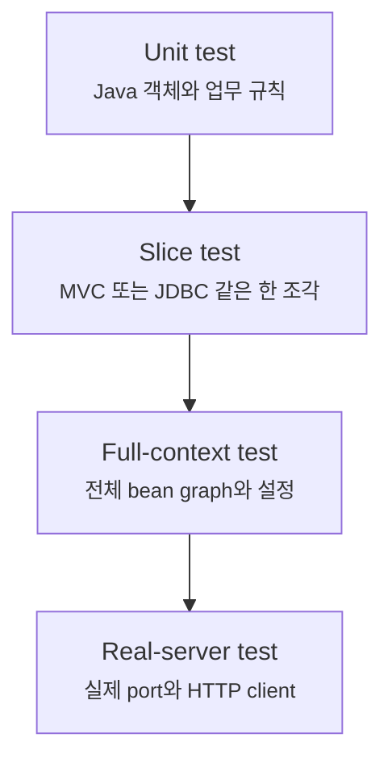
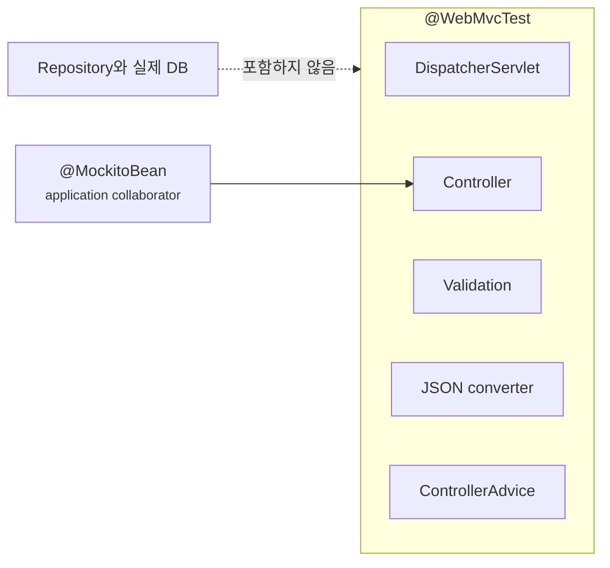
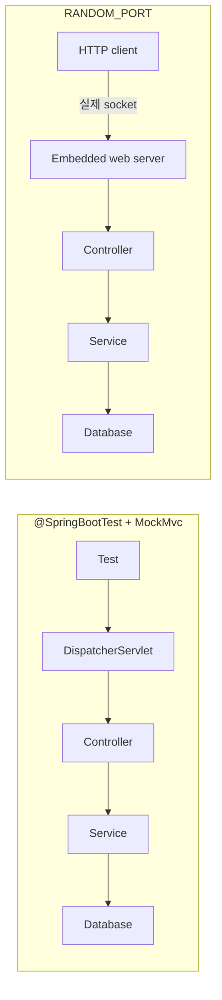

# 테스트는 unit, slice, integration을 어떻게 나눠야 할까요?

> 테스트가 모두 초록색이어도, 그 테스트가 지나가지 않은 경계에서는 애플리케이션이 여전히 실패할 수 있어요.

앞선 Auth API 실습에는 15개의 test가 있었어요. domain 규칙을 확인하는 test도 있었고, `MockMvc`로 회원가입부터 JWT 인증까지 확인하는 test도 있었죠. 모두 통과하면 꽤 든든해 보여요.

그런데요, test 개수만 보고는 아직 알 수 없는 것이 있어요.

- `UserAccount`의 email 정규화가 맞다는 test가 Spring bean 연결까지 증명할까요?
- `@WebMvcTest`가 통과하면 실제 repository의 SQL도 맞다는 뜻일까요?
- `@SpringBootTest`와 `MockMvc`를 썼다면 진짜 8080 port로 HTTP 요청을 보낸 걸까요?
- test에 `@Transactional`을 붙였으니 실제 server가 저장한 값도 자동으로 rollback될까요?

사실은 아니에요. **test 이름보다 중요한 것은 그 test가 실제로 연 경계**예요.

이번 글에서는 unit test, slice test, integration test를 속도 순서로만 외우지 않을 거예요. 각 test가 어떤 객체를 직접 만들고, 어떤 Spring 설정을 불러오며, 어느 경계부터는 가짜로 바꾸는지 따라가 볼게요.

!!! note "이 글의 기준"
    이 글은 Spring Boot 4.x와 Java 21, JUnit Jupiter를 기준으로 해요. Boot 4에서는 `@WebMvcTest`, `@JdbcTest`, `@DataJpaTest` 같은 test 지원이 기능별 `-test` module로 나뉘어 있고 Annotation package도 3.x 예제와 다를 수 있어요. 개념은 Boot 3.x에서도 이어지지만, import는 현재 프로젝트의 Boot version에 맞춰 확인해야 해요.

---

## Boot 4에서는 확인할 기술의 test starter를 골라요

Test code를 쓰기 전에 `build.gradle`부터 잠깐 볼게요. Spring Boot 4는 main 기능뿐 아니라 test infrastructure도 module과 starter로 나눴어요.

앞선 Auth API처럼 Spring MVC, JDBC, Spring Security를 확인한다면 다음 test starter가 연결돼 있어야 해요.

```gradle title="build.gradle" linenums="1"
dependencies {
    testImplementation 'org.springframework.boot:spring-boot-starter-webmvc-test'
    testImplementation 'org.springframework.boot:spring-boot-starter-jdbc-test'
    testImplementation 'org.springframework.boot:spring-boot-starter-security-test'
    testRuntimeOnly 'org.junit.platform:junit-platform-launcher'
}
```

기능별 test starter는 공통 `spring-boot-starter-test`를 transitively 가져와요. 그래서 Boot 4에서 새 project를 구성할 때는 공통 starter 하나에 모든 test 지원이 들어 있을 것이라 기대하기보다, **실제로 test할 기술의 starter**를 적는 방식이 의존성을 더 잘 드러내요.

JPA를 test한다면 JDBC starter를 억지로 재사용하지 않고 `spring-boot-starter-data-jpa-test`를 선택해요. WebFlux, MongoDB, Redis도 같은 식으로 해당 기술의 `-test` starter를 확인하면 돼요.

!!! note "Boot 3.x 예제를 그대로 붙여 넣으면 import가 다를 수 있어요"
    Boot 4의 modularization으로 test Annotation package도 기능별 root package로 이동했어요. 예를 들어 `@WebMvcTest`는 `org.springframework.boot.webmvc.test.autoconfigure`, `@JdbcTest`는 `org.springframework.boot.jdbc.test.autoconfigure`에서 import해요. IDE가 예전 package를 못 찾을 때 Annotation이 사라졌다고 생각하기보다 Boot version과 test starter부터 확인하세요.

---

## 먼저 “무엇을 증명할 test인가?”부터 물어봐요

회원가입 API 하나만 해도 확인할 질문이 여러 개예요.

| 확인할 질문 | 가장 작은 정직한 test 경계 |
|---|---|
| email을 소문자로 바꾸나요? | Spring 없는 unit test |
| 이미 가입한 email이면 application 규칙이 실패하나요? | service unit test 또는 application integration test |
| 잘못된 JSON에 `400`을 돌려주나요? | MVC slice test |
| JDBC query가 실제 table에 값을 저장하나요? | JDBC slice test |
| controller, transaction, repository, Security bean이 함께 연결되나요? | full-context integration test |
| 실제 web server와 client 사이 HTTP 교환이 되나요? | random-port server test |

이 표의 핵심은 “큰 test가 작은 test보다 좋다”가 아니에요. 질문마다 필요한 장비가 다르다는 뜻이에요. 문자열 정규화 하나를 확인하려고 server와 DB를 모두 띄울 필요는 없고, SQL column 이름이 맞는지 확인하면서 repository를 mock으로 바꾸면 안 되겠죠.



아래로 갈수록 더 많은 실제 부품을 함께 확인하지만, 원인을 찾기 어려워지고 실행 비용도 커져요. 그래서 실무의 test suite는 한 종류로 통일하기보다 **질문을 가장 작게 증명하는 test를 많이 두고, 중요한 연결 경계를 더 넓은 test로 보강하는 모양**이 자연스러워요.

!!! tip "Annotation부터 고르지 마세요"
    `@SpringBootTest`를 붙일지 고민하기 전에 실패했을 때 알고 싶은 사실을 한 문장으로 써 보세요. “회원가입이 된다”보다 “잘못된 email JSON을 MVC가 `400`으로 바꾼다”처럼 경계를 포함하면 test 종류가 훨씬 잘 보여요.

---

## Unit test는 Spring을 띄우지 않고 한 규칙을 바로 불러요

Unit test는 보통 `ApplicationContext`를 만들지 않아요. 대상 객체를 `new`로 만들고 method를 직접 호출해요.

앞선 Auth API의 `UserAccountTests`가 이 모양이었죠.

```java title="src/test/java/me/nvim/blog/auth/identity/domain/UserAccountTests.java" linenums="1"
package me.nvim.blog.auth.identity.domain;

import static org.junit.jupiter.api.Assertions.assertEquals;

import java.util.List;

import org.junit.jupiter.api.Test;

class UserAccountTests {

    @Test
    void registrationNormalizesEmailAndAssignsUserRole() {
        UserAccount userAccount = UserAccount.register(
                "User@Example.COM",
                "password-hash",
                "User");

        assertEquals("user@example.com", userAccount.email());
        assertEquals(List.of("ROLE_USER"), userAccount.roles());
    }
}
```

이 test에는 `@SpringBootTest`, `@Autowired`, database가 없어요. 그래서 빠르고 실패 원인도 좁아요. 실패했다면 component scan이나 profile보다 `UserAccount.register(...)`의 규칙부터 보면 돼요.

반대로 이 test가 증명하지 않는 것도 분명해요.

| 이 test가 증명하는 것 | 이 test가 증명하지 않는 것 |
|---|---|
| email 정규화 규칙 | `UserAccount`가 Spring bean인지 |
| 기본 role이 `ROLE_USER`인지 | JDBC에 role이 저장되는지 |
| 순수 Java 객체의 반환값 | JSON field 이름과 HTTP status |
| Spring 없이도 domain 규칙을 실행할 수 있는지 | transaction과 Security proxy가 적용되는지 |

“Spring 코드인데 Spring을 안 띄워도 되나요?”라는 질문이 생길 수 있어요. 생성자 주입을 사용했다면 service도 필요한 협력 객체를 직접 넣어 unit test할 수 있어요.

예를 들어 `IdentityFacade`의 회원가입 순서만 확인하고 싶다면 repository와 password hasher를 test double로 넣을 수 있어요.

```java title="src/test/java/me/nvim/blog/auth/identity/application/IdentityFacadeTests.java" linenums="1"
package me.nvim.blog.auth.identity.application;

import static org.junit.jupiter.api.Assertions.assertEquals;
import static org.mockito.ArgumentMatchers.any;
import static org.mockito.BDDMockito.given;
import static org.mockito.Mockito.mock;

import org.junit.jupiter.api.Test;

import me.nvim.blog.auth.identity.domain.PasswordHasher;
import me.nvim.blog.auth.identity.domain.RefreshTokenRepository;
import me.nvim.blog.auth.identity.domain.TokenIssuer;
import me.nvim.blog.auth.identity.domain.UserAccount;
import me.nvim.blog.auth.identity.domain.UserAccountRepository;

class IdentityFacadeTests {

    @Test
    void registrationHashesPasswordBeforeSaving() {
        UserAccountRepository users = mock(UserAccountRepository.class);
        PasswordHasher passwords = mock(PasswordHasher.class);
        RefreshTokenRepository refreshTokens = mock(RefreshTokenRepository.class);
        TokenIssuer tokens = mock(TokenIssuer.class);

        given(passwords.hash("correct-password")).willReturn("encoded-password");
        given(users.save(any(UserAccount.class)))
                .willAnswer(invocation -> invocation.getArgument(0));

        IdentityFacade facade = new IdentityFacade(users, refreshTokens, passwords, tokens);

        AccountResult result = facade.register(new RegisterAccountCommand(
                "User@Example.COM",
                "correct-password",
                "User"));

        assertEquals("user@example.com", result.email());
    }
}
```

여기서 Mockito는 Spring container를 만드는 도구가 아니에요. `IdentityFacade`가 대화할 상대를 test 안에서 바꿔 넣은 것뿐이에요. 따라서 이 test는 application 순서를 빠르게 확인하지만 `@Transactional` proxy가 실제로 생겼는지는 확인하지 못해요.

!!! warning "Mock이 많다고 unit test가 좋아지는 것은 아니에요"
    내부 class를 전부 mock으로 바꾸면 구현 method 호출 순서만 고정하는 test가 되기 쉬워요. DB, token issuer, 외부 API처럼 분명한 경계에는 test double이 유용하지만, 값 객체와 작은 domain 규칙은 실제 객체를 쓰는 편이 읽기 좋아요.

---

## Slice test는 필요한 Spring 조각만 잘라서 열어요

JSON binding과 validation을 확인하려면 순수 unit test만으로는 부족해요. 그렇다고 application 전체를 매번 열 필요도 없죠. 이 사이를 채우는 것이 slice test예요.



Slice는 “가벼운 full-context test”가 아니에요. **특정 기술 경계가 제대로 구성됐는지 확인하도록 의도적으로 잘라 만든 context**예요.

### `@WebMvcTest`는 HTTP 입구를 확인해요

Spring Boot 4의 `@WebMvcTest`는 MVC infrastructure와 controller, controller advice, converter, filter처럼 web layer에 필요한 대상을 중심으로 불러와요. 일반 `@Component`나 `@ConfigurationProperties`를 전부 scan하지는 않아요.

그래서 controller가 의존하는 application service는 보통 `@MockitoBean`으로 대신 넣어요.

```java title="src/test/java/me/nvim/blog/auth/identity/presentation/AccountControllerTests.java" linenums="1"
package me.nvim.blog.auth.identity.presentation;

import static org.mockito.ArgumentMatchers.any;
import static org.mockito.BDDMockito.given;
import static org.springframework.test.web.servlet.request.MockMvcRequestBuilders.post;
import static org.springframework.test.web.servlet.result.MockMvcResultMatchers.jsonPath;
import static org.springframework.test.web.servlet.result.MockMvcResultMatchers.status;

import java.time.Instant;
import java.util.List;
import java.util.UUID;

import org.junit.jupiter.api.Test;
import org.springframework.beans.factory.annotation.Autowired;
import org.springframework.boot.webmvc.test.autoconfigure.AutoConfigureMockMvc;
import org.springframework.boot.webmvc.test.autoconfigure.WebMvcTest;
import org.springframework.http.MediaType;
import org.springframework.test.context.bean.override.mockito.MockitoBean;
import org.springframework.test.web.servlet.MockMvc;

import me.nvim.blog.auth.identity.application.AccountResult;
import me.nvim.blog.auth.identity.application.IdentityFacade;

@WebMvcTest(AccountController.class)
@AutoConfigureMockMvc(addFilters = false)
class AccountControllerTests {

    @Autowired
    private MockMvc mvc;

    @MockitoBean
    private IdentityFacade identityFacade;

    @Test
    void validRegistrationReturnsCreatedResponse() throws Exception {
        given(this.identityFacade.register(any())).willReturn(new AccountResult(
                UUID.fromString("00000000-0000-0000-0000-000000000001"),
                "user@example.com",
                "User",
                true,
                Instant.parse("2026-07-20T00:00:00Z"),
                List.of("ROLE_USER")));

        this.mvc.perform(post("/api/auth/register")
                        .contentType(MediaType.APPLICATION_JSON)
                        .content("""
                                {
                                  "email": "user@example.com",
                                  "password": "correct-password",
                                  "displayName": "User"
                                }
                                """))
                .andExpect(status().isCreated())
                .andExpect(jsonPath("$.email").value("user@example.com"));
    }
}
```

이 test가 통과하면 request mapping, JSON 역직렬화, Bean Validation, response 직렬화 같은 MVC 계약에 대한 근거가 생겨요. 하지만 `IdentityFacade`는 mock이므로 password hash, transaction, JDBC 저장은 통과하지 않았어요.

예제의 `addFilters = false`도 경계를 분명히 만들기 위한 선택이에요. 이 test는 controller의 HTTP 계약에 집중하는 대신 Security filter chain을 증명하지 않아요. 인증과 CSRF까지 web slice에서 확인하려면 filter를 끄지 않고 Spring Security test 지원으로 인증 요청을 만들거나, 필요한 Security 설정을 명시적으로 import해야 해요.

!!! warning "slice가 못 찾은 bean을 무조건 import하지 마세요"
    `NoSuchBeanDefinitionException`이 날 때 production 설정을 하나씩 전부 `@Import`하면 결국 경계가 불분명한 작은 full-context가 돼요. 먼저 그 bean이 이번 slice가 검증해야 할 대상인지, 아니면 `@MockitoBean`으로 경계 밖에 둘 협력 객체인지 결정해야 해요.

### `@JdbcTest`와 `@DataJpaTest`는 저장 경계를 확인해요

Web slice가 JSON과 controller를 확인한다면 data slice는 query와 mapping을 확인해요.

앞선 Auth API는 Spring Data JPA가 아니라 `JdbcClient`를 사용했으므로 `@DataJpaTest`보다 `@JdbcTest`가 질문에 맞아요.

```java title="src/test/java/me/nvim/blog/auth/identity/infrastructure/jdbc/JdbcUserAccountRepositoryTests.java" linenums="1"
package me.nvim.blog.auth.identity.infrastructure.jdbc;

import static org.junit.jupiter.api.Assertions.assertEquals;

import org.junit.jupiter.api.Test;
import org.springframework.beans.factory.annotation.Autowired;
import org.springframework.boot.jdbc.test.autoconfigure.JdbcTest;
import org.springframework.context.annotation.Import;
import org.springframework.test.context.jdbc.Sql;

import me.nvim.blog.auth.identity.domain.UserAccount;

@JdbcTest(properties = "spring.sql.init.mode=never")
@Import(JdbcUserAccountRepository.class)
@Sql({"/schema.sql", "/data.sql"})
class JdbcUserAccountRepositoryTests {

    @Autowired
    private JdbcUserAccountRepository repository;

    @Test
    void savesAndReadsRolesWithUser() {
        UserAccount saved = this.repository.save(UserAccount.register(
                "User@Example.COM",
                "encoded-password",
                "User"));

        UserAccount found = this.repository.findById(saved.id()).orElseThrow();

        assertEquals("user@example.com", found.email());
        assertEquals("ROLE_USER", found.roles().getFirst());
    }
}
```

이 test는 실제 `JdbcClient`, SQL, H2 table, row mapping을 통과해요. controller와 Security는 불러오지 않아요. 기본적으로 JDBC slice test는 transactional하게 실행되고 test가 끝나면 rollback되므로 다른 test에 저장 상태를 남기지 않아요.

JPA를 쓰는 프로젝트라면 질문이 달라져요. `@DataJpaTest`는 entity와 Spring Data JPA repository, embedded database를 중심으로 context를 만들어요. entity mapping, query method, flush 시점의 constraint가 관심사라면 이 slice가 더 잘 맞아요.

| 저장 방식 | 먼저 떠올릴 slice | 주로 확인하는 것 |
|---|---|---|
| `JdbcClient`, `JdbcTemplate` | `@JdbcTest` | SQL, parameter binding, row mapping |
| Spring Data JDBC | `@DataJdbcTest` | aggregate mapping, repository query |
| Spring Data JPA | `@DataJpaTest` | entity mapping, repository, JPQL, flush |
| R2DBC | `@DataR2dbcTest` | reactive repository와 R2DBC mapping |

여기서 embedded H2 test가 통과했다고 PostgreSQL까지 증명되는 것은 아니에요. SQL dialect, index, collation, lock, 실제 container 설정까지 같아야 하는 질문은 다음 글의 Testcontainers 경계로 넘겨야 해요.

---

## `@SpringBootTest`는 전체 bean graph를 연결해요

이제 controller, service, repository, Security, 설정 속성이 함께 연결되는지 확인하고 싶어요. 이때 `@SpringBootTest`가 필요해져요.

앞선 Auth API의 `AuthApiIntegrationTests`는 다음 모양이었어요.

```java
@SpringBootTest
@AutoConfigureMockMvc
@ActiveProfiles("test")
@DirtiesContext(classMode = DirtiesContext.ClassMode.AFTER_EACH_TEST_METHOD)
class AuthApiIntegrationTests {

    @Autowired
    private MockMvc mvc;

    // register -> Basic token -> Bearer API 흐름을 확인해요.
}
```

`@SpringBootTest`는 `SpringApplication`을 통해 application context를 만들어요. 그래서 실제 component scan, auto-configuration, `@ConfigurationProperties`, transaction proxy, repository bean을 함께 확인할 수 있어요.

그런데 `@AutoConfigureMockMvc`를 함께 쓴 이 test는 **실제 web server를 시작하지 않아요.** `MockMvc`가 mock servlet request를 만들어 Spring MVC pipeline에 전달해요.



`@SpringBootTest + MockMvc`도 전체 application bean을 연결하지만 socket과 embedded server 경계는 건너뛰어요. `RANDOM_PORT`는 실제 port까지 열기 때문에 더 넓은 근거를 주지만, 실행 비용과 상태 정리 부담도 커져요.

### Full-context가 알려주는 것과 모르는 것

| `@SpringBootTest`가 잘 잡는 것 | 설정에 따라 여전히 놓칠 수 있는 것 |
|---|---|
| component scan과 bean 연결 실패 | 실제 운영 DB와의 dialect 차이 |
| `@ConfigurationProperties` binding 실패 | 외부 API의 실제 응답 계약 |
| Security filter와 controller 연결 | reverse proxy와 TLS 설정 |
| transaction proxy와 repository 협력 | 실제 port가 열린 뒤의 network 동작 |
| application profile별 설정 | 배포 환경의 secret과 권한 |

그래서 `contextLoads()` 하나도 “전체 context가 만들어진다”는 좁지만 실제적인 근거는 줘요. 하지만 business flow를 호출하지 않았다면 회원가입의 성공과 실패 규칙까지 증명하지는 않아요.

---

## `RANDOM_PORT`는 진짜 server를 띄우지만 transaction도 갈라져요

실제 HTTP client가 embedded server와 통신하는 경계까지 보고 싶다면 random port를 열 수 있어요.

```java title="src/test/java/me/nvim/blog/auth/identity/presentation/AuthApiServerTests.java" linenums="1"
package me.nvim.blog.auth.identity.presentation;

import static org.assertj.core.api.Assertions.assertThat;

import org.junit.jupiter.api.Test;
import org.springframework.beans.factory.annotation.Autowired;
import org.springframework.boot.resttestclient.autoconfigure.AutoConfigureRestTestClient;
import org.springframework.boot.test.context.SpringBootTest;
import org.springframework.boot.test.context.SpringBootTest.WebEnvironment;
import org.springframework.test.web.servlet.client.RestTestClient;
import org.springframework.test.web.servlet.client.RestTestClient.ResponseSpec;
import org.springframework.test.web.servlet.client.assertj.RestTestClientResponse;

@SpringBootTest(webEnvironment = WebEnvironment.RANDOM_PORT)
@AutoConfigureRestTestClient
class AuthApiServerTests {

    @Test
    void healthIsReachableThroughHttp(@Autowired RestTestClient client) {
        ResponseSpec spec = client.get().uri("/actuator/health").exchange();
        RestTestClientResponse response = RestTestClientResponse.from(spec);

        assertThat(response).hasStatusOk();
        assertThat(response).bodyJson()
                .extractingPath("$.status").asString().isEqualTo("UP");
    }
}
```

이 test에서는 실제 embedded server가 임의의 빈 port에서 떠요. 고정된 `8080`을 쓰지 않으므로 다른 test process나 개발 server와 충돌할 가능성도 줄어요.

하지만 중요한 차이가 하나 있어요. Test method와 server의 request 처리 thread는 서로 달라요. 그래서 test class에 `@Transactional`을 붙여도 server thread에서 commit된 DB 변경까지 test transaction이 대신 rollback해 주지 못해요.

```text
test thread                       server thread
@Transactional 시작              HTTP request 수신
    |                                 |
    |--- 실제 HTTP request ----------> transaction 시작
    |                                 commit
test transaction rollback         DB 변경은 이미 commit됨
```

따라서 random-port test는 test 전용 schema를 새로 만들거나, 각 test가 고유한 데이터를 사용하거나, 명시적인 cleanup을 수행해야 해요. “integration test에는 `@Transactional`을 붙이면 데이터가 항상 지워진다”라고 외우면 이 경계에서 틀려요.

!!! warning "rollback은 운영 동작을 가릴 수도 있어요"
    Transactional slice test는 격리에 편하지만 commit 뒤에만 보이는 제약이나 event를 놓칠 수 있어요. JPA query와 constraint를 확인할 때는 필요한 시점에 `flush()`하고, commit 자체가 요구사항이면 commit을 실제로 통과하는 별도 test를 두세요.

---

## Test context가 느린 이유는 개수보다 “서로 다른 모양”에 있어요

Spring TestContext Framework는 한 번 만든 `ApplicationContext`를 cache하고, 같은 설정을 요구하는 뒤 test에서 재사용해요. 그래서 full-context test가 50개라고 해서 반드시 context를 50번 만드는 것은 아니에요.

문제는 test마다 context 모양을 조금씩 바꿀 때 생겨요.

- `@ActiveProfiles` 조합이 달라요.
- test property가 class마다 달라요.
- `@MockitoBean` 구성이 달라요.
- `@DynamicPropertySource`가 서로 다른 값을 만들어요.
- `@DirtiesContext`로 사용한 context를 cache에서 버려요.

앞선 Auth API integration test의 `@DirtiesContext(AFTER_EACH_TEST_METHOD)`는 test마다 H2와 bean 상태를 깨끗하게 다시 만드는 대신, 같은 context를 재사용하지 못하게 해요. 12개 HTTP test가 서로 영향을 주지 않는다는 장점과 12번 context를 다시 만드는 비용을 맞바꾼 셈이에요.

실무에서는 다음 순서로 줄여 볼 수 있어요.

1. 상태 없는 bean은 test 사이에 바뀌지 않게 설계해요.
2. DB state는 transaction rollback이나 `@Sql` cleanup으로 정리해요.
3. profile과 property 조합을 몇 가지 공통 모양으로 맞춰요.
4. 정말 context 자체를 오염시킨 test에만 `@DirtiesContext`를 써요.

!!! tip "느린 test를 만나면 context cache부터 확인해요"
    `org.springframework.test.context.cache` log level을 `DEBUG`로 올리면 cache hit와 miss 통계를 볼 수 있어요. Test method 수만 세기보다 서로 다른 context key가 몇 개인지 확인하는 편이 원인에 더 가까워요.

---

## 앞선 Auth API의 15개 test를 다시 분류해 봐요

이제 실제 test suite를 표로 돌아볼게요.

| 현재 test | 개수 | 실제로 여는 경계 | 잘 증명하는 것 |
|---|---:|---|---|
| `UserAccountTests` | 2 | 순수 Java | email 정규화, role 불변성 |
| `RsaKeyConfigTests` | 1 | 순수 Java와 Java Security API | PEM key parsing |
| `AuthApiIntegrationTests` | 12 | full context + MockMvc + H2 | Security chain, controller, service, JDBC, JWT의 연결 흐름 |

이 구성은 “domain 규칙”과 “전체 연결”이라는 양끝을 잘 잡고 있어요. 대신 중간 경계가 비어 있어요.

- Controller validation이나 Problem Detail이 실패하면 12개의 full-context test 중 어디서 깨졌는지 따라가야 해요.
- JDBC row mapping 하나를 확인하려고 Security와 JWT 설정까지 같이 띄워요.
- `IdentityFacade`의 token 회전 순서를 아주 빠르게 확인하는 application unit test가 없어요.
- 실제 port를 여는 test는 없으므로 MockMvc가 검증하지 않는 embedded server 경계는 남아 있어요.

그래서 다음처럼 보강할 수 있어요.

| 추가할 test | 확인할 계약 | 대신하지 않는 test |
|---|---|---|
| `IdentityFacadeTests` | 회원가입·token 회전의 application 순서 | JDBC mapping test |
| `AccountControllerTests` | JSON, validation, status, Problem Detail | 실제 service 규칙 test |
| `JdbcUserAccountRepositoryTests` | SQL과 row mapping | PostgreSQL 호환 test |
| 소수의 random-port smoke test | 실제 server와 HTTP 연결 | 모든 business case test |

여기서 full-context test 12개를 전부 지우자는 뜻은 아니에요. Basic credential이 token으로 바뀌고, 발급된 JWT가 Security filter를 지나 `/api/me`에 도착하며, 예전 refresh token이 거절되는 흐름은 여러 경계가 함께 움직여야 의미가 있어요. 이런 핵심 journey는 full-context test로 남길 가치가 커요.

반면 email validation의 모든 조합이나 repository query의 모든 edge case까지 full-context로만 늘리면 느린 test가 비슷한 준비를 반복하게 돼요. **경계별 test가 세부 경우를 맡고, full-context test는 중요한 연결을 맡는 식**으로 역할을 나누면 돼요.

---

## Test가 실패했을 때 첫 번째로 볼 곳도 달라져요

Test 종류를 나누는 이유는 속도뿐만이 아니에요. 실패를 읽는 출발점이 달라져요.

| 실패한 test | 먼저 볼 곳 |
|---|---|
| Spring 없는 unit test | 대상 객체의 입력, 반환값, domain 규칙 |
| `@WebMvcTest` | mapping, JSON, validation, controller advice, mock 계약 |
| `@JdbcTest` / `@DataJpaTest` | schema, query, mapping, transaction, flush |
| `@SpringBootTest` context 시작 실패 | profile, property binding, bean graph, 조건부 설정 |
| `@SpringBootTest` + MockMvc | filter chain부터 controller, service, repository까지 실제 요청 경로 |
| `RANDOM_PORT` test | server 시작, port, HTTP client, thread와 DB cleanup 경계 |

`@WebMvcTest`에서 repository bean이 없다는 오류가 나면 “Spring Boot가 bean을 못 찾는다”가 아니라 “이 slice 밖의 협력 객체를 test가 어떻게 다룰지 정하지 않았다”일 수 있어요. 반대로 full-context test에서 같은 오류가 나면 실제 component scan이나 조건부 등록 문제일 가능성이 커요.

같은 `NoSuchBeanDefinitionException`이어도 test 경계를 먼저 알아야 의미를 제대로 읽을 수 있는 이유예요.

---

## 실무에서는 이 순서로 test를 고르면 돼요

새 기능을 만들 때 Annotation 목록부터 펼치지 말고 다음 질문을 차례대로 물어보세요.

1. **Spring 없이 확인할 수 있는 업무 규칙인가요?**  
   그렇다면 객체를 직접 만드는 unit test부터 시작해요.

2. **JSON, validation, SQL, JPA mapping처럼 framework의 한 조각이 핵심인가요?**  
   그렇다면 `@WebMvcTest`, `@JdbcTest`, `@DataJpaTest` 같은 slice를 골라요.

3. **여러 bean과 proxy, 설정이 함께 연결돼야 의미가 있나요?**  
   그렇다면 `@SpringBootTest`로 핵심 application flow를 확인해요.

4. **실제 server port, 실제 DB 제품, 외부 HTTP server가 질문에 포함되나요?**  
   그렇다면 random port, Testcontainers, WireMock 같은 더 바깥 경계를 추가해요.

5. **이 test가 통과해도 여전히 모르는 것은 무엇인가요?**  
   Test 이름이나 주석에 그 경계를 드러내면 나중에 과신하기 어려워져요.

좋은 test suite는 모든 것을 실제로 쓰는 하나의 거대한 test가 아니에요. 실패했을 때 “어느 약속이 깨졌는지” 빠르게 좁혀 주면서도, 작은 test끼리의 연결이 실제 application에서도 성립하는지 중요한 지점마다 확인해 주는 test suite예요.

## 참고한 링크

- [Spring Boot 공식 문서: Testing](https://docs.spring.io/spring-boot/reference/testing/index.html)
- [Spring Boot 공식 문서: Testing Spring Boot Applications](https://docs.spring.io/spring-boot/reference/testing/spring-boot-applications.html)
- [Spring Boot 공식 문서: Test Slices](https://docs.spring.io/spring-boot/appendix/test-auto-configuration/slices.html)
- [Spring Boot 공식 문서: Build Systems와 test starter 목록](https://docs.spring.io/spring-boot/reference/using/build-systems.html)
- [Spring Boot 공식 문서: 4.0 Migration Guide의 test modularization](https://github.com/spring-projects/spring-boot/wiki/Spring-Boot-4.0-Migration-Guide#test-code)
- [Spring Framework 공식 문서: Integration Testing](https://docs.spring.io/spring-framework/reference/testing/integration.html)
- [Spring Framework 공식 문서: Context Caching](https://docs.spring.io/spring-framework/reference/testing/testcontext-framework/ctx-management/caching.html)
- [Spring Framework 공식 문서: Test-managed Transactions](https://docs.spring.io/spring-framework/reference/testing/testcontext-framework/tx.html)
- [Spring Security 공식 문서: Testing Method Security](https://docs.spring.io/spring-security/reference/servlet/test/method.html)

## 자, 정리해볼까요?

!!! abstract "오늘 우리가 배운 것"
    - Test 종류는 서열이 아니라 **실제로 통과한 경계**로 구분해야 해요.
    - Unit test는 Spring 없이 domain과 application 규칙을 빠르고 좁게 확인해요. Bean 연결, proxy, JSON, SQL은 증명하지 않아요.
    - Slice test는 MVC나 JDBC처럼 필요한 Spring 조각만 열어요. `@WebMvcTest`는 HTTP 계약을, `@JdbcTest`와 `@DataJpaTest`는 저장 기술의 계약을 확인해요.
    - `@SpringBootTest`는 전체 bean graph와 설정을 연결하지만, 기본 `MOCK` 환경과 `MockMvc`는 실제 server port를 열지 않아요.
    - `RANDOM_PORT`에서는 client와 server가 다른 thread와 transaction에서 움직이므로 test의 `@Transactional` rollback이 server의 commit을 지워 주지 않아요.
    - Context cache를 잘 재사용하려면 profile, property, mock 구성을 공통화하고 `@DirtiesContext`는 정말 필요한 곳에만 써야 해요.
    - 작은 test로 세부 규칙을 확인하고, 중요한 journey는 full-context test로 연결해야 빠른 test와 실제 경계의 증거를 함께 얻을 수 있어요.

다음 글에서는 embedded H2와 mock HTTP server 바깥으로 나가 볼게요. Testcontainers로 실제 database 제품을 띄우고, WireMock으로 외부 API의 성공과 실패를 재현하며, contract test가 서비스 사이의 약속을 어떻게 고정하는지 살펴볼게요.
