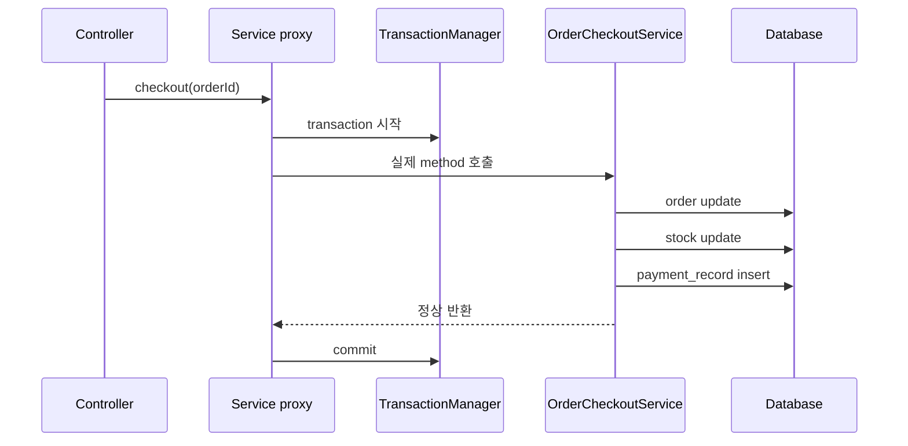
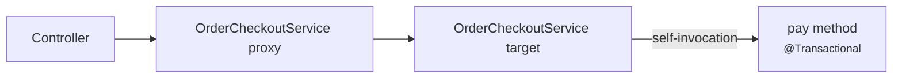
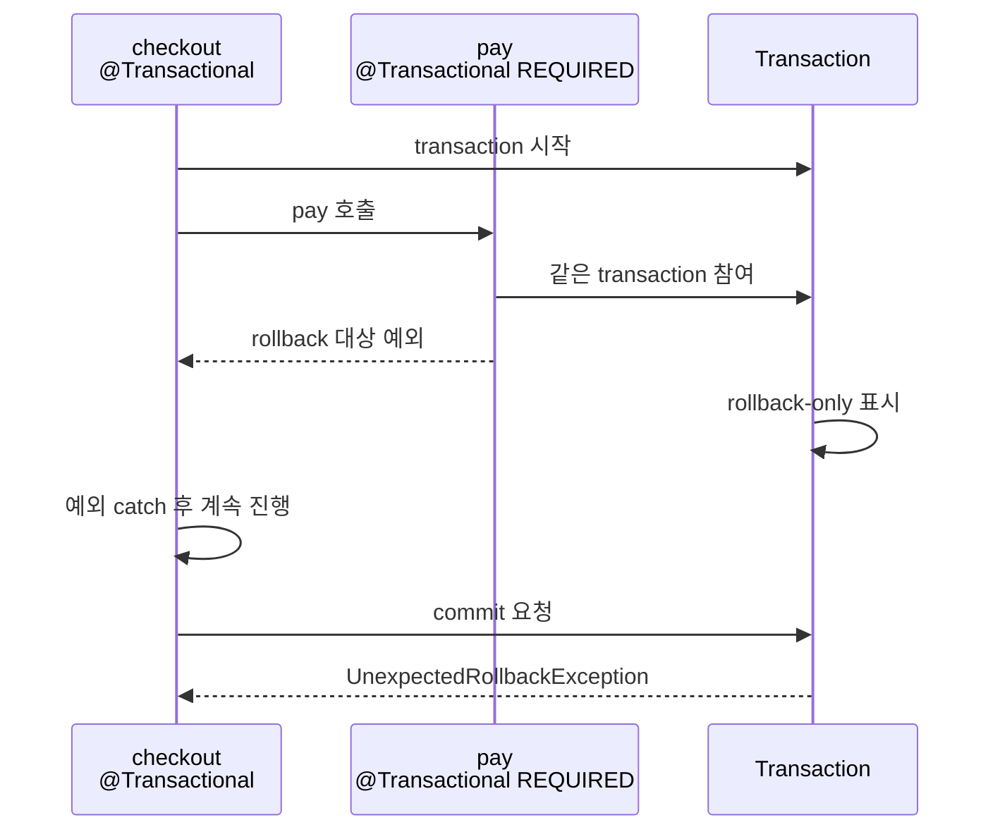
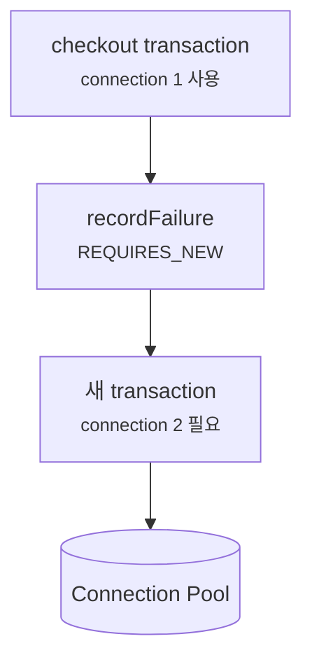
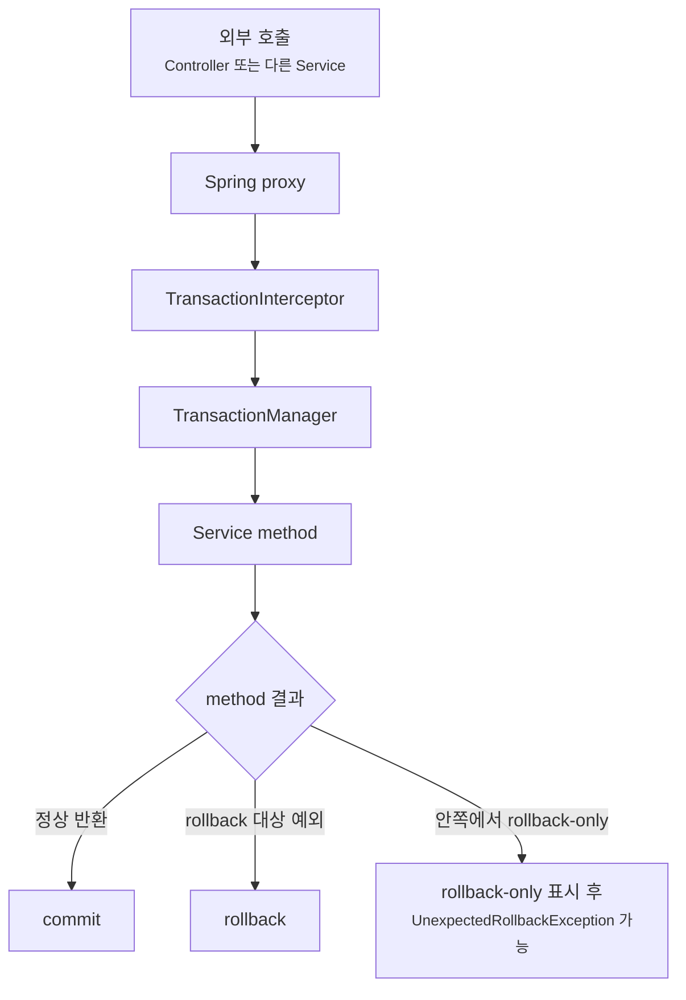

# 트랜잭션 경계와 롤백은 왜 Annotation 하나로 끝나지 않을까요?

> 에러를 잡아서 처리했는데, 마지막에 `UnexpectedRollbackException`이 터졌어요.

지난 글에서는 JPA Entity가 영속성 컨텍스트(persistence context) 안에서 관리될 때 dirty checking이 일어나고, transaction이 끝날 때 변경 내용이 flush될 수 있다고 봤어요. 오늘은 그 바깥 경계를 볼게요.

처음에는 `@Transactional`을 이렇게 읽기 쉬워요.

> "이 method 안의 DB 작업을 하나로 묶어주는 표시구나."

큰 방향은 맞아요. 하지만 실무에서 헷갈리는 지점은 그 다음이에요.

- 정확히 어디서 transaction이 시작되나요?
- 같은 클래스 안에서 호출해도 적용되나요?
- 어떤 예외에서 rollback되고, 어떤 예외에서는 commit되나요?
- 안쪽 method에서 실패를 잡았는데 왜 바깥 commit이 실패하나요?
- `REQUIRES_NEW`를 붙이면 항상 안전한가요?
- 테스트의 `@Transactional`은 운영 코드의 transaction과 같은 의미인가요?

오늘 목표는 Annotation 이름을 외우는 게 아니에요. **트랜잭션은 method 안쪽 장식이 아니라 runtime 경계**라는 감각을 잡는 거예요.

!!! note "이 글의 기준"
    이 글은 Spring Framework 공식 문서의 선언적 트랜잭션(declarative transaction management), `@Transactional`, rollback rule, propagation 설명과 Spring Data JPA의 transaction 설명을 기준으로 작성했어요. Spring Boot 4.x에서는 Spring Framework 7.x 계열의 개념으로 읽으면 되고, 기존 Spring Boot 3.x 프로젝트에서도 service 경계, 프록시 호출, rollback rule이라는 핵심 모델은 같은 방향으로 보면 돼요.

---

## 트랜잭션은 "한 번에 성공하거나, 한 번에 되돌리는" 약속이에요

주문을 결제 완료로 바꾸는 코드를 생각해볼게요.

```java
package com.example.order;

import org.springframework.stereotype.Service;
import org.springframework.transaction.annotation.Transactional;

@Service
public class OrderCheckoutService {

    private final OrderRepository orderRepository;
    private final StockRepository stockRepository;
    private final PaymentRecordRepository paymentRecordRepository;

    public OrderCheckoutService(
            OrderRepository orderRepository,
            StockRepository stockRepository,
            PaymentRecordRepository paymentRecordRepository
    ) {
        this.orderRepository = orderRepository;
        this.stockRepository = stockRepository;
        this.paymentRecordRepository = paymentRecordRepository;
    }

    @Transactional
    public void checkout(long orderId) {
        Order order = orderRepository.findById(orderId)
                .orElseThrow(OrderNotFoundException::new);

        order.markPaid();
        stockRepository.decrease(order.productId(), order.quantity());
        paymentRecordRepository.save(PaymentRecord.forOrder(order.id()));
    }
}
```

이 method는 세 가지 DB 변경을 해요.

1. 주문 상태를 결제 완료로 바꿔요.
2. 재고를 줄여요.
3. 결제 기록을 저장해요.

중간에 재고 차감이 실패했는데 주문 상태만 결제 완료로 남으면 안 되겠죠. 그래서 이 use case는 하나의 transaction으로 묶는 게 자연스러워요.



이 그림에서 transaction은 `checkout(...)` method 본문 안에서 직접 시작하지 않아요. 호출이 service 프록시(proxy)를 통과할 때 Spring의 transaction interceptor가 먼저 움직이고, method가 정상적으로 끝났는지 예외가 나왔는지에 따라 commit이나 rollback을 결정해요.

그래서 `@Transactional`은 "이 줄부터 DB를 묶어라"라는 명령문이 아니라, Spring이 runtime에 경계를 만들 수 있게 해주는 설정에 가까워요.

---

## 경계는 보통 repository가 아니라 service에 둬요

Spring Data JPA repository도 transaction 설정을 가지고 있어요. 예를 들어 기본 CRUD method는 읽기 작업과 쓰기 작업에 맞게 transaction이 적용될 수 있어요. 하지만 이것만 보고 "repository마다 transaction이 있으니 service에는 없어도 되겠네"라고 생각하면 위험해요.

왜냐하면 use case는 repository method 하나로 끝나지 않는 경우가 많기 때문이에요.

```java
@Service
public class OrderCheckoutService {

    private final OrderRepository orderRepository;
    private final StockRepository stockRepository;

    public OrderCheckoutService(OrderRepository orderRepository, StockRepository stockRepository) {
        this.orderRepository = orderRepository;
        this.stockRepository = stockRepository;
    }

    public void checkoutWithoutServiceTransaction(long orderId) {
        Order order = orderRepository.findById(orderId)
                .orElseThrow(OrderNotFoundException::new);

        order.markPaid();
        stockRepository.decrease(order.productId(), order.quantity());
    }
}
```

이 코드는 겉으로는 간단해요. 하지만 service method 전체를 감싸는 transaction이 없으면 `findById`, Entity 변경, 재고 차감이 하나의 업무 단위로 읽히지 않아요. 특히 JPA의 managed Entity, dirty checking, lazy loading은 transaction과 영속성 컨텍스트 경계에 기대는 경우가 많아요.

그래서 보통은 이렇게 생각하는 편이 좋아요.

| 위치 | 맡기 좋은 책임 |
|---|---|
| Controller | HTTP 요청/응답, 인증된 사용자 정보 전달, 입력 DTO 수신 |
| Service | 하나의 업무 흐름, transaction 경계, 여러 repository 호출 조합 |
| Repository | DB 접근, query, Entity 저장과 조회 |

Repository의 transaction 설정은 유용한 기본값이에요. 하지만 "주문 결제"처럼 여러 DB 변경을 하나의 의미로 묶어야 하는 경계는 service가 더 잘 표현해요.

!!! tip "transaction 경계는 기술 경계보다 업무 경계로 먼저 잡으세요"
    "어떤 repository method가 DB를 쓰나요?"보다 "사용자 입장에서 이 일이 성공하거나 실패하는 단위가 어디인가요?"를 먼저 물어보는 편이 좋아요.

---

## `@Transactional`은 프록시를 통과하는 호출에서 힘을 얻어요

이전 AOP 글에서 본 것처럼 Spring의 선언적 transaction은 보통 프록시 기반으로 동작해요. 이 말은 `@Transactional`이 붙은 method를 **Spring이 만든 프록시를 통해 호출해야** transaction interceptor가 끼어들 수 있다는 뜻이에요.

문제가 되는 코드를 볼게요.

```java
@Service
public class OrderCheckoutService {

    public void checkout(long orderId) {
        validate(orderId);
        pay(orderId);
    }

    @Transactional
    public void pay(long orderId) {
        // 주문 상태 변경
        // 재고 차감
        // 결제 기록 저장
    }

    private void validate(long orderId) {
        // 주문 검증
    }
}
```

처음 보면 `checkout(...)`이 `pay(...)`를 호출하니 transaction이 걸릴 것 같아요. 하지만 같은 객체 안에서 `this.pay(orderId)`처럼 호출되면 프록시를 거치지 않아요. 그러면 transaction interceptor가 호출을 볼 기회가 없어요.



이 그림에서 처음 호출은 프록시를 통과했지만, target 객체 안에서 다시 자기 method를 부르는 호출은 프록시 밖에서 일어나요. 그래서 self-invocation은 `@Transactional`이 기대와 다르게 보이는 대표 사례예요.

해결은 대개 구조를 분명히 하는 쪽이에요.

```java
@Service
public class OrderCheckoutService {

    private final OrderPaymentService orderPaymentService;

    public OrderCheckoutService(OrderPaymentService orderPaymentService) {
        this.orderPaymentService = orderPaymentService;
    }

    public void checkout(long orderId) {
        validate(orderId);
        orderPaymentService.pay(orderId);
    }

    private void validate(long orderId) {
        // 주문 검증
    }
}
```

```java
@Service
public class OrderPaymentService {

    @Transactional
    public void pay(long orderId) {
        // 주문 상태 변경
        // 재고 차감
        // 결제 기록 저장
    }
}
```

이제 `OrderCheckoutService`가 다른 Spring 빈인 `OrderPaymentService`를 호출하므로 프록시 경계를 통과할 수 있어요. 더 중요한 건 코드 책임도 선명해졌다는 점이에요. checkout 흐름과 실제 결제 반영 transaction을 분리해서 읽을 수 있죠.

!!! warning "`private` method에 `@Transactional`을 붙여 문제를 해결하려고 하지 마세요"
    프록시 기반 AOP에서는 외부에서 프록시를 통해 들어오는 호출이 중요해요. transaction 경계로 삼을 method는 보통 service의 public method로 두고, 내부 helper method에는 별도 transaction 의미를 기대하지 않는 편이 안전해요.

---

## rollback은 "예외가 났다" 하나로 끝나지 않아요

Spring의 기본 rollback 규칙은 처음에 꼭 잡아야 해요.

| method 밖으로 나온 예외 | 기본 동작 |
|---|---|
| `RuntimeException` | rollback 대상 |
| `Error` | rollback 대상 |
| checked exception | 기본적으로 rollback 대상이 아님 |

예를 들어 이런 코드는 기본적으로 rollback돼요.

```java
@Transactional
public void checkout(long orderId) {
    Order order = orderRepository.findById(orderId)
            .orElseThrow(OrderNotFoundException::new);

    order.markPaid();
    stockRepository.decrease(order.productId(), order.quantity());

    if (order.quantity() <= 0) {
        throw new IllegalStateException("주문 수량이 올바르지 않아요.");
    }
}
```

`IllegalStateException`은 unchecked exception이므로 method 밖으로 전파되면 transaction interceptor는 rollback으로 판단해요.

하지만 checked exception은 기본 동작이 달라요.

```java
@Transactional
public void importOrders(OrderImportFile file) throws OrderImportException {
    orderRepository.saveAll(file.toOrders());

    if (file.hasInvalidLine()) {
        throw new OrderImportException("잘못된 주문 행이 있어요.");
    }
}
```

`OrderImportException`이 checked exception이라면, 기본 규칙만으로는 rollback되지 않을 수 있어요. 이 실패에서 rollback이 필요하다면 rollback rule을 명시해야 해요.

```java
@Transactional(rollbackFor = OrderImportException.class)
public void importOrders(OrderImportFile file) throws OrderImportException {
    orderRepository.saveAll(file.toOrders());

    if (file.hasInvalidLine()) {
        throw new OrderImportException("잘못된 주문 행이 있어요.");
    }
}
```

반대로 어떤 unchecked exception에서는 rollback하지 않겠다고 정할 수도 있어요.

```java
@Transactional(noRollbackFor = DuplicateNotificationException.class)
public void recordNotification(NotificationCommand command) {
    notificationRepository.save(command.toNotification());
    duplicateChecker.check(command);
}
```

물론 이런 설정은 조심해야 해요. rollback rule은 단순히 "예외 종류 목록"이 아니라 **실패했을 때 DB 상태가 남아도 되는지**를 표현하는 계약이에요.

!!! note "Spring Framework 6.2 이후에는 기본 rollback 정책을 전역으로 바꾸는 선택지도 있어요"
    예를 들어 모든 exception에 대해 rollback하도록 기본값을 조정할 수 있어요. 다만 팀의 기존 예외 설계와 충돌할 수 있으니, 이 글에서는 가장 흔히 만나는 기본 규칙인 unchecked exception과 checked exception 차이를 먼저 기준으로 설명할게요.

---

## 예외를 잡으면 rollback 신호도 같이 사라질 수 있어요

transaction method 안에서 예외를 잡아버리면 어떻게 될까요?

```java
@Transactional
public void checkout(long orderId) {
    Order order = orderRepository.findById(orderId)
            .orElseThrow(OrderNotFoundException::new);

    order.markPaid();

    try {
        stockRepository.decrease(order.productId(), order.quantity());
    } catch (StockNotEnoughException exception) {
        log.warn("재고 차감 실패: orderId={}", orderId);
    }
}
```

이 코드는 위험해요. 재고 차감이 실패했는데 예외를 method 밖으로 내보내지 않았어요. transaction interceptor 입장에서는 method가 정상 반환된 것처럼 보일 수 있고, 그러면 commit을 시도할 수 있어요.

실패를 기록하고 싶다면 보통은 기록한 뒤 다시 던져야 해요.

```java
@Transactional
public void checkout(long orderId) {
    Order order = orderRepository.findById(orderId)
            .orElseThrow(OrderNotFoundException::new);

    order.markPaid();

    try {
        stockRepository.decrease(order.productId(), order.quantity());
    } catch (StockNotEnoughException exception) {
        log.warn("재고 차감 실패: orderId={}", orderId);
        throw exception;
    }
}
```

다른 선택지도 있어요. 정말로 예외를 삼키면서 rollback만 표시해야 한다면 transaction status를 rollback-only로 표시할 수 있어요. 하지만 이 방식은 service 코드가 Spring transaction API에 직접 기대게 만들어요. 대부분은 예외를 밖으로 전파하거나, 실패를 별도 흐름으로 모델링하는 편이 더 읽기 좋아요.

!!! warning "catch는 transaction 설계에서 아주 강한 신호예요"
    `@Transactional` method 안에 넓은 `catch`가 있으면 코드 리뷰에서 꼭 물어봐야 해요. "이 실패는 commit되어도 되나요?", "rollback되어야 하나요?", "실패 기록은 같은 transaction 안에 남아야 하나요, 별도 transaction이어야 하나요?"

---

## rollback-only가 숨어 있으면 `UnexpectedRollbackException`이 나올 수 있어요

더 헷갈리는 장면은 nested service 호출에서 자주 나와요.

```java
@Service
public class OrderCheckoutService {

    private final OrderPaymentService orderPaymentService;

    public OrderCheckoutService(OrderPaymentService orderPaymentService) {
        this.orderPaymentService = orderPaymentService;
    }

    @Transactional
    public void checkout(long orderId) {
        try {
            orderPaymentService.pay(orderId);
        } catch (PaymentFailedException exception) {
            log.warn("결제 처리 실패를 기록하고 주문 흐름을 이어갑니다.");
        }

        // 다른 DB 작업
    }
}
```

```java
@Service
public class OrderPaymentService {

    @Transactional
    public void pay(long orderId) {
        // DB 변경
        throw new PaymentFailedException();
    }
}
```

기본 propagation인 `REQUIRED`에서는 이미 바깥 transaction이 있으면 안쪽 method가 그 transaction에 참여해요. 이때 안쪽에서 rollback 대상 예외가 나면 transaction이 rollback-only로 표시될 수 있어요.

바깥 method가 그 예외를 잡고 정상적으로 끝나더라도, 마지막 commit 시점에 Spring은 "사실 이 transaction은 이미 rollback-only였어요"라고 알려줘야 해요. 그래서 `UnexpectedRollbackException`이 나올 수 있어요.



이 동작은 이상한 버그가 아니라 보호 장치예요. 호출자는 commit됐다고 믿으면 안 되는데, 실제로는 rollback이 일어났기 때문이에요.

이 문제를 만나면 선택지를 분명히 해야 해요.

| 의도 | 더 어울리는 설계 |
|---|---|
| 안쪽 실패가 전체 실패여야 함 | 예외를 잡지 말고 바깥까지 전파해요 |
| 안쪽 실패를 잡고 대체 흐름으로 가야 함 | DB 변경이 어떤 상태로 남아야 하는지 먼저 정해요 |
| 실패 기록만은 반드시 남겨야 함 | 실패 기록을 별도 transaction이나 transaction 밖 저장소로 분리할지 검토해요 |
| 안쪽 작업만 독립적으로 commit/rollback되어야 함 | `REQUIRES_NEW`가 맞는지 connection pool까지 함께 검토해요 |

---

## propagation은 "method를 몇 번 감쌌나"가 아니라 물리 transaction 관계예요

`@Transactional`에는 propagation 옵션이 있어요. 가장 자주 만나는 것은 `REQUIRED`, `REQUIRES_NEW`, `NESTED`예요.

| propagation | 쉽게 읽기 | 주의할 점 |
|---|---|---|
| `REQUIRED` | transaction이 있으면 참여하고, 없으면 새로 시작해요 | 기본값이라 대부분의 service transaction이 여기에 해당해요 |
| `REQUIRES_NEW` | 바깥 transaction을 잠시 두고, 독립 transaction을 새로 시작해요 | 별도 connection이 필요할 수 있어 pool 고갈 위험이 있어요 |
| `NESTED` | 같은 물리 transaction 안에서 savepoint를 써서 부분 rollback을 시도해요 | JDBC savepoint 지원과 transaction manager 제약을 확인해야 해요 |

실패 로그를 반드시 남기고 싶은 예를 볼게요.

```java
@Service
public class CheckoutFailureLogService {

    private final CheckoutFailureRepository checkoutFailureRepository;

    public CheckoutFailureLogService(CheckoutFailureRepository checkoutFailureRepository) {
        this.checkoutFailureRepository = checkoutFailureRepository;
    }

    @Transactional(propagation = Propagation.REQUIRES_NEW)
    public void recordFailure(long orderId, String reason) {
        checkoutFailureRepository.save(CheckoutFailure.of(orderId, reason));
    }
}
```

```java
@Transactional
public void checkout(long orderId) {
    try {
        orderPaymentService.pay(orderId);
    } catch (PaymentFailedException exception) {
        checkoutFailureLogService.recordFailure(orderId, exception.getMessage());
        throw exception;
    }
}
```

이렇게 하면 실패 로그 저장은 바깥 checkout transaction과 독립적으로 commit될 수 있어요. 하지만 이 선택은 공짜가 아니에요. 바깥 transaction이 connection을 잡고 있는 동안, `REQUIRES_NEW`는 안쪽 transaction을 위해 다른 connection을 필요로 할 수 있어요. 동시 요청이 많고 connection pool이 작으면 병목이나 deadlock 비슷한 대기 상황을 만들 수 있어요.



`REQUIRES_NEW`는 "실패해도 로그는 남겨야 해요" 같은 요구에 유용할 수 있어요. 하지만 "꼬이면 일단 붙여보는 옵션"이 아니에요. 물리 transaction과 connection 사용량까지 같이 설계해야 해요.

---

## isolation은 동시성 문제를 얼마나 막을지 정하는 약속이에요

transaction을 말할 때 isolation도 자주 나와요. isolation은 여러 transaction이 동시에 같은 데이터를 읽고 쓸 때 서로를 얼마나 강하게 격리할지 정하는 수준이에요.

예를 들어 재고가 1개 남은 상품을 두 사용자가 동시에 주문한다고 해볼게요.

```text
사용자 A: 재고 1개 확인 -> 주문
사용자 B: 재고 1개 확인 -> 주문
```

둘 다 같은 시점에 재고를 1개로 읽고 차감하면 재고가 음수가 될 수 있어요. 이 문제는 단순히 `@Transactional`만 붙인다고 항상 해결되지 않아요. DB isolation level, row lock, optimistic locking, unique constraint, 재시도 전략 같은 선택이 함께 필요해요.

Spring에서는 transaction에 isolation을 지정할 수 있어요.

```java
@Transactional(isolation = Isolation.READ_COMMITTED)
public void checkout(long orderId) {
    // 주문 처리
}
```

하지만 isolation level을 코드에 무작정 높게 쓰는 건 답이 아니에요. DB마다 기본값과 동작이 다르고, isolation을 높이면 동시성이 떨어지거나 lock 대기가 늘 수 있어요.

실무에서는 이렇게 접근하는 편이 좋아요.

| 문제 | 먼저 볼 것 |
|---|---|
| 같은 재고가 중복 차감됨 | update 조건, row lock, optimistic locking, 재시도 |
| 정산 금액이 중간 상태로 읽힘 | query 시점, isolation level, batch transaction 경계 |
| deadlock이 가끔 발생함 | SQL 순서, index, lock 범위, transaction 길이 |
| 읽기 API가 느려짐 | 긴 transaction, connection 점유, lazy loading, N+1 |

처음에는 isolation 이름을 외우기보다, **우리 코드가 어떤 데이터를 동시에 읽고 쓰는지**를 먼저 그려보는 게 더 중요해요.

---

## read-only transaction은 성능 마법이 아니라 의도 표시예요

조회 method에는 자주 `readOnly = true`를 붙여요.

```java
@Transactional(readOnly = true)
public OrderDetailResponse findOrder(long orderId) {
    Order order = orderRepository.findById(orderId)
            .orElseThrow(OrderNotFoundException::new);

    return OrderDetailResponse.from(order);
}
```

이 설정은 "이 method는 데이터를 읽기 위한 transaction이에요"라는 의도를 드러내요. JPA provider나 database driver가 이 힌트를 활용해 flush나 connection 동작을 최적화할 수도 있어요.

하지만 `readOnly = true`를 "DB write가 절대 불가능해지는 보안 장치"처럼 믿으면 안 돼요. 환경과 데이터 접근 기술에 따라 효과가 다를 수 있어요. 더 중요한 가치는 코드 리뷰에서 의도가 보인다는 점이에요.

```java
@Transactional(readOnly = true)
public void renameOrder(long orderId, String name) {
    Order order = orderRepository.findById(orderId)
            .orElseThrow(OrderNotFoundException::new);

    order.rename(name); // 읽기 method에서 상태 변경이 보이면 이상하죠
}
```

이런 코드는 "왜 조회 transaction에서 Entity 상태를 바꾸고 있나요?"라는 질문을 만들어요. 그 질문이 바로 `readOnly = true`의 실무 가치예요.

---

## 외부 API 호출을 DB transaction 안에 오래 붙잡아두지 마세요

주문 결제 코드에서 가장 흔한 함정은 외부 결제 API 호출이에요.

```java
@Transactional
public void checkout(long orderId) {
    Order order = orderRepository.findById(orderId)
            .orElseThrow(OrderNotFoundException::new);

    paymentGateway.approve(order.paymentKey()); // 외부 HTTP 호출

    order.markPaid();
    paymentRecordRepository.save(PaymentRecord.forOrder(order.id()));
}
```

이 코드는 보기에는 한 method로 깔끔해요. 하지만 DB transaction이 열린 상태로 외부 HTTP 응답을 기다릴 수 있어요. 그동안 DB connection과 lock이 오래 잡힐 수 있고, 외부 API가 느려지면 우리 DB transaction도 같이 길어져요.

더 나쁜 건 외부 세계는 DB rollback으로 되돌릴 수 없다는 점이에요. DB transaction이 나중에 rollback되어도 이미 외부 결제 승인 요청이 성공했을 수 있어요.

그래서 외부 호출이 섞이면 transaction 설계를 더 분명히 해야 해요.

| 상황 | 생각할 설계 |
|---|---|
| 외부 결제가 먼저 확정되어야 함 | 외부 승인과 DB 반영 사이 실패 보상 로직을 설계해요 |
| DB 상태 변경 후 외부 알림이 필요함 | outbox pattern이나 transaction commit 후 이벤트를 검토해요 |
| 실패해도 재시도 가능해야 함 | idempotency key, 상태 machine, retry job을 둬요 |
| 긴 작업이 필요함 | 짧은 transaction 여러 개와 명시적 상태 전이를 고려해요 |

처음에는 어렵게 느껴져도 질문은 단순해요.

> "DB rollback으로 되돌릴 수 없는 일을 transaction 안에 넣고 있나요?"

이 질문 하나가 결제, 이메일, 메시지 발행, 파일 업로드 같은 코드를 볼 때 중요해져요.

---

## 테스트의 `@Transactional`은 운영 코드와 목적이 달라요

Spring 테스트에서 `@Transactional`을 붙이면 테스트가 끝난 뒤 기본적으로 rollback되는 흐름을 자주 봐요.

```java
@SpringBootTest
@Transactional
class OrderCheckoutServiceTest {

    @Autowired
    OrderCheckoutService orderCheckoutService;

    @Autowired
    OrderRepository orderRepository;

    @Test
    void checkoutChangesOrderStatus() {
        Order order = orderRepository.save(OrderFixture.readyOrder());

        orderCheckoutService.checkout(order.id());

        Order found = orderRepository.findById(order.id()).orElseThrow();
        assertThat(found.status()).isEqualTo(OrderStatus.PAID);
    }
}
```

이 방식은 테스트 데이터 정리에 편해요. 하지만 운영 코드와 다른 착시도 만들 수 있어요.

- 테스트 method 전체가 하나의 transaction 안에 있어 lazy loading 문제가 숨을 수 있어요.
- 실제 HTTP 요청에서는 transaction이 service 안에서 끝나는데, 테스트에서는 assertion까지 같은 transaction 안에 있을 수 있어요.
- commit 시점에만 드러나는 constraint, trigger, transaction synchronization 문제가 늦게 보이거나 안 보일 수 있어요.

그래서 transaction 자체를 검증해야 하는 테스트라면 commit 경계를 의도적으로 나눠야 해요. Spring TestContext의 `@Commit`, `@Rollback`, `TestTransaction` 같은 도구를 검토할 수 있고, API 레벨 테스트에서는 실제 요청을 보내 commit 이후 상태를 다시 조회하는 방식이 더 자연스러울 때도 있어요.

!!! tip "테스트 rollback은 청소 도구이지, 운영 transaction의 완전한 재현은 아니에요"
    테스트가 편하게 통과한다고 해서 실제 요청 경계, commit 시점, lazy loading, 외부 호출 순서까지 검증됐다고 보면 안 돼요.

---

## 실무 코드 리뷰에서는 이 냄새를 먼저 봐요

transaction 문제는 코드 한 줄보다 경계 전체에서 보여요. 리뷰할 때는 아래 냄새를 자주 확인해요.

| 냄새 | 의심할 지점 |
|---|---|
| controller에 `@Transactional`이 붙어 있음 | HTTP 계층과 업무 transaction 경계가 섞였을 수 있어요 |
| service method 안에 외부 HTTP 호출이 오래 들어 있음 | DB connection과 lock을 필요 이상으로 오래 잡을 수 있어요 |
| `@Transactional` method가 같은 class 안에서만 호출됨 | self-invocation으로 프록시를 우회할 수 있어요 |
| 넓은 `catch (Exception exception)`이 있음 | rollback 신호를 삼키고 commit할 수 있어요 |
| checked exception을 던지는데 rollback rule이 없음 | 실패했는데 commit될 수 있어요 |
| `REQUIRES_NEW`가 여러 곳에 흩어져 있음 | connection pool과 실패 의미를 다시 봐야 해요 |
| 조회 method에서 Entity를 변경함 | `readOnly` 의도와 실제 변경이 어긋날 수 있어요 |
| 테스트가 전부 `@Transactional` 안에서만 검증됨 | 실제 commit 이후 동작을 놓칠 수 있어요 |

그리고 디버깅할 때는 질문을 이렇게 바꿔보세요.

- 이 호출은 프록시를 통과했나요?
- transaction은 어느 service method에서 시작됐나요?
- 안쪽 method는 같은 transaction에 참여했나요, 새 transaction을 만들었나요?
- 예외가 method 밖으로 나갔나요, 중간에서 잡혔나요?
- rollback-only로 표시된 뒤 commit을 시도하지 않았나요?
- DB connection을 잡은 채 외부 API를 기다리고 있지는 않나요?
- 테스트는 실제 요청과 같은 commit 경계를 지나갔나요?

이 질문들이 있어야 `@Transactional`을 "붙이면 되는 Annotation"이 아니라 "runtime 경계를 설계하는 도구"로 읽을 수 있어요.

---

## 처음에는 여기까지만 잡아도 충분해요

오늘 내용을 한 장으로 줄이면 이 흐름이에요.



이 그림에서 중요한 건 transaction 경계가 method 본문 안쪽에 숨어 있는 게 아니라는 점이에요. 프록시를 통과하는 호출, transaction manager, 예외 전파, rollback rule이 함께 움직여요.

그래서 transaction 코드를 읽을 때는 항상 이렇게 물어보세요.

> "이 작업은 어디서 시작해서, 어떤 실패에서, 어디까지 되돌아가야 하나요?"

이 질문이 service boundary, propagation, rollback rule, 테스트 설계를 한 줄로 연결해줘요.

---

## 참고한 링크

- [Spring Framework Reference: Declarative Transaction Management](https://docs.spring.io/spring-framework/reference/data-access/transaction/declarative.html)
- [Spring Framework Reference: Using `@Transactional`](https://docs.spring.io/spring-framework/reference/data-access/transaction/declarative/annotations.html)
- [Spring Framework Reference: Transaction Propagation](https://docs.spring.io/spring-framework/reference/data-access/transaction/declarative/tx-propagation.html)
- [Spring Framework Reference: Rolling Back a Declarative Transaction](https://docs.spring.io/spring-framework/reference/data-access/transaction/declarative/rolling-back.html)
- [Spring Framework API: `@Transactional`](https://docs.spring.io/spring-framework/docs/current/javadoc-api/org/springframework/transaction/annotation/Transactional.html)
- [Spring Data JPA Reference: Transactionality](https://docs.spring.io/spring-data/jpa/reference/jpa/transactions.html)
- [Spring Framework Reference: Transaction Management in Tests](https://docs.spring.io/spring-framework/reference/testing/testcontext-framework/tx.html)

---

## 자, 정리해볼까요?

!!! abstract "오늘 우리가 배운 것"
    - `@Transactional`은 method 안쪽 장식이 아니라 Spring 프록시와 transaction interceptor가 만드는 runtime 경계예요.
    - transaction 경계는 보통 repository method보다 service use case에 두는 편이 읽기 좋아요.
    - 기본 rollback은 unchecked exception과 `Error` 중심이고, checked exception은 rollback rule을 명시해야 할 수 있어요.
    - transaction method 안에서 예외를 잡으면 rollback 신호를 삼킬 수 있어요.
    - 안쪽 transaction 참여 method가 rollback-only를 표시하면 바깥에서 예외를 잡아도 commit 시점에 `UnexpectedRollbackException`이 나올 수 있어요.
    - `REQUIRES_NEW`는 독립 transaction을 만들 수 있지만 connection pool과 실패 의미까지 함께 설계해야 해요.
    - 테스트의 `@Transactional` rollback은 편리한 청소 도구지만, 운영 요청의 commit 경계를 완전히 재현한다고 보면 안 돼요.

다음 글에서는 database schema 변경을 어떻게 관리할지 볼게요. Flyway와 Liquibase가 왜 단순한 SQL 실행 도구가 아니라 팀의 배포 약속이 되는지 이어서 살펴볼 거예요.
