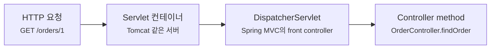
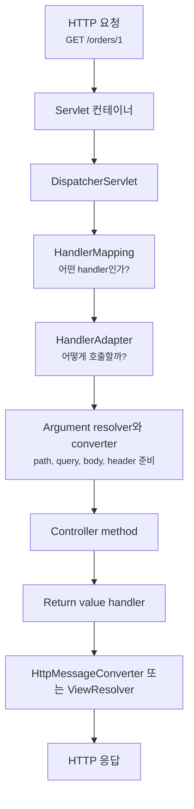
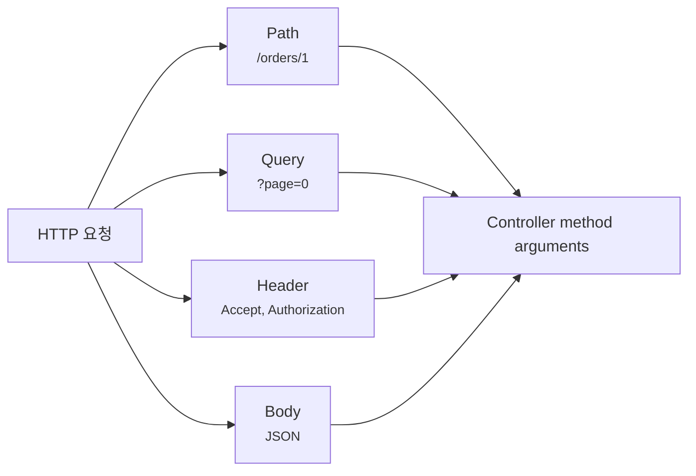
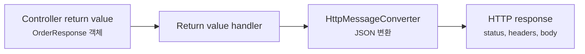
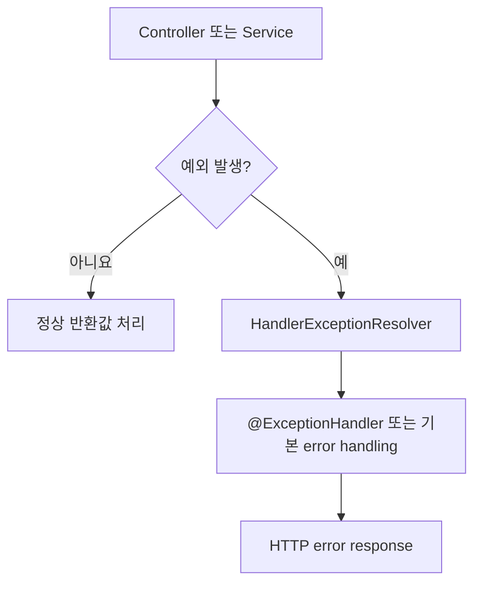
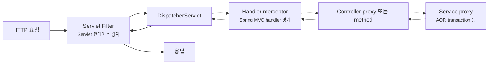

# 웹 요청은 Spring MVC 안에서 어떤 순서로 지나갈까요?

> 컨트롤러 메서드 하나를 만들었을 뿐인데, HTTP 요청은 이미 여러 번 해석되고 변환되고 검증된 뒤에 도착해요.

지난 글에서는 Spring Boot 4.x와 3.x의 기준선을 봤어요. 버전 하나가 Spring Framework, Jakarta EE, Servlet 컨테이너, starter 이름, JSON 처리 기준까지 같이 움직인다는 이야기였죠.

이제 다시 애플리케이션 안으로 들어와볼게요.

Spring Boot MVC 프로젝트에서 이런 코드를 자주 봐요.

```java
package com.example.order;

import org.springframework.web.bind.annotation.GetMapping;
import org.springframework.web.bind.annotation.PathVariable;
import org.springframework.web.bind.annotation.RestController;

@RestController
public class OrderController {

    private final OrderService orderService;

    public OrderController(OrderService orderService) {
        this.orderService = orderService;
    }

    @GetMapping("/orders/{id}")
    public OrderResponse findOrder(@PathVariable Long id) {
        return orderService.findOrder(id);
    }
}
```

처음에는 단순해 보여요.

> "`GET /orders/1` 요청이 오면 `findOrder(1)`이 실행되는 거죠?"

맞아요. 하지만 그 한 문장 안에는 꽤 많은 일이 숨어 있어요.

> "누가 `/orders/{id}`와 실제 요청을 비교하죠?"  
> "문자열 `1`은 누가 `Long`으로 바꾸죠?"  
> "`@RequestBody` JSON은 언제 Java 객체가 되죠?"  
> "`@Valid`는 컨트롤러 앞에서 실행되나요, 안에서 실행되나요?"  
> "컨트롤러가 객체를 return하면 누가 JSON으로 바꾸죠?"  
> "예외가 나면 왜 `@ExceptionHandler`가 대신 응답을 만들 수 있죠?"

오늘은 이 길을 한 번에 따라가볼게요. **Spring MVC 요청은 Servlet 컨테이너에서 들어와 `DispatcherServlet`을 지나고, HandlerMapping이 컨트롤러 메서드를 찾고, HandlerAdapter가 인자를 준비해서 호출하고, 반환값은 message converter나 view resolver를 통해 HTTP 응답으로 바뀌어요. 예외가 나면 HandlerExceptionResolver가 중간에 다른 응답으로 바꿀 기회를 가져요.**

!!! note "이 글의 기준"
    이 글은 Spring Boot 4.1.0과 Spring Framework 7.0.8 공식 문서의 Spring MVC 설명을 기준으로 작성했어요. 요청 흐름의 큰 구조는 Spring MVC에서 오래 이어진 개념이지만, starter 이름, Jackson 세대, 일부 기본 설정은 사용 중인 Spring Boot 버전에 따라 달라질 수 있어요.

---

## 먼저 요청은 컨트롤러로 바로 가지 않아요

브라우저나 API client가 요청을 보낸다고 해볼게요.

```http
GET /orders/1 HTTP/1.1
Host: api.example.com
Accept: application/json
```

우리가 작성한 코드는 `OrderController`예요. 하지만 요청이 처음 만나는 것은 컨트롤러가 아니에요.

Spring MVC는 Servlet 기반 웹 프레임워크예요. 그래서 요청은 먼저 Servlet 컨테이너, 예를 들면 Tomcat 같은 서버로 들어와요. Spring Boot MVC 앱이라면 Boot가 내장 서버와 MVC 기본 설정을 준비해주고, 그 안에서 Spring MVC의 중심 Servlet인 `DispatcherServlet`이 요청을 받아요.



이 그림에서 핵심은 `DispatcherServlet`이에요. Spring MVC는 front controller 패턴을 써요. 요청마다 컨트롤러가 제각각 직접 입구가 되는 게 아니라, 공통 입구인 `DispatcherServlet`이 요청 처리 알고리즘을 들고 있고 실제 작업을 여러 구성요소에 위임해요.

그래서 "컨트롤러 메서드가 호출됐다"는 말은 사실 이렇게 읽어야 해요.

> `DispatcherServlet`이 요청을 받고, 여러 후보 중 실행할 handler를 찾고, 그 handler를 실행할 방법을 골라서 컨트롤러 메서드를 호출했다.

처음에는 `DispatcherServlet`을 "교통정리 담당자"처럼 생각해도 좋아요. 하지만 비유에서 멈추면 안 돼요. 실무에서 중요한 건 `DispatcherServlet`이 혼자 모든 일을 하는 게 아니라, `HandlerMapping`, `HandlerAdapter`, `HandlerExceptionResolver`, `ViewResolver`, `HttpMessageConverter` 같은 Spring MVC 구성요소에게 일을 나눠 맡긴다는 점이에요.

---

## Spring Boot가 준비한 것과 MVC가 처리하는 일을 나눠볼게요

Spring Boot 4.x 기준으로 MVC 웹 앱을 만들면 이런 의존성을 보게 돼요.

```gradle
dependencies {
    implementation "org.springframework.boot:spring-boot-starter-webmvc"
}
```

이 한 줄은 "내 앱이 Servlet 기반 Spring MVC 웹 애플리케이션이다"라는 선택에 가까워요. 스타터가 MVC, servlet, 내장 서버, JSON 처리에 필요한 의존성을 올리고, Boot 자동 설정(auto-configuration)이 기본 MVC 설정을 준비해요.

하지만 요청 하나를 실제로 처리하는 세부 단계는 Spring Framework의 Spring MVC가 맡아요.

| 구분 | 주로 하는 일 |
|---|---|
| Spring Boot | starter 의존성, 내장 서버, 기본 MVC 설정, JSON converter, error handling 기본값을 준비해요 |
| Servlet 컨테이너 | 네트워크 요청을 받아 Servlet API 요청/응답 객체로 넘겨요 |
| Spring MVC | `DispatcherServlet`을 중심으로 handler 선택, 인자 준비, controller 호출, 반환값 처리, 예외 처리를 진행해요 |
| 내 애플리케이션 코드 | controller, service, DTO, exception handler, validation 규칙을 제공해요 |

이 구분은 디버깅할 때 특히 중요해요.

| 증상 | 먼저 의심할 경계 |
|---|---|
| 서버가 아예 안 뜸 | Boot 설정, starter, 내장 서버, port 충돌 |
| URL이 404로 끝남 | controller bean 등록, request mapping, servlet path |
| `String`을 `Long`으로 못 바꿈 | type conversion, argument resolution |
| JSON body를 못 읽음 | `@RequestBody`, message converter, content type |
| validation이 안 됨 | validation 의존성, `@Valid`, binding 대상 |
| 예외 응답 모양이 이상함 | `@ExceptionHandler`, `@ControllerAdvice`, Boot error handling |

처음에는 다 "Spring Boot가 안 돼요"처럼 보이지만, 실제로는 요청이 어느 경계까지 갔는지에 따라 봐야 할 곳이 달라져요.

---

## 전체 흐름을 먼저 한 장으로 볼게요

요청이 정상적으로 처리되는 큰 흐름은 이래요.



이 그림에서 `Controller method`는 가운데 한 칸이에요. 우리가 작성한 코드는 중요하지만, HTTP 요청을 Java 메서드 호출로 바꾸고 다시 HTTP 응답으로 바꾸는 앞뒤 작업이 더 넓게 펼쳐져 있어요.

`@RestController`를 쓰는 API에서는 반환값이 보통 `HttpMessageConverter`를 거쳐 JSON 같은 body로 바뀌어요. 반대로 `@Controller`에서 view 이름을 반환하는 서버 렌더링 화면이라면 `ViewResolver`가 어떤 template을 렌더링할지 찾는 흐름으로 이어져요.

---

## 1단계: HandlerMapping이 "누가 처리할지" 찾아요

`DispatcherServlet`이 요청을 받으면 먼저 "이 요청을 누가 처리할 수 있지?"를 찾아요. 이 일을 하는 대표 구성요소가 `HandlerMapping`이에요.

예를 들어 이런 컨트롤러가 있다고 해볼게요.

```java
package com.example.order;

import org.springframework.web.bind.annotation.GetMapping;
import org.springframework.web.bind.annotation.PathVariable;
import org.springframework.web.bind.annotation.RestController;

@RestController
public class OrderController {

    @GetMapping("/orders/{id}")
    public OrderResponse findOrder(@PathVariable Long id) {
        return new OrderResponse(id, "READY");
    }
}
```

요청은 이렇게 들어와요.

```http
GET /orders/1 HTTP/1.1
Accept: application/json
```

`HandlerMapping`은 URL만 보지 않아요. HTTP method, path pattern, consumes, produces, header 조건 같은 request mapping 정보를 함께 볼 수 있어요.

| 요청에서 보는 것 | 컨트롤러 쪽 대응 |
|---|---|
| `GET` | `@GetMapping` |
| `/orders/1` | `/orders/{id}` |
| `Accept: application/json` | JSON 응답을 만들 수 있는지 |
| `Content-Type: application/json` | body를 읽어야 하는 요청에서 중요 |

그래서 404와 405는 느낌이 달라요.

| 결과 | 읽는 법 |
|---|---|
| 404 Not Found | 이 path를 처리할 handler를 못 찾았을 가능성이 커요 |
| 405 Method Not Allowed | path는 비슷하게 찾았지만 HTTP method가 맞지 않을 수 있어요 |
| 415 Unsupported Media Type | 요청 body의 `Content-Type`을 처리할 수 없을 수 있어요 |
| 406 Not Acceptable | client가 원하는 응답 media type을 만들 수 없을 수 있어요 |

!!! tip "404가 나면 service부터 보지 마세요"
    요청이 controller method까지 도착하지 못했을 수 있어요. 먼저 URL, HTTP method, controller bean 등록, `spring.mvc.servlet.path` 같은 servlet mapping 설정을 확인하는 편이 빨라요.

---

## 2단계: HandlerAdapter가 "어떻게 호출할지" 준비해요

Handler를 찾았다고 바로 Java 메서드를 호출할 수는 없어요.

HTTP 요청은 문자열과 header와 body로 들어와요. 그런데 controller method는 이렇게 생겼죠.

```java
@GetMapping("/orders/{id}")
public OrderResponse findOrder(@PathVariable Long id) {
    return orderService.findOrder(id);
}
```

여기서 `Long id`는 그냥 생긴 값이 아니에요. Spring MVC가 `/orders/1`에서 path variable 문자열 `"1"`을 꺼내고, `Long` 타입으로 변환해서 넣어준 값이에요.

이 일을 크게 보면 `HandlerAdapter`가 맡아요. Annotation 기반 controller method를 실행할 수 있는 adapter가 선택되고, 그 안에서 여러 argument resolver와 converter가 협력해요.

대표적인 인자들은 이렇게 읽으면 돼요.

| Controller method 인자 | Spring MVC가 준비하는 방식 |
|---|---|
| `@PathVariable Long id` | path pattern에서 값을 꺼내 타입 변환해요 |
| `@RequestParam int page` | query string이나 form parameter에서 값을 꺼내 타입 변환해요 |
| `@RequestHeader String token` | HTTP header에서 값을 꺼내요 |
| `@RequestBody CreateOrderRequest request` | HTTP body를 message converter로 읽어 Java 객체로 만들어요 |
| `HttpServletRequest` | Servlet API 요청 객체를 그대로 넘겨요 |
| `Principal` | 인증 정보가 있으면 현재 사용자 정보를 넘겨요 |

그래서 컨트롤러 메서드의 signature는 단순한 Java 문법이 아니에요. "이 HTTP 요청에서 어떤 조각을 꺼내 메서드 인자로 받을 것인가"를 선언한 모양이에요.



이 그림에서 중요한 건 "요청 전체가 한 번에 객체 하나로 바뀐다"가 아니라는 점이에요. path, query, header, body가 각각 다른 규칙으로 읽히고, controller method signature가 그 규칙을 드러내요.

---

## 3단계: 변환과 검증은 controller 호출 직전에 중요해져요

이번에는 POST 요청을 볼게요.

```java
package com.example.order;

import jakarta.validation.Valid;
import jakarta.validation.constraints.Min;
import jakarta.validation.constraints.NotBlank;
import org.springframework.http.HttpStatus;
import org.springframework.web.bind.annotation.PostMapping;
import org.springframework.web.bind.annotation.RequestBody;
import org.springframework.web.bind.annotation.ResponseStatus;
import org.springframework.web.bind.annotation.RestController;

@RestController
public class OrderController {

    @PostMapping("/orders")
    @ResponseStatus(HttpStatus.CREATED)
    public OrderResponse createOrder(@Valid @RequestBody CreateOrderRequest request) {
        return new OrderResponse(1L, "READY");
    }
}

record CreateOrderRequest(
    @NotBlank String productCode,
    @Min(1) int quantity
) {
}
```

요청은 이런 모양일 수 있어요.

```http
POST /orders HTTP/1.1
Content-Type: application/json
Accept: application/json

{
  "productCode": "BOOK-001",
  "quantity": 2
}
```

여기서는 두 일이 이어져요.

1. `@RequestBody` 때문에 HTTP body를 Java 객체로 읽어요.
2. `@Valid` 때문에 만들어진 객체가 validation 규칙을 통과하는지 확인해요.

body를 읽을 때는 `HttpMessageConverter`가 중요해요. JSON 요청이라면 Jackson 기반 converter가 body를 `CreateOrderRequest`로 바꾸는 식이에요. Boot 4.x 흐름에서는 Jackson 3가 기본 방향이에요.

검증은 "컨트롤러 안에서 내가 직접 if문을 쓰기 전"에 일어날 수 있어요. `quantity`가 `0`이면 controller method 본문까지 들어가기 전에 binding 또는 validation 예외가 발생할 수 있어요.

!!! warning "DTO 생성과 validation은 service 로직이 아니에요"
    JSON을 Java 객체로 읽는 일, 문자열을 숫자로 바꾸는 일, `@Valid`로 요청 형식을 검증하는 일은 보통 controller 진입 경계에서 일어나요. service는 이미 해석된 application input을 받는 쪽에 가깝게 두는 편이 읽기 좋아요.

실무에서는 이 경계가 설계를 바꿔요.

| 질문 | 추천하는 판단 |
|---|---|
| 요청 JSON 필드 이름을 어디서 바꿀까요? | API DTO와 JSON mapping 쪽에서 다루는 게 자연스러워요 |
| 수량이 1 이상이어야 하는 검증은 어디에 둘까요? | 요청 형식 규칙이면 DTO validation이 좋아요 |
| 재고가 충분한지 확인은 어디에 둘까요? | 비즈니스 규칙이므로 service나 domain 쪽이 좋아요 |
| 잘못된 JSON 문법은 어디서 잡힐까요? | controller method 본문 전에 message converter 단계에서 실패할 수 있어요 |

---

## 4단계: Controller는 HTTP를 모두 처리하는 곳이 아니에요

컨트롤러는 요청의 application entry point예요. 하지만 모든 일을 컨트롤러가 직접 하면 금방 커져요.

좋은 컨트롤러는 보통 이렇게 얇아요.

```java
@RestController
public class OrderController {

    private final OrderService orderService;

    public OrderController(OrderService orderService) {
        this.orderService = orderService;
    }

    @PostMapping("/orders")
    @ResponseStatus(HttpStatus.CREATED)
    public OrderResponse createOrder(@Valid @RequestBody CreateOrderRequest request) {
        Order order = orderService.create(request.productCode(), request.quantity());
        return OrderResponse.from(order);
    }
}
```

이 코드를 읽을 때는 책임을 나눠보세요.

| 코드 위치 | 책임 |
|---|---|
| `@PostMapping` | 어떤 HTTP 요청을 받을지 선언해요 |
| `@RequestBody` DTO | 요청 body 모양을 application input으로 받아요 |
| `@Valid` | 요청 형식 규칙을 확인해요 |
| `orderService.create(...)` | 주문 생성 비즈니스 규칙을 실행해요 |
| `OrderResponse.from(order)` | application 결과를 API 응답 모양으로 바꿔요 |

컨트롤러가 얇아야 하는 이유는 단순히 "깔끔해서"가 아니에요. 요청 흐름의 앞뒤를 Spring MVC가 이미 맡고 있기 때문이에요. controller method 안에는 "HTTP를 Java 호출로 바꾼 뒤, 내 애플리케이션이 실제로 해야 할 일"이 남아야 해요.

반대로 이런 코드 냄새가 나면 요청 흐름을 다시 나눠봐야 해요.

| 냄새 | 왜 위험할까요? |
|---|---|
| controller에서 JSON 문자열을 직접 파싱함 | message converter가 할 일을 우회해요 |
| controller에서 validation if문이 길어짐 | DTO validation과 비즈니스 검증이 섞일 수 있어요 |
| controller에서 repository를 직접 호출함 | HTTP 경계와 persistence 경계가 붙어서 테스트와 변경이 어려워져요 |
| controller method마다 error response를 직접 만듦 | 예외 응답 계약이 흩어져요 |

물론 아주 작은 앱에서는 간단히 시작할 수 있어요. 하지만 Spring MVC의 요청 경계를 이해하면 "컨트롤러에 둘 일"과 "밖으로 빼야 할 일"이 더 선명해져요.

---

## 5단계: 반환값은 다시 HTTP 응답으로 바뀌어요

컨트롤러가 return한 값은 아직 HTTP 응답이 아니에요.

```java
return new OrderResponse(1L, "READY");
```

이건 Java 객체예요. `@RestController`는 `@Controller`와 `@ResponseBody`가 합쳐진 흐름으로 생각하면 돼요. 반환값을 view 이름으로 보지 않고, 응답 body로 쓰겠다는 뜻이에요.

그러면 Spring MVC는 반환값을 처리할 handler를 고르고, `HttpMessageConverter`를 통해 body를 만들어요.



예를 들어 이런 응답이 만들어질 수 있어요.

```http
HTTP/1.1 201 Created
Content-Type: application/json

{
  "id": 1,
  "status": "READY"
}
```

여기서 응답 status는 여러 방식으로 정할 수 있어요.

| 방식 | 예시 | 쓰임 |
|---|---|---|
| 기본값 | return 객체만 함 | 성공 응답은 보통 200 |
| `@ResponseStatus` | `@ResponseStatus(HttpStatus.CREATED)` | 고정 status를 선언하고 싶을 때 |
| `ResponseEntity` | `ResponseEntity.created(uri).body(body)` | status, header, body를 함께 제어할 때 |

처음에는 `ResponseEntity`를 모든 곳에 쓰고 싶어질 수 있어요. 하지만 status와 header를 세밀하게 제어할 필요가 없는 단순 조회 API라면 객체를 바로 반환해도 충분한 경우가 많아요.

중요한 건 "return한 Java 객체가 곧 wire format은 아니다"예요. JSON 필드 이름, 날짜 형식, enum 표현, null 처리 같은 문제는 다음 JSON 글에서 더 자세히 볼 거예요.

---

## 6단계: 예외는 요청 흐름 밖으로 튀는 게 아니라 다른 경로로 처리돼요

컨트롤러나 그 아래 service에서 예외가 날 수 있어요.

```java
@GetMapping("/orders/{id}")
public OrderResponse findOrder(@PathVariable Long id) {
    Order order = orderService.findOrder(id);
    return OrderResponse.from(order);
}
```

`orderService.findOrder(id)`에서 `OrderNotFoundException`이 발생하면 어떻게 될까요?

처음에는 "그냥 서버 에러가 나겠지"라고 생각하기 쉬워요. 하지만 Spring MVC에는 예외를 HTTP 응답으로 바꿀 수 있는 경로가 있어요. `DispatcherServlet` 수준에서 `HandlerExceptionResolver`들이 예외를 처리할 기회를 가져요. 우리가 자주 쓰는 `@ExceptionHandler`와 `@ControllerAdvice`도 이 흐름 위에 있어요.

```java
import org.springframework.http.HttpStatus;
import org.springframework.web.bind.annotation.ExceptionHandler;
import org.springframework.web.bind.annotation.ResponseStatus;
import org.springframework.web.bind.annotation.RestControllerAdvice;

@RestControllerAdvice
public class ApiExceptionHandler {

    @ExceptionHandler(OrderNotFoundException.class)
    @ResponseStatus(HttpStatus.NOT_FOUND)
    public ErrorResponse handleOrderNotFound(OrderNotFoundException exception) {
        return new ErrorResponse("ORDER_NOT_FOUND", exception.getMessage());
    }
}
```

흐름은 이렇게 볼 수 있어요.



이 그림의 핵심은 예외 처리도 MVC 요청 흐름의 일부라는 점이에요. 예외가 "Spring MVC 바깥으로 그냥 터지는 것"만은 아니에요. 어떤 resolver가 처리하느냐에 따라 400, 404, 500, Problem Details 같은 응답 모양으로 바뀔 수 있어요.

!!! tip "예외 응답은 한곳에서 모으는 편이 좋아요"
    controller method마다 `try-catch`로 응답을 만들기 시작하면 API error contract가 흩어져요. 공통 규칙은 `@RestControllerAdvice` 같은 경계에 모아두고, controller는 정상 요청 흐름을 읽기 쉽게 유지하는 편이 좋아요.

---

## filter, interceptor, AOP는 어디쯤 있을까요?

요청 흐름을 공부하다 보면 filter, interceptor, AOP도 같이 나와요. 셋은 모두 "중간에 끼어든다"는 느낌이 있어서 헷갈리기 쉬워요.

간단히 위치부터 잡아볼게요.



이 그림은 단순화한 지도예요. 핵심은 경계가 다르다는 점이에요.

| 도구 | 주로 보는 경계 |
|---|---|
| Servlet Filter | Spring MVC 앞의 Servlet 요청/응답 전체 경계 |
| HandlerInterceptor | Spring MVC가 handler를 찾은 뒤 controller 호출 전후 경계 |
| AOP proxy | Spring bean method 호출 경계 |

예를 들어 인증/보안 필터는 MVC controller를 찾기 전에도 요청을 볼 수 있어요. 반면 interceptor는 어떤 handler가 선택됐는지 알고 움직일 수 있어요. AOP는 HTTP 요청 자체보다 Spring bean method 호출에 붙는 경우가 많아요.

지난 AOP 글에서 봤던 self-invocation 함정도 여기서 다시 이어져요. 요청이 controller proxy나 service proxy의 바깥 경계를 통과해야 부가 동작이 붙을 수 있어요. "Annotation을 붙였는데 왜 동작하지 않지?"라는 질문은 MVC 요청 경계와 AOP proxy 경계를 함께 봐야 풀리는 경우가 많아요.

---

## 실무에서 요청 흐름을 따라 디버깅하는 순서

API가 기대와 다르게 동작할 때는 요청 흐름 순서대로 좁혀가면 좋아요.

| 확인 순서 | 볼 것 | 흔한 단서 |
|---|---|---|
| 1 | 서버와 servlet path | 앱이 떴는지, port와 base path가 맞는지 |
| 2 | handler mapping | 404, 405, mapping actuator 정보 |
| 3 | argument binding | path/query/header/body 이름과 타입 |
| 4 | message conversion | `Content-Type`, `Accept`, JSON 파싱 오류 |
| 5 | validation | `@Valid`, validation 의존성, field constraint |
| 6 | service 호출 | 비즈니스 예외, transaction, 외부 연동 |
| 7 | return value handling | status, header, JSON 필드 |
| 8 | exception handling | `@ControllerAdvice`, 기본 error response |

Actuator를 붙인 프로젝트라면 나중에 `mappings`, `conditions`, `httpexchanges` 같은 endpoint도 중요한 단서가 돼요. 지금은 요청이 어느 단계에서 멈췄는지 보는 감각만 잡아두면 충분해요.

예를 들어 이런 식으로 생각해볼 수 있어요.

| 증상 | 요청 흐름에서 멈춘 위치 |
|---|---|
| 요청이 404 | handler를 찾기 전에 멈췄을 수 있어요 |
| `Failed to convert value of type 'java.lang.String' to required type 'java.lang.Long'` | argument conversion 단계 문제예요 |
| JSON 문법 오류 | controller method 본문 전에 body 읽기에서 실패했을 수 있어요 |
| `@Valid`가 안 먹음 | validation 의존성, Annotation 위치, DTO 구조를 봐야 해요 |
| 예외가 HTML error page로 감 | API 예외 처리나 content negotiation을 확인해야 해요 |

!!! warning "컨트롤러에 breakpoint가 안 걸리면 controller 내부 문제가 아닐 수 있어요"
    요청이 controller method까지 도착하지 못하면 service나 repository를 봐도 답이 없어요. 먼저 mapping, binding, converter, validation 단계에서 실패했는지 확인하세요.

---

## 처음에는 여기까지만 잡아도 충분해요

Spring MVC 요청 흐름을 처음부터 완벽히 외울 필요는 없어요. 지금은 이 문장만 남겨도 좋아요.

> 요청은 `DispatcherServlet`으로 들어오고, handler를 찾고, 인자를 만들고, controller를 호출하고, 반환값을 응답으로 바꾸고, 예외가 나면 예외 처리 경로로 응답을 만든다.

조금 더 깊게 보면 이런 원칙이 남아요.

| 초반 이해 | 더 깊은 이해 |
|---|---|
| URL이 controller method로 연결돼요 | `HandlerMapping`이 request mapping 조건을 평가해 handler를 골라요 |
| path variable이 인자로 들어와요 | argument resolver와 conversion service가 문자열을 target type으로 바꿔요 |
| JSON body가 DTO가 돼요 | `HttpMessageConverter`가 media type과 target type을 보고 body를 읽어요 |
| return 객체가 JSON이 돼요 | return value handler와 message converter가 응답 body를 만들어요 |
| 예외는 error response가 돼요 | `HandlerExceptionResolver`, `@ExceptionHandler`, Boot error handling이 관여해요 |

이 차이를 알면 다음 글들이 훨씬 덜 헷갈려요. REST API 설계, error contract, Jackson, validation, Security filter chain, MVC test는 모두 이 요청 흐름 위에 올라가거든요.

---

## 참고한 링크

- [Spring Framework Reference - DispatcherServlet](https://docs.spring.io/spring-framework/reference/web/webmvc/mvc-servlet.html)
- [Spring Framework Reference - Annotated Controllers](https://docs.spring.io/spring-framework/reference/web/webmvc/mvc-controller.html)
- [Spring Framework Reference - Exceptions](https://docs.spring.io/spring-framework/reference/web/webmvc/mvc-servlet/exceptionhandlers.html)
- [Spring Boot Reference - Spring MVC](https://docs.spring.io/spring-boot/how-to/spring-mvc.html)
- [Spring Boot Tutorial - Developing Your First Spring Boot Application](https://docs.spring.io/spring-boot/tutorial/first-application/index.html)

---

## 자, 정리해볼까요?

!!! abstract "오늘 우리가 배운 것"
    - Spring MVC 요청은 controller로 바로 가지 않고 `DispatcherServlet`을 공통 입구로 지나가요.
    - `HandlerMapping`은 어떤 controller method가 요청을 처리할지 찾고, `HandlerAdapter`는 그 method를 호출할 준비를 해요.
    - path variable, query parameter, header, body는 각각 다른 argument resolver와 converter 규칙으로 controller 인자가 돼요.
    - `@RestController`의 반환 객체는 `HttpMessageConverter`를 거쳐 JSON 같은 HTTP response body로 바뀌어요.
    - 예외도 MVC 요청 흐름 안에서 `HandlerExceptionResolver`, `@ExceptionHandler`, `@ControllerAdvice`를 통해 HTTP 응답으로 바뀔 수 있어요.

다음 글에서는 이 흐름 위에서 REST API를 어떻게 설계할지 볼 거예요. DTO, validation, Problem Details, error code, API contract를 "컨트롤러 코드 모양"이 아니라 "클라이언트와 서버가 맺는 약속"으로 읽어볼게요.
