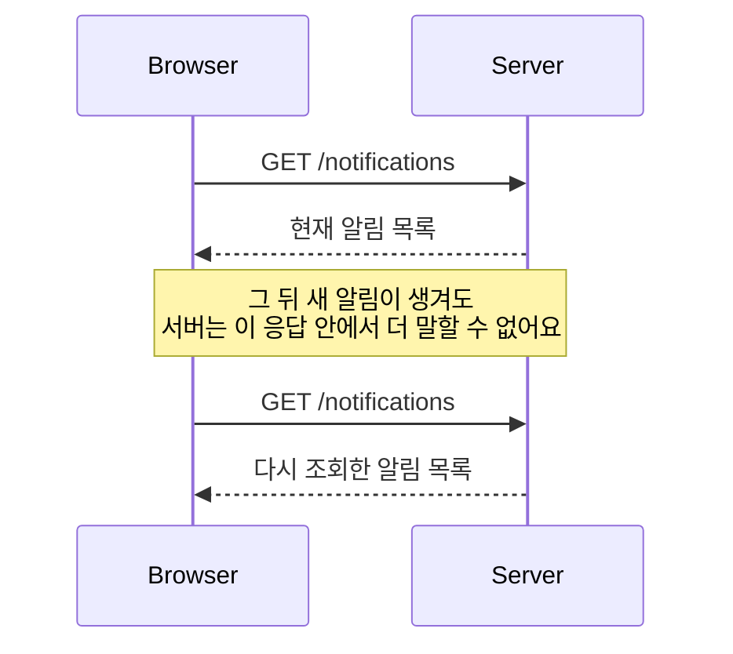
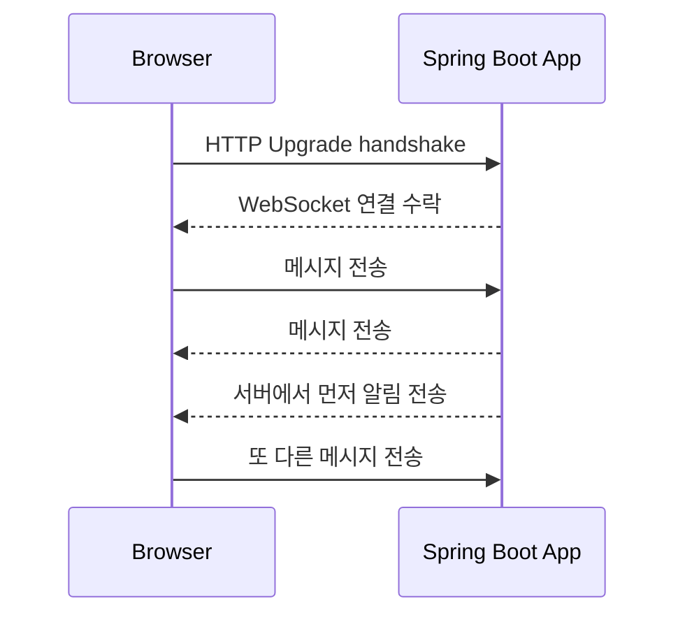
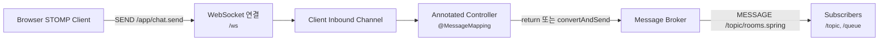
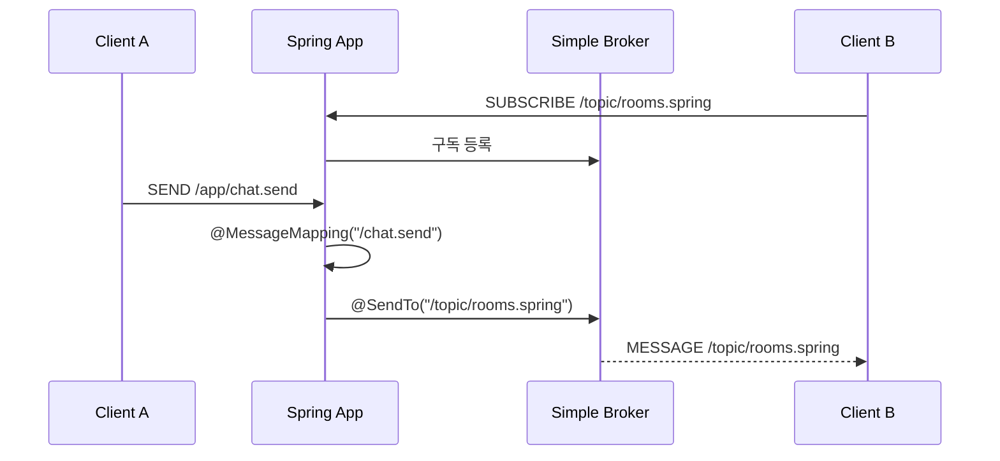
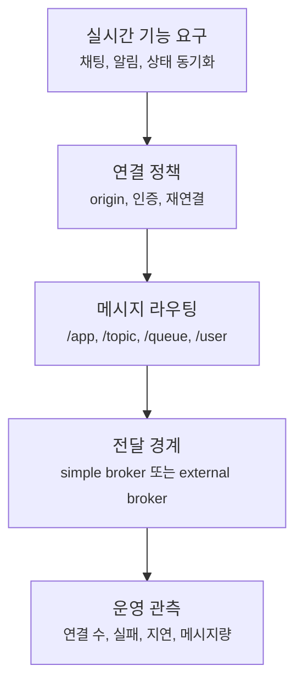

# WebSocket과 STOMP는 언제 실시간 연결에 필요할까요?

> 채팅창은 새로고침하지 않았는데도 새 메시지가 도착해요. 이때 서버는 어떻게 브라우저에게 먼저 말을 걸 수 있을까요?

지난 글에서는 Spring MVC와 WebFlux를 비교하면서 요청을 처리하는 thread와 I/O 대기 방식을 봤어요. 둘 다 결국 HTTP 요청을 받고 HTTP 응답을 돌려주는 웹 stack이었죠.

그런데 어떤 화면은 요청-응답만으로는 감각이 잘 안 맞아요.

> "상대가 메시지를 보냈는데, 내 브라우저가 왜 바로 알죠?"  
> "주문 상태가 바뀌면 서버가 화면에 먼저 알려줄 수 있나요?"  
> "실시간 알림은 REST API를 1초마다 호출하면 되는 건가요?"  
> "WebSocket을 열면 controller도 똑같이 쓰나요?"  
> "STOMP는 WebSocket이랑 같은 말인가요?"

오늘은 이 질문을 볼 거예요. **WebSocket은 한 번 연결한 뒤 양쪽이 계속 메시지를 주고받을 수 있게 해주는 전송 통로이고, STOMP는 그 통로 위에서 메시지의 목적지와 의미를 정해주는 약속이에요.** Spring Boot는 `spring-boot-starter-websocket`으로 Spring Framework의 WebSocket과 STOMP 지원을 쉽게 쓸 수 있게 해줘요.

!!! note "이 글의 기준"
    이 글은 Spring Boot 4.1.0과 Spring Framework 7.0.x 공식 문서의 WebSocket, STOMP, SockJS fallback 설명을 기준으로 작성했어요. 예제는 Spring MVC 기반 앱에서 `spring-boot-starter-websocket`을 쓰는 흐름으로 읽어주세요.

---

## REST API는 "물어보면 답하는" 흐름이에요

REST API는 보통 클라이언트가 먼저 묻고, 서버가 한 번 답하는 흐름이에요.

```http
GET /notifications HTTP/1.1
Accept: application/json
```

```http
HTTP/1.1 200 OK
Content-Type: application/json

[
  {
    "id": 1,
    "message": "새 댓글이 달렸어요"
  }
]
```

이 방식은 단순하고 강해요. 목록 조회, 상세 조회, 생성, 수정, 삭제처럼 사용자가 행동한 뒤 결과를 받는 API에는 잘 맞아요.

하지만 "서버 쪽에서 언제 일이 생길지 모르는" 화면에서는 고민이 생겨요.

예를 들어 알림 화면이 있다고 해볼게요.



이 그림에서 중요한 건 HTTP 응답이 끝나면 그 대화도 끝난다는 점이에요. 새 알림이 생겼는지 알고 싶으면 브라우저가 다시 물어봐야 해요.

그래서 가장 쉬운 해결은 polling이에요. 1초마다, 5초마다, 30초마다 다시 요청하는 방식이죠.

| 방식 | 읽는 법 | 잘 맞는 상황 |
|---|---|---|
| Polling | 클라이언트가 일정 간격으로 다시 물어봐요 | 조금 늦어도 괜찮은 알림, 상태 갱신 |
| Long polling | 서버가 응답을 잠시 붙잡고 있다가 변화가 생기면 답해요 | WebSocket을 쓰기 어려운 환경의 준실시간 |
| Server-Sent Events | 서버가 클라이언트로 단방향 event stream을 보내요 | 서버에서 브라우저로만 흘러도 되는 알림 |
| WebSocket | 연결을 열어두고 양방향 메시지를 주고받아요 | 채팅, 협업, 게임, 빈번한 상태 동기화 |

그러니까 WebSocket은 "실시간이면 무조건 써야 하는 기술"이 아니에요. 변화가 드물고 몇 초 늦어도 괜찮다면 polling이 더 단순할 수 있어요. 반대로 낮은 지연, 잦은 메시지, 양방향 상호작용이 중요하면 WebSocket을 검토할 이유가 생겨요.

!!! tip "먼저 질문을 바꿔보세요"
    "실시간인가요?"보다 "서버가 클라이언트에게 먼저 자주 말해야 하나요?", "연결을 오래 유지할 만큼 메시지가 자주 오가나요?", "몇 초 늦어도 괜찮나요?"가 더 좋은 선택 질문이에요.

---

## WebSocket은 HTTP와 다른 대화 방식이에요

WebSocket 연결은 처음에는 HTTP 요청으로 시작해요. 브라우저가 "이 연결을 WebSocket으로 바꿔도 되나요?"라고 묻고, 서버가 받아들이면 같은 연결 위에서 양쪽이 계속 메시지를 주고받아요.



여기서 HTTP 요청-응답과 감각이 갈라져요. REST API는 보통 `GET /orders/1`, `POST /orders`처럼 요청마다 URL과 method가 의미를 가져요. WebSocket은 연결을 열고 나면 보통 하나의 연결 위로 여러 메시지가 지나가요.

| 질문 | REST API | WebSocket |
|---|---|---|
| 대화 시작 | 요청마다 새 HTTP request | 처음 handshake 후 연결 유지 |
| 응답 방향 | 클라이언트 요청 뒤 서버 응답 | 클라이언트와 서버가 둘 다 먼저 보낼 수 있음 |
| 의미 위치 | HTTP method, path, status, header | 메시지 안의 약속 |
| 잘 맞는 작업 | 자원 조회와 변경 | 실시간 상호작용과 push |
| 운영상 볼 것 | status code, latency, error body | 연결 수, 메시지 흐름, 끊김, 재연결 |

처음에는 이 정도만 잡아도 충분해요. **WebSocket은 REST API의 더 빠른 버전이 아니라, 연결을 오래 열어두고 메시지를 주고받는 다른 통신 방식이에요.**

---

## 그런데 WebSocket만으로는 메시지 의미가 부족해요

여기서 한 가지 함정이 있어요.

> "WebSocket을 열었으니 이제 `/chat/send` 같은 URL로 메시지를 보내면 되나요?"

사실은 아니에요. WebSocket 자체는 메시지의 내용이 무엇인지 정하지 않아요. 텍스트나 바이너리 메시지를 보낼 수 있는 통로를 줄 뿐이에요.

예를 들어 브라우저가 이런 문자열을 보냈다고 해볼게요.

```json
{
  "roomId": "spring",
  "message": "안녕하세요"
}
```

서버는 이 메시지를 보고 직접 약속을 해석해야 해요.

- 이 메시지는 채팅방에 보내는 건가요?
- `roomId`가 없으면 에러인가요?
- 어느 구독자에게 다시 보내야 하나요?
- 개인 메시지와 전체 메시지는 어떻게 구분하나요?
- 연결이 끊겼다가 다시 붙으면 구독 상태는 어떻게 되나요?

작은 기능이면 직접 규칙을 만들 수 있어요. `WebSocketHandler`를 구현해서 들어온 문자열을 읽고, JSON으로 파싱하고, 어떤 session에 다시 보낼지 직접 정할 수 있죠.

하지만 채팅, 알림, 주식 가격, 협업 편집처럼 메시지 종류와 구독자가 늘어나면 직접 약속을 만들기 시작한 순간부터 새로운 미니 프로토콜을 설계하게 돼요.

여기서 STOMP가 등장해요.

---

## STOMP는 WebSocket 위의 메시지 약속이에요

STOMP(Simple Text Oriented Messaging Protocol)는 메시지를 어디로 보내고, 어디를 구독하고, 어떤 frame인지 표현하는 간단한 메시징 프로토콜이에요. WebSocket과 같은 말이 아니라, WebSocket 위에서 쓸 수 있는 상위 약속이라고 보면 돼요.

STOMP에서는 이런 단어들이 중요해져요.

| STOMP 단어 | 쉽게 읽기 | 예시 |
|---|---|---|
| `CONNECT` | STOMP 세션을 시작해요 | 클라이언트가 broker에 연결 |
| `SUBSCRIBE` | 어떤 destination을 구독해요 | `/topic/rooms.spring` |
| `SEND` | 어떤 destination으로 메시지를 보내요 | `/app/chat.send` |
| `MESSAGE` | 구독자에게 메시지가 도착해요 | broker가 클라이언트로 전달 |
| destination | 메시지 주소예요 | `/app`, `/topic`, `/queue`, `/user` |
| broker | 구독과 전달을 맡는 메시지 중간자예요 | simple broker, external broker relay |

Spring에서 STOMP를 쓰면 흐름이 이렇게 나뉘어요.



이 그림에서 `/ws`는 처음 WebSocket을 연결하는 endpoint예요. 반면 `/app/chat.send`나 `/topic/rooms.spring`은 HTTP URL이 아니라 STOMP destination이에요. 이 둘을 섞어 읽으면 많이 헷갈려요.

!!! note "비슷해 보여도 HTTP mapping은 아니에요"
    `@MessageMapping`은 HTTP controller의 `@PostMapping`과 닮아 보이지만 같은 것은 아니에요. HTTP request path를 매핑하는 게 아니라, STOMP destination으로 들어온 message를 처리하는 handler를 찾는 거예요.

---

## Spring Boot에서는 starter와 설정 class에서 시작해요

MVC 기반 Spring Boot 앱에서는 먼저 WebSocket starter를 넣어요.

```gradle
dependencies {
    implementation "org.springframework.boot:spring-boot-starter-websocket"
}
```

그다음 STOMP message broker를 켜는 설정을 만들 수 있어요.

```java
package com.example.realtime;

import org.springframework.context.annotation.Configuration;
import org.springframework.messaging.simp.config.MessageBrokerRegistry;
import org.springframework.web.socket.config.annotation.EnableWebSocketMessageBroker;
import org.springframework.web.socket.config.annotation.StompEndpointRegistry;
import org.springframework.web.socket.config.annotation.WebSocketMessageBrokerConfigurer;

@Configuration
@EnableWebSocketMessageBroker
public class RealtimeWebSocketConfig implements WebSocketMessageBrokerConfigurer {

    @Override
    public void registerStompEndpoints(StompEndpointRegistry registry) {
        registry.addEndpoint("/ws")
                .withSockJS();
    }

    @Override
    public void configureMessageBroker(MessageBrokerRegistry registry) {
        registry.setApplicationDestinationPrefixes("/app");
        registry.enableSimpleBroker("/topic", "/queue");
        registry.setUserDestinationPrefix("/user");
    }
}
```

여기서 설정이 하는 일은 세 가지예요.

| 설정 | 의미 |
|---|---|
| `addEndpoint("/ws")` | 브라우저가 처음 WebSocket 또는 SockJS로 붙는 입구예요 |
| `setApplicationDestinationPrefixes("/app")` | application controller가 처리할 message prefix예요 |
| `enableSimpleBroker("/topic", "/queue")` | 구독자에게 메시지를 전달할 in-memory broker prefix예요 |
| `setUserDestinationPrefix("/user")` | 특정 사용자에게 보내는 destination prefix예요 |

`withSockJS()`는 "브라우저 코드에서 SockJS client를 쓰면, WebSocket이 어려운 환경에서 대체 전송 방식도 시도할 수 있게 하겠다"는 뜻이에요. 모든 앱에 반드시 필요한 것은 아니지만, 공개 인터넷 환경에서 오래 열린 연결이 proxy나 네트워크 정책 때문에 막히는 경우를 고려할 때 선택지가 될 수 있어요.

!!! warning "운영에서는 origin과 인증을 같이 봐야 해요"
    WebSocket은 연결을 오래 유지하므로 CORS, allowed origins, 인증, 권한, 연결 제한을 REST API보다 더 느슨하게 두면 위험해져요. 이 글은 메시지 흐름을 먼저 보는 글이라 보안 설정은 깊게 다루지 않지만, 실제 서비스에서는 Spring Security와 origin 정책을 반드시 같이 설계해야 해요.

---

## 메시지를 받는 쪽은 `@MessageMapping`으로 읽어요

이제 클라이언트가 `/app/chat.send` destination으로 메시지를 보낸다고 해볼게요. `setApplicationDestinationPrefixes("/app")`를 설정했으므로 Spring은 `/app` 뒤의 `chat.send`를 message handler 쪽에서 찾을 수 있어요.

```java
package com.example.realtime.chat;

import java.time.Instant;
import org.springframework.messaging.handler.annotation.MessageMapping;
import org.springframework.messaging.handler.annotation.Payload;
import org.springframework.messaging.handler.annotation.SendTo;
import org.springframework.stereotype.Controller;

@Controller
public class ChatMessageController {

    @MessageMapping("/chat.send")
    @SendTo("/topic/rooms.spring")
    public ChatMessageResponse send(@Payload ChatMessageRequest request) {
        return new ChatMessageResponse(
                request.roomId(),
                request.sender(),
                request.message(),
                Instant.now()
        );
    }
}
```

```java
package com.example.realtime.chat;

public record ChatMessageRequest(
        String roomId,
        String sender,
        String message
) {
}
```

```java
package com.example.realtime.chat;

import java.time.Instant;

public record ChatMessageResponse(
        String roomId,
        String sender,
        String message,
        Instant sentAt
) {
}
```

이 코드를 HTTP controller처럼 읽으면 조금 이상해요. `@Controller`인데 `@ResponseBody`가 없고, `@MessageMapping`은 path가 아니고, `@SendTo`는 HTTP response status도 아니죠.

Spring STOMP 흐름으로 다시 읽으면 이래요.



핵심은 controller가 직접 HTTP 응답을 돌려주는 게 아니라는 점이에요. message handler가 메시지를 처리하고, 그 결과가 broker destination으로 보내지고, 그 destination을 구독한 클라이언트들이 메시지를 받아요.

---

## `/topic`, `/queue`, `/user`는 URL이 아니라 메시지 주소예요

처음 STOMP를 보면 destination prefix가 URL처럼 보여서 헷갈려요.

```text
/ws
/app/chat.send
/topic/rooms.spring
/queue/notifications
/user/queue/notifications
```

하지만 역할이 서로 달라요.

| 모양 | 역할 | 누가 주로 쓰나요? |
|---|---|---|
| `/ws` | WebSocket handshake endpoint | 브라우저가 처음 연결할 때 |
| `/app/...` | Spring application handler로 들어가는 destination | 클라이언트가 서버 로직을 호출할 때 |
| `/topic/...` | 여러 구독자에게 broadcast하는 destination | 채팅방, 공개 상태 업데이트 |
| `/queue/...` | point-to-point 성격의 destination | 작업 결과, 개인 알림의 실제 broker 경로 |
| `/user/...` | 사용자별 destination을 편하게 표현하는 prefix | 특정 사용자 또는 session 대상 메시지 |

예를 들어 모든 사용자가 보는 공지라면 `/topic/announcements`가 자연스러워요. 특정 사용자에게만 주문 상태를 알려주고 싶다면 `/user/queue/order-updates` 같은 형태를 검토할 수 있어요.

사용자 destination은 겉으로는 같은 주소를 구독하는 것처럼 보이지만, Spring이 실제 session별 destination으로 바꿔줘요. 덕분에 클라이언트는 일반적인 이름을 구독하면서도 다른 사용자의 메시지와 섞이지 않게 받을 수 있어요.

```java
package com.example.realtime.order;

import org.springframework.messaging.simp.SimpMessagingTemplate;
import org.springframework.stereotype.Service;

@Service
public class OrderStatusNotifier {

    private final SimpMessagingTemplate messagingTemplate;

    public OrderStatusNotifier(SimpMessagingTemplate messagingTemplate) {
        this.messagingTemplate = messagingTemplate;
    }

    public void notifyUser(String username, OrderStatusMessage message) {
        messagingTemplate.convertAndSendToUser(
                username,
                "/queue/order-updates",
                message
        );
    }
}
```

이 예제에서 서버 코드는 특정 사용자에게 메시지를 보내지만, 클라이언트는 보통 `/user/queue/order-updates`를 구독하는 식으로 읽어요. 실제 destination 변환은 Spring의 user destination 처리 흐름이 맡아요.

---

## simple broker와 외부 broker는 목적이 달라요

위 설정에서는 `enableSimpleBroker("/topic", "/queue")`를 썼어요. 이름 그대로 Spring 애플리케이션 안의 간단한 broker예요. 예제, 작은 서비스, 단일 인스턴스에서 메시지 구독과 전달을 이해하기에는 좋죠.

하지만 운영 규모가 커지면 질문이 바뀌어요.

> "서버 인스턴스가 3대면 어느 서버에 연결된 사용자가 메시지를 받나요?"  
> "메시지를 더 안정적으로 쌓거나 라우팅해야 하나요?"  
> "서버가 재시작되면 구독과 메시지는 어떻게 되나요?"  
> "채팅과 알림이 서비스 경계를 넘어가나요?"

이런 경우에는 외부 message broker를 relay로 붙이는 선택을 검토해요. Spring STOMP 설정에서는 `enableStompBrokerRelay(...)`를 통해 RabbitMQ나 ActiveMQ 같은 STOMP broker로 메시지를 전달하는 구조를 만들 수 있어요.

| 구분 | simple broker | external broker relay |
|---|---|---|
| 위치 | Spring 애플리케이션 내부 | 외부 message broker |
| 장점 | 설정이 단순하고 이해하기 쉬워요 | 여러 앱 인스턴스와 더 잘 맞아요 |
| 한계 | 단일 앱 메모리 흐름에 가까워요 | broker 운영과 장애 대응이 필요해요 |
| 적합한 시점 | 학습, 작은 기능, 단일 인스턴스 | 규모 확장, broker 기능 필요, 다중 인스턴스 |

처음부터 외부 broker를 붙여야 한다는 뜻은 아니에요. 다만 WebSocket/STOMP 기능이 "화면 편의 기능"을 넘어 서비스의 핵심 경로가 되면, 연결 수와 메시지 전달 경계를 별도로 설계해야 해요.

---

## WebSocket 기능은 API보다 운영 질문이 더 빨리 따라와요

REST API는 요청이 오고 응답이 나가면 일단 연결이 끝나요. 반면 WebSocket은 연결 자체가 자원이에요. 사용자가 많아질수록 열려 있는 연결 수, 메시지 빈도, heartbeat, 재연결, 인증 만료 같은 문제가 빨리 드러나요.

실무에서는 이런 질문을 미리 적어두는 편이 좋아요.

| 질문 | 왜 중요할까요? |
|---|---|
| 연결은 누가 인증하나요? | handshake 때의 인증과 message별 권한을 나눠 봐야 해요 |
| 어떤 origin을 허용하나요? | 브라우저에서 열리는 장기 연결이므로 출처 제한이 중요해요 |
| 연결이 끊기면 클라이언트는 어떻게 재연결하나요? | 모바일 네트워크와 proxy 환경에서는 끊김이 자연스러워요 |
| heartbeat를 쓰나요? | 죽은 연결을 빨리 알아차리는 데 필요할 수 있어요 |
| 메시지 순서가 중요한가요? | 채팅, 주문 상태, 협업 기능은 순서가 의미를 가질 수 있어요 |
| 서버가 여러 대면 메시지를 어떻게 공유하나요? | simple broker만으로는 기대와 다를 수 있어요 |
| 너무 많은 메시지를 보내면 어떻게 제한하나요? | 연결 하나가 계속 살아 있어서 abuse 대응이 필요해요 |

Spring의 STOMP 지원은 이런 문제를 모두 자동으로 "정답 처리"해주는 마법이 아니에요. 대신 message channel, broker, controller, user destination, event 같은 경계를 제공해요. 개발자는 그 경계 위에서 기능 요구와 운영 요구를 맞춰야 해요.



이 그림의 순서가 중요해요. WebSocket 코드를 먼저 붙이기 전에 연결 정책과 메시지 주소를 같이 정해야 나중에 "누가 어떤 메시지를 받아야 하는지"가 흔들리지 않아요.

---

## 처음에는 여기까지만 잡아도 충분해요

WebSocket과 STOMP는 단어가 같이 나오지만 같은 층의 개념이 아니에요.

| 초반 이해 | 더 깊은 이해 |
|---|---|
| WebSocket은 실시간 통신이에요 | HTTP handshake 뒤 같은 연결에서 양방향 메시지를 주고받는 transport예요 |
| STOMP는 WebSocket 설정이에요 | WebSocket 위에서 destination, subscribe, send, message frame을 정하는 protocol이에요 |
| `/ws`로 메시지를 보내요 | `/ws`는 연결 endpoint이고, 메시지는 `/app`, `/topic`, `/queue`, `/user` 같은 destination으로 흘러요 |
| `@MessageMapping`은 controller mapping이에요 | HTTP path가 아니라 application destination으로 들어온 message를 처리해요 |
| simple broker면 끝이에요 | 단일 앱에서는 쉽지만, 다중 인스턴스와 운영 규모에서는 external broker relay를 검토해야 해요 |

조금 더 깊게 보면 이런 원칙이 남아요.

> WebSocket 기능은 controller 하나를 추가하는 일이 아니라, 오래 열린 연결 위에서 메시지 주소, 구독자, 권한, 전달 경계를 설계하는 일이에요.

---

## 참고한 링크

- [Spring Boot Reference - WebSockets](https://docs.spring.io/spring-boot/reference/messaging/websockets.html)
- [Spring Boot Reference - Messaging](https://docs.spring.io/spring-boot/reference/messaging/index.html)
- [Spring Framework Reference - WebSockets](https://docs.spring.io/spring-framework/reference/web/websocket.html)
- [Spring Framework Reference - STOMP](https://docs.spring.io/spring-framework/reference/web/websocket/stomp.html)
- [Spring Framework Reference - Enable STOMP](https://docs.spring.io/spring-framework/reference/web/websocket/stomp/enable.html)
- [Spring Framework Reference - Flow of Messages](https://docs.spring.io/spring-framework/reference/web/websocket/stomp/message-flow.html)
- [Spring Framework Reference - User Destinations](https://docs.spring.io/spring-framework/reference/web/websocket/stomp/user-destination.html)
- [Spring Framework Reference - SockJS Fallback](https://docs.spring.io/spring-framework/reference/web/websocket/fallback.html)

---

## 자, 정리해볼까요?

!!! abstract "오늘 우리가 배운 것"
    - REST API는 클라이언트가 물어보고 서버가 답하는 흐름에 잘 맞아요.
    - WebSocket은 처음 handshake 뒤 연결을 열어두고 클라이언트와 서버가 양방향으로 메시지를 주고받게 해줘요.
    - WebSocket 자체는 메시지 의미를 정하지 않으므로, Spring에서는 STOMP로 destination, 구독, 전송 흐름을 표현할 수 있어요.
    - `/ws`는 연결 endpoint이고, `/app`, `/topic`, `/queue`, `/user`는 STOMP 메시지 destination으로 읽어야 해요.
    - `@MessageMapping`은 HTTP 요청 path가 아니라 application destination으로 들어온 message를 처리해요.
    - simple broker는 시작하기 쉽지만, 다중 인스턴스와 운영 규모에서는 external broker relay, 인증, origin, 재연결, 관측까지 함께 설계해야 해요.

다음 글에서는 외부 HTTP API를 호출하는 client 경계를 볼 거예요. 서버가 다른 서버에게 요청을 보낼 때 `RestClient`, `WebClient`, HTTP interface를 어떻게 고르고, timeout과 retry 같은 실패 경계를 어디에 둬야 하는지 살펴볼게요.
