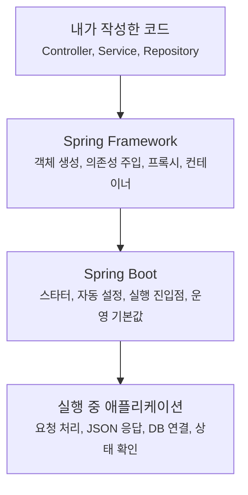

# 왜 Spring과 Spring Boot가 필요했을까요?

> 컨트롤러 클래스 하나 만들었을 뿐인데, 왜 서버가 뜨고 요청이 들어오고 JSON이 나갈까요?

처음 Spring Boot 프로젝트를 열면 묘한 느낌이 들어요.

내가 직접 `new`로 컨트롤러를 만든 적도 없고, 웹 서버를 띄운 적도 없고, JSON 변환기를 연결한 적도 없는데요.

```java
package com.example.order;

import org.springframework.web.bind.annotation.GetMapping;
import org.springframework.web.bind.annotation.RestController;

@RestController
class OrderController {

    @GetMapping("/orders")
    String orders() {
        return "orders";
    }
}
```

이런 클래스 하나가 있으면 어느 순간 `/orders` 요청을 받을 수 있어요. 처음 보면 편한데, 동시에 좀 이상하죠.

> "내가 안 만든 객체는 누가 만들었지?"  
> "내가 안 연결한 서버는 어디서 나왔지?"  
> "설정이 적다는 건 내부 동작도 단순하다는 뜻일까?"

오늘은 이 질문에서 시작할게요. 여기서 다루는 **왜 Spring이 필요했고 Boot가 무엇을 덜어냈는지**라는 큰 그림은 특정 Spring Boot 버전 하나에 묶인 이야기가 아니라, Spring Boot 전반을 이해하는 출발점이에요.

참고로 공식 문서 기준으로는 Spring Framework의 [제어의 역전 컨테이너(IoC container)](https://docs.spring.io/spring-framework/reference/core/beans/introduction.html), Spring Boot의 [자동 설정(auto-configuration)](https://docs.spring.io/spring-boot/reference/using/auto-configuration.html), 그리고 [Spring Boot 프로젝트 소개](https://spring.io/projects/spring-boot)를 배경으로 잡고 읽어볼게요.

!!! note "이 글의 범위"
    여기서는 `@RestController`, `@SpringBootApplication`, `SpringApplication.run`의 모든 내부 단계를 파헤치지 않아요. 오늘 목표는 **Spring이 가져간 일**과 **Spring Boot가 줄여준 일**을 분리해서 보는 거예요. 세부 동작은 뒤 글에서 하나씩 열어볼게요.

---

## 직접 다 만들던 시절의 코드를 떠올려볼게요

주문을 조회하는 작은 코드를 만든다고 해볼게요.

```java
package com.example.order;

class OrderController {

    private final OrderService orderService;

    OrderController() {
        OrderRepository orderRepository = new OrderRepository();
        this.orderService = new OrderService(orderRepository);
    }

    String findOrders() {
        return orderService.findOrders();
    }
}
```

겉으로는 단순해요. 컨트롤러가 서비스도 만들고, 서비스가 쓸 저장소도 만들어요.

그런데 애플리케이션이 커지면 이 방식은 금방 부담이 돼요.

- `OrderService`가 `PaymentClient`, `InventoryClient`, `Clock`까지 필요해지면 생성 코드가 계속 커져요.
- 테스트에서는 진짜 `OrderRepository` 대신 가짜 저장소를 넣고 싶은데, 컨트롤러가 이미 직접 만들어버렸어요.
- 여러 곳에서 같은 객체를 써야 할 때, 누가 언제 만들고 공유할지 기준이 흐려져요.
- 트랜잭션, 보안, 로깅처럼 여러 기능에 걸치는 규칙을 매번 손으로 끼워 넣어야 해요.

처음에는 `new`가 자유로워 보이지만, 규모가 커질수록 **객체를 만드는 코드**와 **실제 업무 코드**가 뒤엉켜요.

컨트롤러는 주문 요청을 받아야 하는데, 어느 순간 객체 조립 담당자까지 하고 있는 셈이에요.

---

## 식당으로 비유하면, 요리사가 직원을 직접 채용하는 상황이에요

식당을 하나 떠올려볼게요.

주방장은 요리에 집중해야 해요. 그런데 손님이 들어올 때마다 주방장이 직접 채소 담당을 부르고, 계산 담당을 뽑고, 배달 담당을 연결하고, 오늘 쓸 카드 단말기까지 세팅한다면 어떨까요?

처음 작은 가게에서는 버틸 수 있어요. 하지만 손님이 늘고 메뉴가 늘면 주방장은 요리보다 조립과 관리에 더 많은 시간을 쓰게 돼요.

그래서 역할을 나눠요.

| 식당에서는 | 애플리케이션에서는 |
|---|---|
| 주방장 | 비즈니스 코드를 담은 클래스 |
| 직원과 도구 | 다른 객체, 라이브러리, 설정 |
| 매장 관리자 | Spring 컨테이너 |
| 직원 배치표 | 설정, 애노테이션, 자동 설정 |
| 주방장이 요리에 집중함 | 클래스가 자기 책임에 집중함 |

여기서 핵심은 **일을 대신한다**가 아니에요.

Spring이 주문 로직을 대신 작성해주는 건 아니에요. 대신 객체를 만들고, 필요한 객체를 연결하고, 공통 규칙을 적용하는 일을 맡아요. 그래서 개발자는 주문 조회, 결제, 재고 차감 같은 애플리케이션의 핵심 행동에 더 집중할 수 있어요.

---

## Spring은 객체 조립 책임을 가져갔어요

Spring Framework의 출발점은 거창한 마법보다 **객체를 누가 만들고 연결할 것인가**에 가까워요.

직접 만드는 방식은 이래요.

```java
OrderRepository orderRepository = new OrderRepository();
OrderService orderService = new OrderService(orderRepository);
OrderController orderController = new OrderController(orderService);
```

Spring을 쓰면 흐름이 바뀌어요.

```java
package com.example.order;

import org.springframework.stereotype.Service;

@Service
class OrderService {

    private final OrderRepository orderRepository;

    OrderService(OrderRepository orderRepository) {
        this.orderRepository = orderRepository;
    }
}
```

`OrderService`는 이제 `OrderRepository`를 직접 만들지 않아요. 필요한 것을 생성자로 드러내고, 실제 연결은 Spring 컨테이너가 맡아요.

이걸 **의존성 주입(dependency injection)** 이라고 불러요. 더 큰 원칙으로는 **제어의 역전(inversion of control, IoC)** 이라고 해요.

말이 조금 딱딱하죠. 쉽게 말하면 이거예요.

> "내가 직접 만들던 객체들을, 이제 컨테이너가 만들고 꽂아준다."


이 구조 덕분에 객체 생성 규칙이 한곳으로 모여요. 테스트할 때 다른 구현을 넣기도 쉬워지고, 공통 기능을 프록시(proxy)로 감싸는 일도 가능해져요.

여기까지가 먼저 Spring의 큰 역할이에요.

---

## 그런데 Spring만으로도 설정은 꽤 많았어요

Spring이 객체 조립 문제를 덜어줬다고 해서, 웹 애플리케이션 준비가 저절로 끝나는 건 아니었어요.

웹 서버를 붙이고, 요청을 컨트롤러로 보내는 장치를 등록하고, JSON 변환기를 연결하고, 데이터베이스 설정을 넣고, 운영에서 볼 상태 확인 기능을 켜는 일은 여전히 필요했어요.

대략 이런 질문들이 계속 따라와요.

| 하고 싶은 일 | 직접 정해야 하는 것 |
|---|---|
| 웹 API 만들기 | 어떤 웹 라이브러리를 넣고, 요청을 누가 받을지 |
| JSON 응답 보내기 | 어떤 JSON 변환기를 쓰고, 어떻게 등록할지 |
| 데이터베이스 연결 | 드라이버, 커넥션 풀, 트랜잭션 설정을 어떻게 둘지 |
| 운영 상태 보기 | health, metrics 같은 엔드포인트를 어떻게 노출할지 |
| 배포하기 | 서버에 올릴지, 실행 가능한 애플리케이션으로 만들지 |

이 설정들은 대부분 프로젝트마다 완전히 새롭지 않아요.

웹 API를 만들면 보통 웹 관련 기본 구성이 필요하고, 데이터베이스 드라이버를 넣으면 보통 데이터소스 설정이 필요하고, Actuator를 넣으면 운영 확인 엔드포인트가 필요해요.

여기서 Spring Boot가 들어와요.

---

## Spring Boot는 반복 설정의 기본값을 가져왔어요

Spring Boot는 Spring을 대체하는 별도 프레임워크라기보다, **Spring 애플리케이션을 더 빨리, 더 일관되게 시작하게 해주는 층**에 가까워요.

Boot가 줄여주는 대표적인 부담은 세 가지예요.

### 1. 의존성을 묶어서 고르게 해줘요

웹 애플리케이션을 만들 때 필요한 라이브러리를 하나씩 고르면 버전 조합이 금방 피곤해져요.

그래서 Boot는 스타터(starter)라는 묶음을 제공해요. 예를 들어 웹 스타터를 넣으면 Spring MVC, 내장 웹 서버, JSON 처리에 필요한 기본 조합을 함께 가져오는 식이에요.

스타터는 "이 기능을 하려면 보통 이 조합이 필요하다"는 출발점을 만들어줘요.

### 2. 클래스패스를 보고 자동 설정을 시도해요

Boot의 자동 설정(auto-configuration)은 프로젝트에 들어온 라이브러리와 사용자가 이미 등록한 설정을 보고 기본 구성을 시도해요.

예를 들어 웹 관련 라이브러리가 있으면 웹 애플리케이션에 필요한 기본 설정을 준비하고, 사용자가 직접 같은 종류의 설정을 제공하면 그쪽을 우선할 수 있어요.

중요한 건 자동 설정이 **개발자 코드를 덮어쓰기 위한 기능이 아니라는 점**이에요. 보통은 기본값을 먼저 깔아주고, 필요하면 개발자가 명시한 설정으로 바꿔갈 수 있게 설계돼요.

### 3. 실행 가능한 애플리케이션 형태를 기본으로 잡아요

예전 Java 웹 애플리케이션은 별도 애플리케이션 서버에 배포하는 방식이 익숙했어요. Boot는 내장 서버를 사용해서 애플리케이션 자체를 실행하는 흐름을 자연스럽게 만들었어요.

그래서 `main` 메서드에서 애플리케이션을 시작하는 모양이 나와요.

```java
package com.example.order;

import org.springframework.boot.SpringApplication;
import org.springframework.boot.autoconfigure.SpringBootApplication;

@SpringBootApplication
public class OrderApplication {

    public static void main(String[] args) {
        SpringApplication.run(OrderApplication.class, args);
    }
}
```

이 코드는 짧지만, 빈(bean) 등록, 환경 설정 읽기, 자동 설정 적용, 웹 서버 시작 같은 큰 흐름의 입구가 돼요.

---

## 그래서 "설정이 없다"가 아니라 "기본값이 있다"예요

Spring Boot를 처음 만날 때 가장 조심해야 할 오해가 있어요.

> "설정을 안 했으니 내부도 별로 없는 거 아닌가?"

아니에요. 오히려 반대에 가까워요.

Boot는 자주 쓰는 설정을 없앤 게 아니라, **합리적인 기본값으로 미리 배치**해둔 거예요. 그래서 초반에는 코드가 적어 보이고, 어느 순간부터는 "왜 이렇게 동작하지?"라는 질문이 생겨요.



처음에는 Boot 덕분에 빨리 시작해요. 하지만 제대로 운영하려면 결국 Spring이 무엇을 만들었는지, Boot가 어떤 기본값을 골랐는지 읽을 수 있어야 해요.

그래서 이 시리즈는 "애노테이션을 외우는 글"이 아니라, **내가 쓴 코드와 프레임워크가 대신 한 일을 나눠보는 글**로 갈 거예요.

---

## Spring과 Boot를 한 문장씩 나누면

헷갈릴 때는 이렇게 잡으면 좋아요.

| 이름 | 먼저 떠올릴 역할 |
|---|---|
| Spring Framework | 객체를 만들고 연결하고, 공통 규칙을 적용하는 기반 |
| Spring Boot | Spring 애플리케이션을 빠르게 시작하도록 의존성, 자동 설정, 실행 방식을 정리한 도구 |

조금 더 실무적으로 말하면 이래요.

- Spring은 "이 객체들은 누가 만들고 어떻게 연결하지?"라는 질문에 답해요.
- Spring Boot는 "웹 서버, JSON, 설정 파일, 운영 기본값을 매번 어떻게 준비하지?"라는 질문에 답해요.
- 둘을 같이 쓰면, 개발자는 처음부터 모든 배선을 깔기보다 애플리케이션의 실제 행동부터 작성할 수 있어요.

하지만 그 편리함은 공짜가 아니에요. 대신 프레임워크가 무엇을 해줬는지 읽는 능력이 필요해져요.

---

## 자, 정리해볼까요?

!!! abstract "오늘 우리가 잡은 큰 그림"
    - 직접 `new`로 객체를 만들면 작은 코드에서는 편하지만, 규모가 커질수록 조립 코드와 업무 코드가 뒤섞여요.
    - Spring은 객체 생성과 연결을 컨테이너가 맡게 해서, 개발자 코드가 자기 책임에 집중하게 도와줘요.
    - Spring Boot는 스타터와 자동 설정으로 반복되는 Spring 애플리케이션 설정을 줄여줘요.
    - Boot가 설정을 줄여준다는 말은 내부 동작이 없다는 뜻이 아니라, 기본값을 먼저 준비해준다는 뜻이에요.

이제 처음 질문으로 돌아가 볼게요.

> "컨트롤러만 만들었는데 왜 서버가 떠요?"

답은 이래요.

컨트롤러는 내가 만들었지만, 그 컨트롤러를 발견하고 객체로 만들고, 웹 요청과 연결하고, 내장 서버 위에서 실행되게 준비한 쪽은 Spring과 Spring Boot예요.

다음 글에서는 이 흐름을 직접 프로젝트 생성 장면에서 이어볼게요. Spring Initializr에서 고르는 옵션들이 실제로 어떤 파일과 실행 구조로 바뀌는지 볼 차례예요.

---

## 참고한 링크

- [Spring Framework Reference: Introduction to the Spring IoC Container and Beans](https://docs.spring.io/spring-framework/reference/core/beans/introduction.html)
- [Spring Boot Reference: Auto-configuration](https://docs.spring.io/spring-boot/reference/using/auto-configuration.html)
- [Spring Boot Project Page](https://spring.io/projects/spring-boot)
